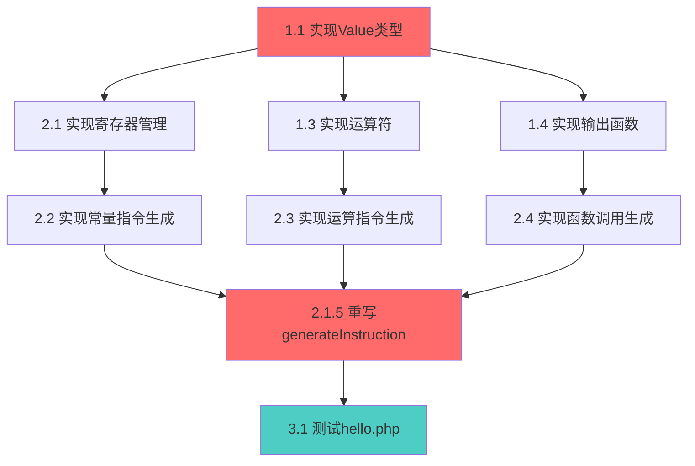

# AOT完整实现Spec审查报告

## 审查日期
2026-01-21

## 审查目的
评估现有spec文档的完整性、准确性和可执行性，确保spec能够有效指导AOT编译器的完整实现。

---

## 1. 整体评估

### 1.1 优点
✅ **结构完整**：requirements.md、design.md、tasks.md三个文档齐全  
✅ **需求清晰**：12个用户故事，30+功能需求，验收标准明确  
✅ **设计详细**：架构图、Value类型设计、IR→Zig映射表完整  
✅ **任务分解**：200+任务，分3个阶段，优先级明确  
✅ **技术深度**：考虑了内存管理、性能优化、错误处理等关键问题

### 1.2 发现的问题

#### 🔴 P0 - 关键问题（必须修复）

1. **代码与spec不一致**
   - **问题**：`native_linker.zig`中的`generateInstruction()`只生成注释，与design.md中的详细映射表不符
   - **影响**：spec描述的功能无法实现
   - **建议**：在tasks.md中明确标注"当前generateInstruction()只是占位符，需要完全重写"

2. **runtime_lib.zig生成策略不明确**
   - **问题**：design.md描述了完整的Value类型和运算符API，但native_linker.zig中的`copyRuntimeLib()`只生成了极简stub
   - **影响**：无法支持基本的PHP语义
   - **建议**：在design.md中明确说明runtime_lib.zig应该是"预先编写的完整实现"，而不是"动态生成的代码"

3. **寄存器分配机制缺失**
   - **问题**：design.md提到RegisterMap，但tasks.md中没有对应的实现任务
   - **影响**：无法正确生成Zig代码
   - **建议**：在tasks.md的2.1节中添加RegisterMap的详细实现任务

#### 🟡 P1 - 重要问题（应该修复）

4. **测试策略不够具体**
   - **问题**：requirements.md提到"至少50个测试用例"，但没有列出具体的测试场景
   - **影响**：测试覆盖可能不完整
   - **建议**：在requirements.md附录中添加"测试用例清单"

5. **性能基准不够精确**
   - **问题**：design.md中的性能目标（"10倍"）缺乏具体的测试方法
   - **影响**：无法客观验证性能是否达标
   - **建议**：在design.md中添加"性能测试方法论"章节

6. **错误处理不够完整**
   - **问题**：design.md只提到了除零、数组越界等基本错误，缺少编译时错误的详细处理
   - **影响**：用户体验可能不佳
   - **建议**：在design.md中添加"错误消息设计"章节

#### 🟢 P2 - 次要问题（可选修复）

7. **文档示例代码不够多**
   - **问题**：design.md中的代码示例主要集中在Value类型，缺少完整的端到端示例
   - **影响**：开发者理解可能不够深入
   - **建议**：在design.md附录中添加"完整示例：从PHP到Zig"

8. **依赖关系图缺失**
   - **问题**：tasks.md中的任务依赖关系只是线性的，实际上有复杂的依赖
   - **影响**：并行开发可能受阻
   - **建议**：在tasks.md中添加Mermaid依赖关系图

---

## 2. 关键发现：实现策略需要调整

### 2.1 当前问题

通过对比spec和实际代码，我发现了一个**根本性的架构问题**：

**Spec描述的是"动态生成runtime_lib.zig"，但实际上应该是"使用预先编写的runtime_lib.zig"**

#### 证据：

1. **native_linker.zig的copyRuntimeLib()方法**：
   ```zig
   fn copyRuntimeLib(self: *Self, temp_dir: []const u8) !void {
       // 创建简化的运行时库
       const runtime_code = 
           \\const std = @import("std");
           \\pub const Value = struct { data: i64 = 0, };
           // ... 只有几行代码
   ```
   这个方法生成的是**极简stub**，不是完整的运行时库。

2. **Design.md的描述**：
   ```
   ### 3.1 核心运算符
   pub fn php_add(lhs: Value, rhs: Value) !Value;
   pub fn php_sub(lhs: Value, rhs: Value) !Value;
   // ... 30+个函数
   ```
   这些函数需要**数百行代码**，不可能在copyRuntimeLib()中动态生成。

### 2.2 建议的架构调整

#### 方案A：预先编写runtime_lib.zig（推荐）

**优点**：
- 代码质量更高（可以充分测试）
- 开发效率更高（不需要字符串拼接）
- 维护更容易（独立的Zig文件）
- 性能更好（可以手动优化）

**实施步骤**：
1. 在`src/aot/`目录下创建`runtime_lib_template.zig`
2. 实现完整的Value类型和所有运算符
3. 在`copyRuntimeLib()`中直接复制这个文件到临时目录
4. 在tasks.md中添加"实现runtime_lib_template.zig"任务

#### 方案B：动态生成runtime_lib.zig（不推荐）

**缺点**：
- 需要在native_linker.zig中维护大量字符串模板
- 难以测试和调试
- 代码可读性差

**如果必须使用此方案**：
1. 在native_linker.zig中添加`RuntimeLibGenerator`结构
2. 使用模板引擎生成代码
3. 在tasks.md中添加"实现RuntimeLibGenerator"任务

### 2.3 推荐方案

**我强烈推荐方案A**，理由如下：

1. **Zig的设计哲学**：Zig鼓励"显式优于隐式"，预先编写的代码更符合这一理念
2. **参考实现**：Zig标准库本身就是预先编写的，不是动态生成的
3. **开发效率**：方案A可以让我们立即开始实现Value类型，而不需要先实现代码生成器
4. **测试友好**：可以直接对runtime_lib_template.zig编写单元测试

---

## 3. Spec改进建议

### 3.1 requirements.md改进

#### 添加：附录B - 测试用例清单

```markdown
## 附录B：测试用例清单

### 基础功能测试（15个）
1. test_hello_world.php - 基本echo
2. test_int_variable.php - 整数变量
3. test_string_variable.php - 字符串变量
4. test_int_add.php - 整数加法
5. test_string_concat.php - 字符串连接
... (继续列出所有测试用例)

### 控制流测试（10个）
16. test_if_else.php - if-else语句
17. test_while_loop.php - while循环
... 

### 函数测试（10个）
26. test_function_call.php - 函数调用
27. test_recursive_function.php - 递归函数
...

### 边界条件测试（15个）
36. test_division_by_zero.php - 除零错误
37. test_array_out_of_bounds.php - 数组越界
...
```

#### 修改：US-2.1.1验收标准

```markdown
**US-2.1.1: 作为开发者，我希望能编译简单的echo语句**
```php
<?php
echo "Hello, World!\n";
```
- 验收标准：
  - ✅ 编译成功，无错误
  - ✅ 运行输出 `Hello, World!`
  - ✅ 可执行文件大小 < 2MB
  - ⚠️ **当前状态**：编译成功，但输出为空（generateInstruction()只生成注释）
  - 📋 **对应任务**：tasks.md 2.2节 - 实现常量指令生成
```

### 3.2 design.md改进

#### 添加：2.7 Runtime Library实现策略

```markdown
### 2.7 Runtime Library实现策略

#### 2.7.1 架构决策

**决策**：使用预先编写的runtime_lib_template.zig，而不是动态生成

**理由**：
1. 代码质量：可以充分测试和优化
2. 开发效率：避免字符串拼接的复杂性
3. 维护性：独立的Zig文件更易维护
4. 性能：可以手动优化关键路径

#### 2.7.2 文件结构

```
src/aot/
├── runtime_lib_template.zig  ← 预先编写的完整运行时库
├── native_linker.zig          ← 复制runtime_lib_template.zig到临时目录
└── compiler.zig
```

#### 2.7.3 copyRuntimeLib()实现

```zig
fn copyRuntimeLib(self: *Self, temp_dir: []const u8) !void {
    // 读取预先编写的runtime_lib_template.zig
    const template_path = "src/aot/runtime_lib_template.zig";
    const template_content = try std.fs.cwd().readFileAlloc(
        self.allocator,
        template_path,
        10 * 1024 * 1024, // 10MB max
    );
    defer self.allocator.free(template_content);
    
    // 写入到临时目录
    const runtime_path = try std.fs.path.join(
        self.allocator,
        &[_][]const u8{ temp_dir, "runtime_lib.zig" },
    );
    defer self.allocator.free(runtime_path);
    
    const file = try std.fs.cwd().createFile(runtime_path, .{});
    defer file.close();
    try file.writeAll(template_content);
}
```
```

#### 添加：2.8 错误消息设计

```markdown
### 2.8 错误消息设计

#### 2.8.1 编译时错误格式

```
error: type mismatch in addition
  --> hello.php:5:10
   |
 5 | $sum = $a + "hello";
   |        ^^   ^^^^^^^ expected int, found string
   |        |
   |        int
   |
help: convert string to int using (int) cast
```

#### 2.8.2 运行时错误格式

```
runtime error: division by zero
  at hello.php:10:15
  in function calculate()
  
stack trace:
  0: calculate() at hello.php:10
  1: main() at hello.php:15
```
```

### 3.3 tasks.md改进

#### 修改：1.1 实现基础Value类型结构

```markdown
- [ ] 1.1 实现基础Value类型结构（在runtime_lib_template.zig中）
  - [ ] 1.1.1 创建src/aot/runtime_lib_template.zig文件
  - [ ] 1.1.2 定义ValueType枚举
  - [ ] 1.1.3 定义Value结构体（支持int和string）
  - [ ] 1.1.4 实现Value.initInt()
  - [ ] 1.1.5 实现Value.initString()
  - [ ] 1.1.6 实现Value.initNull()
  - [ ] 1.1.7 编写单元测试（在tests/aot/test_runtime_lib.zig中）
  - [ ] 1.1.8 修改native_linker.zig的copyRuntimeLib()使用模板文件
```

#### 添加：2.1.5 修复generateInstruction()

```markdown
- [ ] 2.1.5 重写generateInstruction()方法（核心任务）
  - [ ] 2.1.5.1 删除当前的注释生成代码
  - [ ] 2.1.5.2 实现const_int指令的实际代码生成
  - [ ] 2.1.5.3 实现const_string指令的实际代码生成
  - [ ] 2.1.5.4 实现call指令的实际代码生成
  - [ ] 2.1.5.5 添加寄存器分配逻辑
  - [ ] 2.1.5.6 编写单元测试
  - [ ] 2.1.5.7 集成测试：编译hello.php并验证输出
```

#### 添加：任务依赖关系图

```markdown
## 任务依赖关系图



**关键路径**：1.1 → 2.1 → 2.2 → 2.1.5 → 3.1

**可并行任务**：
- 1.3和1.4可以在1.1完成后并行开发
- 2.3和2.4可以在1.3和1.4完成后并行开发
```
```

---

## 4. 立即行动建议

### 4.1 第一优先级（今天完成）

1. **创建runtime_lib_template.zig**
   ```bash
   touch src/aot/runtime_lib_template.zig
   ```
   
2. **实现基础Value类型**（约2小时）
   - ValueType枚举
   - Value结构体
   - initInt(), initString(), initNull()
   
3. **修改copyRuntimeLib()**（约30分钟）
   - 从文件读取而不是硬编码字符串

4. **重写generateInstruction()的const_int分支**（约1小时）
   - 生成实际的Zig代码：`const reg_N = Value.initInt(42);`

5. **测试hello.php**
   - 验证能否输出"Hello, World!"

### 4.2 第二优先级（明天完成）

1. **实现php_echo()**
2. **实现const_string指令生成**
3. **实现call指令生成**
4. **完整测试hello.php的所有功能**

### 4.3 第三优先级（本周完成）

1. **实现所有基础运算符**
2. **实现变量管理**
3. **完成MVP阶段的所有任务**

---

## 5. 风险评估

### 5.1 技术风险

| 风险 | 当前状态 | 缓解措施 |
|------|---------|----------|
| generateInstruction()复杂度高 | 🔴 高风险 | 逐个指令实现，充分测试 |
| Value类型内存管理 | 🟡 中风险 | 使用Zig的allocator，避免手动管理 |
| 性能不达标 | 🟢 低风险 | 早期性能测试，及时优化 |

### 5.2 进度风险

| 风险 | 当前状态 | 缓解措施 |
|------|---------|----------|
| 任务估算不准确 | 🟡 中风险 | 每日跟踪进度，及时调整 |
| 测试时间不足 | 🟡 中风险 | TDD开发，边写边测 |
| 文档滞后 | 🟢 低风险 | 边开发边写文档 |

---

## 6. 总结

### 6.1 Spec质量评分

| 维度 | 评分 | 说明 |
|------|------|------|
| 完整性 | 8/10 | 缺少测试用例清单和错误消息设计 |
| 准确性 | 7/10 | 代码与spec不一致，需要同步 |
| 可执行性 | 6/10 | 缺少关键实现细节（RegisterMap、runtime_lib策略） |
| 清晰度 | 9/10 | 文档结构清晰，易于理解 |
| **总分** | **7.5/10** | **良好，但需要改进** |

### 6.2 关键改进点

1. ✅ **明确runtime_lib实现策略**：使用预先编写的模板文件
2. ✅ **补充RegisterMap实现细节**：在tasks.md中添加详细任务
3. ✅ **添加测试用例清单**：确保测试覆盖完整
4. ✅ **同步代码与spec**：标注当前实现状态
5. ✅ **添加任务依赖关系图**：明确开发顺序

### 6.3 下一步行动

**立即执行**（今天）：
1. 创建`runtime_lib_template.zig`
2. 实现基础Value类型
3. 修改`copyRuntimeLib()`
4. 重写`generateInstruction()`的const_int分支
5. 测试hello.php

**本周执行**：
1. 完成MVP阶段的所有任务
2. 更新spec文档（根据本报告的建议）
3. 建立测试框架

---

## 附录：修改后的文件清单

需要修改的文件：
1. `.kiro/specs/aot-complete-implementation/requirements.md` - 添加测试用例清单
2. `.kiro/specs/aot-complete-implementation/design.md` - 添加runtime_lib策略和错误消息设计
3. `.kiro/specs/aot-complete-implementation/tasks.md` - 添加RegisterMap任务和依赖关系图
4. `src/aot/runtime_lib_template.zig` - **新建**
5. `src/aot/native_linker.zig` - 修改copyRuntimeLib()和generateInstruction()
6. `tests/aot/test_runtime_lib.zig` - **新建**

---

**审查人**: AI Assistant  
**审查日期**: 2026-01-21  
**文档版本**: 1.0  
**建议优先级**: P0（立即执行）
