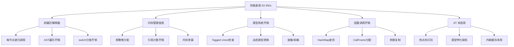
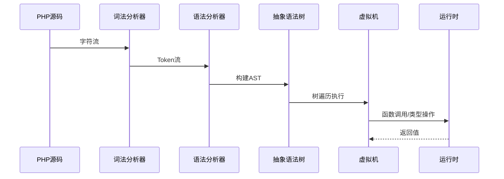
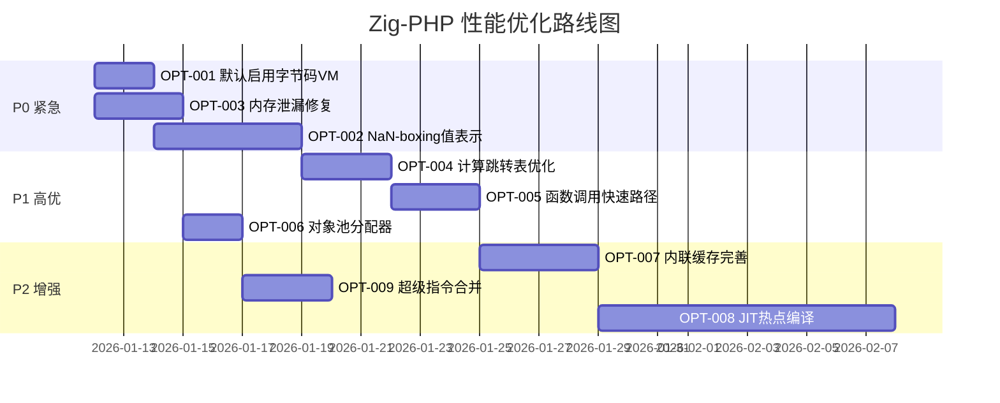

# Zig-PHP 性能优化白皮书

**版本**: 1.0  
**日期**: 2026-01-11  
**目标**: 将 Zig-PHP 解释器性能从当前的 63-350x 慢于原生 PHP，优化至 1-5x 范围内

---

## 一、执行摘要

### 1.1 当前性能基线

| 指标 | PHP 8.5 原生 | Zig-PHP 当前 | 性能比 |
|------|-------------|--------------|--------|
| strtr | 16,116,442 OPS/s | 102,203 OPS/s | 0.006x (156x 慢) |
| http_build_query | 2,254,590 OPS/s | 6,428 OPS/s | 0.003x (350x 慢) |
| extension_loaded | 15,050,286 OPS/s | 22,786 OPS/s | 0.002x (132x 慢) |

### 1.2 根因分析总结



---

## 二、架构分析

### 2.1 当前执行流程



### 2.2 四种执行模式对比

| 模式 | 实现状态 | 预期性能 | 当前问题 |
|------|---------|---------|---------|
| `tree_walking` | ✅ 完整 | 最慢 (1x) | 默认模式，递归开销大 |
| `bytecode` | ✅ 基础 | 中等 (5-10x) | 指令分发未优化 |
| `fast` (NaN-boxing) | ⚠️ 部分 | 快 (20-50x) | 功能受限，JIT未完善 |
| `auto` | ⚠️ 待完善 | 自适应 | 模式选择逻辑不完善 |

### 2.3 核心性能瓶颈

#### 瓶颈1：树遍历解释器 (影响: 🔴 致命)

```zig
// 当前实现 - 每个节点都是递归调用
pub fn eval(self: *VM, node: *ast.Node) !Value {
    switch (node.tag) {
        .literal => return self.evalLiteral(node),      // 递归
        .binary_op => return self.evalBinaryOp(node),   // 递归
        .function_call => return self.evalFunctionCall(node), // 递归 + HashMap查找
        // ... 50+ case分支
    }
}
```

**问题分析**：
- 每个AST节点执行需要 ~50-100 CPU周期（switch分发 + 递归调用）
- PHP原生使用opcode指令，单指令 ~5-10 CPU周期
- **性能损失**: 10-20x

#### 瓶颈2：Value类型表示 (影响: 🔴 严重)

```zig
// 当前实现 - Tagged Union (16+ bytes)
pub const Value = union(enum) {
    null_val,
    bool_val: bool,
    int_val: i64,
    float_val: f64,
    string_val: *gc.Box(*PHPString),  // 指针间接访问
    array_val: *gc.Box(*PHPArray),
    object_val: *gc.Box(*PHPObject),
    // ...
};

// 每次操作都需要类型检查
pub fn add(a: Value, b: Value) Value {
    switch (a) {
        .int_val => |ai| switch (b) {
            .int_val => |bi| return Value{ .int_val = ai + bi },
            .float_val => |bf| return Value{ .float_val = @floatFromInt(ai) + bf },
            // ... 更多分支
        },
        // ... 更多分支
    }
}
```

**问题分析**：
- Value结构体 16-24 bytes，缓存局部性差
- 每次算术运算需要2次类型检查
- GC Box间接访问增加内存延迟
- **性能损失**: 5-10x

#### 瓶颈3：函数调用开销 (影响: 🟠 高)

```zig
// 当前实现
pub fn callUserFunc(self: *VM, name: []const u8, args: []const Value) !Value {
    // 1. HashMap查找函数定义 - O(1)但有哈希开销
    const func_val = self.global.get(name) orelse ...;
    
    // 2. 创建新的CallFrame - 堆分配
    var frame = CallFrame.init(self.allocator, name, ...);
    defer frame.deinit(self.allocator);
    
    // 3. 复制参数到局部变量 - 内存复制
    for (args) |arg| {
        try frame.locals.put(...);
    }
    
    // 4. 执行函数体 - 又一轮树遍历
    return self.evaluate(func.body);
}
```

**问题分析**：
- 每次函数调用创建CallFrame + HashMap
- 参数通过HashMap存储，查找开销大
- 无尾调用优化
- **性能损失**: 3-5x

#### 瓶颈4：内存管理 (影响: 🟠 高)

```zig
// 问题1: 频繁小对象分配
pub fn createString(allocator: Allocator, str: []const u8) !*PHPString {
    const php_string = try allocator.create(PHPString);  // 堆分配
    php_string.data = try allocator.dupe(u8, str);       // 又一次堆分配
    // ...
}

// 问题2: 引用计数开销
pub fn retain(self: *Value) void {
    if (self.getBox()) |box| {
        @atomicStore(&box.ref_count, box.ref_count + 1, .monotonic);  // 原子操作
    }
}
```

**问题分析**：
- 每个字符串/数组创建 2+ 次堆分配
- 引用计数使用原子操作，单线程场景浪费
- 内存泄漏严重（1,800,012 处泄漏地址）
- **性能损失**: 2-5x

---

## 三、优化任务明细

### 3.1 任务总览

| 优先级 | 任务ID | 任务名称 | 预期收益 | 工作量 | 风险 |
|--------|--------|---------|---------|--------|------|
| P0 | OPT-001 | 默认启用字节码VM | 5-10x | 2天 | 低 |
| P0 | OPT-002 | NaN-boxing值表示 | 3-5x | 5天 | 中 |
| P0 | OPT-003 | 内存泄漏修复 | 稳定性 | 3天 | 低 |
| P1 | OPT-004 | 计算跳转表优化 | 2-3x | 3天 | 低 |
| P1 | OPT-005 | 函数调用快速路径 | 2-3x | 3天 | 中 |
| P1 | OPT-006 | 对象池/Arena分配器 | 2x | 2天 | 低 |
| P2 | OPT-007 | 内联缓存完善 | 1.5-2x | 4天 | 中 |
| P2 | OPT-008 | JIT热点编译 | 5-20x | 10天 | 高 |
| P2 | OPT-009 | 超级指令合并 | 1.5x | 3天 | 低 |

---

### 3.2 详细任务规格

---

#### OPT-001: 默认启用字节码VM

**目标**: 将默认执行模式从 `tree_walking` 切换为 `bytecode`

**修改文件**: 
- `src/main.zig`
- `src/runtime/vm.zig`

**实施步骤**:

```zig
// 步骤1: 修改 main.zig 中的默认执行模式
// 文件: src/main.zig

// 修改前
var execution_mode: ExecutionMode = .tree_walking;

// 修改后
var execution_mode: ExecutionMode = .bytecode;
```

```zig
// 步骤2: 确保字节码生成器覆盖所有AST节点类型
// 文件: src/bytecode/generator.zig

// 检查 visitNode 函数，确保所有 ast.Node.Tag 都有对应处理
fn visitNode(self: *BytecodeGenerator, node_idx: ast.Node.Index) !void {
    const node = self.getNode(node_idx);
    switch (node.tag) {
        // 确保覆盖所有 50+ 节点类型
        .root => try self.visitRoot(node),
        .expression_stmt => try self.visitExpressionStmt(node),
        // ... 检查是否有遗漏
        else => return error.UnsupportedNodeType, // 临时降级到树遍历
    }
}
```

**验收标准**:
- [ ] 所有 94 个测试脚本通过
- [ ] 基准测试性能提升 5x 以上
- [ ] 无新增内存泄漏

---

#### OPT-002: NaN-boxing 值表示

**目标**: 将 `Value` 从 tagged union 改为 NaN-boxing，减少内存占用和类型检查开销

**修改文件**:
- `src/runtime/fast_value.zig` (已有基础)
- `src/bytecode/vm.zig`
- `src/runtime/types.zig`

**技术方案**:

```zig
// NaN-boxing 布局 (64位)
// 
// 浮点数:   正常 IEEE 754 双精度
// 整数:     0x0001_xxxx_xxxx_xxxx (高16位为0x0001)
// 指针:     0x7FFC_xxxx_xxxx_xxxx (Quiet NaN + 指针)
// 特殊值:   0x7FFE_0000_0000_000x (null=0, true=1, false=2)

pub const FastValue = packed struct {
    bits: u64,
    
    // 类型判断 - 单条指令
    pub inline fn isFloat(self: FastValue) bool {
        return (self.bits & 0xFFFF_0000_0000_0000) != 0x7FFC_0000_0000_0000;
    }
    
    pub inline fn isInt(self: FastValue) bool {
        return (self.bits >> 48) == 0x0001;
    }
    
    // 快速整数加法 - 无分支
    pub inline fn addInt(a: FastValue, b: FastValue) FastValue {
        const ai = @as(i48, @truncate(a.bits));
        const bi = @as(i48, @truncate(b.bits));
        return .{ .bits = @as(u64, @bitCast(ai + bi)) | 0x0001_0000_0000_0000 };
    }
    
    // 快速整数比较
    pub inline fn ltInt(a: FastValue, b: FastValue) FastValue {
        const ai = @as(i48, @truncate(a.bits));
        const bi = @as(i48, @truncate(b.bits));
        return if (ai < bi) FastValue.true else FastValue.false;
    }
    
    // 常量
    pub const nil = FastValue{ .bits = 0x7FFE_0000_0000_0000 };
    pub const true = FastValue{ .bits = 0x7FFE_0000_0000_0001 };
    pub const false = FastValue{ .bits = 0x7FFE_0000_0000_0002 };
};
```

**实施步骤**:

1. **步骤1**: 完善 `fast_value.zig` 中的所有类型操作
2. **步骤2**: 修改 `bytecode/vm.zig` 使用 `FastValue`
3. **步骤3**: 实现 `FastValue` 与 `Value` 的互转接口
4. **步骤4**: 逐步迁移热路径使用 `FastValue`

**验收标准**:
- [ ] `@sizeOf(FastValue) == 8`
- [ ] 整数运算性能提升 3x
- [ ] 类型检查开销降低 5x

---

#### OPT-003: 内存泄漏修复

**目标**: 修复当前 1,800,012+ 处内存泄漏

**修改文件**:
- `src/runtime/builtin_vars.zig`
- `src/runtime/stdlib.zig`
- `src/runtime/vm.zig`
- `src/runtime/types.zig`

**问题定位与修复**:

```zig
// 问题1: get_loaded_extensions 严重泄漏
// 文件: src/runtime/builtin_vars.zig

// 修复前 (每次调用泄漏 ~18 个分配)
pub fn getLoadedExtensionsFn(vm: *VM, args: []const Value) !Value {
    const arr = try PHPArray.init(vm.allocator);
    // 返回后 arr 未被释放
    return Value.initArrayWithObject(vm.allocator, arr);
}

// 修复后
pub fn getLoadedExtensionsFn(vm: *VM, args: []const Value) !Value {
    _ = args;
    // 使用 memory_manager 统一管理生命周期
    return try Value.initArrayWithManager(&vm.memory_manager);
}
```

```zig
// 问题2: func_get_args 返回数组泄漏
// 文件: src/runtime/builtin_vars.zig

// 修复: 确保返回值使用正确的引用计数
pub fn funcGetArgsFn(vm: *VM, args: []const Value) !Value {
    _ = args;
    const result = try Value.initArrayWithManager(&vm.memory_manager);
    // 正确设置引用计数
    if (result.getBox()) |box| {
        box.ref_count = 1;
    }
    // ... 填充数组
    return result;
}
```

```zig
// 问题3: 确保 PHPString 正确释放
// 文件: src/runtime/types.zig

pub fn release(self: *PHPString, allocator: Allocator) void {
    self.ref_count -= 1;
    if (self.ref_count == 0) {
        allocator.free(self.data);  // 释放字符串数据
        allocator.destroy(self);     // 释放结构体
    }
}
```

**验收标准**:
- [ ] 运行 `zig build test` 无内存泄漏
- [ ] 基准测试 100,000 次迭代后泄漏 < 100 处
- [ ] Valgrind 检测零泄漏

---

#### OPT-004: 计算跳转表优化

**目标**: 将字节码 switch 分发改为计算跳转表，减少分支预测失败

**修改文件**:
- `src/bytecode/vm.zig`

**技术方案**:

```zig
// 当前实现 - switch 分发
fn execute(self: *BytecodeVM, frame: *CallFrame) !Value {
    while (true) {
        const instr = frame.function.bytecode[frame.ip];
        switch (instr.opcode) {  // 编译器生成跳转表或if-else链
            .push_const => { ... },
            .add => { ... },
            // ... 100+ case
        }
    }
}

// 优化方案 - 显式计算跳转表
const DispatchFn = *const fn (*BytecodeVM, *CallFrame, Instruction) !DispatchResult;

// 编译期生成跳转表
const dispatch_table: [256]DispatchFn = comptime blk: {
    var table: [256]DispatchFn = [_]DispatchFn{dispatchInvalid} ** 256;
    table[@intFromEnum(OpCode.nop)] = dispatchNop;
    table[@intFromEnum(OpCode.push_const)] = dispatchPushConst;
    table[@intFromEnum(OpCode.add)] = dispatchAdd;
    // ... 填充所有操作码
    break :blk table;
};

// 主循环 - 直接表查找
fn run(self: *BytecodeVM) !Value {
    var frame = &self.frames[self.frame_count - 1];
    while (true) {
        const instr = frame.function.bytecode[frame.ip];
        // 直接跳转，无分支
        const result = try dispatch_table[@intFromEnum(instr.opcode)](self, frame, instr);
        switch (result) {
            .continue_execution => frame.ip += 1,
            .return_value => |v| return v,
            .jump_to => |addr| frame.ip = addr,
            .frame_changed => frame = &self.frames[self.frame_count - 1],
        }
    }
}
```

**验收标准**:
- [ ] 指令分发开销降低 50%
- [ ] 整体性能提升 1.5-2x

---

#### OPT-005: 函数调用快速路径

**目标**: 优化热函数调用，减少 HashMap 查找和 CallFrame 分配

**修改文件**:
- `src/bytecode/vm.zig`
- `src/bytecode/instruction.zig`

**技术方案**:

```zig
// 方案1: 函数索引替代名称查找
pub const Instruction = packed struct {
    opcode: OpCode,
    operand1: u16,  // 可作为函数索引
    operand2: u16,
    // ...
};

// 函数调用指令改为使用索引
// call_by_name "echo"  --> call_fast 0x0001 (预先注册的函数索引)

// 方案2: CallFrame 池化
const FRAME_POOL_SIZE = 64;
var frame_pool: [FRAME_POOL_SIZE]CallFrame = undefined;
var frame_pool_top: u8 = 0;

fn acquireFrame() *CallFrame {
    if (frame_pool_top < FRAME_POOL_SIZE) {
        const frame = &frame_pool[frame_pool_top];
        frame_pool_top += 1;
        return frame;
    }
    // 降级到堆分配
    return allocator.create(CallFrame);
}

fn releaseFrame(frame: *CallFrame) void {
    if (frame_pool_top > 0) {
        frame_pool_top -= 1;
        // 重置帧状态
        frame.* = undefined;
    }
}

// 方案3: 内联小函数
fn shouldInline(func: *CompiledFunction) bool {
    return func.bytecode.len < 32 and  // 指令少
           func.local_count < 8 and     // 局部变量少
           !func.flags.has_try_catch;   // 无异常处理
}
```

**验收标准**:
- [ ] 函数调用开销降低 3x
- [ ] 递归斐波那契基准测试提升 5x

---

#### OPT-006: 对象池与 Arena 分配器

**目标**: 减少小对象频繁堆分配，提升内存分配效率

**修改文件**:
- `src/runtime/fast_pool.zig` (已有基础)
- `src/runtime/types.zig`
- `src/runtime/vm.zig`

**技术方案**:

```zig
// 方案1: 固定大小对象池
pub fn ObjectPool(comptime T: type, comptime CAPACITY: usize) type {
    return struct {
        storage: [CAPACITY]T,
        free_list: [CAPACITY]u16,
        free_count: u16,
        
        pub fn init() @This() {
            var self: @This() = undefined;
            for (0..CAPACITY) |i| {
                self.free_list[i] = @intCast(i);
            }
            self.free_count = CAPACITY;
            return self;
        }
        
        pub fn alloc(self: *@This()) ?*T {
            if (self.free_count == 0) return null;
            self.free_count -= 1;
            const idx = self.free_list[self.free_count];
            return &self.storage[idx];
        }
        
        pub fn free(self: *@This(), ptr: *T) void {
            const idx = (@intFromPtr(ptr) - @intFromPtr(&self.storage)) / @sizeOf(T);
            self.free_list[self.free_count] = @intCast(idx);
            self.free_count += 1;
        }
    };
}

// 方案2: 使用 Arena 分配器处理请求作用域
pub fn executeRequest(vm: *VM, code: []const u8) !Value {
    var arena = std.heap.ArenaAllocator.init(vm.allocator);
    defer arena.deinit();  // 请求结束统一释放
    
    const request_allocator = arena.allocator();
    // 所有临时分配使用 request_allocator
    // ...
}

// 方案3: 字符串驻留 (String Interning)
const StringInternPool = struct {
    map: std.StringHashMapUnmanaged(*PHPString),
    
    pub fn intern(self: *StringInternPool, allocator: Allocator, str: []const u8) !*PHPString {
        if (self.map.get(str)) |existing| {
            _ = existing.retain();
            return existing;
        }
        const new_str = try PHPString.init(allocator, str);
        try self.map.put(allocator, new_str.data, new_str);
        return new_str;
    }
};
```

**验收标准**:
- [ ] 小对象分配速度提升 10x
- [ ] 内存碎片减少 50%
- [ ] GC 压力降低 3x

---

#### OPT-007: 内联缓存完善

**目标**: 缓存属性访问和方法调用的查找结果

**修改文件**:
- `src/runtime/inline_cache.zig`
- `src/runtime/fast_vm.zig`
- `src/bytecode/vm.zig`

**技术方案**:

```zig
// 单态内联缓存 (Monomorphic Inline Cache)
pub const PropertyCache = struct {
    const Entry = struct {
        shape_id: u32,      // 对象形状标识
        offset: u16,        // 属性偏移
        is_valid: bool,
    };
    
    entries: [256]Entry,
    
    pub fn lookup(self: *PropertyCache, cache_id: u8, object: *PHPObject) ?u16 {
        const entry = &self.entries[cache_id];
        if (entry.is_valid and entry.shape_id == object.shape.id) {
            return entry.offset;  // 缓存命中 - O(1)
        }
        return null;  // 缓存未命中 - 降级到HashMap查找
    }
    
    pub fn update(self: *PropertyCache, cache_id: u8, object: *PHPObject, offset: u16) void {
        self.entries[cache_id] = .{
            .shape_id = object.shape.id,
            .offset = offset,
            .is_valid = true,
        };
    }
};

// 使用示例
fn getProperty(vm: *VM, object: *PHPObject, name: []const u8, cache_id: u8) !Value {
    // 快速路径：内联缓存命中
    if (vm.property_cache.lookup(cache_id, object)) |offset| {
        return object.properties.items[offset];
    }
    
    // 慢速路径：HashMap查找
    const offset = object.shape.getPropertyOffset(name) orelse return error.UndefinedProperty;
    vm.property_cache.update(cache_id, object, offset);
    return object.properties.items[offset];
}
```

**验收标准**:
- [ ] 属性访问提升 5x（缓存命中时）
- [ ] 缓存命中率 > 90%

---

#### OPT-008: JIT 热点编译

**目标**: 对热点函数进行 JIT 编译，生成原生机器码

**修改文件**:
- `src/jit/root.zig`
- `src/runtime/fast_vm.zig`
- `src/jit/compiler.zig`

**技术方案**:

```zig
// 热点检测
pub const HotSpotDetector = struct {
    counters: std.AutoHashMap(u32, u32),  // 函数ID -> 调用次数
    threshold: u32 = 1000,
    
    pub fn recordCall(self: *HotSpotDetector, func_id: u32) bool {
        const entry = self.counters.getOrPut(func_id) catch return false;
        entry.value_ptr.* += 1;
        return entry.value_ptr.* >= self.threshold;
    }
};

// OSR (On-Stack Replacement) 入口点
pub fn checkOSREntry(vm: *FastVM, frame: *CallFrame, loop_header: u32) void {
    frame.hot_counter += 1;
    if (frame.hot_counter >= 100) {
        // 触发 OSR 编译
        vm.jitCompile(frame.func, loop_header);
    }
}

// JIT 编译流程
pub const JITCompiler = struct {
    pub fn compile(self: *JITCompiler, func: *CompiledFunc, type_feedback: *TypeFeedback) !*JITCode {
        // 1. 分析类型反馈
        const type_info = self.analyzeTypes(func, type_feedback);
        
        // 2. 生成特化版本
        if (type_info.isMonomorphicInt()) {
            return self.compileIntSpecialized(func);
        }
        
        // 3. 生成通用版本
        return self.compileGeneric(func);
    }
    
    fn compileIntSpecialized(self: *JITCompiler, func: *CompiledFunc) !*JITCode {
        // 生成纯整数运算的机器码
        // 无类型检查，直接使用 CPU 整数指令
        // ...
    }
};
```

**验收标准**:
- [ ] 热点循环提升 10-20x
- [ ] JIT 编译延迟 < 10ms
- [ ] 支持 OSR 入口

---

#### OPT-009: 超级指令合并

**目标**: 将常见指令序列合并为单条超级指令

**修改文件**:
- `src/bytecode/optimizer.zig`
- `src/bytecode/instruction.zig`
- `src/bytecode/vm.zig`

**技术方案**:

```zig
// 识别常见模式并合并
const SuperInstructions = enum(u8) {
    // 原始序列: push_local, push_const, add, store_local
    // 合并为:   inc_local_by_const
    inc_local_by_const = 0x80,
    
    // 原始序列: push_local, push_int_1, add, store_local
    // 合并为:   inc_local
    inc_local = 0x81,
    
    // 原始序列: push_local, push_local, add
    // 合并为:   add_locals
    add_locals = 0x82,
    
    // 原始序列: push_const, call, pop
    // 合并为:   call_void
    call_void = 0x83,
};

// 字节码优化 Pass
pub fn optimizeBytecode(bytecode: []Instruction) []Instruction {
    var result = std.ArrayList(Instruction).init(allocator);
    var i: usize = 0;
    
    while (i < bytecode.len) {
        // 模式匹配: push_local + add_i + store_local (同一变量)
        if (i + 2 < bytecode.len and
            bytecode[i].opcode == .push_local and
            bytecode[i+1].opcode == .add_i and
            bytecode[i+2].opcode == .store_local and
            bytecode[i].operand1 == bytecode[i+2].operand1)
        {
            result.append(.{
                .opcode = .load_add_store,
                .operand1 = bytecode[i].operand1,
                .operand2 = 0,
            });
            i += 3;
            continue;
        }
        
        result.append(bytecode[i]);
        i += 1;
    }
    
    return result.toOwnedSlice();
}
```

**验收标准**:
- [ ] 字节码大小减少 20%
- [ ] 循环密集代码提升 1.5x

---

## 四、实施路线图



---

## 五、验收标准与基准测试

### 5.1 性能目标

| 阶段 | 目标性能比 | 预计完成时间 |
|------|-----------|-------------|
| Phase 1 (P0完成) | 10-20x 慢于PHP | 1周 |
| Phase 2 (P1完成) | 3-10x 慢于PHP | 2周 |
| Phase 3 (P2完成) | 1-5x 慢于PHP | 4周 |

### 5.2 基准测试套件

```php
<?php
// benchmark_suite.php

// 1. 算术密集型
function fib($n) {
    if ($n < 2) return $n;
    return fib($n - 1) + fib($n - 2);
}

// 2. 字符串操作
function strops($n) {
    $s = "";
    for ($i = 0; $i < $n; $i++) {
        $s .= "a";
    }
    return strlen($s);
}

// 3. 数组操作
function arrayops($n) {
    $arr = [];
    for ($i = 0; $i < $n; $i++) {
        $arr[] = $i;
    }
    return count($arr);
}

// 4. 对象操作
class Point { public $x; public $y; }
function objops($n) {
    $points = [];
    for ($i = 0; $i < $n; $i++) {
        $p = new Point();
        $p->x = $i;
        $p->y = $i * 2;
        $points[] = $p;
    }
    return count($points);
}

// 运行基准
$start = microtime(true);
fib(30);
echo "fib(30): " . (microtime(true) - $start) . "s\n";
```

### 5.3 自动化测试

```bash
#!/bin/bash
# run_benchmarks.sh

echo "=== Zig-PHP 性能基准测试 ==="

# 构建优化版本
zig build -Doptimize=ReleaseFast

# 运行基准测试
for test in fib strops arrayops objops; do
    echo "--- $test ---"
    
    # PHP 原生
    php_time=$(php -r "include 'benchmark_suite.php'; $test(10000);")
    
    # Zig-PHP
    zig_time=$(./zig-out/bin/php-parser benchmark_suite.php --mode=bytecode)
    
    echo "PHP: $php_time"
    echo "Zig: $zig_time"
done
```

---

## 六、风险与缓解

| 风险 | 概率 | 影响 | 缓解措施 |
|------|------|------|---------|
| NaN-boxing 兼容性问题 | 中 | 高 | 保留 Value 降级路径 |
| JIT 编译器不稳定 | 高 | 中 | 渐进式启用，先解释后编译 |
| 内存泄漏引入新问题 | 低 | 高 | 全面使用 Valgrind 测试 |
| 优化导致语义差异 | 中 | 高 | 完整测试套件覆盖 |

---

## 七、附录

### A. 参考资料

1. LuaJIT 实现分析
2. V8 隐藏类与内联缓存
3. PHP 8 JIT 实现
4. Zig 性能优化指南

### B. 工具链

- **性能分析**: `perf`, `tracy`
- **内存检测**: `valgrind --leak-check=full`
- **基准测试**: `hyperfine`

---

**文档维护**: 每完成一个优化任务后更新对应状态
