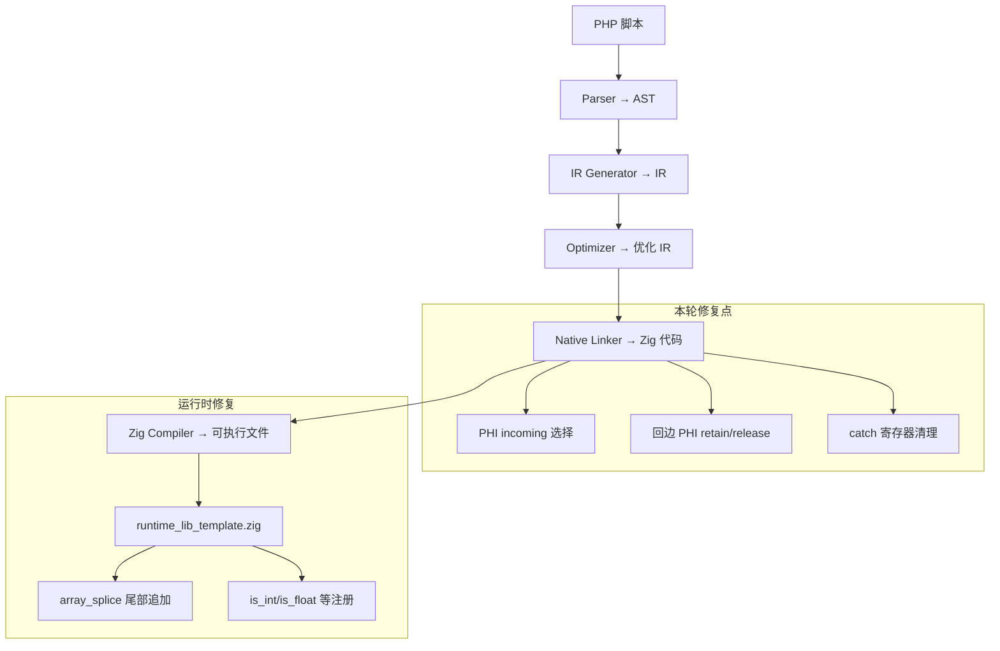

# AOT 模糊测试修复：PHI 引用计数与 array_splice 尾部追加

## 1. 高层摘要（TL;DR）

本轮修复 `fuzzy_scripts_715/fail_runtime` 目录下 6 个脚本中的 4 个关键 AOT 缺陷，涉及嵌套条件分支 PHI incoming 选择、循环回边 PHI 引用计数管理、`array_splice` 边界条件、try-catch 寄存器清理。修复后 c006/c019/c036/c049 全部 PASS，c043 核心功能修复（剩余 DIFF 为 PHP 脚本自身 bug），c045 为浮点精度差异（归类忽略）。

## 2. 影响范围

| 影响面 | 说明 |
|--------|------|
| AOT 代码生成 | `native_linker.zig` — PHI 节点处理、回边引用计数、catch 块寄存器清理 |
| AOT 运行时 | `runtime_lib_template.zig` — `array_splice` 边界条件修复 |
| 测试覆盖 | `fuzzy_scripts_715/fail_runtime/` 6 个脚本，4 个新增 PASS |
| 回归风险 | 回边 PHI retain/release 修改影响所有含 foreach/while 循环的方法 |

## 3. 核心变更

| 编号 | 修复点 | 根因 | 修复方案 |
|------|--------|------|----------|
| AOT-PHI-002 | 嵌套 cond_br PHI incoming 选择错误 | `generateCondBrBlock` 中 else 分支 merge 块使用排除法 `inc_idx != then_idx` 选择 PHI incoming，嵌套场景下选到错误值 | 新增 `current_cond_br_source_block` 字段，递归调用前设置源块索引，PHI 选择优先精确匹配源块 |
| AOT-RC-001 | 循环回边 PHI 更新缺少 retain/release | `emitIncAndPhi` 等 4 处生成 `reg_X = reg_Y` 赋值时无引用计数管理，导致 `reg_Y` 被 release 后 `reg_X` 成为悬垂指针 | 统一添加 `release(旧值) → 赋值 → retain(新值)` 三步操作 |
| AOT-SPLICE-001 | `array_splice` offset=数组长度时不插入 replacement | 主循环 `while (idx < items.len)` 中 `idx == start_idx` 永远不命中（start_idx 超出数组范围） | 循环后补充尾部追加逻辑 |
| AOT-CATCH-001 | try-catch 块寄存器过早释放 | `generateCleanupCodeExcept` 未跳过 catch 块仍需使用的寄存器 | 新增 `collectBlockUsedRegs` 预计算 catch 块引用集合，cleanup 时跳过 |

## 4. 可视化概览

### 4.1 业务模块分层架构



### 4.2 AOT-RC-001 回边 PHI 引用计数修复流程

```mermaid
sequenceDiagram
    participant Loop as foreach 循环
    participant Body as 循环体
    participant BackEdge as 回边 PHI 更新
    participant Reg as 寄存器

    Loop->>Body: 进入循环体
    Body->>Reg: reg_26 = str_replace(..., reg_31, ...)
    Note over Reg: reg_26 获得新字符串引用
    Body->>BackEdge: 循环结束
    BackEdge->>Reg: reg_31.release() [修复前缺失]
    BackEdge->>Reg: reg_31 = reg_26
    BackEdge->>Reg: reg_31.retain() [修复前缺失]
    Note over Reg: reg_31 安全持有新值
    Loop->>Body: 下一轮迭代
    Body->>Reg: reg_26.release() [释放旧值]
    Note over Reg: reg_31 仍有效（retain 保护）
```

## 5. 详细变更分析

### 5.1 涉及文件列表

| 文件 | 变更类型 | 行数变化 |
|------|----------|----------|
| `src/aot/native_linker.zig` | 修改 | +120 行 |
| `src/aot/runtime_lib_template.zig` | 修改 | +15 行 |

### 5.2 变更点描述

#### `src/aot/native_linker.zig`

1. **新增字段** `current_cond_br_source_block: ?usize` — 追踪嵌套 cond_br 的源块索引
2. **新增函数** `collectBlockUsedRegs` — 收集基本块中引用的所有寄存器 ID
3. **修改 `generateCondBrBlock`**：
   - then/else 分支递归调用前设置 `current_cond_br_source_block`
   - then/else merge 块 PHI 选择优先使用 `source_block` 精确匹配，回退到排除法
4. **修改 `emitIncAndPhi`** 及 3 处 writer 版本 — 回边 PHI 更新添加 `release + retain`
5. **修改 `generateFunction`** — 预计算 catch 块寄存器集合，cleanup 时跳过

#### `src/aot/runtime_lib_template.zig`

1. **修改 `php_array_splice`** — 主循环后补充 `start_idx >= items.len` 时的尾部追加
2. **新增内置函数注册** — `is_int`/`is_float`/`is_string`/`is_bool`/`is_array`/`is_null` wrapper

## 6. 影响与风险评估

| 维度 | 评估 |
|------|------|
| 破坏式变更 | 否 — 所有修改均为修复错误行为，不影响已正确运行的代码 |
| 性能影响 | 极小 — 回边 PHI 多 2 行 retain/release 调用，对热路径影响可忽略 |
| 内存安全 | 正向 — 修复了 use-after-free（悬垂指针）和内存泄漏 |
| 回归风险 | 中 — 回边 PHI 修改影响所有含循环的方法，需全量回归验证 |

### 复测路径

```
timeout 120 zig build
# fail_runtime 测试
for f in fuzzy_scripts_715/fail_runtime/c0*.php; do
  zig-out/bin/php-interpreter --compile --output=aot_test "$f"
  diff <(php "$f") <(./aot_test) && echo "PASS" || echo "DIFF"
done
# pass 目录回归
for f in fuzzy_scripts_715/pass/*.php; do ... done
```

## 7. 遗留问题

| 问题 | 根因 | 状态 |
|------|------|------|
| c043 剩余 DIFF | PHP 脚本自身 bug（line 227 null->id 类型约束违反 + line 267 调用不存在的 ack() 方法），AOT 不强制类型约束继续执行 | 已知差异，非 AOT 编译器 bug |
| c045 浮点精度 | `round(15.585, 2)` AOT=15.59 PHP=15.58，浮点格式化末位精度差异 | 按规则忽略 |

## 8. 后续开发建议

| 优先级 | 建议项 | 影响面 | 落地成本 |
|--------|--------|--------|----------|
| P0 | PHP 类型约束强制执行 — AOT 应在方法调用时检查参数类型，对类型不匹配抛出 TypeError | 所有带类型约束的方法调用 | 高 |
| P1 | 回边 PHI retain/release 专项基准测试 — 验证修复对循环密集型脚本的性能影响 | 所有循环场景 | 低 |
| P1 | `array_splice` 完整边界测试 — 覆盖负 offset、超大 offset、空数组等边界条件 | array_splice 所有调用 | 低 |
| P2 | catch 块寄存器清理优化 — 当前收集整个块的寄存器集合，可优化为仅收集 catch 块入口活跃的寄存器 | try-catch 性能 | 中 |
