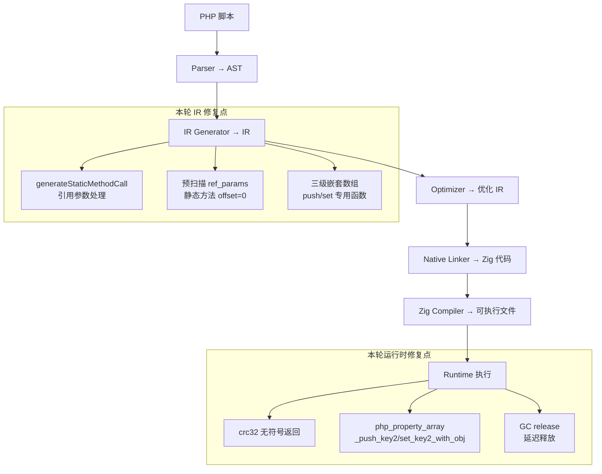
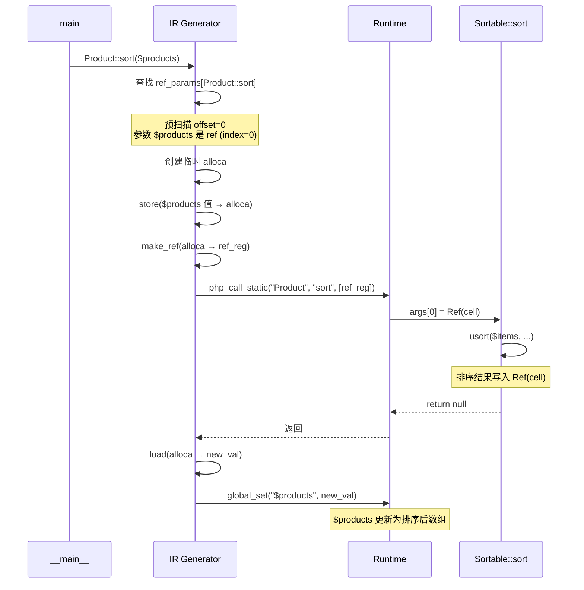
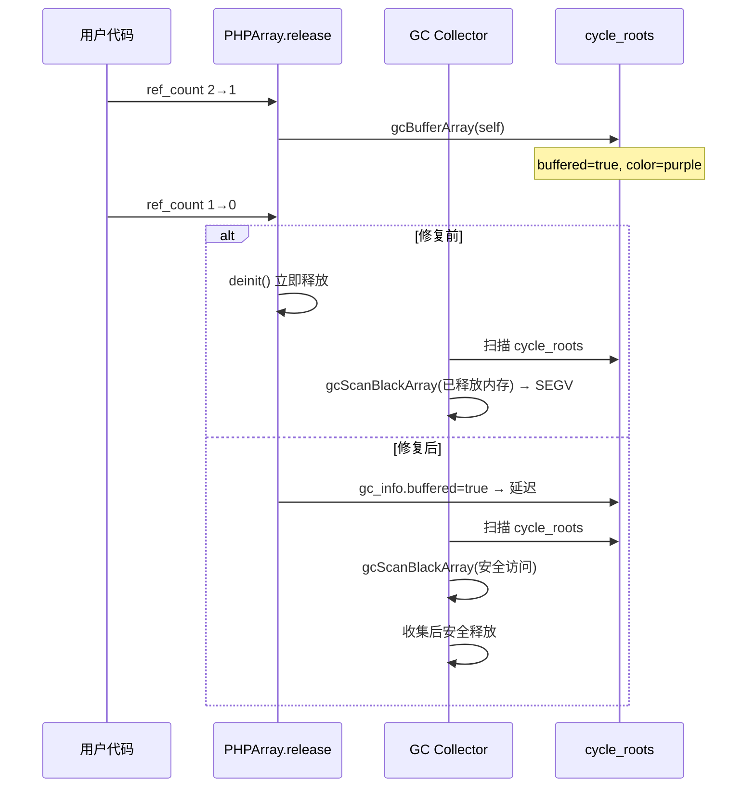

# AOT 模糊测试修复：静态方法引用参数、三级嵌套数组写回、GC use-after-free

## 1. 高层摘要（TL;DR）

本轮修复 `fuzzy_scripts_715` 目录下 4 个关键 AOT 缺陷：静态方法调用（如 `Product::sort($products)`）引用参数未处理导致排序结果丢失、`crc32` 返回有符号值与 PHP 64 位无符号不一致、三级嵌套数组 `$obj->prop[k1][k2][] = value` push 后 COW 克隆未写回、GC `release` 在 `ref_count=0` 时立即 `deinit` 但已被 buffer 到 `cycle_roots` 导致扫描时 use-after-free。修复后 c003/c047 从 FAIL 转 PASS，c028/c046 SEGV 已消除。

## 2. 影响范围

| 影响面 | 说明 |
|--------|------|
| AOT IR 生成 | `ir_generator.zig` — `generateStaticMethodCall` 引用参数处理、预扫描 `ref_params` 索引偏移、三级嵌套数组 push/set |
| AOT 运行时 | `runtime_lib_template.zig` — `crc32` 无符号返回、`php_property_array_push_key2/set_key2_with_obj`、GC release 三处 use-after-free |
| 测试覆盖 | `fuzzy_scripts_715/` — c003/c047 从 FAIL 转 PASS，c028/c046 SEGV 消除 |
| 回归风险 | 中 — GC release 修改影响所有 PHPArray/PHPObject/PHPClosure 的释放路径 |

## 3. 核心变更

| 编号 | 修复点 | 根因 | 修复方案 |
|------|--------|------|----------|
| AOT-REF-003 | 静态方法调用引用参数缺失 | `generateStaticMethodCall` 仅 `generateExpression` 所有参数，未处理 `by-reference` 参数，`Product::sort($products)` 传值而非传引用 | 添加与 `generateMethodCall` 一致的引用参数处理逻辑（`make_ref + alloca + writeback`） |
| AOT-OFFSET-001 | 预扫描静态方法 `ref_params` 索引偏移 | 预扫描对所有方法统一 `+1`（跳过 `$this`），但静态方法无 `$this`，应 `offset=0` | 根据 `method_data.modifiers.is_static` 动态选择 offset |
| AOT-CRC32-001 | `crc32` 返回有符号 i32 | `@bitCast(crc)` 将 `u32` 转为 `i32`，PHP 64 位返回无符号 `u32` | 直接 `@intCast(crc)` 到 `i64` |
| AOT-NESTED-003 | 三级嵌套数组 push 写回缺失 | `$obj->prop[k1][k2][] = value` 中 `array_ensure` 链返回 COW 克隆副本，`array_push` 修改副本未写回原始属性 | 新增 `php_property_array_push_key2_with_obj` 和 `php_property_array_set_key2_with_obj` 运行时函数，直接通过对象属性导航修改内层数组 |
| AOT-GC-UAF-001 | GC use-after-free | `PHPArray/PHPObject/PHPClosure` 的 `release` 在 `ref_count=0` 时立即 `deinit`，但若已被 GC buffer 到 `cycle_roots`，GC 后续扫描时访问已释放内存 | `ref_count=0` 时若 `gc_info.buffered=true`，延迟释放交给 GC 处理 |

## 4. 可视化概览

### 4.1 业务模块分层架构



### 4.2 AOT-REF-003 静态方法引用参数写回流程



### 4.3 AOT-GC-UAF-001 GC 延迟释放流程



## 5. 详细变更分析

### 5.1 涉及文件列表

| 文件 | 变更类型 | 行数变化 |
|------|----------|----------|
| `src/aot/ir_generator.zig` | 修改 | +110 行 |
| `src/aot/runtime_lib_template.zig` | 修改 | +80 行 |

### 5.2 变更点描述

#### `src/aot/ir_generator.zig`

1. **修改预扫描 `ref_params` 索引偏移**（line ~818）
   - 修复前：所有方法统一 `i + 1`（跳过 `$this`）
   - 修复后：`const offset: u32 = if (method_data.modifiers.is_static) 0 else 1;`

2. **修改 `generateStaticMethodCall`**（line ~7674）
   - 修复前：仅 `args[i] = try self.generateExpression(arg_idx);`
   - 修复后：添加完整的引用参数查找 + make_ref + alloca + writeback 逻辑
   - 静态方法 `param_idx = i`（无 `$this` 偏移）
   - 调用后执行 `global_set` 写回引用参数新值

3. **修改三级嵌套数组赋值**（line ~4095）
   - 修复前：`array_ensure` 链 + `array_push`（COW 克隆未写回）
   - 修复后：2 键 push → `php_property_array_push_key2_with_obj`
   - 2 键 set → `php_property_array_set_key2_with_obj`
   - 更深层嵌套保留回退路径

#### `src/aot/runtime_lib_template.zig`

1. **修改 `php_crc32`**（line ~27097）
   - 修复前：`const signed: i32 = @bitCast(crc); return Value.initInt(@intCast(signed));`
   - 修复后：`return Value.initInt(@intCast(crc));`（直接 u32 → i64）

2. **新增 `php_property_array_push_key2_with_obj`**（line ~19065）
   - 处理 `$obj->prop[key1][key2][] = value` 模式
   - 直接通过 `obj.getPropertyDirect` → `arr.get(key1)` → `sub_arr.get(key2)` → `sub2_arr.push(value)` 导航修改

3. **新增 `php_property_array_set_key2_with_obj`**（line ~19100）
   - 处理 `$obj->prop[key1][key2] = value` 模式
   - 同上导航路径，最终 `sub_arr.set(key2, value)`

4. **修改 `PHPArray.release`**（line ~2032）
   - 修复前：`ref_count==0 → deinit()`
   - 修复后：`ref_count==0 && gc_info.buffered && !gc_in_progress → gcBufferArray(self)`（延迟释放）

5. **修改 `PHPObject.release`**（line ~17931）
   - 同 PHPArray 逻辑，延迟释放给 GC

6. **修改 `PHPClosure.release`**（line ~2825）
   - 同 PHPArray 逻辑，延迟释放给 GC

## 6. 影响与风险评估

| 维度 | 评估 |
|------|------|
| 破坏式变更 | 否 — 所有修改均为修复错误行为 |
| 性能影响 | 极小 — GC 延迟释放仅在 `buffered=true` 时触发，正常路径不受影响 |
| 内存安全 | 正向 — 修复 3 处 use-after-free（PHPArray/PHPObject/PHPClosure） |
| 回归风险 | 中 — GC release 修改影响所有对象的释放路径；静态方法引用参数影响所有 `Class::method(&$var)` 调用 |

### 复测路径

```bash
# 编译验证
timeout 120 zig build

# c003 验证（静态方法引用参数 + crc32）
timeout 60 zig-out/bin/php-interpreter --compile --no-debug-info fuzzy_scripts_715/fail_compile/c003_trait_interface_polymorphism.php
diff <(php fuzzy_scripts_715/fail_compile/c003_trait_interface_polymorphism.php) <(./fuzzy_scripts_715/fail_compile/aot_compile_c003_trait_interface_polymorphism)

# c047 验证（三级嵌套数组 push）
timeout 60 zig-out/bin/php-interpreter --compile --no-debug-info fuzzy_scripts_715/pass/c047_crdt_gcounter_lww_orset.php
diff <(php fuzzy_scripts_715/pass/c047_crdt_gcounter_lww_orset.php) <(./fuzzy_scripts_715/pass/aot_compile_c047_crdt_gcounter_lww_orset)

# c028/c046 SEGV 验证
timeout 60 zig-out/bin/php-interpreter --compile --no-debug-info fuzzy_scripts_715/pass/c028_expression_rpn_precedence.php
timeout 10 ./fuzzy_scripts_715/pass/aot_compile_c028_expression_rpn_precedence  # 不应 SEGV

# 全量回归
for f in fuzzy_scripts_715/pass/*.php; do
  name=$(basename "$f" .php)
  timeout 60 zig-out/bin/php-interpreter --compile --no-debug-info "$f" 2>/dev/null
  bin="fuzzy_scripts_715/pass/aot_compile_${name}"
  diff <(timeout 10 php "$f" 2>/dev/null) <(timeout 10 "$bin" 2>/dev/null) && echo "PASS: $name" || echo "DIFF: $name"
done

# 清理编译产物
find fuzzy_scripts_715 -name 'aot_compile_*' -type f -delete
rm -rf .zigphp_aot_build
```

## 7. 遗留问题

| 问题 | 根因 | 状态 |
|------|------|------|
| c028 括号表达式求值差异 | `(3 + 4) * 2 = 0`（应为 14），Debug 模式正确但 ReleaseFast 错误，疑似优化器对字符串 token 比较的优化问题 | 待调试 — ReleaseFast 优化器深层问题 |
| c028 `3 + 4 * 2 / (1 - 5) ^ 2` 除零错误 | 表达式求值中括号 token 识别错误导致操作数顺序错乱 | 同上 |
| c046 Large Scale 段 GC 崩溃 | `gcScanBlackArray` 在大规模数据下仍有 use-after-free，可能存在 GC 增量收集与并发修改的竞态 | 待深入分析 |
| c043 TypeError 参数类型检查 | AOT 不强制 PHP 类型约束，`reject(null)` 应抛出 TypeError 但 AOT 继续执行 | 需新增参数类型检查特性 |
| c045 浮点精度差异 | `round(15.585, 2)` 末位精度差异 | 按规则忽略 |
| c037/c049 编译失败 | 函数式柯里化/协变泛型模式不支持 | 待语法扩展 |

## 8. 后续开发建议

| 优先级 | 建议项 | 影响面 | 落地成本 |
|--------|--------|--------|----------|
| P0 | c028 ReleaseFast 括号表达式调试 — 在优化器中禁用相关优化 pass 逐步定位，检查 `===` 字符串比较在 ReleaseFast 下的行为 | 所有含字符串比较的条件分支 | 高 |
| P0 | c046 GC 大规模数据崩溃 — 分析 GC 增量收集时的竞态条件，考虑在 `gcScanBlackArray` 中增加 `ref_count > 0` 守卫 | 所有大规模数组操作场景 | 高 |
| P1 | PHP 类型约束强制执行 — AOT 应在方法调用时检查参数类型，对类型不匹配抛出 TypeError | 所有带类型约束的方法调用 | 高 |
| P1 | GC 改为增量式收集 — 当前批量扫描在大规模数据下容易触发 use-after-free，增量式可降低风险 | GC 全局性能与安全 | 高 |
| P2 | 四级及以上嵌套数组写回 — 当前仅支持到 2 键 push/set，更深层嵌套仍走 `array_ensure` 回退路径 | 极少数深层嵌套场景 | 低 |
| P2 | 静态方法引用参数基准测试 — 验证 `make_ref + alloca + writeback` 对排序密集型脚本的性能影响 | 所有 `Class::method(&$var)` 调用 | 低 |
