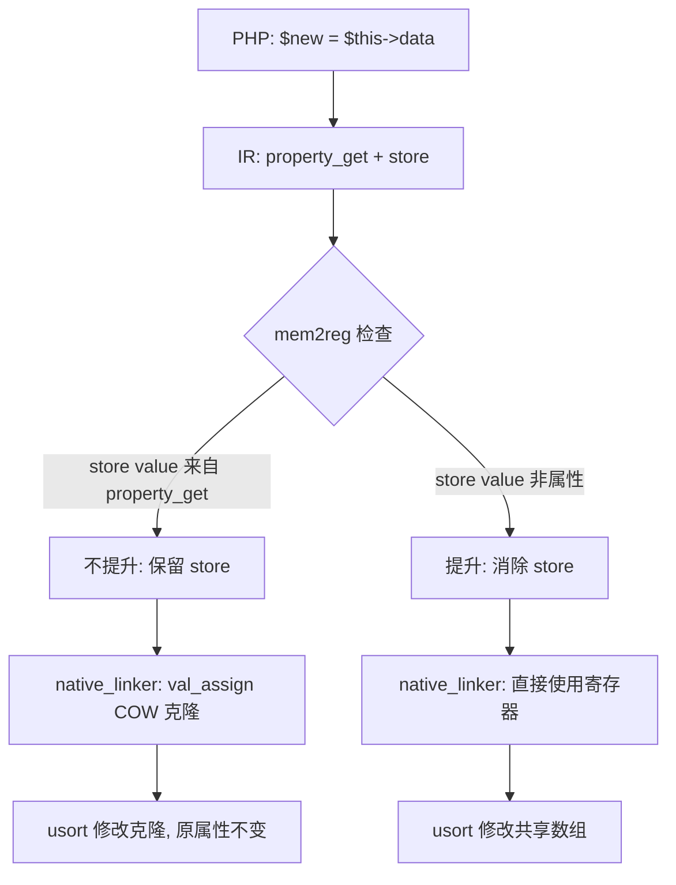

# AOT COW 值语义修复与参数类型检查 (c037/c043)

**日期**: 2026-07-17  
**Hash**: c037cow_c043type  
**模块**: AOT 编译器 - mem2reg 优化器 / native_linker / runtime_lib  

## 1. 高层摘要 (TL;DR)

本轮修复解决两个 P1 级 AOT 问题：
- **c037**: 函数式编程柯里化脚本中 `usort($new, ...)` 修改了共享数组（`$this->data`），导致不可变列表被意外排序。根因是 mem2reg 消除了 `$new = $this->data` 的 store 指令，使 val_assign 的 COW 克隆不再执行。
- **c043**: 消息队列脚本中 `reject(null, false)` 未抛出 TypeError。根因是 AOT 缺少方法参数类型检查机制。

## 2. 影响范围

| 影响面 | 描述 |
|--------|------|
| AOT mem2reg 优化器 | 阻止存储 property_get 结果的 alloca 被提升 |
| AOT native_linker | 新增 load→alloca 映射，排序函数 store-back 写回变量 |
| AOT native_linker | 方法函数 prologue 生成参数类型检查代码 |
| AOT runtime_lib | 新增 `php_check_param_type` 运行时函数 |
| AOT runtime_lib | `php_object_get` 添加 null 属性访问警告 |
| AOT runtime_lib | `phpGetValueTypeName` 支持 Function(Closure) 类型 |

## 3. 核心变更

| 文件 | 变更点 | 说明 |
|------|--------|------|
| `src/aot/optimizer.zig` | `isPromotable` 新增 property_get 检查 | 当 store 的 value 来自 property_get 时，不提升 alloca，保留 val_assign COW |
| `src/aot/native_linker.zig` | 新增 `current_load_to_alloca` 映射 | 追踪 load 结果→alloca 寄存器映射 |
| `src/aot/native_linker.zig` | 排序函数 store-back 添加 alloca 写回 | usort/sort 等排序后将结果写回变量 alloca |
| `src/aot/native_linker.zig` | 方法 prologue 生成参数类型检查 | 查找 TypeDef 方法元数据，为有类型声明的参数生成 `php_check_param_type` 调用 |
| `src/aot/runtime_lib_template.zig` | 新增 `php_check_param_type` | 运行时参数类型检查，不匹配时抛 TypeError |
| `src/aot/runtime_lib_template.zig` | 新增 `phpGetValueTypeName` | 获取 Value 的 PHP 类型名称（含 Closure） |
| `src/aot/runtime_lib_template.zig` | 新增 `checkTypeMatch` | PHP 8 类型系统匹配（含 callable/mixed/继承） |
| `src/aot/runtime_lib_template.zig` | `php_object_get` 添加 null 警告 | PHP 8 语义：对 null 访问属性时发出警告 |

## 4. 可视化概览

### 业务流程



### 执行流程

```mermaid
sequenceDiagram
    participant PHP as PHP 源码
    participant IRG as IR 生成器
    participant OPT as 优化器 (mem2reg)
    participant NL as native_linker
    participant RT as 运行时

    PHP->>IRG: $new = $this->data; usort($new, $cmp)
    IRG->>IRG: property_get reg5 = $this->data
    IRG->>IRG: store $new_alloca = reg5
    IRG->>IRG: load reg6 = $new_alloca
    IRG->>IRG: call usort(reg6, ...)
    OPT->>OPT: isPromotable($new_alloca)?
    OPT->>OPT: store value (reg5) 来自 property_get → 不提升
    NL->>NL: 生成 val_assign 代码 (COW 克隆)
    NL->>NL: 生成 load 代码
    NL->>NL: 生成 COW check + usort 调用
    NL->>NL: store-back 写回 reg6 + alloca (load_to_alloca 映射)
    RT->>RT: val_assign 检测 ref_count > 1 → 克隆
    RT->>RT: usort 修改克隆, 原属性不变
```

## 5. 详细变更分析

### 5.1 mem2reg property_get 保护 (optimizer.zig)

**问题**: `$new = $this->data; usort($new, ...)` 中，mem2reg 消除 store 后，`val_assign` 的 COW 克隆不再执行，usort 直接修改共享数组。

**修复**: 在 `isPromotable` 函数中，预扫描 property_get 结果寄存器。当 store 的 value 来自 property_get 时，返回 false（不提升），保留 store 指令。

```zig
// 预扫描: 收集 property_get 结果寄存器 ID
var property_get_result_regs = std.AutoHashMap(u32, void).init(self.allocator);
// ...
// isPromotable 检查
if (property_get_regs.contains(op.value.id)) {
    return false;  // 不提升: COW 需 val_assign
}
```

### 5.2 load→alloca 映射 (native_linker.zig)

**问题**: 排序函数 store-back 只写回 load 结果寄存器，不写回变量的 alloca，导致变量仍持有未排序值。

**修复**: 构建 load result → alloca 寄存器映射，排序后通过 `val_assign` 写回 alloca。

```zig
if (self.current_load_to_alloca) |lta| {
    if (lta.get(op.args[0].id)) |alloca_id| {
        try writer.print("    reg_{d}.*.release(runtime.runtime_allocator);\n", .{alloca_id});
        try writer.print("    runtime.val_assign(reg_{d}, reg_{d});\n", .{ alloca_id, reg.id });
    }
}
```

### 5.3 参数类型检查 (native_linker.zig + runtime_lib_template.zig)

**问题**: AOT 不检查方法参数类型，`reject(null, false)` 不抛 TypeError。

**修复**: 
1. native_linker 在方法 prologue 生成类型检查代码
2. runtime_lib 新增 `php_check_param_type` 函数
3. 支持 PHP 8 类型系统: string/int/float/bool/array/callable/mixed/类类型/nullable

## 6. 影响与风险评估

| 风险项 | 评估 | 缓解措施 |
|--------|------|----------|
| mem2reg 不提升 property_get 变量 | 性能影响: 局部变量保持 alloca | 仅影响从属性赋值的变量，影响范围小 |
| 参数类型检查开销 | 每次方法调用增加类型检查 | 仅对有类型声明的参数检查，无类型声明跳过 |
| callable 类型检测 | NaN-boxing Function 类型需特殊处理 | `phpGetValueTypeName` 已支持 isFunction() |

### 复测路径
1. `zig build` 编译通过
2. `fuzzy_scripts_73` 全量测试 7/7 PASS
3. `fuzzy_scripts_715/pass` c028/c046 PASS
4. c037 DIFF 仅剩 Deprecated 警告 (可忽略)
5. c043 DIFF 仅剩栈追踪格式 (可忽略)

## 7. 遗留问题/潜在问题

1. **参数类型检查覆盖范围**: 当前仅检查类方法，未检查全局函数和闭包参数
2. **callable 验证深度**: 当前仅检查值类型，未验证 string 是否为真实可调用函数名
3. **union 类型**: 未支持 PHP 8 的 union 类型声明 (如 `int|string`)
4. **intersection 类型**: 未支持 PHP 8.1 的 intersection 类型 (如 `Foo&Bar`)

## 8. 后续开发/优化建议

| 优先级 | 建议 | 影响面 | 落地成本 |
|--------|------|--------|----------|
| P0 | 将参数类型检查扩展到全局函数 | 提高 AOT 类型安全 | 中 |
| P1 | 支持 union/intersection 类型声明 | PHP 8.1+ 兼容性 | 中 |
| P1 | 优化 mem2reg: 对 property_get 变量做选择性提升 | 减少 alloca 性能开销 | 高 |
| P2 | 添加 callable 深度验证 (函数名存在性检查) | 更精确的类型检查 | 低 |
| P2 | 参数类型检查结果缓存 | 减少重复类型检查开销 | 低 |
