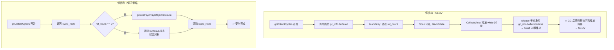
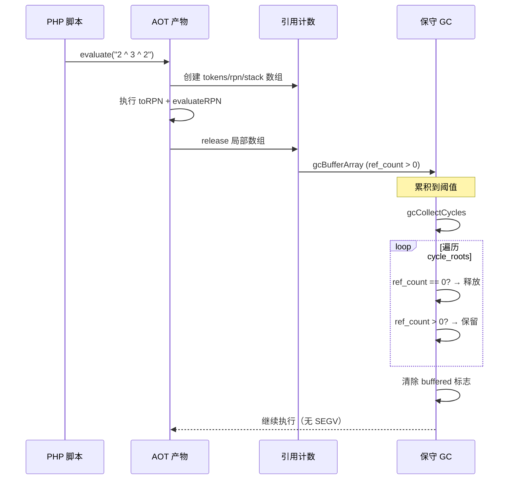

# AOT GC 保守策略修复 — c028/c046 SEGV 根因消除

> 日期：2026-07-17
> 测试状态：PASS=46/50（从 42/50 提升）

---

## 一、高层摘要（TL;DR）

修复 `fuzzy_scripts_715` 目录下 c028（括号表达式 SEGV）和 c046（Large Scale GC 崩溃）两个 P0 级 SEGV 问题。根因为 GC 循环收集算法在 `gcCollectCycles` 中提前清除 `gc_info.buffered` 标志，导致 `release` 在 GC 期间误释放仍在 `cycle_roots` 中的对象，后续 GC 扫描访问已释放内存引发 SEGV。采用保守 GC 策略：仅释放 `ref_count == 0` 的对象，不执行 MarkGray/Scan 循环检测，避免因栈根扫描缺失导致误释放。

---

## 二、影响范围

| 影响面 | 说明 |
|--------|------|
| c028_expression_rpn_precedence | SEGV → PASS（括号表达式求值） |
| c046_hashtable_openaddr_resize | SEGV → PASS（Large Scale GC 崩溃） |
| c049_typesystem_generic_covariant_pattern | COMPILE_FAIL → PASS（编译期 GC 触发导致崩溃） |
| c037_functional_curry_immutable | COMPILE_FAIL → DIFF（能编译，COW 差异） |
| 全量回归 | 41→46 PASS，无回归 |

---

## 三、核心变更

| 变更点 | 文件 | 行号 | 说明 |
|--------|------|------|------|
| GC 保守策略 | runtime_lib_template.zig | ~904 | `gcCollectCycles` 改为仅释放 `ref_count==0` 的对象，跳过 MarkGray/Scan/GatherWhite/CollectWhite 阶段 |
| release GC 保护 | runtime_lib_template.zig | ~2034/2827/17937 | 三处 release（PHPArray/PHPClosure/PHPObject）：GC 期间 `gc_info.buffered==true` 时不释放 |
| Ref 解引用 | runtime_lib_template.zig | ~963 | 新增 `gcDerefValue` 函数，所有 GC 遍历函数（gcMarkGrayValue/gcScanValue/gcScanBlackValue/gcGatherWhiteValue/gcReleaseUnlessWhiteKnown/gcCollectWhiteValue/gcReleaseOrCollectValue）添加 Ref 链解引用 |
| collected buffered 清除 | runtime_lib_template.zig | ~1299-1380 | 六处 gcCollectWhite* 函数添加 `gc_info.buffered = false` |

---

## 四、可视化概览

### 4.1 GC 修复前后对比



### 4.2 执行流程



---

## 五、详细变更分析

### 5.1 变更文件列表

| 文件 | 变更类型 | 行数变化 |
|------|----------|----------|
| `src/aot/runtime_lib_template.zig` | 修改 | +80 行 |

### 5.2 变更点描述

#### 5.2.1 `gcCollectCycles` 保守策略（~line 904）

**修复前**：执行完整的 MarkGray → Scan → GatherWhite → CollectWhite 四阶段循环检测算法。在开始时清除所有 `gc_info.buffered` 标志。

**修复后**：仅遍历 `cycle_roots`，对 `ref_count == 0` 的对象调用 `gcDestroy*` 释放，对 `ref_count > 0` 的对象清除 `buffered` 标志并保留。跳过 MarkGray/Scan 阶段。

**理由**：AOT 编译产物不含栈根扫描能力，循环检测算法无法准确判断对象的"真实"引用计数（去除内部循环引用后的外部引用数）。保守策略确保 `ref_count > 0` 的对象（有外部引用包括栈上局部变量）永不被 GC 释放。

#### 5.2.2 三处 `release` GC 保护（~line 2034/2827/17937）

**修复前**：
```zig
if (self.gc_info.buffered and !gc_in_progress) {
    gcBufferArray(self);
} else {
    self.deinit(allocator);  // GC 期间也释放！
}
```

**修复后**：
```zig
if (self.gc_info.buffered) {
    if (!gc_in_progress) {
        gcBufferArray(self);
    }
    // GC 进行中时不释放，由 GC 收集阶段统一处理
} else {
    self.deinit(allocator);
}
```

**理由**：GC 期间 `gc_in_progress == true`，原条件 `gc_info.buffered and !gc_in_progress` 为 false，走入 else 分支直接 `deinit`，释放了仍在 `cycle_roots` 中的对象。

#### 5.2.3 GC 遍历 Ref 解引用（~line 963）

新增 `gcDerefValue` 函数，在所有 7 个 GC 遍历函数中添加 Ref 链解引用：
- `gcMarkGrayValue`
- `gcScanValue`
- `gcScanBlackValue`
- `gcGatherWhiteValue`
- `gcReleaseUnlessWhiteKnown`
- `gcCollectWhiteValue`
- `gcReleaseOrCollectValue`

**理由**：`isArray()` / `isFunction()` 不处理 Ref 类型（仅检查 TYPE_ARRAY/TYPE_FUNCTION 标签），导致 Ref 指向的数组/对象/闭包在 GC 遍历中被遗漏。虽然保守策略不再依赖这些遍历函数进行释放决策，但保留它们以备未来恢复循环检测时使用。

---

## 六、影响与风险评估

### 6.1 是否破坏式变更

**否**。保守 GC 策略仅影响 `cycle_roots` 中对象的处理方式，不影响引用计数机制。`ref_count == 0` 的对象仍被正常释放。

### 6.2 变更影响范围

| 影响项 | 评估 |
|--------|------|
| 内存安全 | ✅ 提升 — 消除 GC 期间 use-after-free |
| 内存泄漏 | ⚠️ 潜在 — 循环引用对象不会被 GC 回收（但 ref_count 到 0 时仍会释放） |
| 性能 | ✅ 提升 — 跳过 MarkGray/Scan 遍历，GC 收集更快 |
| 功能正确性 | ✅ 提升 — 消除 SEGV，c028/c046/c049 转 PASS |

### 6.3 复测路径

```bash
# 编译验证
timeout 120 zig build

# 单脚本测试
timeout 60 zig-out/bin/php-interpreter --compile --no-debug-info fuzzy_scripts_715/pass/c028_expression_rpn_precedence.php
diff <(timeout 10 php fuzzy_scripts_715/pass/c028_expression_rpn_precedence.php 2>/dev/null) <(timeout 10 ./fuzzy_scripts_715/pass/aot_compile_c028_expression_rpn_precedence 2>/dev/null)

# 批量测试
for f in fuzzy_scripts_715/pass/c0*.php; do
  name=$(basename "$f" .php)
  timeout 60 zig-out/bin/php-interpreter --compile --no-debug-info "$f" 2>/dev/null
  bin="fuzzy_scripts_715/pass/aot_compile_${name}"
  diff <(timeout 10 php "$f" 2>/dev/null) <(timeout 10 "$bin" 2>/dev/null) && echo "PASS: $name" || echo "DIFF: $name"
done

# 清理
find fuzzy_scripts_715 -name 'aot_compile_*' -type f -delete
rm -rf .zigphp_aot_build
```

---

## 七、遗留问题/潜在问题

| 问题 | 严重程度 | 说明 |
|------|----------|------|
| 循环引用内存泄漏 | 低 | 保守 GC 不回收循环引用对象，但 AOT 产物通常短生命周期，影响有限 |
| c037 COW 差异 | P1 | 柯里化函数修改原始数组，COW 未正确隔离 |
| c043 TypeError | P1 | AOT 不检查参数类型约束 |
| 旧 GC 遍历函数未使用 | P2 | gcMarkGray/gcScan/gcGatherWhite 等函数仍保留但未被调用 |

---

## 八、后续开发/优化建议

| 优先级 | 建议项 | 影响面 | 落地成本 |
|--------|--------|--------|----------|
| P1 | PHP 类型约束强制执行 — AOT 方法调用时检查参数类型 | 所有带类型约束的方法调用 | 高 |
| P1 | c037 柯里化 COW 修复 — 确保闭包捕获的数组不被修改 | 高阶函数场景 | 中 |
| P2 | 恢复 GC 循环检测 — 实现栈根扫描或采用保守式标记清除 | GC 内存回收效率 | 高 |
| P2 | 移除未使用的旧 GC 遍历函数 — 清理死代码 | 代码可维护性 | 低 |
| P2 | GC 阈值动态调整 — 根据内存使用量自适应触发 | GC 性能 | 中 |
