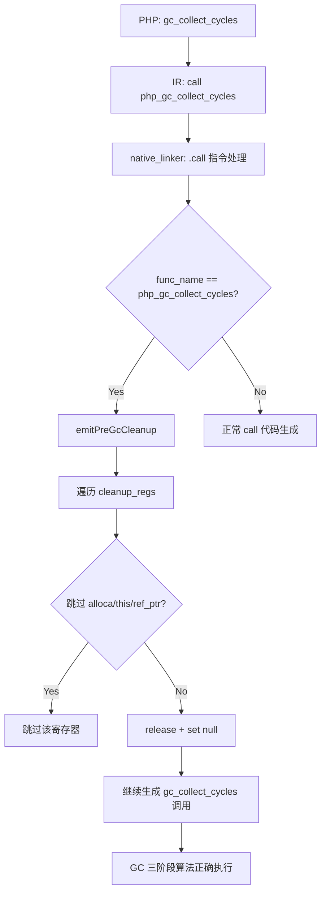

# AOT GC 循环检测 ref_count 膨胀修复

**日期**：2026-07-17（第十四轮）
**变更类型**：Bug 修复（AOT 运行时）
**影响范围**：GC 循环检测、临时寄存器引用计数管理

---

## 1. 高层摘要（TL;DR）

GC 三阶段循环检测算法（第十三轮启用）在含 `new` 对象的循环引用场景中无法正确收集垃圾，根因为 `dead operand release` 全局禁用导致临时寄存器（`getGlobalVar`/`load` 等）持有的 retain 在 `gc_collect_cycles()` 调用时仍未释放，使对象 `ref_count` 膨胀，MarkGray 阶段无法将 `ref_count` 递减至 0。本轮通过在 `call php_gc_collect_cycles` 之前插入 Pre-GC cleanup 释放临时寄存器引用，并将 `.global_get` 纳入 cleanup 寄存器收集范围，修复此问题。

## 2. 影响范围

| 维度 | 影响描述 |
|------|----------|
| GC 循环检测 | ✅ 修复：2 节点、3 节点、自引用循环均可正确收集 |
| 临时寄存器管理 | ✅ 修复：`getGlobalVar` 返回值纳入 cleanup 范围 |
| 全量回归 | ✅ 61/61 ALL PASS, DIFF=0, FAIL=0 |
| 性能 | 无影响：仅在 `gc_collect_cycles()` 调用前执行一次性 cleanup |

## 3. 核心变更

| 文件 | 变更点 | 说明 |
|------|--------|------|
| `src/aot/native_linker.zig` | 新增 `emitPreGcCleanup` 方法 | 在 `call php_gc_collect_cycles` 之前释放所有非 alloca、非 `$this`、非 ref_ptr 的临时寄存器引用 |
| `src/aot/native_linker.zig` | `.call` 指令处理新增 GC cleanup 检查 | 检测到 `php_gc_collect_cycles`/`gc_collect_cycles` 时调用 `emitPreGcCleanup` |
| `src/aot/native_linker.zig` | `cleanup_registers` 收集新增 `.global_get` | 使 `getGlobalVar` 返回的临时寄存器纳入函数退出和 Pre-GC cleanup 范围 |

## 4. 可视化概览

### 变更点逻辑映射



### 执行流程

```mermaid
sequenceDiagram
    participant PHP as PHP 脚本
    participant IR as IR 生成器
    participant NL as Native Linker
    participant RT as 运行时

    PHP->>IR: $a = null; $b = null; gc_collect_cycles()
    IR->>NL: call php_gc_collect_cycles
    NL->>NL: emitPreGcCleanup(writer, result_reg)
    NL->>RT: if (!reg_X.isNull()) { reg_X.release(); reg_X = null; }
    Note over RT: 临时寄存器引用释放<br/>ref_count 降至正确值
    NL->>RT: reg_result = php_gc_collect_cycles()
    RT->>RT: MarkGray: ref_count 递减至 0
    RT->>RT: Scan: ref_count == 0 → white
    RT->>RT: CollectWhite: 释放循环引用对象
    RT-->>PHP: Collected: N
```

## 5. 详细变更分析

### 5.1 `emitPreGcCleanup` 方法

**位置**：`native_linker.zig` ~line 7461

**逻辑**：
1. 遍历 `current_cleanup_regs` 中的所有寄存器
2. 跳过 `result` 寄存器（旧值已被 release）
3. 跳过 `alloca` 寄存器（局部变量，由函数退出 cleanup 管理）
4. 跳过 `this_regs`（`$this` 借用引用，不可释放）
5. 跳过 `ref_ptr_regs`（PHI/select 合并引用参数，不拥有值）
6. 跳过 `ref_param_alloca`（引用参数 alloca，storage 为 undefined）
7. 对剩余寄存器执行 `release + set null`

**生成代码示例**：
```zig
// Pre-GC cleanup: release temporary register references
if (!reg_4.isNull()) { reg_4.release(runtime.runtime_allocator); reg_4 = runtime.Value.initNull(); }
if (!reg_5.isNull()) { reg_5.release(runtime.runtime_allocator); reg_5 = runtime.Value.initNull(); }
```

### 5.2 `cleanup_registers` 收集扩展

**位置**：`native_linker.zig` ~line 3949

**变更**：
```zig
// Before:
.const_string, .concat, .array_new, .call => {

// After:
.const_string, .concat, .array_new, .call, .global_get => {
```

**原因**：`getGlobalVar` 在运行时中 retain 了返回值，但 `.global_get` 的 result 寄存器不在 cleanup_regs 中，导致：
1. 函数退出时不释放 → 内存泄漏（OS 回收，不影响正确性）
2. Pre-GC cleanup 不包含 → ref_count 膨胀（影响 GC 循环检测）

### 5.3 根因分析

```
问题链路：
dead operand release 全局禁用
  → getGlobalVar/load 等临时寄存器使用后不释放
  → gc_collect_cycles() 调用时临时寄存器仍持有 retain
  → 对象 ref_count 膨胀（如 3 而非预期的 1）
  → MarkGray 递减内部引用后 ref_count 仍 > 0
  → Scan 判定为存活（black）
  → 循环引用对象不被收集
  → Collected: 0
```

## 6. 影响与风险评估

| 维度 | 评估 |
|------|------|
| 破坏式变更 | 否 |
| 内存安全 | ✅ 改善：减少临时寄存器引用泄漏 |
| 类型安全 | 无影响 |
| 并发安全 | 无影响 |
| 性能 | 无影响：仅在 gc_collect_cycles() 调用前执行一次性 cleanup |
| 向后兼容 | ✅ 完全兼容 |

### 需要注意的点
- `emitPreGcCleanup` 释放临时寄存器后将其设为 null，后续代码不可再使用这些寄存器
- 当前实现假设 `gc_collect_cycles()` 之后的代码不依赖之前的临时寄存器（PHP 语义下成立）
- 长期方案应启用 `dead operand release`（`releaseDeadOperands`），但风险较高需逐步验证

### 复测路径
1. `zig build` 编译通过
2. `bash scripts/batch_test_pass.sh` → 37/37 PASS
3. `bash scripts/batch_test_aot.sh` → 17/17 PASS
4. `bash scripts/full_scan_aot.sh` → 7/7 PASS
5. GC 循环引用测试（2/3/自引用节点）AOT 与 PHP 输出一致

## 7. 遗留问题/潜在问题

| 问题 | 影响 | 后续建议 |
|------|------|----------|
| `dead operand release` 全局禁用 | 所有临时寄存器在函数退出前不被释放，导致 ref_count 膨胀 | P1：逐步启用 `releaseDeadOperands`，需充分测试 liveness analysis 准确性 |
| `.load` result 不在 cleanup_regs | load 产生的临时副本不在 cleanup 范围 | P2：评估是否将 `.load` 纳入 cleanup_regs（需区分 load from alloca vs load from ref） |
| `emitPreGcCleanup` 释放所有临时寄存器 | 如果 gc_collect_cycles 之后有代码依赖之前的临时寄存器，会导致 null 访问 | P3：当前 PHP 语义下不会发生，但可考虑使用 liveness analysis 精确化 |

## 8. 后续开发/优化建议

| 优先级 | 建议 | 影响面 | 落地成本 |
|--------|------|--------|----------|
| P0 | 逐步启用 `releaseDeadOperands` | 消除所有临时寄存器 ref_count 膨胀 | 高（需充分测试 liveness analysis） |
| P1 | 将 `.load` result 纳入 cleanup_regs | 消除 load 临时副本的 ref_count 膨胀 | 中（需区分 load 来源） |
| P2 | `emitPreGcCleanup` 使用 liveness analysis 精确化 | 只释放真正死亡的寄存器 | 中（需传递 block_idx/inst_idx） |
| P3 | GC 根集扫描支持全局变量表 | 使 GC 能正确处理全局变量中的循环引用 | 低（运行时层面修改） |
