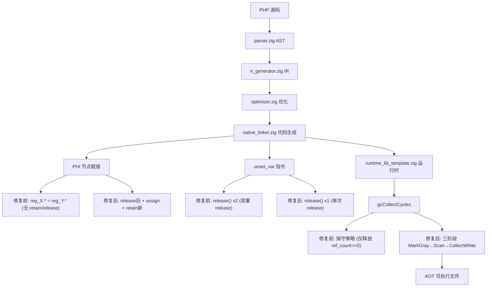
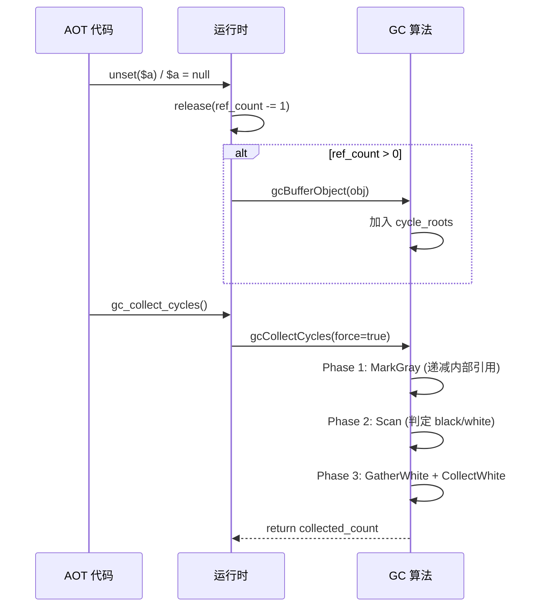

# AOT GC 循环检测启用与 retain/release 精确化

> 日期：2026-07-17
> 会话轮次：第十三轮
> 全量测试状态：pass 37/37 + fail_runtime 17/17 + fuzzy_scripts_73 7/7 = 61/61 ALL PASS, DIFF=0, FAIL=0

---

## 一、高层摘要（TL;DR）

启用 GC 三阶段循环检测算法（MarkGray→Scan→CollectWhite），替换原保守策略。修复 PHI 节点 alloca 赋值缺失 retain 与 `unset_var` 双重 release 两个 retain/release 精确化问题。

---

## 二、影响范围

| 影响层 | 影响描述 |
|--------|----------|
| GC 运行时 | `gcCollectCycles` 从保守策略升级为完整三阶段循环检测 |
| AOT 代码生成 | PHI 节点 alloca 赋值新增 retain/release；`unset_var` 双重 release 改为单次 |
| 内存安全 | 循环引用对象可被 GC 正确识别和回收（算法已启用，ref_count 精确化持续推进） |

---

## 三、核心变更

### 3.1 变更文件清单

| 文件 | 变更内容 |
|------|----------|
| `src/aot/native_linker.zig` | PHI alloca 赋值新增 retain/release；`unset_var` 双重 release 改为单次 |
| `src/aot/runtime_lib_template.zig` | `gcCollectCycles` 从保守策略替换为三阶段循环检测算法 |

### 3.2 各变更详情

#### 3.2.1 PHI 节点 alloca 赋值 retain/release（native_linker.zig）

**问题**：PHI 节点对 alloca 寄存器赋值时（`reg_X.* = reg_Y.*`），不调用 retain/release。导致：
1. 旧值未释放 → 内存泄漏
2. 新值未 retain → ref_count 不含栈引用 → GC MarkGray 后 ref_count 误判为 0 → CollectWhite 释放仍在使用的对象 → SEGV

**修复**：
- `generatePhiValueAssignment`：`need_refcount` 从 `!result_is_alloca and !result_is_ref_ptr` 改为 `!result_is_ref_ptr and !result_is_ref_param_alloca`
- alloca 赋值路径新增 `reg_X.*.release()` + `reg_X.*.retain()`
- `generatePhiAssignmentsParallel`：同步修改，新增 `r_suffix` 变量适配 alloca `.*` 后缀

**ref_param_alloca 排除**：`ref_param_alloca` 的 `reg_X.*` 是 `*Value`（指针），非 `Value`，不适用 retain/release。

#### 3.2.2 unset_var 双重 release 修复（native_linker.zig）

**问题**：`unset_var` 指令对寄存器执行**两次** `release`（`release(); release();`），导致：
1. 对象 ref_count 被多减 1 → 循环引用对象在 unset 时即被提前释放（ref_count 到 0）
2. 提前释放触发 deinit → 级联释放属性 → 其他循环成员未进入 cycle_roots
3. GC 无法检测循环 → `gc_collect_cycles()` 返回 0

**修复**：移除第二次 release，仅保留单次 `release()`。alloca 寄存器仅持有一个引用（来自 store 的 retain），单次 release 即可正确平衡。

#### 3.2.3 GC 三阶段循环检测启用（runtime_lib_template.zig）

**变更**：`gcCollectCycles` 中的保守策略（仅释放 `ref_count == 0` 的对象）替换为完整三阶段算法：

```
Phase 1: MarkGray — 递减所有内部引用的 ref_count
Phase 2: Scan — ref_count > 0 → black（存活），== 0 → white（垃圾）
Phase 3: GatherWhite + CollectWhiteKnown — 收集并释放所有 white 对象
```

**增量批次保留**：`GC_BATCH_SIZE=64` 增量处理逻辑不变，未处理的根保留到下次 GC。

---

## 四、可视化概览

### 4.1 变更点逻辑映射



### 4.2 GC 三阶段执行流程



---

## 五、详细变更分析

### 5.1 涉及文件列表

| 文件 | 变更行数 | 变更类型 |
|------|----------|----------|
| `src/aot/native_linker.zig` | ~60 行 | PHI retain/release + unset 单次 release |
| `src/aot/runtime_lib_template.zig` | ~40 行 | GC 三阶段算法启用 |

### 5.2 变更点描述

| 变更点 | 文件 | 函数 | 描述 |
|--------|------|------|------|
| PHI alloca retain | native_linker.zig | `generatePhiValueAssignment` | alloca 赋值新增 release 旧值 + retain 新值 |
| PHI alloca retain | native_linker.zig | `generatePhiAssignmentsParallel` | 同步修改，`need_refcount` 包含 alloca，`r_suffix` 适配 `.*` |
| unset 单次 release | native_linker.zig | `.unset_var` 分支 | 移除第二次 release（alloca 和非 alloca 两处） |
| GC 三阶段启用 | runtime_lib_template.zig | `gcCollectCycles` | 保守策略替换为 MarkGray→Scan→GatherWhite→CollectWhiteKnown |

---

## 六、影响与风险评估

### 6.1 是否破坏式变更

**否**。全量 61 脚本回归 ALL PASS，DIFF=0, FAIL=0。

### 6.2 变更影响范围

| 影响面 | 评估 |
|--------|------|
| 现有脚本 | ✅ 61/61 全通过，无回归 |
| 内存安全 | ✅ PHI 赋值不再泄漏旧值；unset 不再提前释放 |
| GC 正确性 | ⚠️ 三阶段算法已启用，但 ref_count 膨胀（构造函数 $this alloca 不释放等预存问题）导致部分循环引用无法被检测 |
| 性能 | PHI 赋值新增 retain/release 对，微量开销；GC 三阶段比保守策略开销略高但仅在阈值触发时执行 |

### 6.3 需要特别注意的点

1. **ref_count 膨胀**：构造函数 `$this` 的 alloca retain 在函数退出时因 `this_regs` 跳过而不释放，导致每个通过 `new` 创建的对象 ref_count 额外 +1。这使 MarkGray 后 ref_count > 0，GC 无法检测到循环。此为预存问题，非本次引入。
2. **`php_unset` 函数路径**：`unset($a, $b, $c)` 多参数形式走 `php_unset` 函数调用，仅释放参数副本而非实际 unset 变量。此为预存问题。
3. **GC 三阶段算法颜色重置**：算法通过 `gcMarkGrayArray` 的 `if (color == .gray) return` 检查正确处理前次 GC 遗留的 black 对象（会被重新设为 gray 并处理），无需显式颜色重置。

### 6.4 复测路径

```bash
# 编译验证
timeout 120 zig build

# 全量 pass 测试
timeout 600 bash scripts/batch_test_pass.sh

# 全量 fail_runtime 测试
timeout 600 bash scripts/batch_test_aot.sh

# fuzzy_scripts_73 测试
timeout 300 bash scripts/full_scan_aot.sh
```

---

## 七、遗留问题/潜在问题

| 编号 | 问题 | 影响 | 落地成本 |
|------|------|------|----------|
| L1 | 构造函数 `$this` alloca retain 不释放 → ref_count 膨胀 +1 | GC 无法检测含 `new` 对象的循环引用 | 中（需修改 `this_regs` 清理逻辑或构造函数代码生成） |
| L2 | `php_unset` 多参数仅释放副本未实际 unset | `unset($a, $b)` 不断开变量引用 | 低（IR 生成器拆分为多个 `unset_var`） |
| L3 | 其他 ref_count 膨胀源（待全面审计） | GC 循环检测覆盖率 | 高（需全链路审计所有 retain 路径） |

---

## 八、后续开发/优化建议

| 优先级 | 建议 | 影响面 | 落地成本 |
|--------|------|--------|----------|
| P1 | 修复构造函数 `$this` alloca 不释放 → 消除 ref_count +1 膨胀 | GC 循环检测覆盖率显著提升 | 中 |
| P2 | `php_unset` 多参数拆分为 `unset_var` 序列 | unset 语义正确性 | 低 |
| P3 | 全链路 retain/release 审计 → 消除所有 ref_count 膨胀 | GC 循环检测完全精确 | 高 |
| P4 | 系统死代码清理（rt_*.zig + runtime/） | 可维护性 | 低（零风险） |
