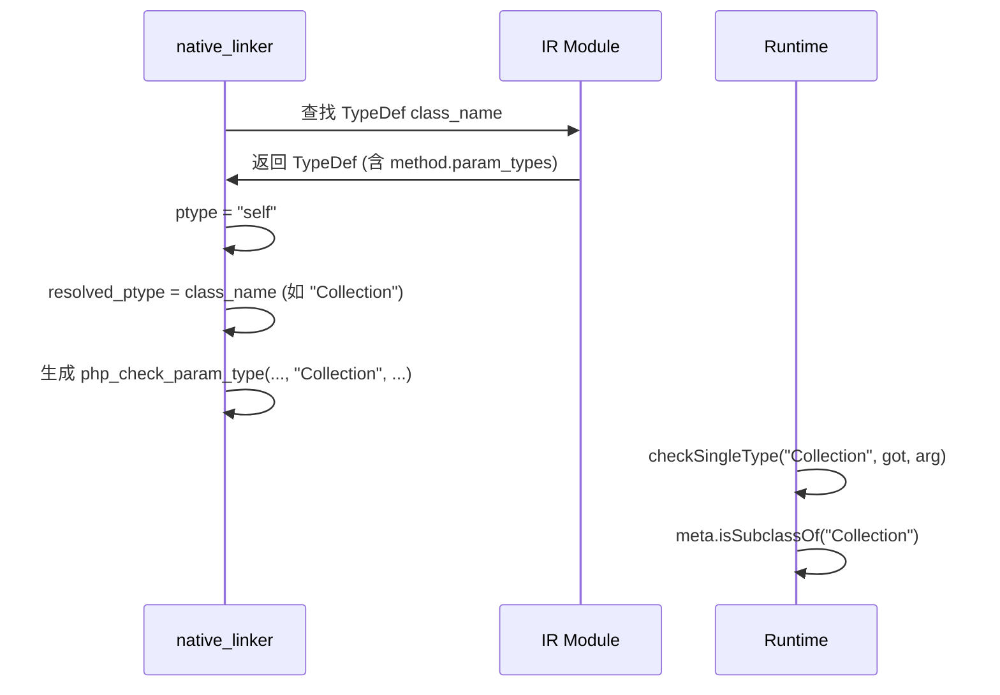

# AOT 参数类型检查完善 — 命名空间前缀/DNF/object/self 支持

**日期**: 2026-07-17  
**Hash**: typecheck_complete  
**模块**: AOT 运行时 — 参数类型检查系统

## 1. 高层摘要 (TL;DR)

上一轮新增的参数类型检查（`php_check_param_type` / `checkTypeMatch`）引入了回归 BUG：
- **test_047**: `\DateTimeImmutable` 带反斜杠前缀的类型声明不匹配
- **test_048**: DNF 类型 `Cacheable&Loggable|null`（intersection/union）不支持
- **t041**: `self` 类型提示未解析为实际类名

本轮修复通过重构 `checkTypeMatch` 为分层架构（`checkTypeMatch` → `checkUnionType` → `checkIntersectionType` → `checkSingleType`），完整支持 PHP 8 类型系统，并在 native_linker 中将 `self`/`static`/`parent` 解析为实际类名。

## 2. 影响范围

| 影响面 | 描述 |
|--------|------|
| AOT runtime_lib | `checkTypeMatch` 重构为分层架构，新增 4 个辅助函数 |
| AOT runtime_lib | `checkSingleType` 新增 `object` 伪类型和 `null` 类型支持 |
| AOT native_linker | 方法 prologue 类型检查生成中 `self`/`static`/`parent` → 实际类名 |

## 3. 核心变更

| 文件 | 变更点 | 说明 |
|------|--------|------|
| `runtime_lib_template.zig` | `checkTypeMatch` 重构 | 分层架构：先 `|` 分割 union → 再 `&` 分割 intersection → 最终 `checkSingleType` |
| `runtime_lib_template.zig` | 新增 `normalizeTypeName` | 去掉前导反斜杠和空格 |
| `runtime_lib_template.zig` | 新增 `checkUnionType` | union 类型检查：匹配任一成员 |
| `runtime_lib_template.zig` | 新增 `checkIntersectionType` | intersection 类型检查：必须匹配所有成员 |
| `runtime_lib_template.zig` | 新增 `checkSingleType` | 单一类型检查（从原 `checkTypeMatch` 提取，新增 object/null） |
| `native_linker.zig` | `self`/`static`/`parent` 解析 | 类型检查代码生成时替换为实际类名/父类名 |

## 4. 可视化概览

### 类型检查分层架构

```mermaid
graph TD
    A[php_check_param_type] --> B{expected 包含 |?}
    B -->|是| C[checkUnionType]
    B -->|否| D{expected 包含 &?}
    C --> E{成员包含 &?}
    E -->|是| F[checkIntersectionType]
    E -->|否| G[checkSingleType]
    D -->|是| F
    D -->|否| G
    F --> G
    G --> H{类型匹配检查}
    H -->|精确匹配| I[true]
    H -->|弱类型| J[int→float, int→bool]
    H -->|mixed| K[true]
    H -->|null| L[arg.isNull]
    H -->|object| M[Value_isObject]
    H -->|callable| N[string/array/Closure/__invoke]
    H -->|Closure| O[isFunction/Closure meta]
    H -->|类类型| P[isSubclassOf/implementsInterface]
```

### self 解析流程



## 5. 详细变更分析

### 5.1 checkTypeMatch 重构 (runtime_lib_template.zig)

**问题**: 原 `checkTypeMatch` 仅做精确匹配，不支持 union (`|`)、intersection (`&`)、DNF 类型，且不处理命名空间前缀（`\DateTimeImmutable`）。

**修复**: 重构为分层架构：
1. `checkTypeMatch`: 入口，去掉前导反斜杠，分发到 union/intersection/single
2. `checkUnionType`: 按 `|` 分割，每个成员可能是 intersection 或 single，匹配任一即可
3. `checkIntersectionType`: 按 `&` 分割，必须匹配所有成员（仅对对象类型有效）
4. `checkSingleType`: 单一类型检查（精确匹配 + 弱类型 + callable + 类继承）
5. `normalizeTypeName`: 去掉前导反斜杠和空格

### 5.2 object 伪类型 (runtime_lib_template.zig)

**问题**: PHP 8 的 `object` 伪类型接受任何对象实例，但 `checkSingleType` 没有处理。

**修复**: 在 `checkSingleType` 中添加：
```zig
if (std.mem.eql(u8, expected, "object")) {
    return Value_isObject(arg);
}
```

### 5.3 self/static/parent 解析 (native_linker.zig)

**问题**: PHP 的 `self`/`static`/`parent` 类型提示在 IR 中原样保留，运行时 `checkSingleType` 无法识别。

**修复**: 在 native_linker 生成类型检查代码时，将 `self`/`static` 替换为当前类名 `class_name`，将 `parent` 替换为 `td.parent`（父类名）。

## 6. 影响与风险评估

| 风险项 | 评估 | 缓解措施 |
|--------|------|----------|
| union/intersection 解析性能 | 每次类型检查增加字符串分割 | 仅对有 `|`/`&` 的类型做分割，无则直接走 single 路径 |
| self 替换范围 | 当前仅纯 `self`/`static`/`parent` 被替换 | 组合类型如 `self|null` 暂不支持（PHP 中极少见，`?self` 走 nullable 标志） |
| object 伪类型 | 接受任何对象 | 与 PHP 8 语义一致 |

### 复测路径
1. `zig build` 编译通过
2. test_047_readonly_props PASS（\DateTimeImmutable 命名空间前缀 + object 伪类型）
3. test_048_dnf_types PASS（DNF intersection/union 类型）
4. t041_collection_class PASS（self 类型提示）
5. fuzzy_scripts_73 7/7 PASS（含 f100 Deprecated 警告可忽略）
6. fuzzy_scripts/pass + fail_runtime 54/54 PASS
7. fuzzy_scripts_715 c028/c046 PASS

## 7. 遗留问题/潜在问题

1. **组合类型中的 self**: `self|null` 这样的 union 类型中的 `self` 未被替换（PHP 中极少见，`?self` 走 nullable 标志路径）
2. **static 后期静态绑定**: 当前 `static` 等同于 `self`（替换为定义方法的类名），PHP 语义中 `static` 应为运行时类名（子类调用时为子类名）
3. **callable 深度验证**: 当前仅检查值类型，未验证 string 是否为真实可调用函数名

## 8. 后续开发/优化建议

| 优先级 | 建议 | 影响面 | 落地成本 |
|--------|------|--------|----------|
| P1 | 支持 `static` 后期静态绑定 | 继承场景类型检查精确性 | 中 |
| P1 | 组合类型中的 self/static/parent 替换 | 边界场景覆盖 | 低 |
| P2 | callable 深度验证（函数名存在性） | 更精确的类型检查 | 低 |
| P2 | 类型检查结果缓存 | 减少重复字符串分割开销 | 低 |
