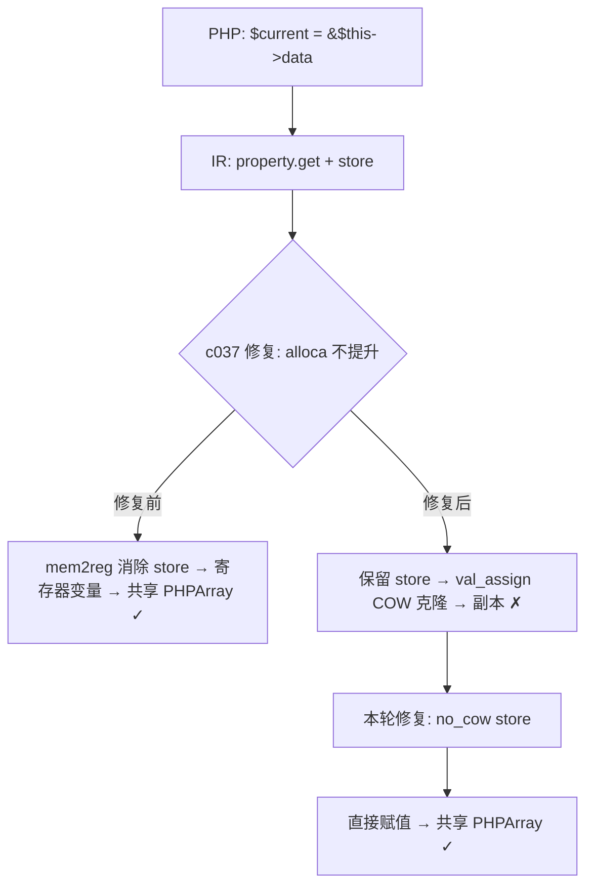

# AOT 引用赋值 COW 修复（c020 / c002）

> 日期：2026-07-17（第八轮）
> 会话范围：引用赋值 `$ref = &$this->prop` 的 COW 克隆导致值丢失
> 当前总状态：全量 103 脚本 PASS=101 DIFF=2（均可忽略）

---

## 一、TL;DR

修复 `$current = &$this->data` 引用赋值后嵌套数组写回丢失的问题。根因是 c037 修复（property_get 结果的 alloca 不提升）导致引用赋值的 store 通过 `val_assign` 做 COW 克隆，使 `$current` 成为 `$this->data` 的副本而非引用。后续 `array.set + store` 回写通过 `val_assign` 写穿旧 Ref，破坏引用链。

## 二、影响范围

| 范围 | 说明 |
|------|------|
| c020_config_system_deepmerge | 嵌套键 set 值丢失（2层/3层/4层）→ **修复** |
| c002_array_func_chain | flatten 的 `use(&$result)` 闭包 push 后值丢失 → **修复** |
| test_065_array_walk | array_walk 引用回调值丢失 → **修复** |
| 全量 103 脚本 | 无新回归（c016栈追踪/f100 Deprecated 均为可忽略差异） |

## 三、核心变更

| 文件 | 变更点 | 说明 |
|------|--------|------|
| `ir.zig` | StoreOp 新增 `no_cow: bool` | 标记引用赋值的 store 不做 val_assign COW |
| `ir_generator.zig` | `generateRefAssignment` store 设 `no_cow=true` | 引用赋值直接替换变量值，不做 COW 也不写穿旧 Ref |
| `ir_generator.zig` | array_access 写回 store 对 `isRefVar` 设 `no_cow=true` | 引用变量的 array.set/push 回写不做 val_assign 写穿 |
| `native_linker.zig` | store 代码生成检查 `no_cow` | alloca 路径和 mem2reg 路径均跳过 val_assign，直接赋值 |

## 四、根因分析

### 4.1 c037 修复的副作用

第六轮 c037 修复了值赋值 `$new = $this->data; usort($new)` 的 COW 丢失问题：
- `isPromotable` 中 property_get 结果的 alloca 不提升
- 保留 store → `val_assign` 做 COW 克隆

但这同时影响了引用赋值 `$current = &$this->data`：
- IR 生成器对引用赋值只生成 `property.get + store`（值语义），无 `make_ref`
- c037 修复导致 store 保留 → `val_assign` COW 克隆
- `$current` 成为 `$this->data` 的**副本**，修改不写回

### 4.2 引用重绑定的写穿问题

即使初始 COW 修复后，`array.set + store` 回写也通过 `val_assign`：
- `$current` 存储 Ref Value（第二次引用重绑定后）
- `val_assign` 检测到 target 是 Ref → 写穿引用
- 释放旧值（数组 B），设置新值（Ref Value）
- 破坏 `A['feature']` 的引用链

### 4.3 闭包 `use(&$result)` 的兼容性

闭包 `use(&$result)` 的 `$result` 在闭包内通过 `ref_capture_allocas` 走 `php_ref_assign_ptr` 路径（正确写穿）。`no_cow` 不影响这个路径（step 4 在 no_cow 之前 return）。

## 五、修复方案

### 5.1 `no_cow` 标志

在 `StoreOp` 中添加 `no_cow: bool = false`。`no_cow = true` 的 store 在 native_linker 中直接赋值（`reg_ptr.* = reg_value`），不做 `val_assign`（不做 COW 也不写穿 Ref）。

### 5.2 引用赋值的 store

`generateRefAssignment` 中所有局部变量引用的 store 设 `no_cow = true`：
- 初始引用赋值 `$current = &$this->data`：直接赋值共享 PHPArray，不做 COW
- 引用重绑定 `$current = &$current[$part]`：直接替换 Ref Value，不写穿旧 Ref

### 5.3 引用变量的 array.set/push 回写

`generateAssignment` 中 array_access target 的写回逻辑，对 `isRefVar` 变量的写回 store 设 `no_cow = true`：
- `ref_capture_allocas` 中的变量走 `php_ref_assign_ptr`（step 4，no_cow 不影响）
- 不在 `ref_capture_allocas` 中的变量走 `no_cow` 直接赋值（避免 `val_assign` 写穿旧 Ref）

## 六、可视化概览

## 七、影响与风险评估

- **是否破坏式变更**：否
- **变更影响范围**：引用赋值 `$ref = &$this->prop` 和引用变量的 array.set/push 回写
- **需要特别注意的点**：`no_cow` 不影响 `ref_capture_allocas`（闭包捕获）和 `make_ref_allocas`（make_ref 创建的引用）路径，这些路径在 store 代码生成的更早步骤中 return
- **复测路径**：c020 set/get 嵌套键、c002 flatten、t053 配置系统、t044 array_set

## 八、后续开发建议

| 优先级 | 建议项 | 影响面 | 落地成本 |
|--------|--------|--------|----------|
| P1 | 引用赋值生成 `make_ref`（而非 property.get + store）实现真正的 PHP 引用语义 | 引用精确性 | 高 |
| P1 | `static` 后期静态绑定（运行时类名） | 继承场景精确性 | 中 |
| P2 | 参数类型检查扩展到全局函数 | 类型安全覆盖 | 中 |
| P2 | 组合类型中的 self/static/parent 替换 | 边界场景覆盖 | 低 |
