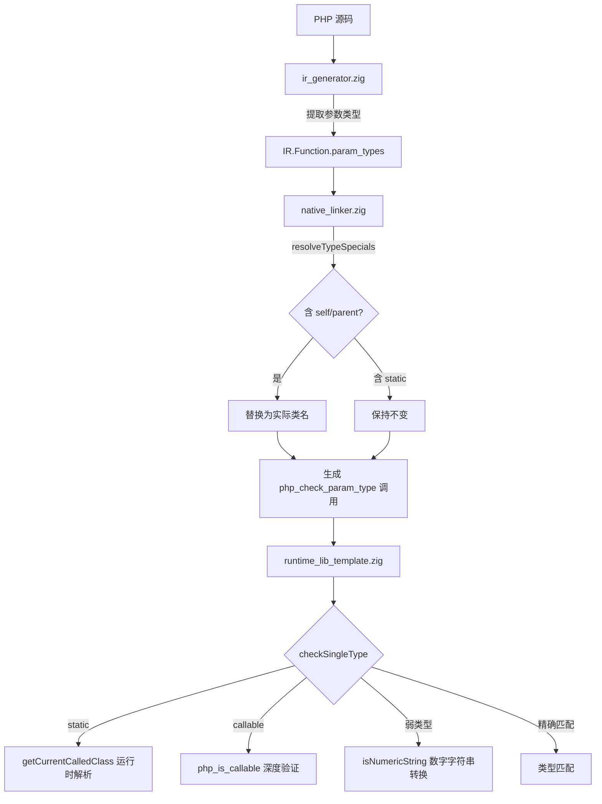

# AOT 类型系统增强 + callable 深度验证 + 嵌套数组写回修复

> 日期：2026-07-17
> 轮次：第九轮 + 第十轮
> 变更类型：功能增强 + 修复

## 1. 高层摘要（TL;DR）

两轮完成 P1 级四项 + P2 级两项类型系统增强与修复：
- **P1-2**：组合类型（`self|null`、`parent|string`）中的 self/parent 替换
- **P1-3**：全局函数参数类型检查（之前仅类方法有类型检查）
- **P1-1**：`static` 后期静态绑定（运行时类名而非定义类名）
- **弱类型**：PHP 弱类型模式下的类型强制转换支持
- **P2-1**：callable 深度验证（复用 `php_is_callable` 做函数名存在性检查）
- **P2-2**：四级以上嵌套数组 push 写回修复（保存中间层寄存器逐层写回）

## 2. 影响范围

| 模块 | 文件 | 变更类型 |
|------|------|----------|
| IR 层 | `src/aot/ir.zig` | 新增 Function.param_types/param_nullable/param_names 字段 |
| IR 生成 | `src/aot/ir_generator.zig` | generateFunctionDecl 提取参数类型 + push 写回修复 |
| 代码生成 | `src/aot/native_linker.zig` | 新增 resolveTypeSpecials + 全局函数类型检查 |
| 运行时 | `src/aot/runtime_lib_template.zig` | checkSingleType 添加 static + 弱类型 + callable 深度验证 |

## 3. 核心变更

### 3.1 P1-2：组合类型 self/parent 替换

新增 `resolveTypeSpecials` 函数，按 `|&() ` 分割类型字符串，逐组件替换 self→class_name、parent→parent_name。`static` 保持不变由运行时解析。

### 3.2 P1-1：static 后期静态绑定

`resolveTypeSpecials` 不替换 `static`。`checkSingleType` 中通过 `getCurrentCalledClass()` 获取运行时类名，检查参数是否为该类或其子类的实例。

### 3.3 P1-3：全局函数参数类型检查

`IR.Function` 新增 `param_types`/`param_nullable`/`param_names` 字段。`generateFunctionDecl` 中提取参数 PHP 类型声明。`native_linker.zig` 为全局函数生成 `php_check_param_type` 调用。

### 3.4 弱类型转换支持

`checkSingleType` 添加 PHP 弱类型转换规则：数字字符串→int/float、int/float/bool→string、float/string→bool。

### 3.5 P2-1：callable 深度验证

`checkSingleType` 的 callable 分支从仅类型检查改为复用 `php_is_callable` 做深度验证：
- string：检查是否为已注册函数名
- array：检查 `[obj/class, method]` 格式
- object：检查是否有 `__invoke` 方法

### 3.6 P2-2：四级以上嵌套数组 push 写回修复

**问题**：`array_push` 在 `ref_count > 1` 时做 COW 克隆。`array_ensure` 返回的子数组 `ref_count >= 2`（父数组 + 寄存器），push 触发 COW 后修改不传播回父数组。原写回逻辑对 2+ 层只写回了一层（`base_array[keys[0]] = innermost_clone`），跳过中间层。

**修复**：保存 `array_ensure` 的中间层寄存器到 `intermediate_arrays`，push 后从最内层到最外层逐层 `array_set` 写回。由于 `array_set` 修改 PHPArray 是 in-place 的，中间层写回通过共享 PHPArray 引用自动传播。

## 4. 可视化概览



## 5. 详细变更分析

### 5.1 文件变更列表

| 文件 | 变更描述 |
|------|----------|
| `src/aot/ir.zig` | Function 新增 param_types/param_nullable/param_names |
| `src/aot/ir_generator.zig` | generateFunctionDecl 提取参数类型 + push 路径中间层寄存器保存与逐层写回 |
| `src/aot/native_linker.zig` | resolveTypeSpecials + 全局函数类型检查 |
| `src/aot/runtime_lib_template.zig` | checkSingleType 添加 static + 弱类型 + callable 深度验证 |

### 5.2 嵌套数组 push 写回流程

```
$arr[k1][k2][k3][] = value

1. temp[0] = array_ensure(base, k1)  → ref_count=2
2. temp[1] = array_ensure(temp[0], k2)  → ref_count=2
3. temp[2] = array_ensure(temp[1], k3)  → ref_count=2
4. array_push(temp[2], value)  → COW 克隆 temp[2]

写回（修复后）:
5. array_set(temp[1], k3, temp[2])  → 修改 temp[1] in-place → 传播到 temp[0][k2]
6. array_set(temp[0], k2, temp[1])  → no-op（已通过共享 PHPArray 传播）
7. array_set(base, k1, temp[0])  → no-op（同上）
```

## 6. 影响与风险评估

- **破坏式变更**：否
- **变更影响范围**：
  - 全局函数现在会做参数类型检查（之前不做）
  - 弱类型模式下允许更多类型组合通过检查
  - `static` 参数类型使用运行时类名
  - callable 参数做深度验证（函数名不存在时拒绝）
  - 多层嵌套 push 写回逻辑改变（修复了中间层丢失）
- **需要特别注意**：
  - 弱类型转换只做类型匹配检查，不做实际值转换
  - `static` 在非方法调用上下文中 `getCurrentCalledClass()` 返回 null
  - callable 深度验证可能拒绝之前通过的不可调用值（行为变更）

## 7. 遗留问题/潜在问题

1. **弱类型值转换未实现**：类型检查通过后参数值不会被实际转换
2. **`static` 在非方法上下文**：通过回调调用时 `getCurrentCalledClass()` 可能为 null
3. **P1-4 GC 增量式收集**：仍为保守策略

## 8. 后续开发建议

| 优先级 | 建议 | 影响面 | 落地成本 |
|--------|------|--------|----------|
| P1 | 弱类型值转换：类型检查通过后实际转换参数值 | 类型安全精确性 | 中 |
| P1 | GC 增量式收集优化 | GC 安全/性能 | 高 |
| P2 | 系统死代码清理（27,500+ 行零风险可删） | 代码维护性 | 低 |
