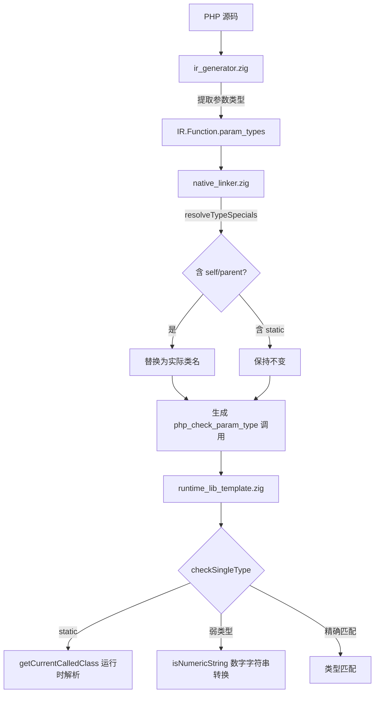

# AOT 类型系统增强：组合类型解析 + 全局函数类型检查 + static 后期静态绑定 + 弱类型转换

> 日期：2026-07-17
> 轮次：第九轮
> 变更类型：功能增强

## 1. 高层摘要（TL;DR）

本轮完成 P1 级四项类型系统增强：
- **P1-2**：组合类型（`self|null`、`parent|string`）中的 self/parent 替换
- **P1-3**：全局函数参数类型检查（之前仅类方法有类型检查）
- **P1-1**：`static` 后期静态绑定（运行时类名而非定义类名）
- **附加**：PHP 弱类型模式下的类型强制转换支持

## 2. 影响范围

| 模块 | 文件 | 变更类型 |
|------|------|----------|
| IR 层 | `src/aot/ir.zig` | 新增 Function.param_types/param_nullable/param_names 字段 |
| IR 生成 | `src/aot/ir_generator.zig` | generateFunctionDecl 中提取参数类型声明 |
| 代码生成 | `src/aot/native_linker.zig` | 新增 resolveTypeSpecials + 全局函数类型检查 |
| 运行时 | `src/aot/runtime_lib_template.zig` | checkSingleType 添加 static + 弱类型转换 |

## 3. 核心变更

### 3.1 P1-2：组合类型 self/parent 替换

**问题**：`self|null` 中的 `self` 未被替换为实际类名（只处理精确匹配 `ptype == "self"`）。

**修复**：新增 `resolveTypeSpecials` 函数，按 `|&() ` 分割类型字符串，逐组件替换 self→class_name、parent→parent_name。

```zig
fn resolveTypeSpecials(self, ptype, class_name, parent_name) ![]const u8 {
    // 逐组件扫描，替换 self/parent 为实际类名
    // static 保持不变，由运行时 checkSingleType 解析
}
```

### 3.2 P1-1：static 后期静态绑定

**问题**：`static` 被编译时替换为定义类名，PHP 语义应为运行时类名。

**修复**：
1. `resolveTypeSpecials` 不替换 `static`（保持原样传入运行时）
2. `checkSingleType` 中添加 `static` 处理：通过 `getCurrentCalledClass()` 获取运行时类名，检查参数是否为该类或其子类的实例

```zig
if (std.mem.eql(u8, expected, "static")) {
    if (getCurrentCalledClass()) |called_class| {
        if (meta.isSubclassOf(called_class.name)) return true;
    }
}
```

### 3.3 P1-3：全局函数参数类型检查

**问题**：只有类方法（函数名含 `::`）生成参数类型检查代码，全局函数不检查。

**修复**：
1. `IR.Function` 新增 `param_types`/`param_nullable`/`param_names` 字段
2. `generateFunctionDecl` 中提取参数 PHP 类型声明并填充
3. `native_linker.zig` 的 `generateFunction` 中，当函数名不含 `::` 时，使用 `func.param_types` 生成类型检查代码

### 3.4 弱类型转换支持

**问题**：P1-3 启用全局函数类型检查后，`coerceFloat("3.14")` 报 TypeError（PHP 非严格模式应做类型转换）。

**修复**：`checkSingleType` 添加 PHP 弱类型转换规则：
- 数字字符串 → int/float（`isNumericString` 检查）
- int/float/bool → string
- float/string → bool

## 4. 可视化概览



## 5. 详细变更分析

### 5.1 文件变更列表

| 文件 | 变更行数 | 变更描述 |
|------|----------|----------|
| `src/aot/ir.zig` | +6 | Function 新增 param_types/param_nullable/param_names |
| `src/aot/ir_generator.zig` | +33 | generateFunctionDecl 中提取参数类型声明 |
| `src/aot/native_linker.zig` | +72 | resolveTypeSpecials + 全局函数类型检查 |
| `src/aot/runtime_lib_template.zig` | +24 | checkSingleType 添加 static + 弱类型转换 |

### 5.2 执行流程

1. PHP 源码 → AST → IR 生成（`ir_generator.zig`）
   - `generateFunctionDecl` 调用 `resolveTypeNodeToString` 提取每个参数的 PHP 类型声明
   - 填充 `func.param_types`/`func.param_nullable`/`func.param_names`

2. IR → Zig 代码生成（`native_linker.zig`）
   - `generateFunction` 中，方法走原有路径（TypeDef.Method.param_types）
   - 全局函数走新路径（IR.Function.param_types）
   - `resolveTypeSpecials` 替换 self/parent，保留 static

3. Zig 代码 → 编译 → 运行
   - `php_check_param_type` → `checkTypeMatch` → `checkSingleType`
   - `static` 通过 `getCurrentCalledClass()` 运行时解析
   - 弱类型转换通过 `isNumericString` 检查

## 6. 影响与风险评估

- **破坏式变更**：否
- **变更影响范围**：类型检查行为变化
  - 全局函数现在会做参数类型检查（之前不做）
  - 弱类型模式下允许更多类型组合通过检查
  - `static` 参数类型现在使用运行时类名
- **需要特别注意**：
  - 弱类型转换只做类型匹配检查，不做实际值转换（函数内部收到的还是原始值）
  - `static` 参数类型在非方法调用上下文中，`getCurrentCalledClass()` 返回 null，会导致类型检查失败
- **复测路径**：运行 `batch_test_pass.sh`、`batch_test_aot.sh`、`full_scan_aot.sh`

## 7. 遗留问题/潜在问题

1. **弱类型值转换未实现**：类型检查通过后，参数值不会被实际转换（如 string "3.14" 不会被转为 float 3.14）。当前依赖函数内部的弱类型运算来产生正确结果，但不保证所有场景都正确。
2. **`static` 在非方法上下文**：如果通过函数指针或回调调用带 `static` 参数的方法，`getCurrentCalledClass()` 可能为 null。
3. **P1-4 GC 增量式收集**：本轮未处理，仍为保守策略。

## 8. 后续开发建议

| 优先级 | 建议 | 影响面 | 落地成本 |
|--------|------|--------|----------|
| P1 | 弱类型值转换：类型检查通过后实际转换参数值 | 类型安全精确性 | 中 |
| P2 | callable 深度验证：检查 string 是否为真实可调用函数名 | 精确性 | 低 |
| P2 | 四级以上嵌套数组写回 | 极端场景 | 低 |
| P1 | GC 增量式收集优化 | GC 安全/性能 | 高 |
