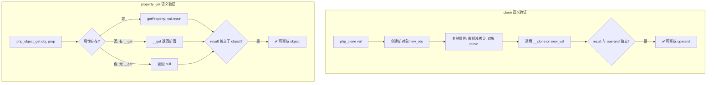
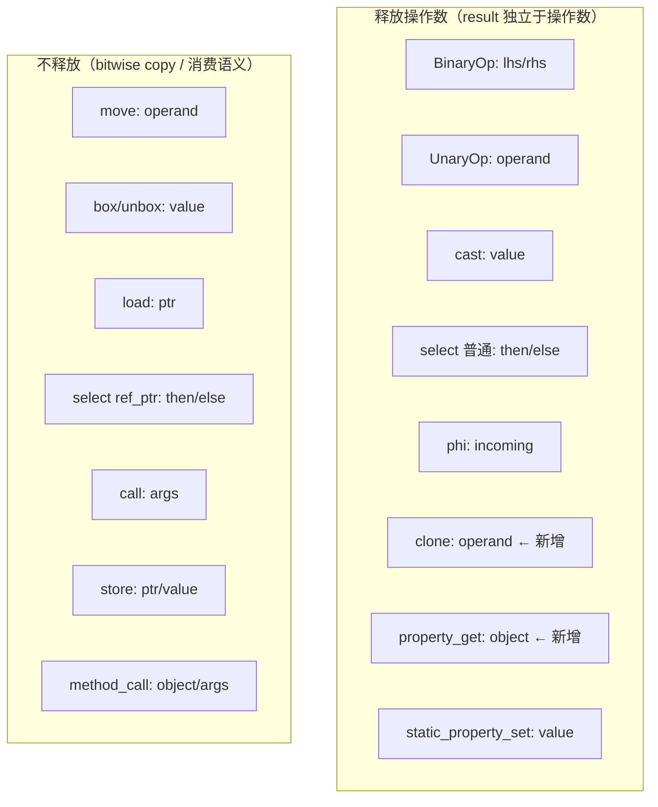

# AOT clone/property_get 操作数释放优化

| 字段 | 值 |
|------|-----|
| 日期 | 2026-07-18 |
| 轮次 | 第二十一轮 |
| Commit | `2e403e7`（工作区变更，未提交） |
| 模块 | AOT 代码生成 / 引用计数精度 |
| 测试 | 61/61 ALL PASS (pass 37 + fail_runtime 17 + fuzzy_scripts_73 7) |

---

## 1. 高层摘要（TL;DR）

将 `clone` 和 `property_get` 指令的操作数从"保守不释放"优化为"释放"。`php_clone` 是深拷贝（创建全新对象），result 与 operand 完全独立；`php_object_get` 内部 `getProperty` 已 retain 返回值，result 独立于 object。两个优化均减少 ref_count 膨胀，提升 GC 循环检测精度。

## 2. 影响范围

| 层级 | 组件 | 影响描述 |
|------|------|---------|
| 代码生成 | `native_linker.zig` | `releaseDeadOperands` 新增 `.clone` case，修改 `.property_get` case |
| 内存安全 | 引用计数 | 减少 clone/property_get 场景的 ref_count 膨胀 |
| GC | 循环检测 | ref_count 更精确 → MarkGray 阶段更准确识别循环引用 |

## 3. 核心变更

| 文件 | 行号 | 变更描述 |
|------|------|---------|
| `src/aot/native_linker.zig` | ~7360 | `.property_get` 从 `{}` 改为释放 `op.object.id` |
| `src/aot/native_linker.zig` | ~7388 | 新增 `.clone` case 释放 `op.operand.id` |

### 3.1 property_get 变更

```zig
// 修复前（保守不释放）
.property_get => {
    // object 属性可能被结果引用（bitwise copy 不 retain），不释放 object
},

// 修复后（释放 object）
.property_get => |op| {
    try used_regs.append(self.allocator, op.object.id);
},
```

### 3.2 clone 变更

```zig
// 修复前（走 else => {}，不释放）
// clone 无显式 case，走 else => {} 分支

// 修复后（释放 operand）
.clone => |op| {
    try used_regs.append(self.allocator, op.operand.id);
},
```

## 4. 可视化概览

### 4.1 语义验证流程



### 4.2 releaseDeadOperands 指令分类（更新后）



## 5. 详细变更分析

### 5.1 clone 深拷贝语义确认

| 检查点 | 结论 | 依据 |
|--------|------|------|
| result 是否全新对象？ | ✅ 是 | `PHPObject.init(allocator, class_name)` 创建新对象 |
| 属性是否独立？ | ✅ 是 | 数组 `cloneShallow`，对象 `retain`（独立引用） |
| __clone 是否引用原对象？ | ❌ 否 | `__clone` 在 `new_val`（新对象）上调用，参数 `&.{}` 空 |
| 释放 operand 是否安全？ | ✅ 安全 | result 与 operand 无共享引用 |

### 5.2 property_get retain 语义确认

| 检查点 | 结论 | 依据 |
|--------|------|------|
| getProperty 是否 retain？ | ✅ 是 | `_ = val.retain(); return val;` |
| __get 返回值是否独立？ | ✅ 是 | PHP 方法返回值按值返回（retain 过） |
| result 是否依赖 object 生命周期？ | ❌ 否 | result 已 retain，object 销毁不影响 result |
| 异常路径是否安全？ | ✅ 是 | 异常 `continue` 跳过 releaseDeadOperands |
| 释放 object 是否安全？ | ✅ 安全 | result 独立于 object |

### 5.3 liveness 分析覆盖确认

| 指令 | liveness addUsedRegs | 状态 |
|------|---------------------|------|
| `.clone` | UnaryOp 列表（line 370） | ✅ 已追踪 operand |
| `.property_get` | PropertyGetOp（line 451） | ✅ 已追踪 object |

### 5.4 安全保障机制

| 机制 | 说明 |
|------|------|
| alloca 检查 | `alloca_regs.contains(reg_id)` 跳过 alloca 寄存器 |
| result 检查 | `reg_id == result_reg.id` 跳过 result 寄存器 |
| ref_ptr 检查 | `current_ref_ptr_regs` 跳过引用参数寄存器 |
| may_heap 检查 | `regMayHeap(reg_id)` 跳过非堆值 |
| shouldReleaseReg | 双重检查释放条件 |
| 异常 continue | 异常时跳过 releaseDeadOperands 代码 |

## 6. 影响与风险评估

### 6.1 是否破坏式变更
**否**。仅影响 clone/property_get 的释放策略，从"不释放"改为"释放"（更积极）。

### 6.2 变更影响范围及明细

| 影响面 | 评估 | 说明 |
|--------|------|------|
| 内存安全 | ✅ 提升 | ref_count 更精确，减少膨胀 |
| GC 循环检测 | ✅ 提升 | ref_count 精确 → MarkGray 更准确 |
| 功能正确性 | ✅ 无影响 | 61/61 回归通过 |
| 性能 | ✅ 微提升 | 减少无用 ref_count 操作 |

### 6.3 复测路径
```bash
timeout 300 bash scripts/full_scan_aot.sh          # fuzzy_scripts_73: 7/7
timeout 600 bash scripts/batch_test_aot.sh          # fail_runtime: 17/17
timeout 600 bash scripts/batch_test_pass.sh         # pass: 37/37
# 总计: 61/61 ALL PASS
```

## 7. 遗留问题/潜在问题

无。clone 和 property_get 的优化已完成，releaseDeadOperands 系统审查全面结束。

## 8. 后续开发/优化建议

| 优先级 | 建议 | 影响面 | 落地成本 |
|--------|------|--------|---------|
| P3 | 清理 `parent_call` 死指令（ir_generator 不生成，全链路防御性代码） | 可维护性 | 中 |
| P3 | 统一 PHI 代码生成路径（消除并行版本与状态机版本重复） | 可维护性 | 中 |
| P3 | 引入 releaseDeadOperands 单元测试（覆盖所有指令类型） | 回归保障 | 中 |
| P3 | 清理 rt_*.zig 死代码（26,880 行，用户表示自行处理） | 代码库规模 | 低 |
