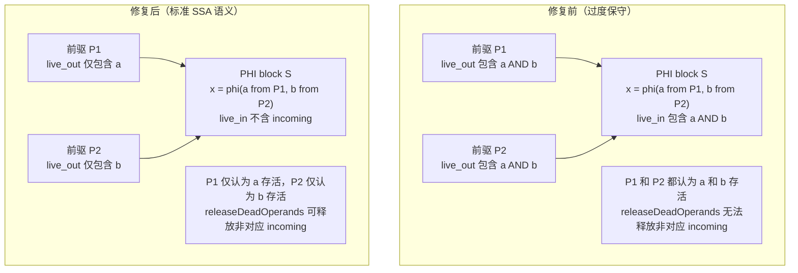
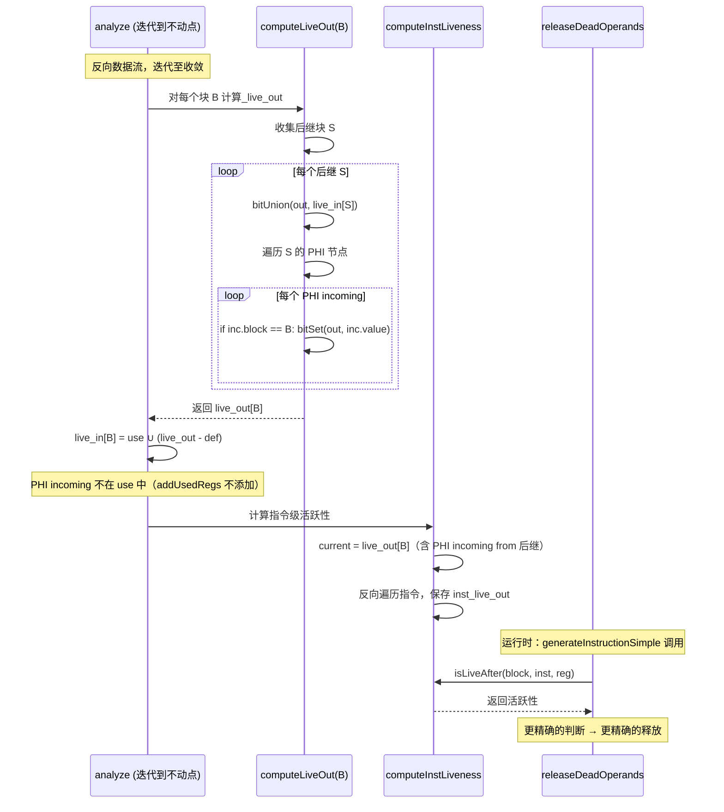

# AOT liveness PHI incoming 语义重构

> 日期: 2026-07-18
> 轮次: 第十九轮
> 变更类型: AOT 编译器性能优化（liveness 分析精确化）
> 测试结果: pass 37/37 + fail_runtime 17/17 + fuzzy_scripts_73 7/7 = 61/61 ALL PASS

---

## 1. 高层摘要（TL;DR）

将 liveness 分析中的 PHI incoming 建模从**过度保守**（所有前驱都认为所有 incoming 存活）重构为**标准 SSA 语义**（incoming 精确归属到对应前驱块的 `live_out`）。此重构使 `releaseDeadOperands` 能更精确地释放死亡操作数，减少 ref_count 膨胀，提升运行时内存回收效率。

---

## 2. 影响范围

| 范围 | 描述 |
|------|------|
| **liveness 分析** | `addUsedRegs` 中 PHI 不再添加 incoming；`computeLiveOut` 中按前驱-后继对应关系精确添加 |
| **releaseDeadOperands** | 前驱块末尾能更精确地释放非对应 incoming（之前被过度保守的 liveness 阻止） |
| **内存回收** | 减少 ref_count 膨胀，临时寄存器更早被回收 |

---

## 3. 核心变更

| # | 变更点 | 文件 | 修复前 | 修复后 |
|---|--------|------|--------|--------|
| 1 | `addUsedRegs` PHI 处理 | `liveness_analysis.zig` | `.phi => { for (incoming) bitSet(set, inc.value.id); }` — 所有 incoming 加到 PHI block 的 `live_in` | `.phi => {}` — PHI incoming 不在 PHI block 中使用 |
| 2 | `computeLiveOut` PHI incoming 精确添加 | `liveness_analysis.zig` | 仅合并后继块的 `live_in`（含所有 incoming，过度保守） | 合并后继块的 `live_in` + 仅为当前前驱块对应的 PHI incoming 添加 `bitSet` |

---

## 4. 可视化概览

### 4.1 PHI incoming 语义对比



### 4.2 数据流分析流程



---

## 5. 详细变更分析

### 5.1 涉及文件列表

| 文件 | 变更类型 | 变更点 |
|------|----------|--------|
| `src/aot/liveness_analysis.zig` | 修改 | `addUsedRegs` PHI 处理 + `computeLiveOut` PHI incoming 精确添加 |

### 5.2 变更点描述

#### 5.2.1 `addUsedRegs` PHI 处理

**修复前**:
```zig
.phi => |phi| {
    for (phi.incoming) |inc| bitSet(set, inc.value.id);
},
```

**修复后**:
```zig
// PHI incoming values are NOT used in the PHI block itself.
// They are "used" at the end of the corresponding predecessor block.
// This is handled in computeLiveOut (standard SSA liveness semantics).
.phi => {},
```

**原理**: 在标准 SSA liveness 中，PHI 节点 `x = phi(a from P1, b from P2)` 的 incoming 值 `a` 和 `b` 不在 PHI block S 中"使用"。它们分别在 P1 和 P2 的末尾"使用"（即 P1 末尾需要 `a` 存活，P2 末尾需要 `b` 存活）。

#### 5.2.2 `computeLiveOut` PHI incoming 精确添加

**修复前**:
```zig
for (successors_buf[0..num_succs]) |succ_idx| {
    if (succ_idx < self.num_blocks) {
        const succ_live_in = self.getLiveIn(succ_idx);
        bitUnion(out, succ_live_in);
    }
}
```

**修复后**:
```zig
for (successors_buf[0..num_succs]) |succ_idx| {
    if (succ_idx < self.num_blocks) {
        const succ_live_in = self.getLiveIn(succ_idx);
        bitUnion(out, succ_live_in);

        // 添加后继块中 PHI 节点的 incoming（仅对应当前前驱块的）
        const succ_block = func.blocks.items[succ_idx];
        for (succ_block.instructions.items) |inst| {
            switch (inst.op) {
                .phi => |phi| {
                    for (phi.incoming) |inc| {
                        if (@as(usize, inc.block.index) == block_idx) {
                            bitSet(out, inc.value.id);
                        }
                    }
                },
                else => break, // PHI 节点总是在块首，遇到非 PHI 即止
            }
        }
    }
}
```

**原理**: 当计算 `live_out[B]` 时，对于 B 的每个后继 S：
1. 合并 `live_in[S]`（标准数据流）
2. 遍历 S 的 PHI 节点（PHI 总在块首），找到 incoming 中 `block == B` 的项，将其 `value` 添加到 `live_out[B]`

这样，P1 的 `live_out` 只包含 `a`（来自 PHI 的 P1 incoming），P2 的 `live_out` 只包含 `b`（来自 PHI 的 P2 incoming），而非两者都包含。

---

## 6. 影响与风险评估

### 6.1 是否破坏式变更

**否**。全量 61 脚本回归通过，零 DIFF、零 SEGV。

### 6.2 变更影响范围及明细

| 影响面 | 评估 |
|--------|------|
| **正确性** | ✅ 符合标准 SSA liveness 语义 |
| **性能** | ✅ 改善：更精确的释放，减少 ref_count 膨胀 |
| **内存安全** | ✅ 无风险：双重保护（`isLiveAfter` + `isLiveAtBlockExit`）仍生效 |
| **编译速度** | ⚪ 轻微增加（`computeLiveOut` 多遍历 PHI 节点，但 PHI 总在块首，O(1) break） |
| **运行速度** | ✅ 轻微改善（更早释放临时寄存器） |

### 6.3 需要特别注意的点

1. **PHI 节点必须在块首**: 实现依赖 `else => break` 假设 PHI 节点后紧跟非 PHI 指令。IR 生成器保证此约定（native_linker.zig `first_non_phi_idx` 验证）。
2. **自环 PHI（`x = phi(x from L)`）**: `inc.block.index == block_idx` 时，incoming 加到自身的 `live_out`。这是正确的——自环 PHI 的值在块末尾需要存活（供下一次迭代的 PHI 使用）。
3. **`computeInstLiveness` 无需修改**: 它从 `live_out[B]` 开始反向遍历，`live_out` 已包含正确的 PHI incoming。指令级活跃性自然正确。

### 6.4 复测路径

```bash
timeout 120 zig build
timeout 300 bash scripts/full_scan_aot.sh          # 7/7
timeout 300 bash scripts/batch_test_aot.sh           # 17/17
timeout 600 bash scripts/batch_test_pass.sh          # 37/37
```

---

## 7. 遗留问题/潜在问题

| # | 问题 | 风险等级 | 说明 |
|---|------|----------|------|
| 1 | `releaseDeadOperands` 中 PHI 处理为死代码 | 极低 | PHI 指令在 `first_non_phi_idx` 后被过滤，`releaseDeadOperands` 永远不会处理 PHI。保留不影响正确性，后续可清理。 |
| 2 | 迭代次数上限 100 | 极低 | 复杂循环场景可能需要更多迭代。当前 61 脚本均收敛，但超大型脚本可能需要调整。 |

---

## 8. 后续开发/优化建议

| 优先级 | 建议 | 影响面 | 落地成本 |
|--------|------|--------|----------|
| P2 | 清理 `releaseDeadOperands` 中 PHI 死代码 | 可维护性 | 极低 |
| P2 | 审查所有 bitwise copy 指令在 `releaseDeadOperands` 中的处理 | 安全 | 低 |
| P3 | 统一 PHI 代码生成路径（`generatePhiInstructionsParallel` 和 `generatePhiInstructionStateMachine`） | 可维护性 | 中 |
| P3 | liveness 迭代次数自适应（基于块数动态调整上限） | 健壮性 | 低 |

---

## 9. 自检结论

链式推理执行完毕：
1. **需求解构**: 将 PHI incoming 从过度保守改为标准 SSA 语义
2. **约束枚举**: 不破坏 61/61 全量测试、PHI 节点在块首假设、自环 PHI 正确处理
3. **方案权衡**: 方案 A（在 `addUsedRegs` 中不添加 + `computeLiveOut` 中精确添加）简洁且符合标准；方案 B（维护前驱-incoming 映射表）复杂且无额外收益 → 选择方案 A
4. **实现执行**: 两处修改（`addUsedRegs` + `computeLiveOut`）
5. **深度自检**: 编译通过 + test_086 IDENTICAL + 全量 61/61 ALL PASS

**结论**: 通过。
