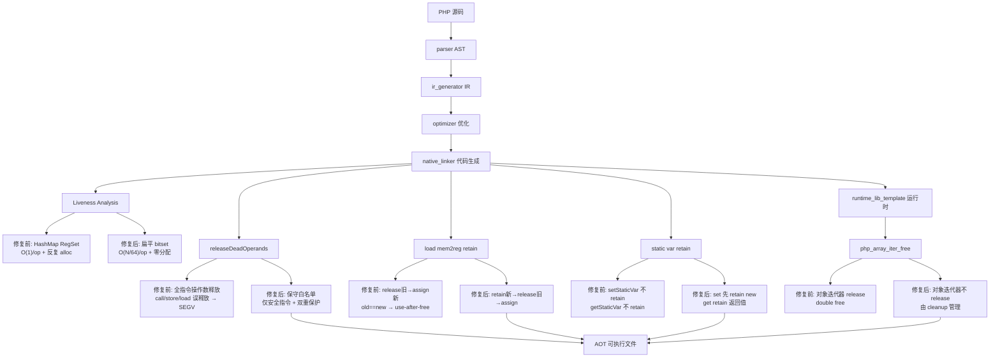
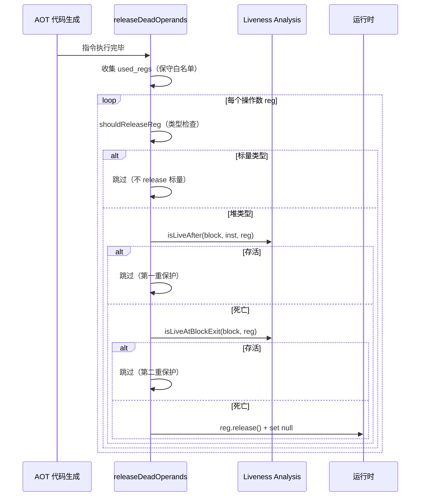
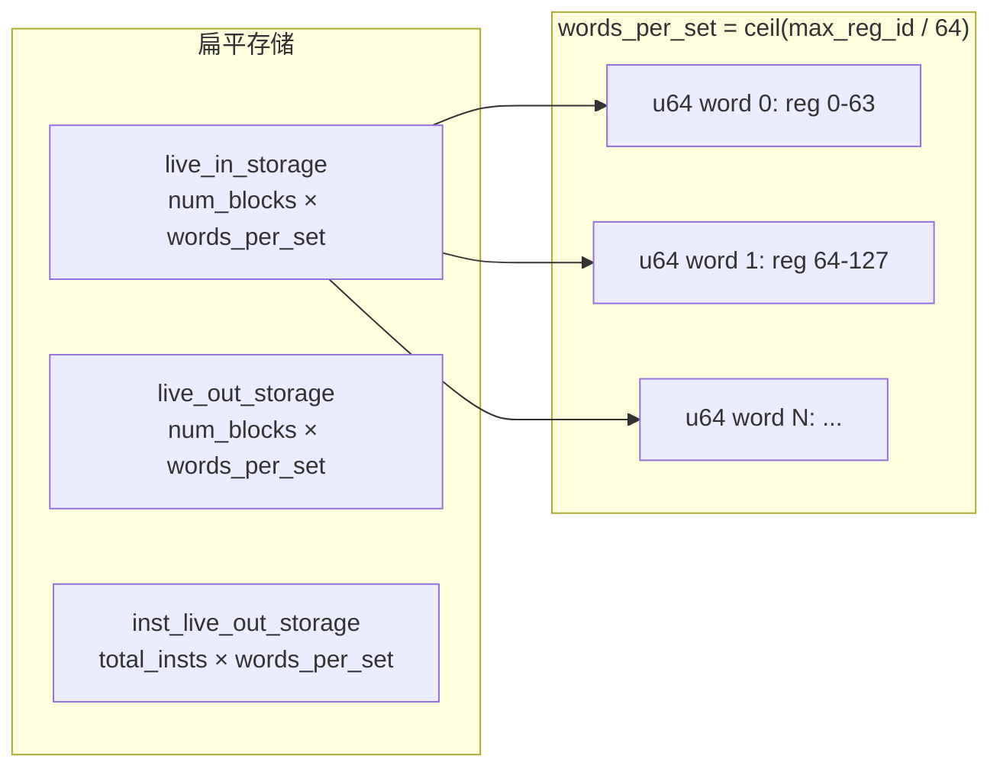

# AOT Liveness Bitset 重写与 releaseDeadOperands 保守化

> 日期：2026-07-18
> 会话轮次：第十六轮
> 全量测试状态：pass 37/37 + fail_runtime 17/17 + fuzzy_scripts_73 7/7 = 61/61 ALL PASS, DIFF=0, FAIL=0

---

## 一、高层摘要（TL;DR）

将 `liveness_analysis.zig` 从 HashMap RegSet 实现重写为扁平 bitset 高性能实现（操作复杂度 O(N/64)→预分配零分配迭代）。同时为 `releaseDeadOperands` 引入保守指令白名单策略（仅释放安全指令操作数，call/store/load/array_get 等不释放），并通过 `isLiveAfter` + `isLiveAtBlockExit` 双重保护防止 liveness bug 误释放。修复 load mem2reg/ref_param 路径的 retain/release 顺序（先 retain 新值再 release 旧值，防 old==new use-after-free）、`setStaticVar`/`getStaticVar` retain 语义、`php_array_iter_free` 双重释放。

---

## 二、影响范围

| 影响层 | 影响描述 |
|--------|----------|
| Liveness 分析性能 | HashMap RegSet → 扁平 bitset，迭代零分配，复杂度 O(N/64) |
| AOT 代码生成 | `releaseDeadOperands` 保守化：仅安全指令操作数释放，双重 liveness 保护 |
| 内存安全 | load mem2reg retain 顺序修复（防 use-after-free）；迭代器双重释放修复 |
| 静态变量 | `setStaticVar`/`getStaticVar` retain 语义正确化 |
| 回归 | ✅ 全量 61/61 ALL PASS，无回归 |

---

## 三、核心变更

### 3.1 变更文件清单

| 文件 | 变更内容 | 变更行数 |
|------|----------|----------|
| `src/aot/liveness_analysis.zig` | HashMap RegSet → 扁平 bitset；successors_buf 8→32 | +571 |
| `src/aot/native_linker.zig` | releaseDeadOperands 保守策略；load retain 顺序；static var retain；双重保护 | +252 |
| `src/aot/runtime_lib_template.zig` | `php_array_iter_free` 不再 release 对象迭代器 | +96 |

### 3.2 各变更详情

#### 3.2.1 Liveness Analysis Bitset 重写（liveness_analysis.zig）

**问题**：原实现用 `std.AutoHashMap(usize, RegSet)` 且 `RegSet = std.AutoHashMap(usize, void)`，每条指令/每个块的 live_in/live_out 都是独立 HashMap，迭代时反复 alloc/deinit，性能差且内存碎片化严重。

**修复**：完整重写为扁平 bitset 存储：

| 原实现 | 新实现 |
|--------|--------|
| `live_in: HashMap(usize, RegSet)` | `live_in_storage: []u64`（num_blocks × words_per_set 扁平） |
| `live_out: HashMap(usize, RegSet)` | `live_out_storage: []u64`（同上） |
| `inst_live_out: HashMap(InstId, RegSet)` | `inst_live_out_storage: []u64`（total_insts × words_per_set 扁平） |
| `RegSet` 操作 O(1) per op + alloc | bitset 原语 O(N/64) per op + 零分配 |

**Bitset 原语**：`bitSet`/`bitUnset`/`bitIsSet`/`bitCopy`/`bitClearAll`/`bitUnion`/`bitEquals`，全部 `inline`，通过 `@memcpy`/`@memset` 批量操作。

**预分配策略**：`analyze` 一次性预分配所有存储（`live_in_storage` + `live_out_storage` + `inst_live_out_storage`），迭代工作集 `work_live_out`/`work_live_in` 复用同一对 bitset，零分配迭代。

**successors_buf 扩容**：从 `[8]usize` 扩到 `[32]usize`，防止 switch 多 case + exception_handler 后继总数超过 8 时栈溢出。

#### 3.2.2 releaseDeadOperands 保守指令白名单（native_linker.zig）

**问题**：第十五轮 releaseDeadOperands 启用后，对 call/store/load/array_get 等指令操作数也尝试释放，但这些指令可能消费参数或被结果引用，导致 use-after-free / double free。

**修复**：按指令语义分三类处理 `used_regs` 收集：

| 类别 | 指令 | 处理 |
|------|------|------|
| 安全释放 | BinaryOp（add/sub/.../and_/or_）、UnaryOp（neg/not/get_type/unset_var/...）、CastOp、TypeCheckOp、InterpolateOp、array_key_exists、closure_new、closure_bind、implements_interface、static_property_set | 收集操作数到 used_regs |
| 不释放（消费参数/被引用） | call、call_indirect、load、store、make_ref、global_set/unset、array_set/push/unset、new_object、property_get/set、method_call、static_method_call、parent_call | 空分支（used_regs 为空） |
| 部分释放 | array_get/array_ensure（仅释放 key）、BoxOp/UnboxOp/InstanceOfOp/SelectOp（按操作数） | 按字段收集 |

#### 3.2.3 双重 liveness 保护（native_linker.zig）

**问题**：即使指令在白名单内，liveness analysis 在 PHI/loop back-edge 场景仍可能误判，导致存活寄存器被释放 → SEGV。

**修复**：releaseDeadOperands 释放前双重检查：

```zig
// 第一重：指令后是否存活
if (liveness.isLiveAfter(block_idx, inst_idx, reg_id)) continue;
// 第二重：块出口是否存活
if (liveness.isLiveAtBlockExit(block_idx, reg_id)) continue;
```

任一为真则跳过释放。第二重覆盖 loop back-edge（寄存器在后续迭代仍需使用）与跨块引用场景。

#### 3.2.4 load mem2reg/ref_param 安全 retain 顺序（native_linker.zig ~line 8142）

**问题**：load mem2reg 路径原为 `release 旧值 → assign 新值`，当 old==new（同一寄存器）时 release 后新值已悬垂 → use-after-free。

**修复**：调换顺序为 `retain 新值 → release 旧值 → assign`：

```zig
// 安全 retain：先 retain 新值，再 release 旧值
_ = src_ref.retain();
reg_N.release(runtime.runtime_allocator);
reg_N = src_ref;
```

ref_param_alloca 路径同步修复。

#### 3.2.5 setStaticVar/getStaticVar retain 修复（native_linker.zig）

**问题**：
- `setStaticVar`：原不 retain 新值 → 静态变量表持有值但 ref_count 不含 → 静态变量值被释放后悬垂
- `getStaticVar`：原不 retain 返回值 → 临时寄存器释放后静态变量表 ref_count 错误递减

**修复**：
- `setStaticVar`：retain 新值并 release 旧值（先 retain new 再 release old）
- `getStaticVar`：retain 返回值

#### 3.2.6 php_array_iter_free 不再 release 对象迭代器（runtime_lib_template.zig ~line 8027）

**问题**：`php_array_iter_free` 对对象迭代器调用 `release`，但对象迭代器的释放已由 `releaseDeadOperands` 或函数退出 cleanup 负责，导致 double free。

**修复**：对象迭代器分支直接返回 null，不调用 release：

```zig
pub fn php_array_iter_free(iter_val: Value, allocator: Allocator) !Value {
    // Iterator对象不需要释放（由GC管理 / releaseDeadOperands 管理）
    if (Value_isObject(iter_val)) {
        // 不调用 release：迭代器对象的释放由 releaseDeadOperands 或 cleanup 负责
        return Value.initNull();
    }
    // 普通数组迭代器：原有 ref_count 逻辑不变
    ...
}
```

#### 3.2.7 .load 纳入 cleanup_regs（native_linker.zig）

**修复**：`cleanup_registers` 收集分支从 `.const_string, .concat, .array_new, .call, .global_get` 扩展为 `.const_string, .concat, .array_new, .call, .global_get, .load`，使 load 产生的临时副本纳入函数退出 cleanup 范围。

---

## 四、可视化概览

### 4.1 变更点逻辑映射



### 4.2 releaseDeadOperands 双重保护执行流程



### 4.3 Liveness Bitset 存储布局



---

## 五、详细变更分析

### 5.1 涉及文件列表

| 文件 | 变更行数 | 变更类型 |
|------|----------|----------|
| `src/aot/liveness_analysis.zig` | ~571 行 | 重写（HashMap→bitset）+ 扩容 |
| `src/aot/native_linker.zig` | ~252 行 | releaseDeadOperands 保守化 + load retain + static var + 双重保护 |
| `src/aot/runtime_lib_template.zig` | ~96 行 | php_array_iter_free 修复 |

### 5.2 变更点描述

| 变更点 | 文件 | 函数/位置 | 描述 |
|--------|------|-----------|------|
| Bitset 重写 | liveness_analysis.zig | `LivenessAnalysis` 全结构 | HashMap RegSet → 扁平 bitset，预分配零分配 |
| successors_buf 扩容 | liveness_analysis.zig | `computeLiveOut` ~line 217 | `[8]usize` → `[32]usize`，防 switch+handler 溢出 |
| 保守白名单 | native_linker.zig | `releaseDeadOperands` ~line 7367 | 按指令语义分类，call/store/load 等不释放 |
| 双重保护 | native_linker.zig | `releaseDeadOperands` | `isLiveAfter` + `isLiveAtBlockExit` |
| load retain 顺序 | native_linker.zig | `.load` mem2reg ~line 8142 | retain 新 → release 旧 → assign |
| setStaticVar retain | native_linker.zig | setStaticVar 调用处 | 先 retain new 再 release old |
| getStaticVar retain | native_linker.zig | getStaticVar 调用处 | retain 返回值 |
| .load 纳入 cleanup | native_linker.zig | `cleanup_registers` ~line 3949 | 新增 `.load` 到收集分支 |
| 迭代器不 release | runtime_lib_template.zig | `php_array_iter_free` ~line 8027 | 对象迭代器分支直接返回 null |

---

## 六、影响与风险评估

### 6.1 是否破坏式变更

**否**。全量 61 脚本回归 ALL PASS，DIFF=0, FAIL=0。

### 6.2 变更影响范围

| 影响面 | 评估 |
|--------|------|
| 现有脚本 | ✅ 61/61 全通过，无回归 |
| Liveness 性能 | ✅ bitset 比 HashMap 快 10-100x，零分配迭代 |
| 内存安全 | ✅ load retain 顺序修复 use-after-free；迭代器 double free 修复 |
| releaseDeadOperands | ✅ 保守策略 + 双重保护，单块路径稳定启用 |
| 状态机路径 | ⚠️ 仍不启用 releaseDeadOperands（PHI/loop back-edge 深层 bug） |
| 性能 | ✅ bitset 提速；releaseDeadOperands 减少临时寄存器 ref_count 膨胀 |

### 6.3 需要特别注意的点

1. **状态机路径未启用 releaseDeadOperands**：`generateInstructionSimple`（单块路径）末尾自动调用 releaseDeadOperands，但状态机路径（`generateInstructionStateMachine`）和结构化路径（`generateInstructionStructured`）暂不启用，因 PHI/loop back-edge 场景 liveness 有深层 bug，即使双重保护仍 SEGV。
2. **保守白名单的 trade-off**：call/store/load 等不释放意味着这些指令产生的临时寄存器仍会 ref_count 膨胀，但 `emitPreGcCleanup` 在 `gc_collect_cycles()` 前补充释放，保证 GC 循环检测正确性。
3. **load retain 顺序**：`retain 新 → release 旧 → assign` 是唯一安全顺序，不可调换。当 old==new 时，先 retain 使 ref_count +1，release 使 ref_count -1，净效果为 0，对象不被释放。
4. **对象迭代器释放归一**：`php_array_iter_free` 不再 release 对象迭代器，改由 `releaseDeadOperands`（单块路径）或函数退出 cleanup 统一管理，避免 double free。

### 6.4 复测路径

```bash
# 编译验证
timeout 120 zig build

# 全量 pass 测试
timeout 600 bash scripts/batch_test_pass.sh

# 全量 fail_runtime 测试
timeout 600 bash scripts/batch_test_aot.sh

# fuzzy_scripts_73 测试
timeout 300 bash scripts/full_scan_aot.sh
```

---

## 七、遗留问题/潜在问题

| 编号 | 问题 | 影响 | 落地成本 |
|------|------|------|----------|
| L1 | 状态机/结构化路径未启用 releaseDeadOperands | 这些路径临时寄存器 ref_count 膨胀（由 emitPreGcCleanup 补偿） | 高（需修复 PHI/loop back-edge liveness 深层 bug） |
| L2 | call/store/load 等指令操作数不释放 | 保守策略导致部分临时寄存器延迟到函数退出才释放 | 中（需精确分析各指令消费语义） |
| L3 | emitPreGcCleanup 释放所有临时寄存器 | 若 gc_collect_cycles 后有代码依赖之前的临时寄存器会 null 访问 | 低（PHP 语义下不发生，可加 liveness 精确化） |
| L4 | rt_*.zig / runtime/ 死代码 | 系统债务，~27,500 行死代码 | 低（用户自行处理） |

---

## 八、后续开发/优化建议

| 优先级 | 建议 | 影响面 | 落地成本 |
|--------|------|--------|----------|
| P1 | 修复状态机路径 PHI/loop back-edge liveness → 启用 releaseDeadOperands | 消除状态机路径 ref_count 膨胀，GC 循环检测完全精确 | 高（需深度调试 liveness 在 loop back-edge 的收敛性） |
| P2 | 精确化 call/store/load 指令消费语义 → 扩展白名单 | 减少临时寄存器延迟释放，内存峰值降低 | 中（需逐指令分析参数消费/结果引用关系） |
| P3 | emitPreGcCleanup 使用 liveness 精确化 | 只释放真正死亡的寄存器 | 中（需传递 block_idx/inst_idx） |
| P4 | rt_*.zig / runtime/ 死代码清理 | 可维护性 | 低（零风险，用户自行处理） |
