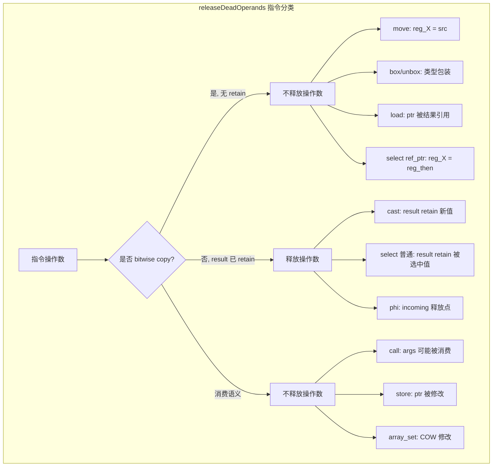
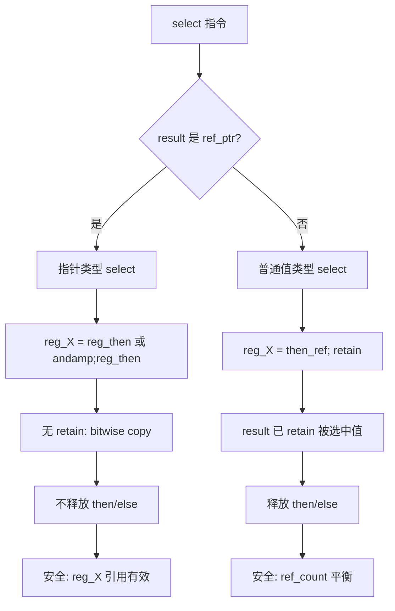

# AOT releaseDeadOperands select UAF 修复与 bitwise copy 指令审查

| 字段 | 值 |
|------|-----|
| 日期 | 2026-07-18 |
| 轮次 | 第二十轮 |
| Commit | `2e403e7` |
| 模块 | AOT 代码生成 / 引用计数安全 |
| 测试 | 61/61 ALL PASS (pass 37 + fail_runtime 17 + fuzzy_scripts_73 7) |

---

## 1. 高层摘要（TL;DR）

对 `releaseDeadOperands` 中所有含寄存器操作数的指令进行系统审查，发现 `select` 指令在**指针类型路径**（ref_ptr result）下存在 UAF 风险：`reg_X = reg_then` 或 `&reg_then` 是 bitwise copy（无 retain），但释放 `then_value`/`else_value` 会导致底层引用被提前回收。修复方案：在 select case 中检查 result 是否为 ref_ptr，若是则不释放 then/else。同时确认 cast/move/box/unbox/property_get/phi 的当前处理均正确。

## 2. 影响范围

| 层级 | 组件 | 影响描述 |
|------|------|---------|
| 代码生成 | `native_linker.zig` | `releaseDeadOperands` select case 增加 ref_ptr 检查 |
| 内存安全 | 引用计数 | 消除指针类型 select 路径的 UAF 隐患 |
| 性能 | 无退化 | 普通值类型 select 仍正常释放 then/else（result 已 retain） |

## 3. 核心变更

| 文件 | 行号 | 变更描述 |
|------|------|---------|
| `src/aot/native_linker.zig` | ~7399 | `releaseDeadOperands` select case：增加 `is_result_ptr` 检查，ref_ptr result 时跳过 then/else 释放 |

### 变更代码

```zig
// 修复前
.select => |op| {
    try used_regs.append(self.allocator, op.cond.id);
    try used_regs.append(self.allocator, op.then_value.id);
    try used_regs.append(self.allocator, op.else_value.id);
},

// 修复后
.select => |op| {
    try used_regs.append(self.allocator, op.cond.id);
    const is_result_ptr = if (inst.result) |r|
        if (self.current_ref_ptr_regs) |rpr| rpr.contains(r.id) else false
    else
        false;
    if (!is_result_ptr) {
        try used_regs.append(self.allocator, op.then_value.id);
        try used_regs.append(self.allocator, op.else_value.id);
    }
},
```

## 4. 可视化概览

### 4.1 业务流程：releaseDeadOperands 指令处理分类



### 4.2 执行流程：select UAF 修复决策



## 5. 详细变更分析

### 5.1 bitwise copy 指令审查结论

| 指令 | 代码生成语义 | 当前处理 | 正确性 | 备注 |
|------|-------------|---------|--------|------|
| `cast` | php_value→php_value: bitwise copy + retain；基本→php_value: 新建包装值 | 释放操作数 | ✅ 正确 | result retain 了底层引用，或源是基本类型 |
| `move` | `reg_X = src_ref`（bitwise copy） | 不释放 | ✅ 正确 | result 与源共享引用 |
| `clone` | `try runtime.php_clone(reg_X)`（深拷贝） | 不释放 | ✅ 保守安全 | 可优化释放（P3），但不紧急 |
| `box` | 类型包装（bitwise copy） | 不释放 | ✅ 正确 | result 与操作数共享值 |
| `unbox` | 类型解包（bitwise copy） | 不释放 | ✅ 正确 | result 与操作数共享值 |
| `property_get` | `php_object_get` 返回 retain 过的值 | 不释放 object | ✅ 保守安全 | getProperty 已 retain，可优化（P3） |
| `select`（ref_ptr） | `reg_X = reg_then` 或 `&reg_then`（无 retain） | **修复前: 释放** → **修复后: 不释放** | ✅ 已修复 | UAF 风险已消除 |
| `select`（普通） | `reg_X = then_ref; retain` | 释放 then/else | ✅ 正确 | result retain 被选中值 |
| `phi` | `reg_X = incoming; retain` | 释放 incoming | ✅ 正确 | incoming 的唯一释放点（liveness 不处理 PHI） |

### 5.2 select UAF 根因分析

**指针类型 select 代码生成**：
```zig
if (is_result_ptr) {
    // reg_X = reg_then（bitwise copy，无 retain）
    // 或 reg_X = &reg_then（取地址，无 retain）
    reg_X = reg_then;
}
```

**UAF 触发路径**：
1. `reg_then` 的 ref_count == 1
2. `reg_X = reg_then`（bitwise copy，ref_count 不变）
3. `releaseDeadOperands` 释放 `reg_then`（ref_count → 0，对象被销毁）
4. `reg_X` 指向已销毁对象 → **UAF**

**修复后**：
1. `reg_then` 的 ref_count == 1
2. `reg_X = reg_then`（bitwise copy）
3. `releaseDeadOperands` 跳过 `reg_then`（ref_count 保持 1）
4. `reg_X` 引用有效 → **安全**

## 6. 影响与风险评估

### 6.1 是否破坏式变更
**否**。仅影响指针类型 select 路径的释放策略，从"释放"改为"不释放"（更保守）。

### 6.2 变更影响范围及明细

| 影响面 | 评估 | 说明 |
|--------|------|------|
| 内存安全 | ✅ 提升 | 消除 UAF 隐患 |
| 引用计数 | ⚠️ 微增 | 指针类型 select 的 then/else 不再被提前释放，ref_count 可能 +1（由后续 cleanup 回收） |
| 功能正确性 | ✅ 无影响 | 61/61 回归通过 |
| 性能 | ✅ 无退化 | 指针类型 select 极少触发（仅 byref 参数合并场景） |

### 6.3 复测路径
```bash
# 全量回归
timeout 300 bash scripts/full_scan_aot.sh          # fuzzy_scripts_73: 7/7
timeout 600 bash scripts/batch_test_aot.sh          # fail_runtime: 17/17
timeout 600 bash scripts/batch_test_pass.sh         # pass: 37/37
# 总计: 61/61 ALL PASS
```

## 7. 遗留问题/潜在问题

| 编号 | 描述 | 优先级 | 风险 |
|------|------|--------|------|
| P3-1 | `clone` 指令可优化为释放操作数（深拷贝后源不再需要） | P3 | 低（保守不释放，仅 ref_count 微增） |
| P3-2 | `property_get` 可优化为释放 object（getProperty 已 retain） | P3 | 低（同上） |
| P3-3 | PHI 代码生成路径存在并行版本与状态机版本的逻辑重复 | P3 | 低（维护成本） |

## 8. 后续开发/优化建议

| 优先级 | 建议 | 影响面 | 落地成本 |
|--------|------|--------|---------|
| P1 | 无（当前全量通过，无紧急项） | - | - |
| P2 | 审查 `method_call`/`parent_call` 的 object 释放策略（当前不释放，确认是否可优化） | 引用计数精度 | 低（仅需审查代码生成路径） |
| P3 | 优化 `clone`/`property_get` 操作数释放 | ref_count 膨胀 | 中（需确认深拷贝/getProperty 语义后修改） |
| P3 | 统一 PHI 代码生成路径（消除并行版本与状态机版本重复） | 可维护性 | 中（重构 generatePhiValueAssignment 调用链） |
| P3 | 引入 releaseDeadOperands 单元测试（覆盖所有指令类型的释放策略） | 回归保障 | 中（需 mock liveness 分析） |
