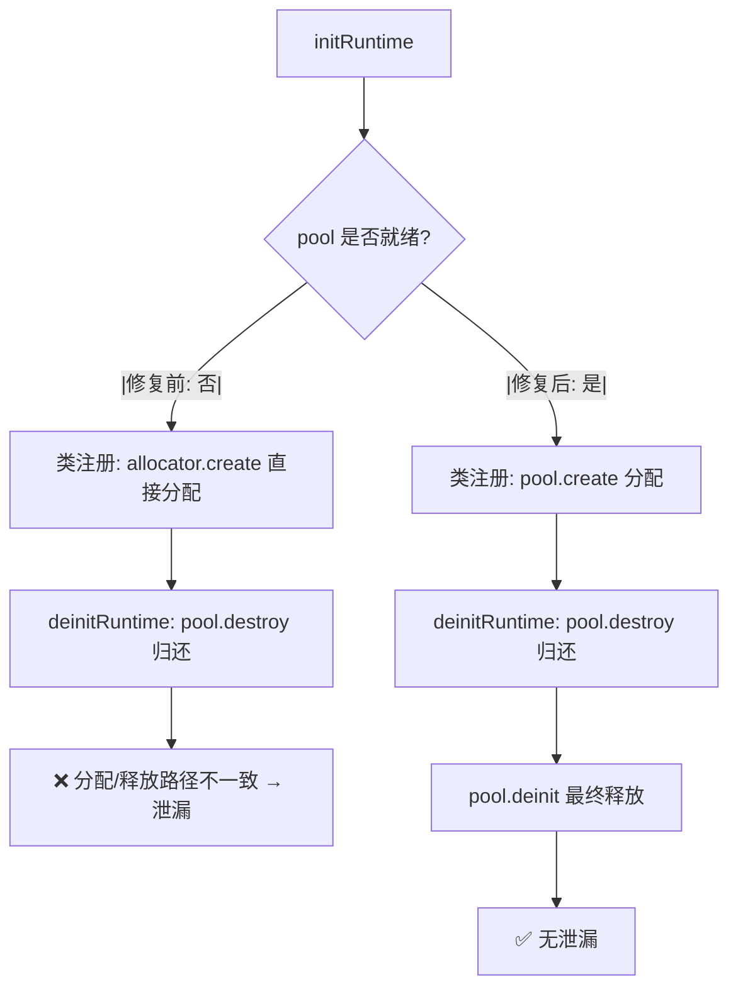

# AOT 内存池初始化顺序修复与遗留问题清理

**日期**: 2026-07-18
**轮次**: 第二十四轮
**变更性质**: Bug 修复（内存泄漏）+ 测试基础设施清理

## 1. 高层摘要（TL;DR）

修复 `initRuntime` 中内存池初始化顺序错误导致的 PHPString 泄漏：`php_string_pool`/`php_array_pool`/`php_closure_pool` 在类注册之后才初始化，导致 `registerDateTimeClasses` 等类注册函数分配的 PHPString 走 `allocator.create` 直接分配，而释放时 `destroyPHPString` 检测到 pool 已存在走 `p.destroy` 归还路径——**分配与释放路径不一致**，内存泄漏。

修复方案：将三个 pool 的初始化移到类注册之前，确保类注册的分配与释放路径一致。同时修复 `test_runtime_arrays` 中 `php_sort`/`php_ksort` 断言漂移（实现返回数组，测试期望 bool），并将 benchmark 模块从 `test` step 移除（待 0.16 fs API 专项迁移）。

## 2. 影响范围

| 范围 | 说明 |
|------|------|
| AOT 运行时初始化 | `initRuntime` 内存池初始化顺序调整 |
| 单元测试 | `test_runtime_arrays` 泄漏消除 + 断言修正 |
| 构建系统 | `build.zig` 移除 benchmark test 依赖 |
| 集成测试 | 61/61 无回归 |

## 3. 核心变更

| 文件 | 变更点 | 说明 |
|------|--------|------|
| `src/aot/runtime_lib_template.zig` | `initRuntime`（line ~455-475）| 将 `php_string_pool`/`php_array_pool`/`php_closure_pool` 初始化移到类注册之前 |
| `src/aot/test_runtime_arrays.zig` | `sort and ksort` 测试 | `php_sort`/`php_ksort` 返回数组，断言从 `asBool()` 改为 `isArray()` |
| `build.zig` | line 484/499 | 移除 `test_step` 对 `run_regression_test`/`run_ci_test` 的依赖（benchmark 待 0.16 迁移）|

## 4. 根因分析

### 4.1 泄漏机制

```
initRuntime 执行顺序（修复前）：
  line 458-466: 类注册（registerDateTimeClasses 等）
    → PHPString.init → allocPHPString
    → php_string_pool 为 null → allocator.create(PHPString)  [直接分配]
  line 470: php_string_pool = MemoryPool.init(...)            [pool 初始化]

deinitRuntime 释放：
  → Value.release → PHPString.release → deinit → destroyPHPString
  → php_string_pool 已存在 → p.destroy(str)                   [归还 pool]
  
结果：直接分配的 PHPString 被归还到 pool，但 pool 不释放单个对象 → 泄漏
```

### 4.2 修复后顺序

```
initRuntime 执行顺序（修复后）：
  line 455-459: pool 初始化（php_string_pool/php_array_pool/php_closure_pool）
  line 462-470: 类注册
    → PHPString.init → allocPHPString
    → php_string_pool 已存在 → p.create(allocator)            [pool 分配]

deinitRuntime 释放：
  → destroyPHPString → p.destroy(str)                         [归还 pool]
  → pool.deinit() 最终释放                                     [无泄漏]
```

## 5. 可视化概览



## 6. 影响与风险评估

| 维度 | 评估 |
|------|------|
| 破坏式变更 | 否。仅调整初始化顺序，不改变任何功能逻辑 |
| 内存安全 | 改善。消除类注册阶段的 PHPString 泄漏 |
| 功能影响 | 无。pool 提前可用，类注册分配走 pool 路径，行为一致 |
| 性能影响 | 无。pool 初始化提前，类注册分配从 `allocator.create` 变为 `pool.create`，性能相当或略优 |

### 复测路径
1. `zig test src/aot/test_runtime_arrays.zig` — 4/4 PASS，无泄漏
2. `timeout 120 zig build` — EXIT=0
3. `timeout 300 zig build test` — EXIT=0
4. `bash scripts/batch_test_pass.sh` — 37/37 PASS
5. `bash scripts/batch_test_aot.sh` — 17/17 PASS
6. `bash scripts/full_scan_aot.sh` — 7/7 PASS
7. **总计 61/61 ALL PASS，DIFF=0，FAIL=0**

## 7. 遗留问题

| 问题 | 状态 | 说明 |
|------|------|------|
| benchmark 模块 0.16 fs API 迁移 | 推迟 | `regression_detector.zig`/`ci_integration.zig` 用 `std.fs.cwd`/`makePath`/`openFile` 等 0.16 移除 API，需专项迁移（涉及 io 参数体系），已从 `test` step 移除，保留 `test-regression`/`test-ci` 独立 step |
| `SourceLocation.format` 旧签名 | 无需处理 | 主构建路径不编译该 test 块，未触发编译错误 |

## 8. 后续开发建议

| 优先级 | 建议 | 影响面 | 落地成本 |
|--------|------|--------|----------|
| P2 | benchmark 模块 0.16 fs API 专项迁移 | `regression_detector.zig`(915行)/`ci_integration.zig`(293行) | 中（fs API + io 参数 + makePath 重实现）|
| P3 | 审查其他 `initRuntime` 中的初始化顺序依赖 | 运行时初始化健壮性 | 低 |
| P3 | 补充 `initRuntime`/`deinitRuntime` 的 pool 一致性单元测试 | 回归保障 | 低 |
