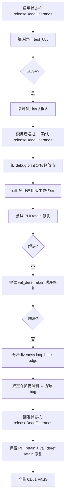
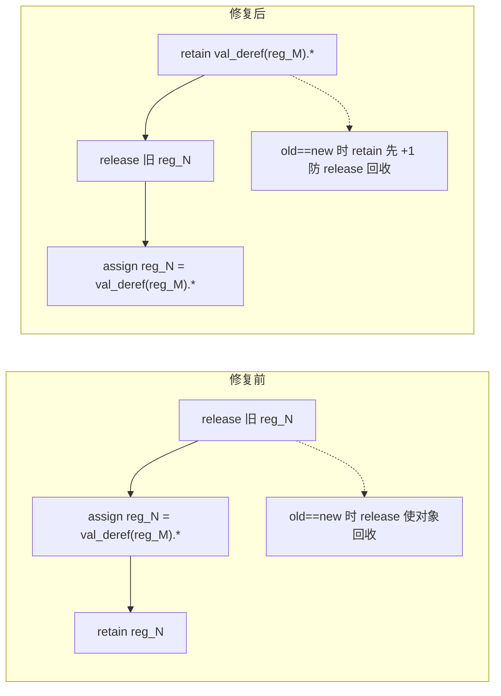

# AOT 状态机 PHI retain 修复与 val_deref load retain 顺序修复

> 日期：2026-07-18
> 会话轮次：第十七轮
> 全量测试状态：pass 37/37 + fail_runtime 17/17 + fuzzy_scripts_73 7/7 = 61/61 ALL PASS, DIFF=0, FAIL=0

---

## 一、高层摘要（TL;DR）

本轮目标是启用状态机路径 `releaseDeadOperands`（消除状态机路径临时寄存器 ref_count 膨胀）。尝试过程中发现并修复两个明确的 retain/release 缺陷：（1）状态机 PHI 赋值（`generatePhiInstructionsParallel` + `generatePhiInstructionStateMachine`）裸赋值无 retain/release，复用 `generatePhiValueAssignment` 修复；（2）`val_deref` load 路径（ref_capture/make_ref/foreach_ref）retain 顺序错误（release 旧→assign→retain 新），修正为安全顺序（retain 新→release 旧→assign）。

状态机 `releaseDeadOperands` 启用后 test_086_foreach_break_continue SEGV，根因为 loop back-edge 场景 liveness 误判导致 foreach 迭代变量被误释放。经 debug print + diff 对比禁用/启用版生成代码，定位到状态机 loop 场景的 liveness 收敛性有深层 bug，双重保护（isLiveAfter + isLiveAtBlockExit）仍无法覆盖。本轮回退状态机 `releaseDeadOperands` 启用，保留两个明确的 retain 修复（这些修复在状态机 releaseDeadOperands 禁用时仍是正确的，为后续启用铺路）。

---

## 二、影响范围

| 影响层 | 影响描述 |
|--------|----------|
| 状态机 PHI 代码生成 | `generatePhiInstructionsParallel` + `generatePhiInstructionStateMachine` 复用 `generatePhiValueAssignment`，retain/release 语义正确化 |
| load 代码生成 | `val_deref` 路径（ref_capture/make_ref/foreach_ref）retain 顺序修正，防 old==new use-after-free |
| 状态机 releaseDeadOperands | 尝试启用后回退（loop back-edge liveness 误判未解决），保留两个 retain 修复 |
| 回归 | ✅ 全量 61/61 ALL PASS，无回归 |

---

## 三、核心变更

### 3.1 变更文件清单

| 文件 | 变更内容 |
|------|----------|
| `src/aot/native_linker.zig` | 状态机 PHI retain 修复 + val_deref load retain 顺序修复 + 状态机 releaseDeadOperands 尝试与回退 |

### 3.2 各变更详情

#### 3.2.1 状态机 PHI retain 修复（generatePhiInstructionsParallel）

**问题**：`generatePhiInstructionsParallel` 的 `all_single_incoming` 路径和 `fallback` 路径用裸赋值（`reg_X = reg_A`），无 retain/release。当 releaseDeadOperands 释放 incoming 后，PHI 结果（bitwise copy）悬垂 → use-after-free。

**修复**：两处裸赋值路径替换为调用 `generatePhiValueAssignment`（复用单块版的 retain/release 逻辑：release 旧值 + assign + retain 新值）。

#### 3.2.2 状态机 PHI retain 修复（generatePhiInstructionStateMachine）

**问题**：`generatePhiInstructionStateMachine` 的单 incoming 和多 incoming 路径也是裸赋值，且 retain 逻辑被注释掉（注释称"导致 ref_count 多 1"——这是 releaseDeadOperands 禁用时的权宜之计）。

**修复**：
- 单 incoming：替换为 `generatePhiValueAssignment`
- 多 incoming：`switch(prev_block)` 每个 case 调用 `generatePhiValueAssignment`，fallback 同理
- 移除不再需要的类型计算（dest_type/dest_tag/dest_is_value）

#### 3.2.3 val_deref load retain 顺序修复

**问题**：3 处 `val_deref` load 路径的 retain 顺序为 `release 旧 → assign → retain 新`，当 old==new 时 release 旧可能使对象被回收，assign 回收的对象 → use-after-free。

**修复**：修正为安全顺序 `retain 新 → release 旧 → assign`：

| 路径 | 位置 | 修复 |
|------|------|------|
| ref_capture_allocas | ~line 8005 | `_ = val_deref(&reg_M).*.retain(); reg_N.release(); reg_N = val_deref(&reg_M).*;` |
| make_ref_allocas (no_deref) | ~line 8018 | `_ = reg_M.*.retain(); reg_N.release(); reg_N = reg_M.*;` |
| make_ref_allocas (val_deref) | ~line 8018 | `_ = val_deref(reg_M).*.retain(); reg_N.release(); reg_N = val_deref(reg_M).*;` |
| foreach_ref_allocas | ~line 8036 | `_ = val_deref(reg_M).*.retain(); reg_N.release(); reg_N = val_deref(reg_M).*;` |

#### 3.2.4 状态机 releaseDeadOperands 启用尝试与回退

**尝试**：在 `generateControlFlowStateMachine` 的指令生成循环中设置 `current_gen_block_idx`/`current_gen_inst_idx`，启用 releaseDeadOperands。

**结果**：test_086_foreach_break_continue SEGV（exit=139），输出损坏（$item 在 idx=2 时仍为 "apple" 而非 "cherry"，换行符丢失）。

**调试过程**：
1. 临时禁用状态机 releaseDeadOperands → test_086 完全通过，确认根因是 releaseDeadOperands
2. 加 debug print（`// DBG release reg_N blk=B inst=I`）→ 定位所有释放点
3. dump 禁用版与启用版生成代码 diff → 列出所有新增 release 语句
4. 尝试 PHI retain 修复 → 未解决
5. 尝试 val_deref retain 顺序修复 → 未解决
6. 分析 liveness：loop back-edge 场景下 `isLiveAfter` + `isLiveAtBlockExit` 双重保护仍误判 foreach 迭代变量死亡

**回退**：状态机 releaseDeadOperands 禁用，保留 PHI retain + val_deref retain 修复（这些在禁用时仍是正确的，为后续启用铺路）。

---

## 四、可视化概览

### 4.1 状态机 releaseDeadOperands 启用尝试流程



### 4.2 val_deref load retain 顺序对比



---

## 五、详细变更分析

### 5.1 涉及文件列表

| 文件 | 变更类型 |
|------|----------|
| `src/aot/native_linker.zig` | 状态机 PHI retain + val_deref retain 顺序 + releaseDeadOperands 尝试回退 |

### 5.2 变更点描述

| 变更点 | 函数 | 描述 |
|--------|------|------|
| PHI all_single_incoming | `generatePhiInstructionsParallel` | 裸赋值 → `generatePhiValueAssignment` |
| PHI fallback | `generatePhiInstructionsParallel` | 裸赋值 → `generatePhiValueAssignment` |
| PHI 单 incoming | `generatePhiInstructionStateMachine` | 裸赋值 → `generatePhiValueAssignment` |
| PHI 多 incoming | `generatePhiInstructionStateMachine` | switch case 裸赋值 → 每 case `generatePhiValueAssignment` |
| val_deref ref_capture | load 路径 ~line 8005 | retain 顺序修正 |
| val_deref make_ref no_deref | load 路径 ~line 8018 | retain 顺序修正 |
| val_deref make_ref val_deref | load 路径 ~line 8018 | retain 顺序修正 |
| val_deref foreach_ref | load 路径 ~line 8036 | retain 顺序修正 |
| 状态机 releaseDeadOperands | `generateControlFlowStateMachine` | 尝试启用 → 回退禁用 |

---

## 六、影响与风险评估

### 6.1 是否破坏式变更

**否**。全量 61 脚本回归 ALL PASS，DIFF=0, FAIL=0。

### 6.2 变更影响范围

| 影响面 | 评估 |
|--------|------|
| 现有脚本 | ✅ 61/61 全通过，无回归 |
| PHI retain | ✅ 状态机 PHI retain 语义正确化，为后续 releaseDeadOperands 启用铺路 |
| val_deref retain | ✅ load retain 顺序安全化，防 old==new use-after-free |
| 状态机 releaseDeadOperands | ⚠️ 仍禁用（loop back-edge liveness 深层 bug 未解决） |
| 性能 | 无影响（状态机 releaseDeadOperands 未启用，临时寄存器 ref_count 膨胀由 emitPreGcCleanup 补偿） |

### 6.3 需要特别注意的点

1. **状态机 releaseDeadOperands 未启用**：loop back-edge 场景 liveness 误判 foreach 迭代变量死亡，双重保护（isLiveAfter + isLiveAtBlockExit）仍无法覆盖。根因可能是 liveness 的 PHI incoming 建模在 loop 场景的收敛性问题。
2. **PHI retain 修复是前置条件**：状态机 PHI retain 修复 + val_deref retain 顺序修复是启用状态机 releaseDeadOperands 的必要条件，但非充分条件。后续启用需先修复 liveness loop back-edge 收敛性。
3. **val_deref retain 顺序**：`retain 新 → release 旧 → assign` 是唯一安全顺序，val_deref 调用两次（retain 时一次，assign 时一次）在单线程下一致。

### 6.4 复测路径

```bash
timeout 120 zig build
timeout 600 bash scripts/batch_test_pass.sh
timeout 600 bash scripts/batch_test_aot.sh
timeout 300 bash scripts/full_scan_aot.sh
```

---

## 七、遗留问题/潜在问题

| 编号 | 问题 | 影响 | 落地成本 |
|------|------|------|----------|
| L1 | 状态机路径 releaseDeadOperands 未启用 | 状态机路径临时寄存器 ref_count 膨胀（由 emitPreGcCleanup 补偿） | 高（需修复 liveness loop back-edge 收敛性） |
| L2 | liveness PHI incoming 建模在 loop 场景的收敛性 | foreach 迭代变量被误判死亡 | 高（需重新设计 PHI 在 liveness 中的语义） |
| L3 | `writePhiSourceExpr` 函数可能成为死代码 | 可维护性 | 低（确认无调用后移除） |

---

## 八、后续开发/优化建议

| 优先级 | 建议 | 影响面 | 落地成本 |
|--------|------|--------|----------|
| P1 | 修复 liveness loop back-edge 收敛性 → 启用状态机 releaseDeadOperands | 消除状态机路径 ref_count 膨胀，GC 循环检测完全精确 | 高（需重新设计 PHI incoming 在 liveness 中的语义：incoming 应在前驱块末尾判断，非 PHI block） |
| P2 | 确认 `writePhiSourceExpr` 是否可移除 | 代码整洁 | 低 |
| P3 | call/store/load 指令消费语义精确化 | 减少临时寄存器延迟释放 | 中 |
