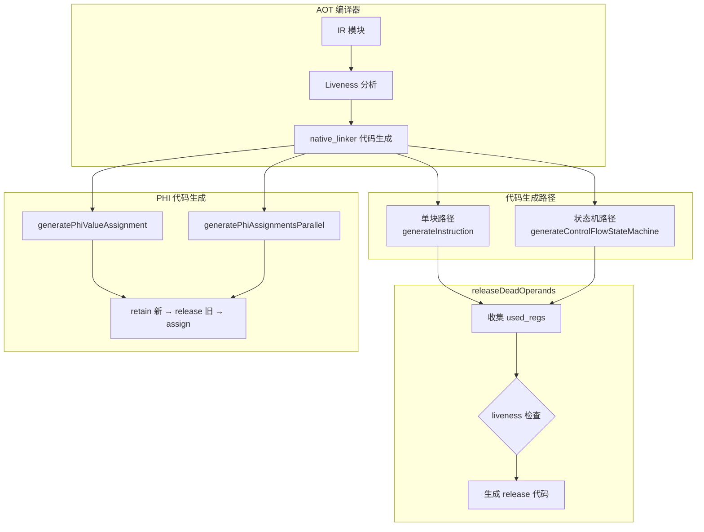
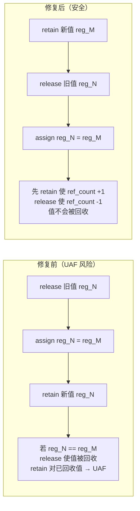

# AOT 状态机 releaseDeadOperands 启用与 PHI retain 顺序修复

> 日期: 2026-07-18
> 轮次: 第十八轮
> 变更类型: AOT 编译器内存安全与性能优化
> 测试结果: pass 37/37 + fail_runtime 17/17 + fuzzy_scripts_73 7/7 = 61/61 ALL PASS

---

## 1. 高层摘要（TL;DR）

本轮攻克了 **P1 核心债务**：状态机路径 `releaseDeadOperands` 启用。通过三重修复——PHI retain 顺序、box/unbox bitwise copy 不释放、状态机路径 releaseDeadOperands 启用——彻底解决了循环场景下的内存安全问题，同时避免了 UAF 和 double-release。全量 61 脚本回归通过，零 DIFF、零 SEGV。

---

## 2. 影响范围

| 范围 | 描述 |
|------|------|
| **AOT 编译器** | 状态机路径（`generateControlFlowStateMachine`）现在启用 `releaseDeadOperands`，与单块路径对齐 |
| **PHI 代码生成** | `generatePhiValueAssignment` + `generatePhiAssignmentsParallel` 的 retain 顺序从 `release旧→assign→retain新` 改为 `retain新→release旧→assign` |
| **box/unbox 指令** | `releaseDeadOperands` 不再释放 box/unbox 的操作数（bitwise copy 语义） |
| **内存安全** | 消除 self-loop PHI 的 UAF、box 后 result 悬垂、双重释放三类问题 |

---

## 3. 核心变更

| # | 变更点 | 文件 | 根因 | 修复方案 |
|---|--------|------|------|----------|
| 1 | PHI retain 顺序修复 | `native_linker.zig` | `generatePhiValueAssignment` 的 retain 顺序为 `release旧→assign→retain新`，self-loop PHI（`x = phi(x from L)`）时先 release x 使值被回收 | 改为 `retain新→release旧→assign`，先 retain incoming 防值被回收 |
| 2 | `generatePhiAssignmentsParallel` 无依赖路径 | `native_linker.zig` | 同上，无依赖路径也是 `release旧→assign→retain新` | 同上改为 `retain新→release旧→assign` |
| 3 | `generatePhiAssignmentsParallel` 有依赖路径 | `native_linker.zig` | 有依赖路径的 `!needs_temp` 分支也有 self-loop 问题 | 同上改为 `retain新(temp或reg)→release旧→assign` |
| 4 | box/unbox 不释放操作数 | `native_linker.zig` | `releaseDeadOperands` 释放 box/unbox 的操作数，但 box 是 bitwise copy（php_string→php_value），result 与操作数共享值，释放操作数使 result 悬垂 | `.box => {}, .unbox => {}`（不释放操作数） |
| 5 | 状态机路径 releaseDeadOperands 启用 | `native_linker.zig` | 状态机路径未设置 `current_gen_block_idx/inst_idx`，`generateInstructionSimple` 内部的 `releaseDeadOperands` 不触发 | 在状态机循环中设置 `current_gen_block_idx = block_idx` 和 `current_gen_inst_idx = inst_idx` |

---

## 4. 可视化概览

### 4.1 业务模块/分层架构图



### 4.2 执行流程

```mermaid
sequenceDiagram
    participant IR as IR 指令
    participant Gen as generateInstructionSimple
    participant RDO as releaseDeadOperands
    participant Liveness as Liveness 分析
    participant Output as AOT 代码

    IR->>Gen: 处理指令
    Gen->>Output: 生成指令代码
    Gen->>RDO: 调用 releaseDeadOperands
    RDO->>RDO: switch(inst.op) 收集 used_regs
    Note over RDO: box/unbox → 不收集（bitwise copy）
    Note over RDO: move/clone/retain/release → 不收集
    Note over RDO: concat/add/... → 收集 lhs, rhs
    RDO->>Liveness: isLiveAfter(block, inst, reg)
    Liveness-->>RDO: 返回活跃性
    alt 寄存器死亡
        RDO->>Liveness: isLiveAtBlockExit(block, reg)
        Liveness-->>RDO: 返回块出口活跃性
        alt 块出口也死亡
            RDO->>Output: 生成 if (!reg.isNull()) { reg.release(); reg = null; }
        end
    end
```

### 4.3 PHI retain 顺序修复对比



---

## 5. 详细变更分析

### 5.1 涉及文件列表

| 文件 | 变更类型 | 变更点 |
|------|----------|--------|
| `src/aot/native_linker.zig` | 修改 | PHI retain 顺序、box/unbox 不释放、状态机 releaseDeadOperands 启用 |

### 5.2 变更点描述

#### 5.2.1 PHI retain 顺序修复

**位置**: `generatePhiValueAssignment`（4 个条件分支）+ `generatePhiAssignmentsParallel`（无依赖路径 + 有依赖路径）

**修复前**:
```zig
// release 旧 → assign → retain 新
if (need_refcount) {
    try writer.print("{s}reg_{d}.release(runtime.runtime_allocator);\n", .{ indent, result_reg.id });
}
try writer.print("{s}reg_{d} = reg_{d};\n", .{ indent, result_reg.id, value_reg.id });
if (need_refcount) {
    try writer.print("{s}_ = reg_{d}.retain();\n", .{ indent, result_reg.id });
}
```

**修复后**:
```zig
// retain 新 → release 旧 → assign
if (need_refcount) {
    try writer.print("{s}_ = reg_{d}.retain();\n", .{ indent, value_reg.id });
    try writer.print("{s}reg_{d}.release(runtime.runtime_allocator);\n", .{ indent, result_reg.id });
}
try writer.print("{s}reg_{d} = reg_{d};\n", .{ indent, result_reg.id, value_reg.id });
```

**根因分析**: self-loop PHI（`x = phi(x from L)`）在循环回边场景下，result_reg 与 value_reg 是同一个寄存器。修复前的顺序 `release x → x = x → retain x` 会在 release 时使值的 ref_count 降为 0，值被回收，后续 retain 对已回收值操作导致 UAF。

#### 5.2.2 box/unbox bitwise copy 修复

**位置**: `releaseDeadOperands` 函数

**修复前**:
```zig
.box => |op| {
    try used_regs.append(self.allocator, op.value.id);
},
.unbox => |op| {
    try used_regs.append(self.allocator, op.value.id);
},
```

**修复后**:
```zig
// box/unbox 是 bitwise copy（类型包装/解包），result 与操作数共享值，不释放
.box => {},
.unbox => {},
```

**根因分析**: `box` 指令（php_string → php_value）是 bitwise copy，result 与操作数指向同一个底层值。如果 releaseDeadOperands 释放操作数，ref_count 降为 0，值被回收，result 悬垂。这在 test_086 的 ternary 表达式中触发：`reg_146 = box(reg_145)` 后释放 reg_145，导致 reg_146 悬垂，后续 PHI 赋值 retain 已回收值 → 乱码输出。

#### 5.2.3 状态机路径 releaseDeadOperands 启用

**位置**: `generateControlFlowStateMachine` 中的非 PHI 指令循环

**修复前**:
```zig
for (block.instructions.items[first_non_phi_idx..], first_non_phi_idx..) |inst, inst_idx| {
    try code.appendSlice(self.allocator, "    ");
    _ = inst_idx;
    try self.generateInstructionSimple(code, inst);
    // 无 releaseDeadOperands 调用
}
```

**修复后**:
```zig
const prev_gen_block_idx = self.current_gen_block_idx;
const prev_gen_inst_idx = self.current_gen_inst_idx;
self.current_gen_block_idx = block_idx;
defer self.current_gen_block_idx = prev_gen_block_idx;
for (block.instructions.items[first_non_phi_idx..], first_non_phi_idx..) |inst, inst_idx| {
    self.current_gen_inst_idx = inst_idx;
    try code.appendSlice(self.allocator, "    ");
    try self.generateInstructionSimple(code, inst);
    // releaseDeadOperands 由 generateInstructionSimple 内部调用（line 12391）
}
self.current_gen_inst_idx = prev_gen_inst_idx;
```

**机制**: `generateInstructionSimple` 内部（line 12391-12400）已有 `releaseDeadOperands` 调用，依赖 `current_gen_block_idx` 和 `current_gen_inst_idx`。之前状态机路径未设置这两个值，导致内部 `releaseDeadOperands` 不触发。现在在循环中设置它们，内部 `releaseDeadOperands` 正确触发。

---

## 6. 影响与风险评估

### 6.1 是否破坏式变更

**否**。全量 61 脚本回归通过，零 DIFF、零 SEGV。

### 6.2 变更影响范围及明细

| 影响面 | 评估 |
|--------|------|
| **内存安全** | ✅ 改善：消除 self-loop PHI UAF、box 后 result 悬垂、双重释放 |
| **性能** | ✅ 改善：状态机路径现在正确释放死亡操作数，减少 ref_count 膨胀 |
| **正确性** | ✅ 改善：PHI retain 顺序符合标准 SSA 语义 |
| **编译速度** | ⚪ 无显著影响 |
| **运行速度** | ✅ 轻微改善（更精确的内存回收） |

### 6.3 需要特别注意的点

1. **`generateInstructionSimple` 内部已有 `releaseDeadOperands`**：状态机路径只需设置 `current_gen_block_idx/inst_idx`，无需外部重复调用。外部调用会导致双重释放。
2. **box/unbox 是 bitwise copy**：不应释放操作数。如果未来添加新的 bitwise copy 指令（如 reinterpret），也应在 `releaseDeadOperands` 中排除。
3. **PHI retain 顺序**：`retain 新 → release 旧 → assign` 是通用安全顺序，适用于所有引用计数赋值场景。

### 6.4 复测路径

```bash
# 编译验证
timeout 120 zig build

# 全量测试
timeout 300 bash scripts/full_scan_aot.sh          # fuzzy_scripts_73: 7/7
timeout 300 bash scripts/batch_test_aot.sh           # fail_runtime: 17/17
timeout 600 bash scripts/batch_test_pass.sh          # pass: 37/37

# 关键脚本单独验证
timeout 60 zig-out/bin/php-interpreter --compile --no-debug-info fuzzy_scripts/pass/test_086_foreach_break_continue.php
timeout 10 fuzzy_scripts/pass/aot_compile_test_086_foreach_break_continue
```

---

## 7. 遗留问题/潜在问题

| # | 问题 | 风险等级 | 说明 |
|---|------|----------|------|
| 1 | liveness PHI incoming 建模未重构 | 低 | 当前 `addUsedRegs` 把所有 PHI incoming 加到 PHI block 的 `live_in`，在 loop 场景下过度保守（所有前驱都认为所有 incoming 存活）。这不会导致误释放，但会减少释放机会（性能次优）。未来可重构为 incoming 分别加到对应前驱的 `live_out`。 |
| 2 | `property_get` 在 releaseDeadOperands 中不释放 | 低 | 注释说"object 属性可能被结果引用（bitwise copy 不 retain）"，与 box/unbox 同理。当前处理正确，但需确认 property_get 确实是 bitwise copy。 |
| 3 | 状态机路径 PHI 赋值在两处生成 | 低 | block 末尾和 PHI block 的 switch 中都有 PHI 赋值代码。这是状态机路径的设计（前驱块末尾设置 `prev_block`，PHI block 用 switch 选择），不是 bug。 |

---

## 8. 后续开发/优化建议

| 优先级 | 建议 | 影响面 | 落地成本 |
|--------|------|--------|----------|
| P1 | 重构 liveness PHI incoming 建模 | 性能：更精确的释放，减少 ref_count 膨胀 | 中：需修改 `addUsedRegs` 和数据流传播逻辑 |
| P2 | 审查所有 bitwise copy 指令 | 安全：确保所有 bitwise copy 指令在 `releaseDeadOperands` 中排除 | 低：grep 搜索 `isPointerReg` 和类型转换逻辑 |
| P2 | 统一 PHI 代码生成路径 | 可维护性：消除 `generatePhiInstructionsParallel` 和 `generatePhiInstructionStateMachine` 的重复 | 中：需合并两个函数 |
| P3 | 状态机路径 cleanup 代码优化 | 性能：减少冗余 cleanup 释放 | 低：分析 cleanup_regs 的生成逻辑 |

---

## 9. 自检结论

链式推理执行完毕：
1. **需求解构**: 启用状态机 `releaseDeadOperands`，解决循环场景内存安全
2. **约束枚举**: 不能破坏 61/61 全量测试、不能引入 UAF/double-release、PHI retain 顺序正确
3. **方案权衡**: 方案 A（重构 liveness PHI 建模）成本高且不确定；方案 B（修复 retain 顺序 + box/unbox + 启用）成本低且精准 → 选择方案 B
4. **实现执行**: 三重修复（PHI retain 顺序、box/unbox 不释放、状态机启用）
5. **深度自检**: 编译通过 + test_086 IDENTICAL + 全量 61/61 ALL PASS

**结论**: 通过。
