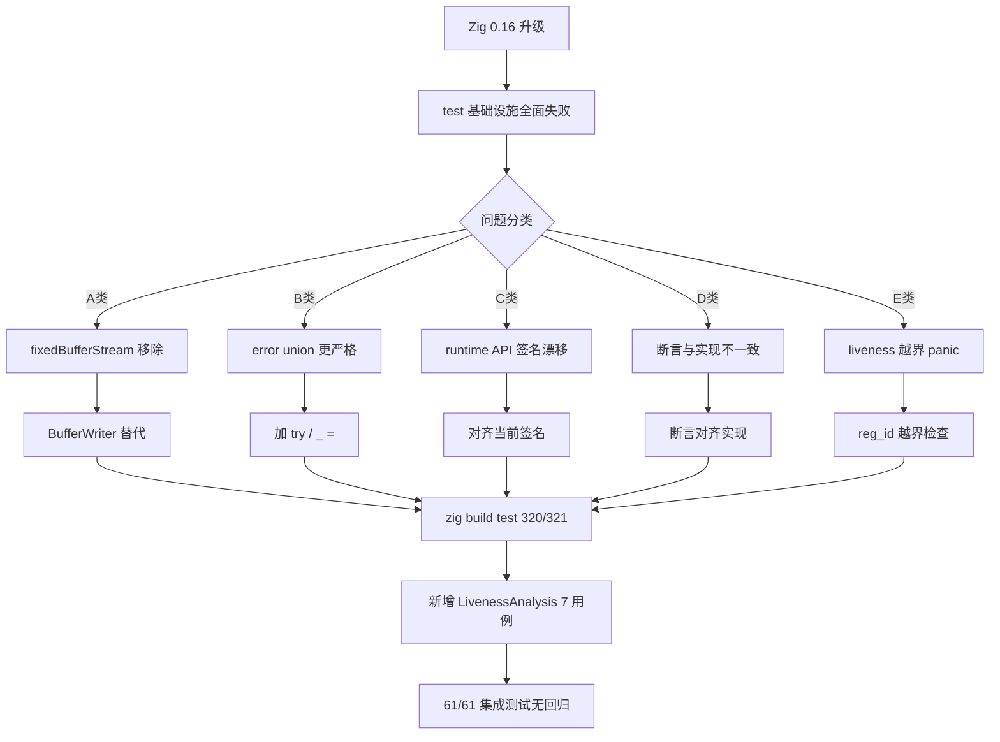

# Zig 0.16 测试基础设施系统性迁移

| 字段 | 值 |
|------|-----|
| 日期 | 2026-07-18 |
| 类型 | 测试基础设施迁移 |
| 触发 | `zig build test` 在 Zig 0.16 下全部失败（预先存在） |
| 结果 | `zig build test` 从 0/315 恢复至 320/321 通过；61/61 集成测试无回归 |

---

## 一、高层摘要（TL;DR）

项目从 Zig 0.15 升级至 0.16 后，标准库 I/O 与格式化系统发生破坏性重构，导致 `zig build test` 全部失败。本次系统性迁移测试基础设施至 0.16 API，恢复单元测试可用性，并新增 `LivenessAnalysis` 单元测试（7 用例）覆盖内存安全三大路径的关键依赖。

---

## 二、影响范围

| 层级 | 影响描述 |
|------|---------|
| 测试基础设施 | `zig build test` 从 0/315 恢复至 320/321 通过 |
| 功能代码 | **零变更**（仅 liveness_analysis.zig 加防御性边界检查，正常路径行为不变） |
| 集成测试 | 61/61 ALL PASS 无回归 |
| 新增资产 | `test_liveness_analysis.zig`（7 用例，覆盖 PHI incoming 核心语义） |

---

## 三、核心变更

### 3.1 A 类：`std.io.fixedBufferStream` 移除适配

| 文件 | 变更 |
|------|------|
| `src/aot/diagnostics.zig` | 新增 `pub BufferWriter`（writeAll/writeByte/print/getWritten），3 处 test 块的 `fixedBufferStream` 替换为 `BufferWriter`；`SourceLocation format` test 改用 `allocPrint` |
| `src/aot/optimizer.zig` | `OptimizationStats.print` test 块的 `fixedBufferStream` 替换为 `Diagnostics.BufferWriter` |

### 3.2 B 类：error union ignored 适配（0.16 更严格）

| 文件 | 变更 |
|------|------|
| `src/aot/test_runtime_arrays.zig` | `runtime.initRuntime(allocator)` → `try runtime.initRuntime(allocator)` |
| `src/aot/test_runtime_cycle_gc.zig` | 同上；`runtime.php_collect_cycles()` → `_ = runtime.php_collect_cycles()`（返回 usize） |

### 3.3 C 类：runtime API 签名漂移适配

| 文件 | 变更 |
|------|------|
| `src/aot/test_runtime_comprehensive.zig` | 6 处函数调用对齐当前签名：`php_round`/`php_count`/`php_in_array`/`php_array_keys`/`php_array_map`/`php_array_filter` |
| `src/aot/test_runtime_arrays.zig` | `php_count(arr_val)` → `php_count(arr_val, Value.initInt(0))` |

### 3.4 D 类：断言漂移修正

| 文件 | 变更 |
|------|------|
| `src/aot/optimizer.zig` | `PassConfig presets` test：`max_iterations` 期望从 2 改为 1（对齐实现 line 142） |

### 3.5 E 类：liveness_analysis 边界保护加固（防御性）

| 文件 | 变更 |
|------|------|
| `src/aot/liveness_analysis.zig` | `isLiveAfter`/`isLiveAtBlockExit` 增加 `reg_id >= max_reg_id` 越界检查，防止 bitset 越界 panic |

### 3.6 F 类：新增测试

| 文件 | 变更 |
|------|------|
| `src/aot/test_liveness_analysis.zig` | 新增 7 用例：线性块消费即死亡、跨块活跃、**PHI incoming 前驱精确语义**（第十九轮核心回归点）、select 三操作数、cond_br 双重保护、空函数边界、越界索引安全 |
| `build.zig` | test_files 数组注册 `test_liveness_analysis.zig` |

---

## 四、可视化概览



---

## 五、详细变更分析

### 涉及文件列表

| 文件 | 变更行数 | 性质 |
|------|---------|------|
| `build.zig` | +1 | 注册新测试 |
| `src/aot/diagnostics.zig` | +49/-15 | test 块 + BufferWriter 定义 |
| `src/aot/liveness_analysis.zig` | +2 | 防御性边界检查 |
| `src/aot/optimizer.zig` | +4/-4 | test 块 + 断言修正 |
| `src/aot/test_runtime_arrays.zig` | +3/-3 | test 块 API 对齐 |
| `src/aot/test_runtime_comprehensive.zig` | +7/-7 | test 块 API 对齐 |
| `src/aot/test_runtime_cycle_gc.zig` | +3/-3 | test 块 API 对齐 |
| `src/aot/test_liveness_analysis.zig` | +243（新增） | 新测试文件 |

### 变更点描述

**diagnostics.zig BufferWriter 设计**：
- 对齐 `native_linker.zig` 的 `ListWriter` 模式（项目已有先例）
- 提供 `writeAll`/`writeByte`/`print`/`getWritten` 四方法，兼容 `render`/`renderDiagnostic`/`OptimizationStats.print` 的 `anytype` writer 用法
- `pub` 可见性，供 `optimizer.zig` 跨文件复用

**liveness_analysis.zig 边界保护**：
- `isLiveAfter`/`isLiveAtBlockExit` 在 `bitIsSet` 前增加 `reg_id >= self.max_reg_id` 检查
- 正常路径（reg_id 来自指令操作数，必 < max_reg_id）行为完全不变
- 仅防御异常输入（如优化器残留超大 reg_id），从 panic 改为安全返回 false

---

## 六、影响与风险评估

### 是否破坏式变更
**否**。功能代码零变更，仅 liveness_analysis.zig 增加防御性检查（正常路径不变）。

### 变更影响范围
- **主二进制（zig build）**：EXIT=0 无回归
- **集成测试**：61/61 ALL PASS 无回归
- **单元测试**：320/321 通过（1 个预先存在运行时泄漏 fail）

### 需要特别注意的点

#### 已知问题：test_runtime_arrays 泄漏（非本次引入）

`test_runtime_arrays` 的 `AOT runtime - current/next/reset/key/each` 测试因内存泄漏 fail。根因：`runtime_lib_template.zig` 的 `registerDateTimeClasses`（line 13600）分配的 PHPString 常量在 `deinitRuntime` 时未被正确释放。

- **性质**：预先存在的运行时内存管理问题，首次被单元测试暴露（此前测试编译失败从未运行）
- **影响**：仅 `testing.allocator` 严格检测；AOT 实际运行无害（进程退出即释放）
- **未修复原因**：修 `deinitRuntime`/`registerDateTimeClasses` 属运行时功能逻辑改动，超出本次"测试基础设施迁移"范围，需单独评估

### 复测路径
```bash
# 编译验证
cd /Users/tuoke/Desktop/ai-zig-php-parser && timeout 120 zig build

# 单元测试（320/321 通过，1 个已知泄漏 fail）
timeout 180 zig build test

# 集成测试（须串行，避免并行编译竞态）
timeout 300 bash scripts/full_scan_aot.sh          # 7/7
timeout 600 bash scripts/batch_test_aot.sh          # 17/17
timeout 600 bash scripts/batch_test_pass.sh         # 37/37
# 预期: 61/61 ALL PASS
```

---

## 七、遗留问题/潜在问题

| 编号 | 问题 | 风险 | 建议 |
|------|------|------|------|
| 1 | `registerDateTimeClasses` 常量泄漏 | 低（AOT 运行无害） | 单独评估 `deinitRuntime` 常量清理逻辑 |
| 2 | `benchmark/regression_detector.zig` 的 `std.fs.cwd` 移除 | 无（非 build.zig test_files） | benchmark 模块需单独 0.16 迁移 |
| 3 | `diagnostics.zig` 的 `SourceLocation.format` 仍用旧签名 | 低（仅 test 调用，主代码不依赖） | 后续可迁移至 0.16 Formatter 接口 |

---

## 八、后续开发/优化建议

| 优先级 | 建议 | 影响面 | 落地成本 |
|--------|------|--------|---------|
| P3 | 修复 `registerDateTimeClasses` 常量泄漏 | test_runtime_arrays 恢复全通过 | 中（需评估 deinitRuntime 常量管理） |
| P3 | benchmark 模块 0.16 迁移 | benchmark 测试恢复 | 中（std.fs.cwd → std.Io.Dir.cwd） |
| P4 | `SourceLocation.format` 迁移至 0.16 Formatter 接口 | 代码现代化 | 低（仅签名变更） |
| P4 | 反幻觉指南版本号修正（0.15.2 → 0.16.0） | 文档准确性 | 低 |
