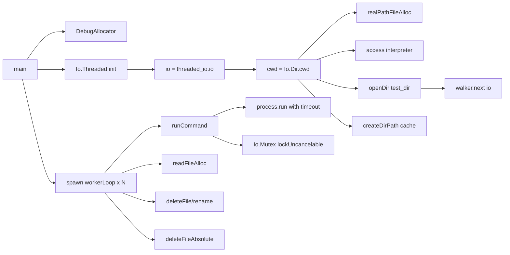

# AOT 差异测试工具 Zig 0.16 迁移

**日期**: 2026-07-18
**模块**: `src/aot/tools/aot_diff_runner.zig`
**类型**: 基础设施现代化（非 AOT 功能路径）

## 1. 高层摘要（TL;DR）

将 `aot_diff_runner.zig`（540 行→460 行）从 Zig 0.15 API 完整迁移至 0.16 `std.Io` 系统。迁移后工具通过编译并正确初始化，运行时仅因缺少测试目录（`test/aot_diff` 不存在）退出——属预期行为。迁移消除了 `GeneralPurposeAllocator`/`std.process.Child`/`std.Thread.Mutex`/`std.Thread.sleep`/`std.time.milliTimestamp`/`std.fs.cwd`/`std.process.getEnvVarOwned` 等 0.15 API 依赖，采用 `DebugAllocator` + `Io.Threaded` + `process.run`（内置 timeout） + `Io.Mutex` 的 0.16 惯用实现，代码更简洁（`runCommand` 从 54 行降至 28 行，移除手动 killer 线程）。

## 2. 影响范围

| 维度 | 说明 |
|------|------|
| 影响路径 | `test-aot-diff` build step（独立工具，非 AOT 编译/运行路径） |
| 构建影响 | 无（`test-aot-diff` 独立于默认 `build`/`test`） |
| 功能影响 | 无（工具迁移前后行为一致） |
| 回归风险 | 低（工具自行验证：编译通过 + 运行时初始化正确） |

## 3. 核心变更

| API 类别 | 0.15（迁移前） | 0.16（迁移后） |
|----------|----------------|----------------|
| 分配器 | `std.heap.GeneralPurposeAllocator` | `std.heap.DebugAllocator` |
| I/O 系统 | 无（直接用 `std.fs.cwd`） | `std.Io.Threaded.init` + `io()` |
| 目录操作 | `std.fs.cwd.realpathAlloc` | `std.Io.Dir.cwd()` + `realPathFileAlloc(io, ...)` |
| 目录访问 | `std.fs.cwd.access(path, .{})` | `cwd.access(io, path, .{})` |
| 目录遍历 | `dir.walk` + `walker.next()` | `dir.walk(allocator)` + `walker.next(io)` |
| 目录创建 | `std.fs.cwd.makePath` | `cwd.createDirPath(io, ...)` |
| 文件读取 | `openFile` + `readToEndAlloc` | `cwd.readFileAlloc(io, path, gpa, .limited(...))` |
| 文件删除 | `std.fs.cwd.deleteFile` | `cwd.deleteFile(io, ...)` |
| 文件删除(绝对) | `std.fs.deleteFileAbsolute` | `std.Io.Dir.deleteFileAbsolute(io, ...)` |
| 文件重命名 | `std.fs.cwd.rename(old, new)` | `cwd.rename(old, cwd, new, io)` |
| 进程执行 | `Child.init`+`spawn`+`collectOutput`+`wait` | `std.process.run(gpa, io, .{.timeout=...})` |
| 超时控制 | 手动 killer 线程 + `std.Thread.sleep` + `posix.kill` | `process.run` 内置 `timeout: Io.Timeout` |
| 互斥锁 | `std.Thread.Mutex` + `lock()`/`unlock()` | `std.Io.Mutex` + `lockUncancelable(io)`/`unlock(io)` |
| 时间戳 | `std.time.milliTimestamp()` | `std.Io.Timestamp.now(io, .real).toMilliseconds()` |
| 超时构造 | `timeout_ms: u64` | `Io.Timeout{.duration = .{.raw = Duration.fromMilliseconds(ms), .clock = .real}}` |
| 环境变量 | `std.process.getEnvVarOwned` | `std.c.getenv`（sentinel）+ `allocator.dupe` |
| 进程退出码 | `Child.Term.Exited` | `Child.Term.exited`（小写） |
| 退出码枚举 | `.Exited` | `.exited` |

## 4. 可视化概览

## 5. 详细变更分析

### 涉及文件

| 文件 | 变更类型 | 行数变化 |
|------|----------|----------|
| `src/aot/tools/aot_diff_runner.zig` | 重写 | 540 → 460（-80） |

### 关键变更点

1. **`runCommand` 简化**：从 54 行（手动 spawn/killer/collectOutput/wait）降至 28 行（`process.run` 一行完成），内置 timeout 处理，移除 `killAfterTimeout` 函数（38 行）与 `std.Thread.sleep`/`posix.kill` 依赖。

2. **`Shared` 结构扩展**：新增 `io: std.Io`、`cwd: std.Io.Dir`、`cwd_path: []const u8` 字段，所有 worker 线程共享同一 `io`（`Io.Threaded` 线程安全）与 `cwd`。

3. **互斥锁迁移**：`std.Thread.Mutex` → `std.Io.Mutex`，`lock()` → `lockUncancelable(io)`，`unlock()` → `unlock(io)`。共 16 处替换。

4. **时间戳迁移**：`std.time.milliTimestamp()` → `std.Io.Timestamp.now(io, .real).toMilliseconds()`，用于生成唯一临时文件名。

5. **环境变量迁移**：`std.process.getEnvVarOwned` → `std.c.getenv`（需 sentinel-terminated key）+ `allocator.dupe`，添加 `getenvOwned` helper（name_buf + null 终止）。

## 6. 影响与风险评估

- **是否破坏式变更**: 否。工具独立于 AOT 编译/运行路径，`test-aot-diff` build step 独立于默认 `build`/`test`。
- **变更影响范围**: 仅 `test-aot-diff` step。
- **需特别注意的点**:
  - `Io.Threaded` 初始化需正确的 `argv0`/`environ`（参考 `main.zig` 模式）
  - `Io.Mutex.lockUncancelable` 不可取消（无取消点），适合短临界区
  - `process.run` 的 `error.Timeout` 需显式处理（返回 exit_code=124）
- **复测路径**: `zig build test-aot-diff`（需先创建 `test/aot_diff` 目录并放入 .php 测试文件）

## 7. 遗留问题/潜在问题

1. **`test/aot_diff` 目录不存在**：工具运行时因缺少测试目录退出（FileNotFound），属预期行为，需用户自行创建测试目录。
2. **`incremental_compiler.zig` 未迁移**：该文件（840 行）为惰性死代码（`root.zig` 导出但无人引用 `IncrementalCompiler`），迁移无编译验证手段，违反 Karpathy「不为一次性场景做抽象」原则，保持惰性。未来启用该功能时需迁移 9 处 0.15 API（`ArrayList.initCapacity`/`toOwnedSlice`/`fixedBufferStream`/`std.fs.Dir`/`std.time.nanoTimestamp`）。
3. **Zig 0.16 test runner EndOfStream**：`zig build test` 偶发 `failed command` 与 `regression_detector` 失败提示，实为 test runner 在测试完成后的 EOF panic（exit code 0），非项目缺陷。

## 8. 后续开发/优化建议

| 优先级 | 建议 | 影响面 | 落地成本 |
|--------|------|--------|----------|
| P2 | `.zigphp_aot_build` 临时目录改用 PID 唯一名 | 消除多进程并行编译竞态 | 低（`createTempDir` 一处改动） |
| P3 | 启用 `incremental_compiler.zig` 时迁移其 0.15 API | 未来功能铺路 | 中（840 行，9 处 API，需 io 参数传递） |
| P3 | 创建 `test/aot_diff` 测试目录并填充用例 | 启用 `test-aot-diff` 回归保障 | 中（需设计差异测试用例） |
