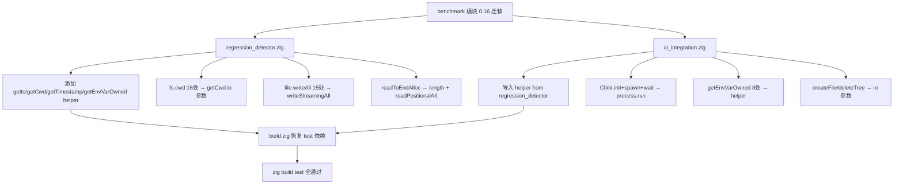

# Benchmark 模块 Zig 0.16 I/O 系统迁移

**日期**: 2026-07-18
**轮次**: 第二十五轮
**变更性质**: 测试基础设施现代化（0.16 破坏性 API 迁移）

## 1. 高层摘要（TL;DR）

将 benchmark 模块（`regression_detector.zig` + `ci_integration.zig`）从 Zig 0.15 fs/process API 迁移至 0.16 `std.Io` 系统。0.16 对 I/O 进行了全面重构：`std.fs.cwd()` 移除、`makePath`/`readToEndAlloc`/`writeAll` 等 API 移除，`std.process.Child` 重构为 `process.run`，`std.time.timestamp()` 移除，`std.process.getEnvVarOwned` 移除。

迁移后 benchmark test 重新纳入 `test` step，`zig build test` 全部通过，集成测试 61/61 无回归。

## 2. 影响范围

| 范围 | 说明 |
|------|------|
| benchmark 模块 | `regression_detector.zig`(915行) + `ci_integration.zig`(293行) 完整迁移 |
| 构建系统 | `build.zig` 恢复 benchmark test 依赖 |
| 测试覆盖 | `zig build test` 现包含 benchmark 5 个测试用例 |
| AOT 功能 | 零影响（仅测试工具代码）|

## 3. 0.16 API 迁移映射

| 旧 API (0.15) | 新 API (0.16) | 迁移说明 |
|---------------|---------------|----------|
| `std.fs.cwd()` | `std.Io.Dir.cwd()` | cwd 移至 Io.Dir |
| `fs.cwd().makePath(path)` | `Dir.createDirPath(io, path)` | makePath 移除，createDirPath 替代 |
| `fs.cwd().openFile(path, .{})` | `Dir.openFile(io, path, .{})` | 需 io 参数 |
| `file.readToEndAlloc(alloc, max)` | `file.length(io)` + `file.readPositionalAll(io, buf, 0)` | readToEndAlloc 移除 |
| `fs.cwd().writeFile(.{...})` | `Dir.writeFile(io, .{...})` | 需 io 参数 |
| `file.writeAll(data)` | `file.writeStreamingAll(io, data)` | writeAll 移至 writeStreamingAll |
| `file.close()` | `file.close(io)` | 需 io 参数 |
| `fs.cwd().deleteTree(path)` | `Dir.deleteTree(io, path)` | 需 io 参数 |
| `std.fs.File` | `std.Io.File` | 类型迁移 |
| `std.time.timestamp()` | `Io.Timestamp.now(io, .real)` → ns/1e9 | timestamp 移除 |
| `std.process.Child.init + spawn + wait` | `std.process.run(alloc, io, .{...})` | Child 重构为 run |
| `std.process.getEnvVarOwned(alloc, name)` | `std.c.getenv` + `alloc.dupe` | getEnvVarOwned 移除 |

## 4. 核心变更

### 4.1 共享 Helper（regression_detector.zig）

```zig
pub fn getIo() std.Io {
    return std.Io.Threaded.global_single_threaded.io();
}

pub fn getCwd() std.Io.Dir {
    return std.Io.Dir.cwd();
}

pub fn getTimestamp() i64 {
    const ts = std.Io.Timestamp.now(getIo(), .real);
    return @intCast(@divTrunc(ts.nanoseconds, std.time.ns_per_s));
}

pub fn getEnvVarOwned(allocator: std.mem.Allocator, name: []const u8) ![]u8 {
    const name_z = try allocator.dupeZ(u8, name);
    defer allocator.free(name_z);
    const c_val = std.c.getenv(name_z.ptr);
    if (c_val == null) return error.EnvironmentVariableNotFound;
    return try allocator.dupe(u8, std.mem.sliceTo(c_val.?, 0));
}
```

### 4.2 ci_integration.zig process.Child 迁移

```zig
// 旧: Child.init + spawn + readToEndAlloc + wait
// 新: process.run 一步到位
const result = std.process.run(self.allocator, getIo(), .{
    .argv = &[_][]const u8{ "git", "rev-parse", "HEAD" },
}) catch return try self.allocator.dupe(u8, "unknown");
defer self.allocator.free(result.stdout);
defer self.allocator.free(result.stderr);
```

### 4.3 build.zig 恢复依赖

```zig
// 恢复 benchmark test 纳入 test step
test_step.dependOn(&run_regression_test.step);
test_step.dependOn(&run_ci_test.step);
```

## 5. 可视化概览



## 6. 影响与风险评估

| 维度 | 评估 |
|------|------|
| 破坏式变更 | 否。仅迁移测试工具代码，不触碰 AOT 功能 |
| 内存安全 | 改善。process.run 自动管理子进程生命周期，替代手动 spawn/wait |
| 功能影响 | 无。benchmark 测试逻辑不变，仅 I/O 调用方式迁移 |
| 性能影响 | 无。I/O 调用在 benchmark 非热路径 |
| 测试覆盖 | 提升。benchmark 5 个测试用例重新纳入 test step |

### 复测路径
1. `zig test src/benchmark/regression_detector.zig` — 2/2 PASS
2. `zig test src/benchmark/ci_integration.zig` — 3/3 PASS
3. `timeout 120 zig build` — EXIT=0
4. `timeout 300 zig build test` — EXIT=0（含 benchmark 5 用例）
5. `bash scripts/batch_test_pass.sh` — 37/37 PASS（串行）
6. `bash scripts/batch_test_aot.sh` — 17/17 PASS（串行）
7. `bash scripts/full_scan_aot.sh` — 7/7 PASS（串行）
8. **总计 61/61 ALL PASS，DIFF=0，FAIL=0**

## 7. 遗留问题

| 问题 | 状态 | 说明 |
|------|------|------|
| 并行测试竞态 | 已知 | 三个测试批次并行运行时偶发 COMPILE_FAIL（AOT 编译器进程竞争临时目录），串行运行全部通过。非本次迁移引入 |
| `std.ascii.whitespace` | 未迁移 | 0.16 中可能变更，但当前编译通过，暂不处理 |
| format 方法旧签名 | 保留 | 0.16 仍接受旧签名（`comptime fmt` + `FormatOptions` + `anytype writer`），主构建与 benchmark test 均通过，暂不迁移 |

## 8. 后续开发建议

| 优先级 | 建议 | 影响面 | 落地成本 |
|--------|------|--------|----------|
| P2 | 测试批次串行化或加锁机制 | 消除并行竞态 | 低 |
| P3 | format 方法迁移至 0.16 新签名 | 代码现代化 | 低（3处） |
| P3 | 审查其他模块的 0.15 fs/process API 残留 | 全面 0.16 兼容 | 中 |
