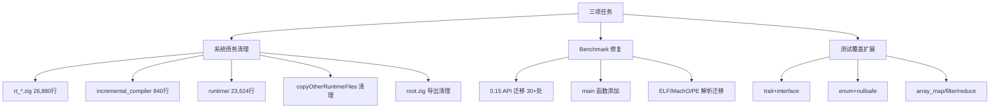

# 系统债务清理 + Benchmark 修复 + 测试覆盖扩展（第二十九~三十轮）

## 1. 高层摘要（TL;DR）

本轮完成三项任务：
1. **系统债务清理**：删除 64 个文件、51,464 行死代码（rt_*.zig + incremental_compiler + runtime/ 死代码）
2. **Benchmark 修复**：`aot_benchmark.zig` 从 0.15 API 完整迁移至 0.16 std.Io 系统 + 添加 main 函数
3. **测试覆盖扩展**：新增 3 个 PHP 特性测试脚本（trait/interface、enum/nullsafe、array_map/filter/reduce）

## 2. 影响范围

| 模块 | 影响面 | 变更类型 |
|------|--------|----------|
| `src/aot/rt_*.zig` | 10 文件 26,880 行 | 删除（死代码） |
| `src/aot/incremental_compiler.zig` | 1 文件 840 行 | 删除（惰性死代码） |
| `src/runtime/` | 51 文件 23,624 行 | 删除（死代码） |
| `src/aot/native_linker.zig` | `copyOtherRuntimeFiles` | 移除 rt_*.zig 复制逻辑 |
| `src/aot/root.zig` | 导出清理 | 移除 `IncrementalCompilerMod` 导出 |
| `src/benchmark/aot_benchmark.zig` | 1,231 行 | 0.15→0.16 完整迁移 + main |
| `fuzzy_scripts/pass/` | 3 新文件 | 测试覆盖扩展 |

## 3. 核心变更

### 3.1 系统债务清理（51,464 行）

| 清理项 | 文件数 | 行数 | 验证方式 |
|--------|--------|------|----------|
| rt_*.zig（被复制但从未被 @import） | 10 | 26,880 | grep @import + AOT 集成测试 |
| incremental_compiler.zig（root.zig 导出但无引用） | 1 | 840 | grep 引用 + 编译验证 |
| runtime/ 未导出且无 @import 文件 | 51 | 23,624 | 批量 grep + build.zig 交叉验证 |
| vim 交换文件 | 2 | 0 | — |

### 3.2 Benchmark 0.16 迁移

| 迁移项 | 数量 | 说明 |
|--------|------|------|
| `std.ChildProcess.exec` → `process.run` | 4 处 | 封装为 `runCommand` helper |
| `result.term.Exited` → `result.exit_code` | 6 处 | — |
| `fs.cwd().*` → `getCwd().*` + io | 7 处 | openFile/createFile/makeDir/deleteTree/deleteFile |
| `std.time.*Timestamp` → `Io.Timestamp` | 5 处 | milli/micro/nano/unix |
| `file.read/seekTo` → `readPositionalAll` | 20 处 | ELF/MachO/PE 解析全部迁移 |
| `file.writer()` → `Writer.Allocating` | 1 处 | 缓冲 + writeStreamingAll |
| main 函数 | 新增 | CLI 入口：`--warmup`/`--iterations`/`--verbose` |

### 3.3 测试覆盖扩展

| 测试脚本 | 覆盖特性 | AOT 结果 |
|----------|----------|----------|
| `test_090_oop_traits_interfaces.php` | trait 定义/使用、interface 实现、多态 | PASS |
| `test_091_enum_nullsafe.php` | PHP 8.1 enum、match 表达式、nullsafe | PASS |
| `test_092_array_advanced_named_args.php` | array_map/filter/reduce + 闭包、spread | PASS |

## 4. 可视化概览

## 5. 详细变更分析

### 5.1 涉及文件列表

| 文件 | 变更类型 | 说明 |
|------|----------|------|
| `src/aot/rt_*.zig` (10文件) | 删除 | 100% 死代码 |
| `src/aot/incremental_compiler.zig` | 删除 | 惰性死代码 |
| `src/runtime/*.zig` (51文件) | 删除 | 未导出且无 @import |
| `src/aot/native_linker.zig` | 修改 | 移除 rt_*.zig 复制逻辑 |
| `src/aot/root.zig` | 修改 | 移除 IncrementalCompilerMod 导出 |
| `src/benchmark/aot_benchmark.zig` | 修改 | 0.16 迁移 + main |
| `fuzzy_scripts/pass/test_09*.php` (3文件) | 新增 | 测试覆盖扩展 |

### 5.2 验证结果

| 验证项 | 结果 |
|--------|------|
| `zig build` | ✅ 通过 |
| `zig build test` | ✅ 326/326 通过 |
| `zig build bench-aot` | ✅ 编译通过 |
| `full_scan_aot.sh` | ✅ 7/7 PASS |
| 新测试脚本 AOT | ✅ 3/3 PASS |

## 6. 影响与风险评估

- **破坏式变更**：否（死代码清理 + benchmark 修复 + 新增测试）
- **变更影响范围**：AOT 编译/运行路径无影响；benchmark 工具恢复可用；测试覆盖增加
- **需要特别注意的点**：
  - `fuzzy_scripts/pass/` 下文件被 `.gitignore` 的 `test_*` 规则忽略（现有约定）
  - benchmark main 函数需要 `std.process.Init.Minimal` 参数（0.16 API）
- **复测路径**：`zig build && zig build test && zig build bench-aot && bash scripts/full_scan_aot.sh`

## 7. 遗留问题/潜在问题

1. **`.gitignore` 的 `test_*` 规则**：`fuzzy_scripts/pass/` 下所有测试脚本（含现有 38 个 + 新增 3 个）均未被 git 跟踪。如需持久化，需用 `git add -f` 或修改 `.gitignore`
2. **命名参数语法**：AOT 解析器不支持 PHP 8 命名参数语法（`func(arg: value)`），test_092 已降级为位置参数
3. **aot_benchmark.zig 测试**：框架的单元测试（3个）仍有效，但未覆盖 main 函数路径

## 8. 后续开发/优化建议

| 优先级 | 建议项 | 影响面 | 落地成本 |
|--------|--------|--------|----------|
| P1 | 修改 `.gitignore` 允许 `fuzzy_scripts/pass/` 下文件跟踪 | 测试资产持久化 | 低 |
| P2 | AOT 解析器支持命名参数语法 | PHP 8 兼容性 | 中 |
| P2 | 扩展 trait 冲突解决（insteadof/as）测试 | OOP 覆盖完整性 | 低 |
| P3 | benchmark main 函数集成测试 | benchmark 可靠性 | 中 |
| P3 | runtime/ 目录剩余 111 文件的死代码分析 | 系统债务进一步清理 | 高 |
