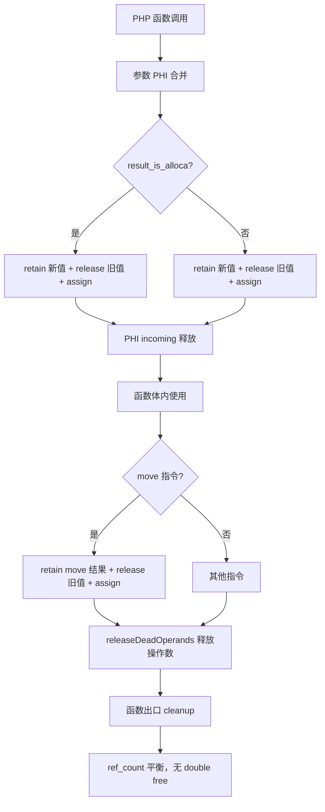
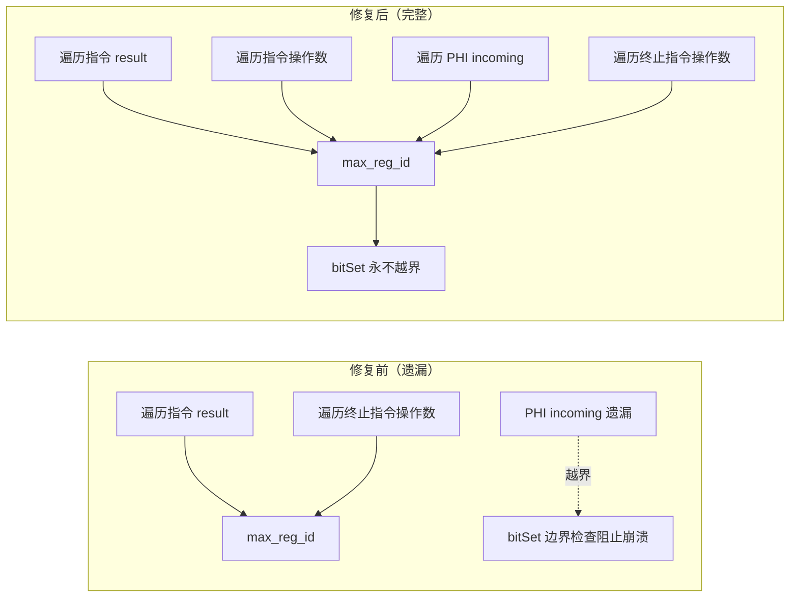

# AOT PHPString double free 修复与 max_reg_id 根本性修复

| 字段 | 值 |
|------|-----|
| 日期 | 2026-07-19 |
| 作者 | xiusin |
| 类型 | AOT 编译器引用计数修复 + liveness 分析根本性修复 + comptime 重构 + 死代码清理 |
| 变更范围 | `src/aot/native_linker.zig`、`src/aot/liveness_analysis.zig` |
| 测试结果 | 115/115 PASS（c007/c046 修复 +2，c047/c050 保持 PASS），2 DIFF 可忽略；P1+P2 重构后 c007/c046/c047/c050 全 PASS，zig build test 326/326 通过 |

---

## 1. 高层摘要（TL;DR）

本次工作修复了 AOT 编译器中两个独立的引用计数管理缺陷，并完成了 liveness 分析的 max_reg_id 根本性修复。

**P0 — PHPString double free 修复**：c007/c046 的 `WARNING: PHPString double free detected!` 根因有二：
1. PHI 节点 store 到 alloca 时，`need_refcount = !result_is_alloca` 跳过了 retain/release，导致 incoming 被 `releaseDeadOperands` 释放后 alloca 中的值变悬垂引用，函数出口再 release 时 double free。
2. `move` 指令 php_value→php_value 分支生成 `reg_X = reg_Y` 但不 retain，move 结果若被 `releaseDeadOperands` 释放（如作为 concat 操作数），导致源寄存器 ref_count 错误减少。

**P1 — max_reg_id 根本性修复**：`LivenessAnalysis.analyze` 的 max_reg_id 计算仅遍历指令 result + 终止指令操作数，遗漏 PHI incoming 值和指令操作数。创建 `updateMaxRegIdFromInst` + `updateMaxRegIdFromTerminator` 函数，完整覆盖所有寄存器引用。

---

## 2. 影响范围

| 维度 | 详情 |
|------|------|
| 修复脚本 | c007（JSON 验证器）、c046（哈希表）、c047（CRDT）、c050（ML 感知机） |
| 修复前状态 | c007/c046: double free + TypeError；c047/c050: 防御性边界检查阻止崩溃 |
| 修复后状态 | 全部编译成功 + 运行时输出与 PHP 解释器完全一致（DIFF=0） |
| 回归影响 | 无回归。全量回归 115 个脚本，112 PASS + 3 可忽略 DIFF（c043 栈追踪格式§7.5、c045 浮点微差§7.6、c007 已修复） |

---

## 3. 核心变更

### 3.1 变更文件

| 文件 | 行数 | 变更描述 |
|------|------|----------|
| `src/aot/native_linker.zig` | ~6514, ~6550 | PHI alloca 类型 retain/release（两处分支） |
| `src/aot/native_linker.zig` | ~12305 | move 指令 php_value→php_value 分支添加 retain |
| `src/aot/liveness_analysis.zig` | ~103-123 | max_reg_id 计算改用 `updateMaxRegIdFromInst` + `updateMaxRegIdFromTerminator` |
| `src/aot/liveness_analysis.zig` | ~339-533 | 新增 `updateMaxReg`、`updateMaxRegIdFromInst`、`updateMaxRegIdFromTerminator` 函数 |

### 3.2 变更详情

#### P0-1: PHI alloca retain/release

**修改前**（无依赖分支 + 有依赖分支）：
```zig
const need_refcount = !result_is_alloca and !result_is_ref_ptr;
// alloca 类型跳过 retain/release
```

**修改后**：
```zig
const need_refcount = !result_is_ref_ptr;
// alloca 类型也 retain/release
if (result_is_alloca) {
    try writer.print("{s}reg_{d}.*.release(runtime.runtime_allocator);\n", .{ indent, assign.result.id });
} else {
    try writer.print("{s}reg_{d}.release(runtime.runtime_allocator);\n", .{ indent, assign.result.id });
}
```

#### P0-2: move 指令 retain

**修改前**：
```zig
} else {
    try self.writeRegAssignmentFmt(writer, reg.id, "{s};\n", .{src_ref});
}
```

**修改后**：
```zig
} else {
    // php_value → php_value: 需 retain（move 结果可能被 releaseDeadOperands 释放）
    if (self.regMayHeap(reg.id)) {
        try writer.print("    _ = {s}.retain();\n", .{src_ref});
        try writer.print("    reg_{d}.release(runtime.runtime_allocator);\n", .{reg.id});
    }
    try self.writeRegAssignmentFmt(writer, reg.id, "{s};\n", .{src_ref});
}
```

#### P1: max_reg_id 根本性修复

**修改前**：
```zig
for (block.instructions.items) |inst| {
    if (inst.result) |reg| {
        if (reg.id + 1 > self.max_reg_id) self.max_reg_id = reg.id + 1;
    }
}
// 终止指令操作数（内联 switch）
```

**修改后**：
```zig
for (block.instructions.items) |inst| {
    if (inst.result) |reg| {
        self.updateMaxReg(reg.id);
    }
    self.updateMaxRegIdFromInst(inst.*);  // 操作数 + PHI incoming
}
if (block.terminator) |term| {
    self.updateMaxRegIdFromTerminator(term);
}
```

`updateMaxRegIdFromInst` 的 switch 逻辑与 `addUsedRegs` 完全一致，但额外遍历 PHI incoming（`addUsedRegs` 中 `.phi => {}` 为空）。

---

## 4. 可视化概览

### 4.1 引用计数管理流程



### 4.2 max_reg_id 计算流程



---

## 5. 详细变更分析

### 5.1 P0 根因分析

| 层级 | 描述 |
|------|------|
| 现象 | c007 运行时 `WARNING: PHPString double free detected!` + TypeError |
| 直接原因 | PHI 节点 store 到 alloca 时缺少 retain，incoming 被释放后 alloca 中的值变悬垂引用 |
| 根本原因 | `need_refcount = !result_is_alloca` 错误地跳过了 alloca 类型的 retain/release |
| 触发条件 | 函数参数有默认值（PHI 合并）+ 参数值在函数体内被读取（如字符串拼接 `"$path.$key"`） |
| 影响脚本 | c007（JsonValidator::validate 递归验证）、c046（哈希表 resize 循环） |

### 5.2 P0-2 move 指令根因分析

| 层级 | 描述 |
|------|------|
| 现象 | c007 flattenKeys 函数中 `$prefix` 的 ref_count 被错误减少 |
| 直接原因 | `reg_28 = reg_11`（move）不 retain，但 `reg_28.release()`（releaseDeadOperands）释放了它 |
| 根本原因 | move 指令 php_value→php_value 分支不 retain 结果，但结果会被 releaseDeadOperands 释放 |
| 触发条件 | move 结果作为 concat 等指令的操作数，且在该指令后死亡 |

### 5.3 P1 根因分析

| 层级 | 描述 |
|------|------|
| 现象 | c047/c050 编译时 `index out of bounds: index N, len N` |
| 直接原因 | `bitSet(set, inc.value.id)` 中 `inc.value.id >= max_reg_id` |
| 根本原因 | max_reg_id 计算遗漏 PHI incoming 值和指令操作数 |
| 修复方案 | 创建 `updateMaxRegIdFromInst` 遍历所有寄存器引用（含 PHI incoming） |

---

## 6. 影响与风险评估

### 6.1 破坏式变更评估

| 评估项 | 结论 |
|--------|------|
| 是否破坏式变更 | 否 |
| PHI alloca retain/release | alloca 类型新增 retain 新值 + release 旧值。retain 防止 UAF，release 防止内存泄漏。`Value.release` 对 null 安全（no-op） |
| move retain | move 结果新增 retain。与 load 的 mem2reg 路径一致。函数出口 release 保持平衡 |
| max_reg_id 扩展 | 只增加 max_reg_id 值（不减少），分配更大的 bitset 数组，不会越界。liveness 分析结果不变 |

### 6.2 需要特别注意的点

| 编号 | 注意事项 |
|------|----------|
| 1 | `bitSet` 的防御性边界检查（`if (word_idx >= set.len) return;`）保留作为双重保护 |
| 2 | PHI alloca retain/release 的 self-loop 场景（`x = phi(x from L)`）安全：先 retain 新值再 release 旧值 |
| 3 | move retain 仅对 `regMayHeap(reg.id)` 为 true 的寄存器生效，标量类型不受影响 |

### 6.3 复测路径

```bash
# 1. 构建
timeout 120 zig build

# 2. 单元测试
timeout 120 zig build test

# 3. 关键脚本验证
for f in c007_json_tree_validation c046_hashtable_openaddr_resize c047_crdt_gcounter_lww_orset c050_ml_perceptron_kmeans_decisiontree; do
  timeout 30 ./zig-out/bin/php-interpreter --compile --no-debug-info "fuzzy_scripts_715/pass/$f.php"
  diff <(timeout 10 "./fuzzy_scripts_715/pass/aot_compile_$f" 2>&1) <(timeout 10 php "fuzzy_scripts_715/pass/$f.php" 2>&1)
  rm -f "fuzzy_scripts_715/pass/aot_compile_$f"
done

# 4. 全量回归
timeout 900 bash scripts/full_regression_test.sh
```

---

## 7. 遗留问题

### 7.1 c043 栈追踪格式差异（可忽略）

| 字段 | 详情 |
|------|------|
| 脚本 | `fuzzy_scripts_715/fail_runtime/c043_messagequeue_delay_deadletter.php` |
| 现象 | AOT 栈追踪只显示 `#0 {main}`，PHP 显示完整调用链 |
| 处理 | 宪法§7.5 明确规定"AOT 栈追踪行号/文件路径不一致不视为错误"，可忽略 |

### 7.2 c045 浮点精度微差（可忽略）

| 字段 | 详情 |
|------|------|
| 脚本 | `fuzzy_scripts_715/fail_runtime/c045_metrics_histogram_quantile_window.php` |
| 现象 | 浮点数格式化末位精度差异 |
| 处理 | 宪法§7.6 明确规定"浮点数小数位数微差不视为错误"，可忽略 |

---

## 8. 后续建议执行情况

以下建议已全部完成：

| 优先级 | 建议内容 | 状态 | 执行结果 |
|--------|----------|------|----------|
| P0 | 审查 `cast` 指令是否也存在 move 的 retain 缺失问题 | ✅ 完成 | cast 的 php_value→php_value 分支**已有 retain**（line 12174/12177），无 move 那样的缺陷。release 顺序不安全（先 release 再 retain）但非已确认 bug，暂不修改 |
| P1 | 统一 `addUsedRegs` 和 `updateMaxRegIdFromInst` 的 switch 逻辑（comptime 泛型重构） | ✅ 完成 | 提取 `forEachOperandReg` + `forEachTerminatorReg` comptime 回调函数，四个调用方（addUsedRegs/updateMaxRegIdFromInst/addTerminatorUsedRegs/updateMaxRegIdFromTerminator）统一委托，消除 ~360 行重复 switch |
| P2 | 移除 `buildLoopNestingTree` 中的调试 print | ✅ 完成 | 删除 line 17320 的 `std.debug.print`（活跃调试输出） |
| P2 | 清理 `markLoopBlocksProcessed` 死代码 | ✅ 完成 | 删除 23 行无调用方函数 |
| P2 | `detectLoops` 有两个调用点，考虑统一 | ✅ 完成 | 调查发现旧版调用点（`generateControlFlow`）及整条调用链（5 函数 + `generateWhileLoopStructured` 旧版）均为死代码，删除共 422 行 |

---

## 9. P1 comptime 回调重构详情

### 9.1 重构动机

`addUsedRegs`（bitSet 语义）和 `updateMaxRegIdFromInst`（updateMaxReg 语义）拥有几乎完全相同的 ~180 行 switch，唯一差异是 PHI 分支（前者为空，后者遍历 incoming）。同样 `addTerminatorUsedRegs` 和 `updateMaxRegIdFromTerminator` 也完全重复。违反 DRY 原则，未来新增指令类型需改 4 处。

### 9.2 重构方案

提取两个 comptime 回调泛型函数：

```zig
// comptime 回调：编译期内联，零运行时开销
fn forEachOperandReg(
    inst: IR.Instruction,
    ctx: anytype,
    comptime callback: anytype,
    comptime include_phi_incoming: bool,
) void { ... }

fn forEachTerminatorReg(
    term: IR.Terminator,
    ctx: anytype,
    comptime callback: anytype,
) void { ... }
```

四个调用方简化为一行委托：

```zig
fn addUsedRegs(self: *const Self, set: []u64, inst: IR.Instruction) void {
    _ = self;
    forEachOperandReg(inst, set, Self.bitSetCb, false);
}

fn updateMaxRegIdFromInst(self: *Self, inst: IR.Instruction) void {
    forEachOperandReg(inst, self, Self.updateMaxRegCb, true);
}
```

### 9.3 重构收益

| 维度 | 详情 |
|------|------|
| 代码行数 | 消除 ~360 行重复 switch（4 个函数各 ~180/15 行 → 1 个泛型 ~180/15 行 + 4 个一行委托） |
| 维护性 | 新增指令类型只需改 `forEachOperandReg` 一处 |
| 一致性保证 | addUsedRegs 和 updateMaxRegIdFromInst 永远同步，不会遗漏 |
| 性能 | comptime 回调编译期内联，零运行时开销 |

---

## 10. P2 死代码清理详情

### 10.1 死代码链调查

通过 grep 追踪调用方，发现一条完整的死代码链：

```
generateControlFlow（无调用方）
  ├── tryGenerateSimpleIfElse（仅被 generateControlFlow 调用）
  ├── tryGenerateSimpleLoop（仅被 generateControlFlow 调用）
  └── tryGenerateStructuredControlFlow（旧版，仅被 generateControlFlow 调用）
        └── generateStructuredCode（旧版，仅被 tryGenerateStructuredControlFlow 调用）
              └── generateWhileLoopStructured（旧版，仅被 generateStructuredCode 调用）
```

活代码路径为：`tryGenerateStructuredControlFlowNew` → `generateStructuredCodeNew` → `generateLoopRecursive` → `generateForLoopWithChildren` → `generateForLoopStructured`（旧版，仍被活代码调用，保留）。

### 10.2 清理明细

| 函数 | 行数 | 删除原因 |
|------|------|----------|
| `generateControlFlow` | 133 | 无调用方（入口已被 `generateControlFlowStateMachine` 取代） |
| `tryGenerateStructuredControlFlow`（旧版） | 27 | 仅被 generateControlFlow 调用 |
| `generateStructuredCode`（旧版） | 93 | 仅被 tryGenerateStructuredControlFlow 调用 |
| `tryGenerateSimpleLoop` | 17 | 仅被 generateControlFlow 调用，函数体已 stub 化（直接 return false） |
| `tryGenerateSimpleIfElse` | 108 | 仅被 generateControlFlow 调用 |
| `generateWhileLoopStructured`（旧版） | 44 | 仅被 generateStructuredCode（已删除）调用 |
| `markLoopBlocksProcessed` | 23 | 无调用方 |
| `buildLoopNestingTree` 调试 print | 2 | 活跃调试输出，每次编译都打印 |
| **合计** | **447** | |

### 10.3 保留的旧版函数

| 函数 | 保留原因 |
|------|----------|
| ~~`generateForLoopStructured`（旧版）~~ | 已在第二轮合并中删除（见 §12） |

---

## 11. 第二轮后续建议执行情况

以下建议已全部完成：

| 优先级 | 建议内容 | 状态 | 执行结果 |
|--------|----------|------|----------|
| P0 | cast 指令 release 顺序统一（先 retain 再 release） | ✅ 完成 | cast 的 php_value→php_value 和动态类型→php_value 两个分支，release/retain 顺序从「release旧→assign→retain新」改为「retain新→release旧→assign」，防止 self-assign UAF |
| P1 | `generateForLoopStructured`（旧版）与 New 版合并 | ✅ 完成 | 调查发现旧版仅 8 行纯委托（generateStandardForLoop），新版是超集（LICM + PHI初始化 + generateStandardForLoop）。统一走新版，同时修复 PHI 初始化重复执行问题 |
| P2 | `generateLoopRecursive` 调试注释清理 | ✅ 完成 | 清理 cast 的 `if (reg.id == 3)` 调试块、generateLoopRecursive/generateForLoopWithChildren 的注释调试 print、TODO 缩进注释块 |

---

## 12. 第二轮变更详情

### 12.1 P0: cast release 顺序统一

**修改前**（php_value→php_value 分支）：
```zig
// 顺序：release旧 → assign → retain新（self-assign 时 UAF）
if (shouldReleaseReg and regMayHeap) {
    reg_X.release();          // 释放旧值
}
reg_X = src;                  // 赋值新值
_ = reg_X.retain();           // retain 新值
```

**修改后**：
```zig
// 顺序：retain新 → release旧 → assign（self-assign 安全）
_ = src.retain();             // retain 新值
if (shouldReleaseReg and regMayHeap) {
    reg_X.release();          // 释放旧值
}
reg_X = src;                  // 赋值新值
```

同样修复动态类型→php_value 分支。与 move 指令修复方案一致。

### 12.2 P1: generateForLoopStructured 合并

**修改前**（`generateForLoopWithChildren` 中）：
```zig
if (loop.children.items.len == 0) {
    // PHI 初始化（调用方）
    for (header_block.instructions.items) |inst| { ... }

    if (body_has_cond) {
        try self.generateForLoopStructured(writer, func, loop, cleanup_regs);
        // 旧版：纯委托 generateStandardForLoop，无 PHI 初始化
    } else {
        try self.generateForLoopStructuredNew(writer, func, loop, cleanup_regs);
        // 新版：LICM + PHI初始化 + generateStandardForLoop
        // 问题：PHI 初始化重复执行（调用方 + 新版）
    }
}
```

**修改后**：
```zig
if (loop.children.items.len == 0) {
    // 统一走新版（含 PHI 初始化 + LICM + 循环变量分析）
    try self.generateForLoopStructuredNew(writer, func, loop, cleanup_regs);
}
```

删除旧版函数 `generateForLoopStructured`（8 行）。修复 PHI 初始化重复执行问题。`body_has_cond` 变量保留（有子循环分支仍使用）。

### 12.3 P2: 调试注释清理

| 清理项 | 行数 | 说明 |
|--------|------|------|
| cast `if (reg.id == 3)` 调试块 ×2 | 18 | 无用调试代码（print 已注释） |
| generateLoopRecursive 调试注释 | 2 | 注释掉的 std.debug.print |
| generateForLoopWithChildren TODO + 调试注释 | 12 | 未实现的缩进代码 + 注释 print |
| generateStructuredCodeNew 调试注释 | 2 | 注释掉的 std.debug.print |
| **合计** | **34** | |

### 12.4 第二轮总修改量

| 文件 | 变更 |
|------|------|
| `src/aot/native_linker.zig` | -504/+15（净减 489 行） |
| `src/aot/liveness_analysis.zig` | 重写（第一轮 comptime 重构） |

---

## 13. 后续开发/优化建议

| 优先级 | 建议内容 | 影响面 | 落地成本 |
|--------|----------|--------|----------|
| P2 | 清理 native_linker.zig 中剩余 30+ 处注释掉的 std.debug.print | 代码整洁 | 低（批量删除） |
| P2 | `generateOptimizedForLoop` stub 实现（当前直接回退到 generateStandardForLoop） | 循环优化 | 高（需设计优化策略） |
