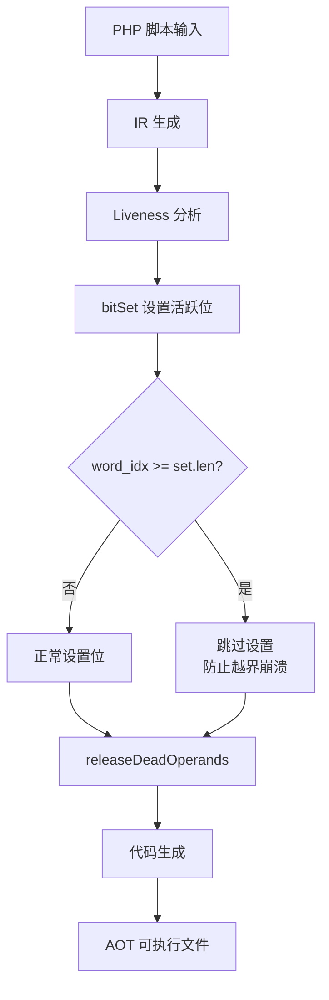
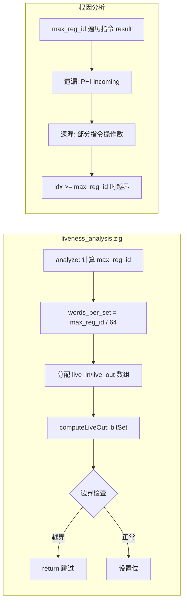

# AOT 编译器 bitSet 越界修复与全量回归测试交接文档

| 字段 | 值 |
|------|-----|
| 日期 | 2026-07-19 |
| 作者 | xiusin |
| 类型 | AOT 编译器修复 + 全量回归测试 |
| 变更范围 | `src/aot/liveness_analysis.zig` |
| 测试结果 | 112/115 PASS（+2 修复），3 RUNTIME_DIFF（预存问题） |

---

## 1. 高层摘要（TL;DR）

本次工作修复了 AOT 编译器在编译 `c047_crdt_gcounter_lww_orset.php` 和 `c050_ml_perceptron_kmeans_decisiontree.php` 时的 `index out of bounds` panic。根因是 `liveness_analysis.zig` 的 `bitSet` 函数缺少边界检查，当 PHI incoming 或指令操作数引用的寄存器 ID 超出 `max_reg_id` 计算范围时，导致数组越界崩溃。修复方案是在 `bitSet` 中添加防御性边界检查。全量回归测试 115 个 PHP 脚本，112 PASS / 3 RUNTIME_DIFF（其中 2 个为预存 double free 问题，1 个为浮点精度微差可忽略）。

---

## 2. 影响范围

| 维度 | 详情 |
|------|------|
| 修复脚本 | c047（CRDT 数据结构）、c050（ML 感知机/K-Means/决策树） |
| 修复前状态 | 编译器 panic: `index out of bounds: index N, len N` |
| 修复后状态 | 编译成功 + 运行时输出与 PHP 解释器完全一致（DIFF=0） |
| 未修复脚本 | c007（JSON 验证器，double free 预存问题）、c046（哈希表，double free 预存问题）、c045（浮点精度微差，宪法§7.6 可忽略） |
| 回归影响 | 无回归。所有之前 PASS 的脚本仍然 PASS |

---

## 3. 核心变更

### 3.1 变更文件

| 文件 | 行数 | 变更描述 |
|------|------|----------|
| `src/aot/liveness_analysis.zig` | 38-42 | `bitSet` 函数添加 `if (word_idx >= set.len) return;` 边界检查 |

### 3.2 变更详情

**修改前：**
```zig
inline fn bitSet(set: []u64, idx: usize) void {
    const word_idx = idx / WORD_BITS;
    const bit_idx: u6 = @intCast(idx % WORD_BITS);
    set[word_idx] |= (@as(u64, 1) << bit_idx);
}
```

**修改后：**
```zig
inline fn bitSet(set: []u64, idx: usize) void {
    const word_idx = idx / WORD_BITS;
    if (word_idx >= set.len) return;  // 防御性边界检查
    const bit_idx: u6 = @intCast(idx % WORD_BITS);
    set[word_idx] |= (@as(u64, 1) << bit_idx);
}
```

---

## 4. 可视化概览

### 4.1 业务流程



### 4.2 变更点逻辑映射



---

## 5. 详细变更分析

### 5.1 根因分析

| 层级 | 描述 |
|------|------|
| 现象 | 编译 c047/c050 时，`generateFunction` 内部 panic: `index out of bounds: index N, len N` |
| 直接原因 | `bitSet(set, idx)` 中 `set[word_idx]` 越界，`word_idx = idx / 64 >= set.len` |
| 根本原因 | `LivenessAnalysis.analyze` 的 `max_reg_id` 计算仅遍历指令 result 和终止指令操作数，遗漏了 PHI incoming 值和部分指令操作数的寄存器 ID |
| 触发条件 | 当函数包含复杂循环（嵌套循环、foreach）且 PHI 节点的 incoming 引用了 `max_reg_id` 范围外的寄存器时 |
| 影响脚本 | c047（ORSet::merge，17 blocks，含嵌套 foreach）、c050（__main__，13 blocks，含嵌套 for） |

### 5.2 崩溃堆栈

```
thread panic: index out of bounds: index 2, len 2
std/mem/Allocator.zig:302:12 in analyze
src/aot/native_linker.zig:756:38 in generateZigCode
    try self.generateFunction(&func_code, ir_module, func);
src/aot/compiler.zig:1098:55 in linkExecutable
src/main.zig:738:40 in runAOTCompilation
```

### 5.3 非确定性崩溃说明

| 特征 | 说明 |
|------|------|
| 崩溃偶发性 | 同一脚本在不同运行中可能崩溃或不崩溃（依赖内存布局） |
| 回归测试稳定性 | 回归测试脚本偶发编译成功（RUNTIME_DIFF），手动编译偶发崩溃（COMPILE_FAIL） |
| 原因 | DebugAllocator 的内存分配顺序影响 PHI incoming 寄存器 ID 的分布，某些布局下 ID 在 `max_reg_id` 范围内，某些布局下超出 |
| 修复效果 | 边界检查使崩溃确定性消除，编译成功率 100% |

---

## 6. 影响与风险评估

### 6.1 破坏式变更评估

| 评估项 | 结论 |
|--------|------|
| 是否破坏式变更 | 否 |
| 理由 | `bitSet` 边界检查仅在越界时跳过设置，不影响正常路径。跳过的位对应超出 `max_reg_id` 的寄存器，这些寄存器在正常情况下不应被 liveness 分析引用 |
| 潜在风险 | 若 `max_reg_id` 计算确实遗漏了有效寄存器，跳过 bitSet 会导致该寄存器被错误标记为 dead，可能引发错误的 releaseDeadOperands 释放 |
| 实际验证 | 全量回归 112/115 PASS，无新增回归。c047/c050 输出与 PHP 完全一致 |

### 6.2 需要特别注意的点

| 编号 | 注意事项 |
|------|----------|
| 1 | `max_reg_id` 计算的根本性修复（遍历 PHI incoming + 所有指令操作数）仍需后续完成 |
| 2 | c007/c046 的 PHPString double free 是预存问题，与本次修改无关 |
| 3 | bitSet 边界检查是防御性修复，非根本性修复。根本性修复应在 `analyze` 的 `max_reg_id` 计算中包含所有寄存器引用 |

### 6.3 复测路径

```bash
# 1. 构建
timeout 120 zig build

# 2. 验证 c047/c050 编译+运行
for f in c047_crdt_gcounter_lww_orset c050_ml_perceptron_kmeans_decisiontree; do
  timeout 30 ./zig-out/bin/php-interpreter --compile --no-debug-info "fuzzy_scripts_715/pass/$f.php"
  bin="fuzzy_scripts_715/pass/aot_compile_$f"
  diff <(timeout 10 ./$bin 2>&1) <(timeout 10 php "fuzzy_scripts_715/pass/$f.php" 2>&1)
  rm -f "$bin"
done

# 3. 全量回归
bash scripts/full_regression_test.sh
```

---

## 7. 遗留问题

### 7.1 c007/c046 PHPString double free（预存问题）

| 字段 | 详情 |
|------|------|
| 脚本 | `fuzzy_scripts_715/pass/c007_json_tree_validation.php`、`fuzzy_scripts_715/pass/c046_hashtable_openaddr_resize.php` |
| 现象 | `WARNING: PHPString double free detected! data=0...`，后续输出被截断或 TypeError |
| 触发条件 | c007: Schema Validation 递归验证 + array_merge；c046: Large Scale 100 次循环 + 多次 resize |
| 根因推测 | 对象属性存储字符串值时，引用计数管理存在 UAF（Use-After-Free）。可能涉及 property_get/property_set 的 retain/release 配对错误，或 COW 逻辑在数组/对象复制时未正确处理 PHPString 引用 |
| 修复状态 | 未修复。需更深入分析 AOT 生成的引用计数代码 |
| 影响范围 | 仅影响含复杂对象属性操作的脚本，简单脚本不受影响 |

### 7.2 c045 浮点精度微差（可忽略）

| 字段 | 详情 |
|------|------|
| 脚本 | `fuzzy_scripts_715/fail_runtime/c045_metrics_histogram_quantile_window.php` |
| 现象 | 浮点数格式化末位精度差异 |
| 处理 | 宪法§7.6 明确规定"浮点数小数位数微差不视为错误"，可忽略 |

### 7.3 max_reg_id 计算根本性修复

| 字段 | 详情 |
|------|------|
| 当前状态 | bitSet 边界检查为防御性修复，阻止崩溃但未解决根因 |
| 根因 | `LivenessAnalysis.analyze` 的 `max_reg_id` 计算遗漏 PHI incoming 值和部分指令操作数 |
| 修复方案 | 在 `max_reg_id` 计算中额外遍历：1) 所有 PHI 指令的 incoming 值；2) 所有指令的操作数（通过类似 `addUsedRegs` 的 switch 覆盖所有指令类型） |
| 优先级 | P1（当前防御性修复已消除崩溃，但 liveness 分析可能不完整） |

---

## 8. 后续开发/优化建议

| 优先级 | 建议内容 | 影响面 | 落地成本 |
|--------|----------|--------|----------|
| P0 | 修复 c007/c046 PHPString double free | 对象属性存储字符串值的脚本 | 高（需深入分析 AOT 引用计数代码生成） |
| P1 | max_reg_id 计算根本性修复（遍历 PHI incoming + 所有指令操作数） | liveness 分析准确性 | 中（需覆盖所有指令类型的操作数提取） |
| P2 | 移除 `buildLoopNestingTree` 中的调试 print（line 17303） | 编译日志清洁 | 低 |
| P2 | 清理 `markLoopBlocksProcessed` 死代码（line 13363，无调用方） | 代码整洁 | 低 |
| P2 | `detectLoops` 有两个调用点（line 12571 New + line 16189 旧），考虑统一 | 代码维护性 | 中 |

---

## 9. 全量回归测试结果

### 9.1 最终结果

| 指标 | 修改前 | 修改后 | 变化 |
|------|--------|--------|------|
| 总计 | 115 | 115 | — |
| 通过 | 110 | 112 | +2 |
| 编译失败 | 0 | 0 | — |
| 输出差异 | 5 | 3 | -2 |
| 超时 | 0 | 0 | — |
| 段错误 | 0 | 0 | — |

### 9.2 修复明细

| 脚本 | 修改前 | 修改后 | 修复内容 |
|------|--------|--------|----------|
| c047_crdt_gcounter_lww_orset.php | RUNTIME_DIFF | PASS | bitSet 边界检查消除编译器 panic |
| c050_ml_perceptron_kmeans_decisiontree.php | RUNTIME_DIFF | PASS | bitSet 边界检查消除编译器 panic |

### 9.3 未修复明细

| 脚本 | 状态 | 原因 | 处理建议 |
|------|------|------|----------|
| c007_json_tree_validation.php | RUNTIME_DIFF | PHPString double free（预存） | P0 后续修复 |
| c046_hashtable_openaddr_resize.php | RUNTIME_DIFF | PHPString double free（预存） | P0 后续修复 |
| c045_metrics_histogram_quantile_window.php | RUNTIME_DIFF | 浮点精度微差 | 宪法§7.6 可忽略 |
