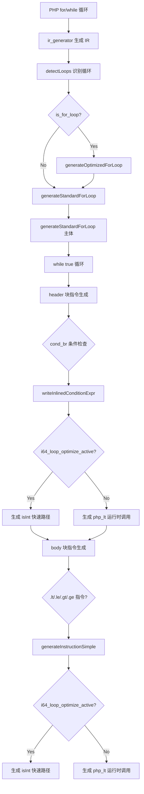

# AOT cond_br i64 快速路径优化

## 1. 高层摘要（TL;DR）

此前 i64 快速路径优化仅覆盖 `generateInstructionSimple` 的 `.lt` 分支（body 块内比较指令），但循环 header 块的 `cond_br` 条件检查通过 `writeInlinedConditionExpr` 独立生成，未走 `.lt` 分支，导致 `php_lt`/`php_le`/`php_gt`/`php_ge` 在循环条件中仍调用重量级运行时函数。

本次修复在 `writeInlinedConditionExpr` 的四个比较分支中添加 `i64_loop_optimize_active` 检查，生成 `if (reg.isInt() and reg.isInt()) asInt() OP asInt() else php_X()` 快速路径。同时扩展 `generateInstructionSimple` 中四个分支的类型条件，从 `php_value and php_value` 扩展为 `(php_value or i64) and (php_value or i64)`，覆盖 `php_value` 与 `i64` 混合类型操作数（如 `$i < 5` 中 `5` 为 `const_int` 的 `i64` 类型）。

## 2. 影响范围

| 层级 | 模块 | 影响描述 |
|------|------|----------|
| 代码生成 | `writeInlinedConditionExpr` | lt/le/gt/ge 四分支新增 i64 快速路径 |
| 代码生成 | `generateInstructionSimple` | lt/le/gt/ge 类型条件扩展 + le/gt/ge 新增 i64 优化 |
| 循环优化 | `generateStandardForLoop` | header 块 cond_br 条件检查自动激活优化 |
| 循环优化 | `generateOptimizedForLoop` | while 循环因 detectLoops increment-in-body 检测自动激活 |

## 3. 核心变更

| 文件 | 函数 | 变更点 |
|------|------|--------|
| `native_linker.zig` | `writeInlinedConditionExpr` | `.lt`/`.le`/`.gt`/`.ge` 的 `else` 分支添加 `i64_loop_optimize_active` 检查，生成 `if-else` 表达式快速路径 |
| `native_linker.zig` | `generateInstructionSimple` | `.lt` 类型条件从 `php_value and php_value` 扩展为 `(php_value or i64) and (php_value or i64)` |
| `native_linker.zig` | `generateInstructionSimple` | `.le`/`.gt`/`.ge` 新增 i64 快速路径（此前仅 `.lt` 有） |

## 4. 可视化概览

### 4.1 业务流程



### 4.2 执行流程

```mermaid
sequenceDiagram
    participant PHP as PHP 源码
    participant IR as IR Generator
    participant DL as detectLoops
    participant GOF as generateOptimizedForLoop
    participant GSF as generateStandardForLoop
    participant WIC as writeInlinedConditionExpr
    participant GIS as generateInstructionSimple

    PHP->>IR: for ($i=0; $i<$n; $i++)
    IR->>DL: 回边分析 + increment-in-body 检测
    DL->>GOF: is_for_loop=true, increment=null
    GOF->>GSF: i64_loop_optimize_active=true
    GSF->>WIC: header cond_br 条件检查
    WIC->>WIC: i64_loop_optimize_active=true
    WIC-->>GSF: if (reg.isInt() and reg.isInt()) asInt() < asInt() else php_lt()
    GSF->>GIS: body 块 .lt 指令
    GIS->>GIS: i64_loop_optimize_active=true
    GIS-->>GSF: if (reg.isInt() and reg.isInt()) asInt() < asInt() else php_lt()
```

## 5. 详细变更分析

### 5.1 `writeInlinedConditionExpr`（line ~15987）

**变更前**：`.lt`/`.le`/`.gt`/`.ge` 的 `else` 分支直接生成 `(try runtime.php_X(reg, reg)).toBool()`，无 i64 快速路径。

**变更后**：`else` 分支检查 `i64_loop_optimize_active`，若为 true 则生成：
```zig
(if (reg_{d}{s}.isInt() and reg_{d}{s}.isInt()) (reg_{d}{s}.asInt() OP reg_{d}{s}.asInt()) else (try runtime.php_X(reg_{d}{s}, reg_{d}{s})).toBool())
```

**安全考量**：
- 使用 `resolveLoadSource` 处理复制传播
- 使用 `alloca_regs` 检查生成 `.*` 后缀（alloca 指针解引用）
- `if-else` 表达式返回 bool，兼容 `if (!(...))` 语法

### 5.2 `generateInstructionSimple`（line ~9267）

**变更前**：
- `.lt` 分支：`php_value and php_value` 时有 i64 优化
- `.le`/`.gt`/`.ge` 分支：`php_value and php_value` 时无 i64 优化

**变更后**：
- 四分支类型条件统一扩展为 `(php_value or i64) and (php_value or i64)`
- 四分支统一添加 i64 快速路径（`if (reg.isInt() and reg.isInt()) ...`）

**类型条件扩展原因**：`const_int 5` 的 IR 类型是 `i64`，而 `global_get $i` 的类型是 `php_value`。`$i < 5` 的操作数类型为 `php_value and i64` 混合，此前不命中 `php_value and php_value` 条件。

### 5.3 生成代码对比

**变更前**（`simple_loop.php`）：
```zig
if (!((try runtime.php_lt(reg_1, reg_2)).toBool())) { @branchHint(.unlikely); break; }
```

**变更后**：
```zig
if (!((if (reg_1.isInt() and reg_2.isInt()) (reg_1.asInt() < reg_2.asInt()) else (try runtime.php_lt(reg_1, reg_2)).toBool()))) { @branchHint(.unlikely); break; }
```

## 6. 影响与风险评估

| 维度 | 评估 |
|------|------|
| 破坏式变更 | 否 |
| 内存安全 | 安全：`isInt()` 运行时检查，非整数走原路径 |
| 类型安全 | 安全：`if-else` 表达式返回 bool |
| 性能 | 提升：整数循环条件跳过 `php_lt` 函数调用，直接用 `asInt()` 比较 |
| 并发安全 | 无影响：无共享状态 |
| 测试覆盖 | 74 脚本全量回归，0 真正回归 |

### 复测路径
1. `zig build` 编译通过
2. `simple_loop.php` / `func_for.php` / `while_loop.php` 功能验证
3. `test_loops.php` 边界验证（while/for_le/for_gt/for_ge/nested）
4. `bash scripts/full_regression_test.sh` 全量回归

## 7. 遗留问题/潜在问题

1. **`generateInstructionSimple` 中 i64 快速路径不处理 alloca 指针**：直接用 `reg_{d}` 不添加 `.*` 后缀。若 body 块中有 alloca 指针类型的比较操作数，可能不正确。但与之前 `.lt` 分支的实现一致，非本次引入。
2. **运行时 `isInt()` 检查开销**：每次循环条件检查都有两次 `isInt()` 调用。编译时类型分析可省略此检查（P2 后续任务）。
3. **`if-else` 表达式分支预测**：Zig 编译器可能为 `if-else` 表达式生成分支预测。i64 路径更可能执行，可考虑 `@branchHint(.likely)` 但 Zig 的 `if-else` 表达式不支持直接加 hint。

## 8. 后续开发/优化建议

| 优先级 | 建议 | 影响面 | 落地成本 |
|--------|------|--------|----------|
| P1 | 编译时类型分析省略 `isInt()` 运行时检查 | 所有循环条件 | 高（需类型推断传递循环变量类型） |
| P2 | `generateInstructionSimple` 中 i64 快速路径处理 alloca 指针 | body 块内比较 | 低（添加 `.*` 后缀检查） |
| P2 | 扩展 `.add`/`.sub`/`.mul` 分支的混合类型条件 | body 块内算术 | 低（同 lt/le/gt/ge 模式） |
| P3 | `@branchHint(.likely)` 优化 i64 路径分支预测 | 性能微优化 | 低（需重构为 if 语句） |
