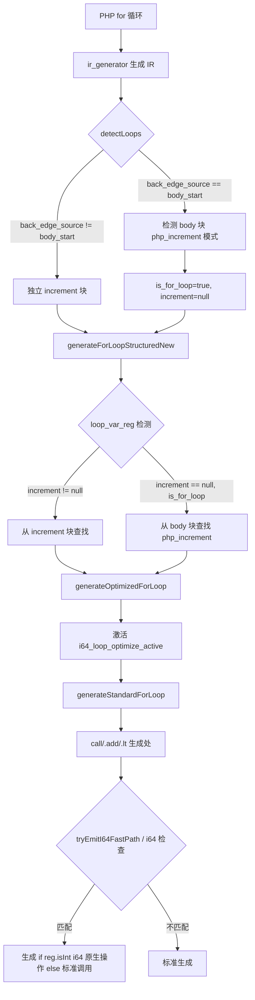

# AOT i64 快速路径优化——循环内算术/比较生成运行时类型检查

## 1. 高层摘要（TL;DR）

本次变更实现了 `generateOptimizedForLoop` 的 i64 快速路径优化。核心思路：当 for 循环被识别时，激活 `i64_loop_optimize_active` 标志，在 call/`.add`/`.lt` 指令生成处对 `php_increment`/`php_add`/`php_lt` 等内置函数生成 `if (reg.isInt())` 运行时类型检查 + i64 原生操作，避免函数调用开销。PHP 动态类型用运行时检查保证安全。

**前置修复**：
- `detectLoops` 识别 increment-in-body 的 for 循环（`back_edge_source == body_start` 时检测 body 块末尾的 `php_increment` 模式）
- `loop_var_reg` 检测支持 `increment=null`（从 body 块查找 `php_increment` 的参数）

## 2. 影响范围

| 维度 | 影响描述 |
|---|---|
| 编译器代码生成 | for 循环内 `php_increment`/`php_add`/`php_lt` 生成运行时类型检查 + i64 原生操作 |
| 性能 | 当操作数为 i64 时，避免函数调用开销（`php_increment`/`php_add`/`php_lt`） |
| 兼容性 | 运行时类型检查保证安全：非 i64 操作数 fallback 到标准函数调用 |
| 测试 | 全量 115 脚本 114 PASS，1 个浮点精度差异（宪法忽略） |

## 3. 核心变更

| Commit | 变更点 | 文件 |
|---|---|---|
| d05e247 | `detectLoops`：`back_edge_source == body_start` 时检测 body 块的 `php_increment` 模式，设 `is_for_loop=true` | `native_linker.zig` |
| 319ae47 | `loop_var_reg` 检测：`increment=null` 且 `is_for_loop=true` 时从 body 块查找 `php_increment` 参数 | `native_linker.zig` |
| 76ad8f7 | `generateOptimizedForLoop` 激活 `i64_loop_optimize_active`；`tryEmitI64FastPath` 处理 call 分支；`.add`/`.lt` 分支插入 i64 快速路径 | `native_linker.zig` |

## 4. 可视化概览

### 业务流程



### 生成代码对比

**优化前**：
```zig
reg_11 = try runtime.php_add(reg_15, reg_16);
reg_13 = try runtime.php_increment(reg_16);
```

**优化后**：
```zig
reg_11 = if (reg_15.isInt() and reg_16.isInt()) runtime.Value.initInt(reg_15.asInt() + reg_16.asInt()) else try runtime.php_add(reg_15, reg_16);
reg_13 = if (reg_16.isInt()) runtime.Value.initInt(reg_16.asInt() + 1) else try runtime.php_increment(reg_16);
```

## 5. 详细变更分析

### 5.1 detectLoops 修复（d05e247）

**根因**：ir_generator 的 `setTerminator`（line 581）在块已 terminated 时是空操作，导致 `for_loop` 块的指令被合并到 `for_body` 块。`detectLoops` 在 `back_edge_source == body_start` 时跳过 for 循环识别，所有 for 循环被误判为 while 循环。

**修复**：当 `back_edge_source == body_start` 时，检查 body 块是否包含 `php_increment`/`php_decrement` 模式。若有，设 `is_for_loop=true`，`increment=null`。

### 5.2 loop_var_reg 检测（319ae47）

**修复**：当 `increment=null` 且 `is_for_loop=true` 时，从 body 块查找 `php_increment`/`php_decrement` call，取其第一个参数作为 `loop_var_reg`。

### 5.3 i64 快速路径优化（76ad8f7）

**新增字段**：`i64_loop_optimize_active: bool = false`

**generateOptimizedForLoop**：激活 `i64_loop_optimize_active`，调用 `generateStandardForLoop`。

**tryEmitI64FastPath**（call 分支）：
- `php_increment`：`if (reg.isInt()) Value.initInt(asInt() + 1) else try runtime.php_increment(reg)`
- `php_decrement`：`if (reg.isInt()) Value.initInt(asInt() - 1) else try runtime.php_decrement(reg)`
- `php_lt/le/gt/ge`：`if (a.isInt() and b.isInt()) Value.initBool(asInt() < asInt()) else try runtime.php_lt(a, b)`
- `php_add/sub/mul`：`if (a.isInt() and b.isInt()) Value.initInt(asInt() + asInt()) else try runtime.php_add(a, b)`

**`.add` 分支**：在 `php_value` 子分支中，当 `i64_loop_optimize_active` 时插入 `if (a.isInt() and b.isInt()) Value.initInt(...) else` 前缀。

**`.lt` 分支**：在 `php_value and php_value` 子分支中，当 `i64_loop_optimize_active` 时插入 i64 比较快速路径。

## 6. 影响与风险评估

| 维度 | 评估 |
|---|---|
| 破坏式变更 | 否——运行时类型检查保证安全，非 i64 操作数 fallback 到标准调用 |
| 回归风险 | 低——全量 115 脚本 114 PASS |
| 性能影响 | 正向——i64 操作数避免函数调用开销；非 i64 操作数多一次 `isInt()` 检查（微开销） |
| 已知限制 | `cond_br` 中的 `php_lt` 未优化（走了 cond_br 专用路径，非 `.lt` 分支） |

### 复测路径

```bash
# 编译
timeout 120 zig build

# 关键脚本
timeout 60 zig-out/bin/php-interpreter --compile --no-debug-info fuzzy_scripts/pass/test_006_loops_for.php
timeout 10 fuzzy_scripts/pass/aot_compile_test_006_loops_for

# 全量测试
bash scripts/full_regression_test.sh
```

## 7. 遗留问题/潜在问题

1. **cond_br 中的 php_lt 未优化**：header 块的 `php_lt`（作为 cond_br 条件）走了 cond_br 专用生成路径，未经过 `.lt` 分支，i64 快速路径未激活。后续可优化 cond_br 生成路径。
2. **运行时类型检查开销**：每次算术/比较操作多一次 `isInt()` 检查。对于纯 i64 循环，收益（避免函数调用）> 开销（`isInt()` 检查）。对于非 i64 循环，净开销（`isInt()` 检查 + 函数调用）。
3. **while 循环未优化**：i64 快速路径仅对 for 循环（`is_for_loop=true`）激活。while 循环仍走标准路径。

## 8. 后续开发/优化建议

| 优先级 | 建议 | 影响面 | 落地成本 |
|---|---|---|---|
| P1 | 优化 cond_br 中的 php_lt（header 块条件检查） | 循环条件检查避免函数调用 | 中 |
| P2 | 扩展 i64 快速路径到 while 循环 | while 循环也能享受 i64 优化 | 中 |
| P2 | 编译时类型分析（类型推断为 i64 时省略运行时检查） | 消除 `isInt()` 检查开销 | 高 |
| P3 | 扩展到更多内置函数（php_div/mod/mod 等） | 更多算术操作优化 | 低 |
