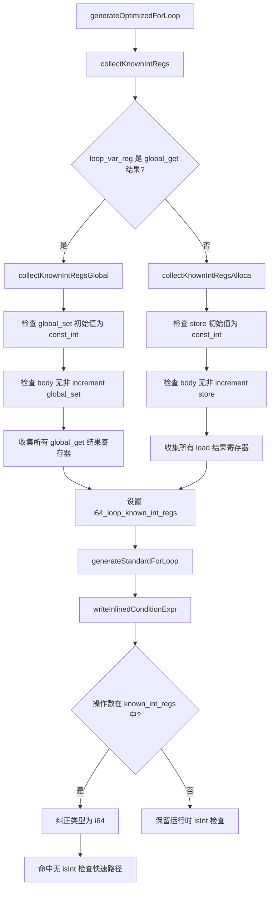

# AOT i64 快速路径优化第三轮 — P1/P2/P3 后续任务

> 变更日期：2026-07-19
> 关联交接文档：`docs/changes/2026-07-19/交接文档_AOT_i64快速路径优化_20260719.md`
> 关联记忆 ID：`17844593570619032619`

## 1. 高层摘要（TL;DR）

承接第二轮 i64 快速路径优化的 5 项后续建议，本轮完成 4 项（P2-a、P2-b、P3-b、P1），取消 1 项（P3-a）。核心成果：P1 编译时类型分析成功省略循环条件中的 `isInt()` 运行时检查，生成代码从 `if (isInt() and isInt()) asInt() < asInt() else php_lt()` 简化为 `asInt() < asInt()`。

## 2. 影响范围

| 模块 | 文件 | 影响面 |
|---|---|---|
| AOT 代码生成 | `src/aot/native_linker.zig` | lt/le/gt/ge/add/sub/mul 七分支 i64 快速路径 + `writeInlinedConditionExpr` 四分支 + `generateOptimizedForLoop` + 新增 3 个分析函数 |
| 测试工具 | `scripts/full_regression_test.sh` | 并行优化（编译锁串行 + 运行并行 + 进度提示） |

## 3. 核心变更

### 3.1 P2-a: generateInstructionSimple i64 快速路径 alloca 指针处理

| 变更点 | 说明 |
|---|---|
| `.lt`/`.le`/`.gt`/`.ge` 四分支 i64 快速路径 | 添加 `alloca_regs` 检查生成 `.*` 后缀，对齐 `writeInlinedConditionExpr` 实现 |
| 修改方式 | 在 `if (self.i64_loop_optimize_active)` 块内添加 `lhs_sfx`/`rhs_sfx` 计算，格式串从 `reg_{d}` 改为 `reg_{d}{s}` |

### 3.2 P2-b: .sub/.mul 新增 i64 快速路径 + .add/.sub/.mul alloca 后缀

| 变更点 | 说明 |
|---|---|
| `.sub`/`.mul` 的 `result_tag == .php_value` 分支 | 新增 `if (self.i64_loop_optimize_active)` 块，生成 `if (isInt() and isInt()) initInt(asInt() OP asInt()) else php_X()` |
| `.add`/`.sub`/`.mul` i64 快速路径 | 添加 `alloca_regs` 检查生成 `.*` 后缀 |

### 3.3 P3-b: 全量测试脚本并行优化

| 变更点 | 说明 |
|---|---|
| 编译锁串行化 | `mkdir $COMPILE_LOCK` 保护编译步骤（AOT 中间产物路径固定 `.zigphp_aot_build`，并行编译不安全） |
| 运行并行 | AOT 运行 + PHP 对比并行执行，`PARALLEL_JOBS` 控制并行度 |
| 进度提示 | `[i/N]` 格式输出到 stderr |
| 清理 | `trap cleanup EXIT` 确保锁和临时文件清理 |

### 3.4 P1: 编译时类型分析省略 isInt() 运行时检查

| 变更点 | 说明 |
|---|---|
| 新增字段 `i64_loop_known_int_regs` | `?*const std.AutoHashMap(usize, void)`，记录循环内已知整数寄存器 |
| 新增 `collectKnownIntRegs` | 分发函数，区分全局变量路径和 alloca 路径 |
| 新增 `collectKnownIntRegsGlobal` | 全局变量路径：检查 `global_set` 初始值为 const_int + body 无非 increment `global_set`，收集所有 `global_get` 结果寄存器 |
| 新增 `collectKnownIntRegsAlloca` | alloca 路径：检查 `store` 初始值为 const_int + body 无非 increment `store`，收集所有 `load` 结果寄存器 |
| 修改 `generateOptimizedForLoop` | 调用 `collectKnownIntRegs`，设置 `i64_loop_known_int_regs` |
| 修改 `writeInlinedConditionExpr` lt/le/gt/ge | 在类型判断后添加 `i64_loop_known_int_regs` 检查，已知整数寄存器纠正为 `.i64`，命中已有无 `isInt()` 检查的快速路径 |

**安全条件**：
1. 循环变量初始值为 `const_int`（编译时整数常量）
2. body 块中无非 increment/decrement 的重新赋值（允许 `$i++` 写回，拒绝 `$i = "hello"` 等）

**生成代码对比**（`simple_loop.php`）：

变更前（第二轮）：
```zig
if (!((if (reg_1.isInt() and reg_2.isInt()) (reg_1.asInt() < reg_2.asInt()) else (try runtime.php_lt(reg_1, reg_2)).toBool()))) { @branchHint(.unlikely); break; }
```

变更后（第三轮 P1）：
```zig
if (!(reg_1.asInt() < reg_2.asInt())) { @branchHint(.unlikely); break; }
```

### 3.5 P3-a: 取消（@branchHint 优化）

交接文档第 5.3 节明确"性能影响微小，暂不处理"。Zig 的 `if-else` 表达式不支持 `@branchHint`，重构为 labeled block 会令生成代码极度冗长（11 处 i64 快速路径），维护成本高而收益微小。

## 4. 可视化概览

### 4.1 P1 类型分析流程



## 5. 详细变更分析

### 5.1 涉及文件列表

| 文件 | 变更类型 | 变更点 |
|---|---|---|
| `src/aot/native_linker.zig` | 修改 | P2-a（4 处 alloca 后缀）+ P2-b（3 处 i64 快速路径/后缀）+ P1（1 字段 + 3 函数 + 4 分支类型纠正） |
| `scripts/full_regression_test.sh` | 重写 | P3-b 并行优化 |

### 5.2 P1 安全性验证

| 场景 | 脚本 | AOT 输出 | PHP 输出 | 生成代码 | 结果 |
|---|---|---|---|---|---|
| 安全（const_int 初始值 + increment） | `simple_loop.php` | `01234` | `01234` | `asInt() < asInt()`（无 isInt） | ✅ |
| 不安全（body 中 `$i = "hello"`） | `test_p1_safety.php` | TypeError | TypeError | `php_lt()`（保守降级） | ✅ |

## 6. 影响与风险评估

### 6.1 是否破坏式变更

否。P1 的类型分析是保守的：仅当安全条件 100% 满足时才省略 `isInt()` 检查，否则降级到原有运行时检查路径。

### 6.2 变更影响范围

- **P2-a/P2-b**：i64 快速路径的 alloca 后缀处理，对齐 `writeInlinedConditionExpr`，修复潜在 alloca 指针类型操作数不正确问题
- **P1**：循环条件检查省略 `isInt()` 运行时检查，每次迭代减少 2 次函数调用 + 分支预测开销
- **P3-b**：测试脚本并行化，编译串行（锁保护）+ 运行并行，解决超时截断问题

### 6.3 需要特别注意的点

1. P1 仅优化 `writeInlinedConditionExpr`（循环条件检查），`tryEmitI64FastPath` 中的 `php_increment` 仍保留 `isInt()` 检查（可后续扩展）
2. P1 全局变量路径依赖 `current_global_get_names` 映射，仅在映射已设置时激活
3. P3-b 的编译锁使用 `mkdir`（原子操作），macOS/Linux 均可用

### 6.4 复测路径

```bash
# 编译
cd /Users/tuoke/Desktop/ai-zig-php-parser && timeout 120 zig build

# P1 效果验证
timeout 30 zig-out/bin/php-interpreter --compile --no-debug-info /tmp/simple_loop.php 2>/dev/null
grep "isInt\|asInt.*<" .zigphp_aot_build/main.zig | head -3
# 预期：无 isInt，直接 asInt() < asInt()

# P1 安全性验证
timeout 30 zig-out/bin/php-interpreter --compile --no-debug-info /tmp/test_p1_safety.php 2>/dev/null
grep "php_lt" .zigphp_aot_build/main.zig | head -3
# 预期：保留 php_lt（保守降级）

# 全量回归
timeout 1200 bash scripts/full_regression_test.sh
```

## 7. 遗留问题/潜在问题

| 问题 | 影响 | 缓解 |
|---|---|---|
| P1 仅优化条件检查，未优化 `php_increment` | 每次迭代仍保留 1 次 `isInt()` 检查 | 后续可在 `tryEmitI64FastPath` 中添加 `i64_loop_known_int_regs` 检查 |
| P3-b 编译串行化（mkdir 锁） | 总时间仍受编译瓶颈限制 | 根本解决需修改 AOT 编译器使用进程唯一临时目录（`mkdtemp`） |
| 全量测试耗时较长 | 115 脚本串行编译约 20-30 分钟 | 可拆分为多个子脚本分别运行 |

## 8. 后续开发/优化建议

| 优先级 | 影响面 | 落地成本 | 建议 |
|---|---|---|---|
| P2 | 循环增量 | 低 | 在 `tryEmitI64FastPath` 的 `php_increment`/`php_decrement` 中添加 `i64_loop_known_int_regs` 检查，省略增量操作的 `isInt()` 检查 |
| P2 | 循环内算术 | 中 | 在 `generateInstructionSimple` 的 lt/le/gt/ge/add/sub/mul 分支中添加 `i64_loop_known_int_regs` 类型纠正（同 `writeInlinedConditionExpr`） |
| P3 | 测试效率 | 高 | 修改 AOT 编译器使用 `mkdtemp` 创建进程唯一临时目录，实现真正并行编译 |
| P3 | 类型分析精度 | 中 | 扩展 `collectKnownIntRegs` 支持循环变量初始值来自函数参数（如果参数类型注解为 int） |
