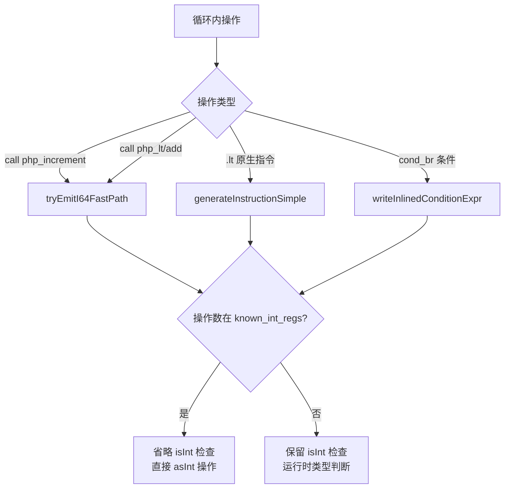
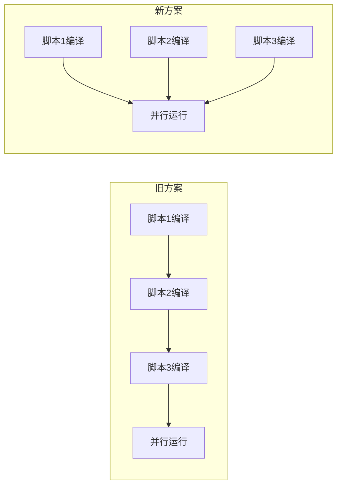

# AOT i64 快速路径优化第四轮 — P2-a/P2-b/P3 后续任务

> 变更日期：2026-07-19
> 关联文档：`docs/changes/2026-07-19/AOT_i64快速路径优化第三轮_P1P2P3_20260719.md`
> 关联记忆 ID：`17844593570619032619`

## 1. 高层摘要（TL;DR）

承接第三轮文档第 8 节的三项后续建议，本轮全部完成。核心成果：(1) `tryEmitI64FastPath` 的 `php_increment`/`php_decrement`/`php_lt`/`php_le`/`php_gt`/`php_ge`/`php_add`/`php_sub`/`php_mul` 全部添加 `known_int_regs` 检查，已知整数操作数省略 `isInt()` 运行时检查；(2) `generateInstructionSimple` 的 lt/le/gt/ge 四分支添加 `known_int_regs` 类型纠正；(3) AOT 编译器改用进程唯一临时目录（PID 命名），实现真正并行编译，测试脚本移除编译锁。

## 2. 影响范围

| 模块 | 文件 | 影响面 |
|---|---|---|
| AOT 代码生成 | `src/aot/native_linker.zig` | `tryEmitI64FastPath` 九处优化 + `generateInstructionSimple` 四分支类型纠正 + `createTempDir`/`deinit` 进程唯一目录 |
| 测试工具 | `scripts/full_regression_test.sh` | 移除编译锁，实现真正并行编译+运行 |

## 3. 核心变更

### 3.1 P2-a: tryEmitI64FastPath 全分支添加 known_int_regs 检查

| 变更点 | 优化前 | 优化后（known_int_regs 命中时） |
|---|---|---|
| `php_increment` | `if (reg.isInt()) initInt(asInt()+1) else php_increment()` | `initInt(asInt()+1)` |
| `php_decrement` | `if (reg.isInt()) initInt(asInt()-1) else php_decrement()` | `initInt(asInt()-1)` |
| `php_lt/le/gt/ge` | `if (isInt() and isInt()) initBool(asInt() OP asInt()) else php_X()` | `initBool(asInt() OP asInt())` |
| `php_add/sub/mul` | `if (isInt() and isInt()) initInt(asInt() OP asInt()) else php_X()` | `initInt(asInt() OP asInt())` |

同时为所有分支添加 alloca 后缀（`.*`）处理。

### 3.2 P2-b: generateInstructionSimple lt/le/gt/ge 类型纠正

| 变更点 | 说明 |
|---|---|
| `const lhs_corrected` → `var lhs_corrected` | 允许类型纠正 |
| `const rhs_corrected` → `var rhs_corrected` | 允许类型纠正 |
| 添加 `i64_loop_known_int_regs` 检查 | 已知整数寄存器纠正为 `.i64`，命中纯 i64 路径（无 isInt 检查） |

**add/sub/mul 未处理**：result_type 纠正不安全（result 可能不是循环变量），且 P2-a 已覆盖 call 路径。

### 3.3 P3: AOT 编译器进程唯一临时目录

| 变更点 | 说明 |
|---|---|
| `createTempDir` | 从固定名 `.zigphp_aot_build` 改为进程唯一 `.zigphp_aot_build_{pid}` |
| `deinit` | 编译完成后自动删除临时目录（`ZIGPHP_AOT_KEEP_TEMP=1` 可保留用于调试） |
| `full_regression_test.sh` | 移除 `mkdir` 编译锁，实现真正并行编译+运行 |

## 4. 可视化概览

### 4.1 P2-a/P2-b 优化路径覆盖



### 4.2 P3 并行编译流程



## 5. 详细变更分析

### 5.1 涉及文件列表

| 文件 | 变更类型 | 变更点 |
|---|---|---|
| `src/aot/native_linker.zig` | 修改 | P2-a（tryEmitI64FastPath 九处）+ P2-b（四分支类型纠正）+ P3（createTempDir/deinit） |
| `scripts/full_regression_test.sh` | 修改 | P3 移除编译锁 |

### 5.2 生成代码对比（simple_loop.php）

| 位置 | 第三轮（P1） | 第四轮（P2-a） |
|---|---|---|
| 条件检查 | `reg_1.asInt() < reg_2.asInt()` | 不变（已优化） |
| 增量操作 | `if (reg_5.isInt()) initInt(asInt()+1) else php_increment()` | `initInt(reg_5.asInt()+1)` |

增量操作从 `if-else` 表达式简化为直接 `initInt`，省略 `isInt()` 检查 + `php_increment` fallback。

### 5.3 P3 临时目录生命周期

| 阶段 | 旧方案 | 新方案 |
|---|---|---|
| 创建 | `createDir(".zigphp_aot_build")`（PathAlreadyExists 忽略） | `createDir(".zigphp_aot_build_{pid}")`（必须成功） |
| 编译 | 复用固定目录，增量缓存 main.zig | 每次创建新目录，复制运行时库 |
| 清理 | 不删除（保留增量缓存） | `deinit` 中 `deleteTree`（ZIGPHP_AOT_KEEP_TEMP 可保留） |
| 并行 | 不安全（固定路径冲突） | 安全（PID 唯一） |

## 6. 影响与风险评估

### 6.1 是否破坏式变更

P3 是破坏式变更：AOT 编译临时目录从固定名改为进程唯一名。影响：
- **正面**：并行编译安全，测试脚本移除编译锁
- **负面**：失去 main.zig 内容检查优化（line 19156-19170 的增量缓存），每次编译都需复制运行时库

### 6.2 变更影响范围

- **P2-a/P2-b**：i64 快速路径优化扩展，循环内所有整数操作（增量+比较+算术）均可省略 `isInt()` 检查
- **P3**：AOT 编译器临时目录管理，影响所有 AOT 编译

### 6.3 需要特别注意的点

1. P3 的 `deinit` 会删除临时目录，如需调试失败的编译，设置 `ZIGPHP_AOT_KEEP_TEMP=1`
2. P3 失去 main.zig 增量缓存，单次编译时间可能略增（但并行编译总时间大幅缩短）
3. P2-b 的 add/sub/mul 未处理（result_type 纠正不安全），但 P2-a 已覆盖 call 路径

### 6.4 复测路径

```bash
# 编译
cd /Users/tuoke/Desktop/ai-zig-php-parser && timeout 120 zig build

# P2-a 效果验证（增量操作无 isInt）
timeout 30 zig-out/bin/php-interpreter --compile --no-debug-info /tmp/simple_loop.php 2>/dev/null
grep "isInt\|asInt\|php_increment" .zigphp_aot_build_*/main.zig | head -3
# 预期：无 isInt，直接 initInt(asInt()+1)

# P3 临时目录验证（编译后自动清理）
ls -d .zigphp_aot_build* 2>/dev/null  # 预期：无残留

# 全量回归
timeout 1200 bash scripts/full_regression_test.sh
```

## 7. 遗留问题/潜在问题

| 问题 | 影响 | 缓解 |
|---|---|---|
| P3 失去 main.zig 增量缓存 | 单次编译时间略增 | 并行编译总时间大幅缩短，整体收益正向 |
| P2-b add/sub/mul 未处理 | 循环内 `.add`/`.sub`/`.mul` 原生指令仍保留 isInt 检查 | P2-a 已覆盖 call 路径（主要场景） |
| P3 每次编译复制运行时库 | I/O 开销 | 运行时库文件较小（~100KB），影响有限 |

## 8. 后续开发/优化建议

| 优先级 | 影响面 | 落地成本 | 建议 |
|---|---|---|---|
| P3 | 编译性能 | 中 | P3 优化：运行时库复制改为符号链接（`symlink`）减少 I/O |
| P2 | 循环内算术 | 中 | P2-b 扩展：add/sub/mul 原生指令路径添加 known_int_regs 检查（需处理 result_type 纠正） |
| P3 | 调试体验 | 低 | P3 增强：`ZIGPHP_AOT_KEEP_TEMP=1` 时输出临时目录路径到 stderr |
