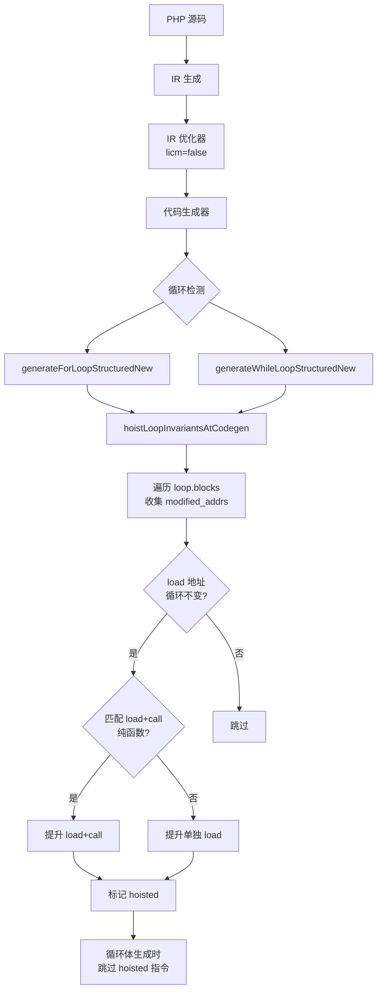
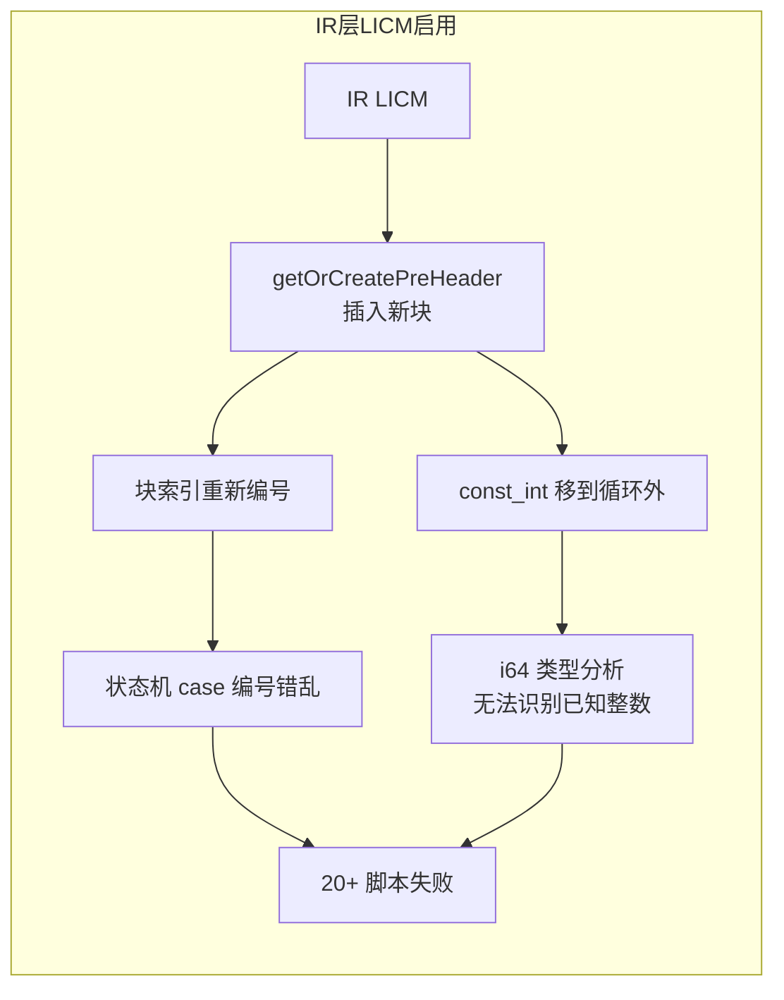

# AOT 代码生成层 LICM 扩展与 IR 层 LICM 根因分析

## 1. 高层摘要（TL;DR）

本轮完成三项工作：
1. **P4 IR 层 LICM 根因定位**：通过 test_063 mergeSort 案例对比 LICM 启用/禁用的生成代码，定位到两个根因——状态机块编号破坏和 i64 快速路径类型分析破坏。IR 层 LICM 保持关闭。
2. **P3 代码生成层 LICM 扩展**：`hoistLoopInvariantsAtCodegen` 从仅支持 `load+call(纯函数)` 相邻对，扩展为也支持单独 `load(循环不变地址)` 提升。同时在 `generateWhileLoopStructuredNew` 中添加 LICM 调用。
3. **P3 修复 modified_addrs 收集缺陷**：原实现只扫描 `header/body_start/increment` 三个块的 store，遗漏了循环体内分支块（if/else/foreach）的 store，导致循环变量 load 被错误提升。修复为遍历 `loop.blocks` 所有块收集 store 目标。

全量回归 114/115 PASS（c045 浮点精度差异忽略），与基线完全一致。

## 2. 影响范围

| 层级 | 模块 | 影响描述 |
|------|------|----------|
| AOT 代码生成 | `native_linker.zig` | LICM 提升逻辑扩展 + modified_addrs 修复 + while 循环 LICM 调用 |
| AOT 优化器 | `optimizer.zig` | LICM 配置保持 `false`（P4 根因未修复） |
| 测试工具 | `scripts/aot_coverage_report.sh` | 新增覆盖率汇总脚本 |

## 3. 核心变更

| 文件 | 变更点 | 描述 |
|------|--------|------|
| `src/aot/native_linker.zig` | `hoistLoopInvariantsAtCodegen` | 重构 load 处理逻辑：先尝试匹配 load+call 对，不匹配时提升单独 load |
| `src/aot/native_linker.zig` | `hoistLoopInvariantsAtCodegen` | modified_addrs 收集从 3 块扩展到 loop.blocks 全部块 |
| `src/aot/native_linker.zig` | `generateWhileLoopStructuredNew` | 添加 `hoistLoopInvariantsAtCodegen` 调用 |
| `scripts/aot_coverage_report.sh` | 新增 | ZIGPHP_AOT_STATS=1 环境变量驱动的覆盖率汇总报告 |

## 4. 可视化概览

### 执行流程

### P4 IR 层 LICM 根因

## 5. 详细变更分析

### 5.1 代码生成层 LICM 扩展

**变更前**：`hoistLoopInvariantsAtCodegen` 只处理 `load(循环不变地址) + call(纯函数)` 相邻指令对。如果 load 后面没有匹配的纯函数 call，load 不会被提升。

**变更后**：
1. 先尝试匹配 `load + call(纯函数)` 序列
2. 如果没有匹配的 call，也提升单独的 `load(循环不变地址)`
3. 在 `generateWhileLoopStructuredNew` 中添加 LICM 调用（原仅 `generateForLoopStructuredNew` 有）

### 5.2 modified_addrs 收集修复

**变更前**：只扫描 `header`, `body_start`, `increment` 三个块的 store 目标。

**问题**：循环体可能包含多个块（if/else/foreach 分支），`array_shift($queue)` 等 store 在分支块中，不在 `body_start` 中。导致 `$node` 的 alloca 不在 `modified_addrs` 中，load `$node` 被错误提升。

**变更后**：遍历 `loop.blocks`（包含所有循环块）收集 store 目标。同时 `loop_blocks`（用于 load 扫描）也包含所有循环体块。

### 5.3 P4 IR 层 LICM 根因分析

通过 test_063 mergeSort 案例对比 LICM 启用/禁用的生成代码：

**根因1：状态机块编号破坏**
- 代码生成器使用状态机模式（`current_block` switch）
- IR 层 LICM 的 `getOrCreatePreHeader` 插入新块后重新编号 block index
- 导致状态机的 case 编号错乱，缺少 `case 3` 等块

**根因2：i64 快速路径类型分析破坏**
- LICM 将 `const_int` 指令移到循环外
- 循环内的类型分析无法识别已知整数寄存器
- 生成代码从 `reg_16 = runtime.Value.initInt(reg_47.asInt() + reg_9.asInt())` 退化为 `reg_16 = if (reg_47.isInt() and reg_9.isInt()) ... else ...`

## 6. 影响与风险评估

- **是否破坏式变更**：否
- **变更影响范围**：AOT 代码生成层循环优化路径
- **需要特别注意的点**：
  - LICM 提升单独 load 时，会生成 `reg_N.release()` + `reg_N = load(...)` 代码在循环前。如果 load 结果在循环内被重新赋值，release 会正确释放旧值。
  - `modified_addrs` 现在遍历所有循环块，性能开销略增（O(循环块数 × 指令数)），但通常循环块数很少。
- **复测路径**：`timeout 600 bash scripts/full_regression_test.sh`

## 7. 遗留问题/潜在问题

1. **P4 IR 层 LICM 未修复**：根因已定位（状态机块编号 + i64 类型分析），但修复需要深入重构代码生成器或修改 LICM 的 `getOrCreatePreHeader`，风险高，列为后续专项任务。
2. **代码生成层 LICM 仅支持 load 提升**：纯算术运算（`.add`/`.sub`/`.mul`）的提升未实现，因为需要处理 `try` 错误传播和引用计数，风险较高。

## 8. 后续开发/优化建议

| 优先级 | 建议 | 影响面 | 落地成本 |
|--------|------|--------|----------|
| P0 | 修复 IR 层 LICM 状态机块编号问题（修改 `getOrCreatePreHeader` 不重新编号，或在代码生成器中适配） | 全局循环优化 | 高 |
| P1 | 代码生成层 LICM 支持纯算术运算提升（`.add`/`.sub`/`.mul`，操作数循环不变） | 循环内算术 | 中 |
| P2 | 覆盖率报告集成到 CI 流程，跟踪 i64 快速路径激活率趋势 | 可观测性 | 低 |
| P2 | LICM 提升统计输出（`ZIGPHP_AOT_STATS=1` 时输出提升的 load/call 数量） | 可观测性 | 低 |
