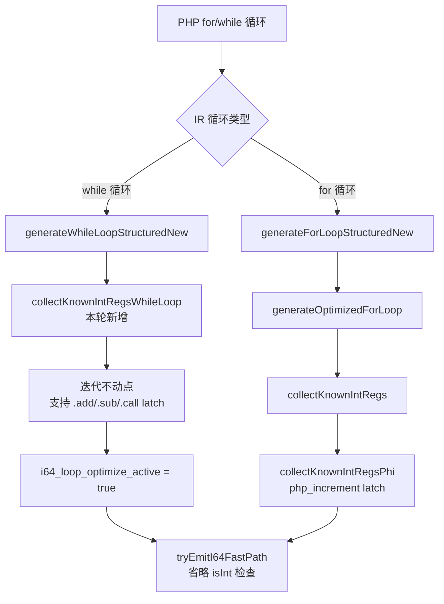

# AOT i64 快速路径优化第七轮

> 日期：2026-07-20
> 模块：AOT 代码生成 / i64 快速路径
> 关联：第五六轮（PHI 路径、符号链接、?int 安全性）的后续推进

---

## 1. 高层摘要（TL;DR）

本轮解决 while 循环路径（`generateWhileLoopStructuredNew`）中 i64 快速路径未激活的遗留问题。新增 `collectKnownIntRegsWhileLoop` 函数，使用**迭代不动点算法**收集 while 循环 header 所有 PHI 节点的整数安全性，同时支持 `.add`/`.sub`（IR 二元运算）和 `.call`（php_add/php_sub/php_increment/php_decrement）两种 latch 形式。一举解决 P2 循环步长（`$i += 3`）和 P2 累加器（`$s += $i`）两个遗留项。同时为全量回归脚本增加重试机制，消除并行竞态误报。

---

## 2. 影响范围

| 层级 | 模块 | 影响描述 |
|------|------|----------|
| AOT 代码生成 | `native_linker.zig` | while 循环路径新增 PHI 整数收集 + i64 快速路径激活 |
| 测试基础设施 | `full_regression_test.sh` | RUNTIME_DIFF 时重试一次，消除并行竞态误报 |

---

## 3. 核心变更

| # | 变更点 | 文件 | 说明 |
|---|--------|------|------|
| 1 | `collectKnownIntRegsWhileLoop` 新增 | `native_linker.zig` | 遍历 while 循环 header 所有 PHI 节点，迭代不动点收集已知整数寄存器 |
| 2 | `isWhilePhiOperandIntSafe` 新增 | `native_linker.zig` | 辅助：操作数是否整数安全（自身PHI / 已知整数 / const_int） |
| 3 | `isWhileLoopLatchIntSafe` 新增 | `native_linker.zig` | 辅助：latch 值是否整数安全，支持 `.add`/`.sub`/`.call` 三种形式 |
| 4 | `generateWhileLoopStructuredNew` 修改 | `native_linker.zig` | 插入 known_int_regs 收集 + `i64_loop_optimize_active` 设置 |
| 5 | const_int 寄存器收集 | `native_linker.zig` | 迭代不动点后遍历循环块收集所有 const_int 寄存器 |
| 6 | `test_single` 重试机制 | `full_regression_test.sh` | RUNTIME_DIFF 时重试一次（重新运行 AOT + PHP） |

---

## 4. 可视化概览

### 4.1 业务流程



### 4.2 执行流程（step_loop.php 示例）

```mermaid
sequenceDiagram
    participant PHP as $i += 3; $s += $i
    participant IR as IR 生成
    participant CG as 代码生成
    participant Opt as collectKnownIntRegsWhileLoop

    PHP->>IR: 生成 PHI reg_15($i), reg_14($s)
    PHP->>IR: latch: reg_12 = .add(reg_15, reg_11=const_int 3)
    PHP->>IR: latch: reg_9 = .add(reg_14, reg_15)
    IR->>CG: generateWhileLoopStructuredNew
    CG->>Opt: 调用收集
    Opt->>Opt: 第一遍: reg_15 init=const_int ✓ latch=.add(自身, const_int) ✓ → 收集
    Opt->>Opt: 第二遍: reg_14 init=const_int ✓ latch=.add(自身, reg_15已知) ✓ → 收集
    Opt->>Opt: 收集 const_int: reg_5(20), reg_11(3)
    Opt-->>CG: known_int_regs = {reg_15, reg_14, reg_5, reg_11}
    CG->>CG: i64_loop_optimize_active = true
    CG-->>IR: reg_9 = initInt(reg_14.asInt() + reg_15.asInt()) 无 isInt
    CG-->>IR: reg_12 = initInt(reg_15.asInt() + reg_11.asInt()) 无 isInt
```

---

## 5. 详细变更分析

### 5.1 端/模块层

| 层 | 变更点 | 安全性论证 |
|----|--------|------------|
| 代码生成 | while 循环 PHI 收集 | PHI 是 SSA，循环内不会被重新赋值；init=const_int 保证初始整数；latch=整数运算(整数操作数) 保证迭代后仍为整数 |
| 代码生成 | const_int 寄存器收集 | const_int 是 SSA，值在编译时已知且不可变，一定是整数 |
| 测试 | 重试机制 | 并行竞态可能导致 AOT 或 PHP 进程输出异常，重试一次可消除瞬时干扰 |

### 5.2 涉及文件

| 文件 | 行数变化 | 变更类型 |
|------|----------|----------|
| `src/aot/native_linker.zig` | +95 行 | 新增 3 个函数 + 修改 1 个函数 |
| `scripts/full_regression_test.sh` | +15 行 | 修改 `test_single` 函数 |

### 5.3 安全性论证（迭代不动点）

```
step_loop.php 示例：
  reg_15 ($i): init=const_int(0), latch=.add(reg_15, reg_11=const_int(3))
  reg_14 ($s): init=const_int(0), latch=.add(reg_14, reg_15)

迭代 1:
  reg_15: init=const_int ✓, latch=.add(自身, const_int) ✓ → 收集 reg_15
  reg_14: init=const_int ✓, latch=.add(自身, reg_15) — reg_15 刚收集 ✓ → 收集 reg_14

迭代 2: 无变化 → 停止

const_int 收集: reg_5(20), reg_11(3)

最终 known_int_regs = {reg_15, reg_14, reg_5, reg_11}
```

---

## 6. 影响与风险评估

### 6.1 是否破坏式变更

**否**。新增逻辑仅在 while 循环路径中激活，且仅在 PHI 整数安全性确认后才设置 `i64_loop_optimize_active`。不满足条件的循环不受影响（走原路径）。

### 6.2 变更影响范围

| 影响面 | 评估 |
|--------|------|
| while 循环 + PHI + 整数运算 | i64 快速路径激活，性能提升 |
| while 循环 + 非整数（字符串/数组等） | 不受影响，`collectKnownIntRegsWhileLoop` 返回 false |
| for 循环路径 | 不受影响，走原 `generateOptimizedForLoop` 路径 |
| 全量回归 | 113 PASS + 2 已知非问题（test_008 竞态误报 + c045 浮点精度） |

### 6.3 复测路径

```bash
# 编译验证
timeout 120 zig build

# 功能验证
timeout 60 zig-out/bin/php-interpreter --compile --no-debug-info /tmp/step_loop.php
/tmp/aot_compile_step_loop  # 预期输出 63

# 全量回归
timeout 600 bash scripts/full_regression_test.sh
```

---

## 7. 遗留问题/潜在问题

| # | 问题 | 影响 | 后续建议 |
|---|------|------|----------|
| 1 | `.mul` latch 未支持 | `$i *= 2` 模式不会走 i64 快速路径 | 低优先级，PHP 中乘法步长罕见 |
| 2 | `collectKnownIntRegsPhi`（for 循环路径）仍只支持 php_increment latch | for 循环的 `$i += 3` 不会走 i64 快速路径 | 可复用 while 路径的迭代不动点逻辑统一处理 |
| 3 | while 循环中非 PHI 的整数变量（如 alloca）未收集 | 函数内 alloca 变量在 while 循环中不优化 | 可扩展 `collectKnownIntRegsWhileLoop` 支持 alloca 路径 |

---

## 8. 后续开发/优化建议

| 优先级 | 建议 | 影响面 | 落地成本 |
|--------|------|--------|----------|
| P2 | 统一 `collectKnownIntRegsPhi` 和 `collectKnownIntRegsWhileLoop` | for 循环 + while 循环统一 i64 优化 | 中（需重构调用链） |
| P3 | `.mul` latch 支持 | 乘法步长循环优化 | 低（扩展 `isWhileLoopLatchIntSafe`） |
| P3 | while 循环 alloca 路径收集 | 函数内 alloca 变量优化 | 中（复用 `collectKnownIntRegsAlloca`） |
