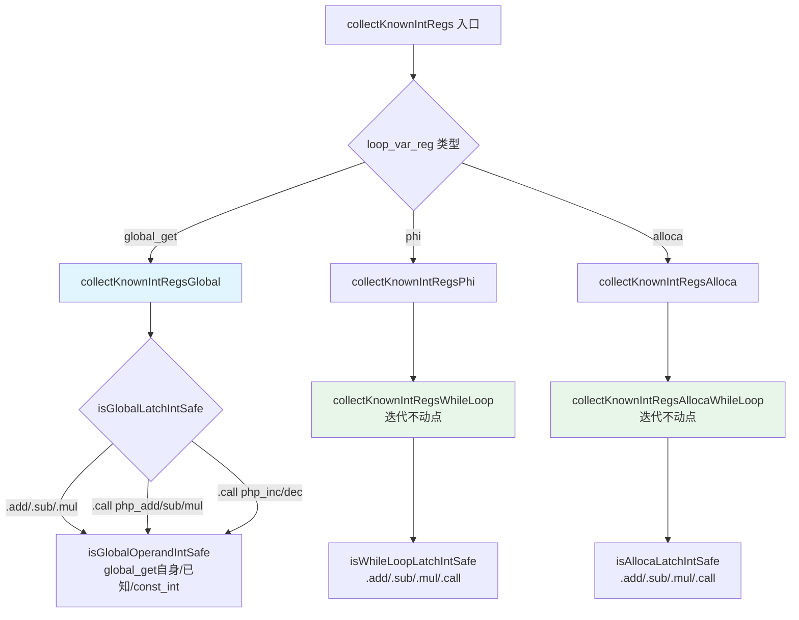
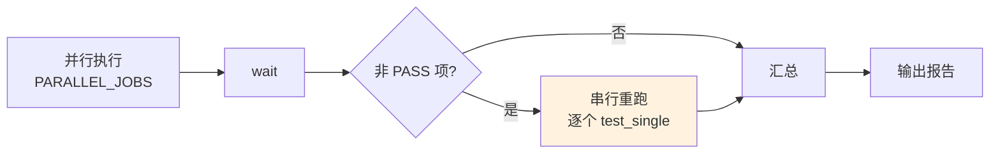

# AOT i64 快速路径优化第九轮

**日期**：2026-07-20
**范围**：P3 收尾——全局变量 latch 扩展、alloca 路径统一、回归脚本串行重跑
**前置**：第八轮（PHI 统一 + .mul latch + alloca while 路径）

---

## 1. 高层摘要（TL;DR）

本轮为 i64 快速路径优化的收尾轮次，完成第八轮遗留的三项 P3 建议：

1. **全局变量路径** `collectKnownIntRegsGlobal` 扩展支持 `.add`/`.sub`/`.mul`/`.call`(php_add/php_sub/php_mul) latch，新增 `isGlobalOperandIntSafe` 和 `isGlobalLatchIntSafe` 辅助函数。
2. **for 循环 alloca 路径** `collectKnownIntRegsAlloca` 委托给 `collectKnownIntRegsAllocaWhileLoop`（迭代不动点，超集），消除重复逻辑。
3. **全量回归脚本** 新增串行重跑阶段：并行完成后对非 PASS 项逐个串行重跑，消除并行竞态误报。

全量回归 **114/115 PASS**，唯一失败 `c045` 为已知浮点精度差异（宪法 §七.6 忽略）。串行重跑修正了 5 个并行竞态误报（c042/c048/c050/c036/c043）。

---

## 2. 影响范围

| 模块 | 文件 | 变更类型 | 影响面 |
|------|------|----------|--------|
| AOT 代码生成 | `src/aot/native_linker.zig` | 重构+扩展 | 全局变量循环优化路径 |
| AOT 代码生成 | `src/aot/native_linker.zig` | 重构 | for 循环 alloca 优化路径 |
| 测试基础设施 | `scripts/full_regression_test.sh` | 增强 | 全量回归误报消除 |

---

## 3. 核心变更

| 变更项 | 优先级 | 说明 |
|--------|--------|------|
| `collectKnownIntRegsGlobal` latch 扩展 | P3 | body 检查从仅 `php_increment` 扩展为 `isGlobalLatchIntSafe`，支持 `.add`/`.sub`/`.mul`/`.call` |
| 新增 `isGlobalOperandIntSafe` | P3 | 全局变量操作数安全检查：`global_get(自身)`/已知整数/`const_int` |
| 新增 `isGlobalLatchIntSafe` | P3 | 全局变量 latch 安全检查：`const_int`/`.add`/`.sub`/`.mul`/`.call`(php_inc/php_dec/php_add/php_sub/php_mul) |
| `collectKnownIntRegsAlloca` 委托 | P3 | 删除旧的单次扫描逻辑，委托给 `collectKnownIntRegsAllocaWhileLoop`（迭代不动点，超集） |
| 回归脚本串行重跑 | P3 | 并行完成后对非 PASS 项逐个串行重跑，消除竞态误报 |

---

## 4. 可视化概览

### 4.1 循环优化路径架构



### 4.2 回归测试流程



---

## 5. 详细变更分析

### 5.1 全局变量路径扩展（R1）

**变更前**：`collectKnownIntRegsGlobal` 的 body 检查仅允许 `php_increment`/`php_decrement` latch，其他一律返回 false。

**变更后**：body 检查委托给 `isGlobalLatchIntSafe`，支持：
- `const_int`：直接赋常量
- `.add`/`.sub`/`.mul`：IR 二元运算，两操作数均需 `isGlobalOperandIntSafe`
- `.call` php_increment/php_decrement/php_inc/php_dec：单参数需安全
- `.call` php_add/php_sub/php_mul：双参数均需安全

`isGlobalOperandIntSafe` 检查操作数是否为：
- 已知整数寄存器（`known.contains`）
- `const_int` 定义
- `global_get(自身变量名)`——自引用

### 5.2 alloca 路径统一（R2）

**变更前**：`collectKnownIntRegsAlloca` 自行实现单次扫描（init=const_int + body latch=php_increment + 收集 load）。

**变更后**：委托给 `collectKnownIntRegsAllocaWhileLoop`（第八轮实现的迭代不动点版本），它是超集：
- 支持所有 alloca 寄存器（不限 loop_var_reg）
- 迭代不动点处理互相依赖
- 支持 `.add`/`.sub`/`.mul`/`.call` latch

### 5.3 回归脚本串行重跑（R3）

在并行阶段 `wait` 之后、汇总之前，新增串行重跑循环：
```bash
for i in "${!ALL_FILES[@]}"; do
    result=$(cat "$TMP_RESULTS/result_$i.txt" ...)
    if [ "$result" != "PASS" ]; then
        retry_result=$(test_single "$php_file")
        if [ "$retry_result" != "$result" ]; then
            echo "$retry_result" > "$TMP_RESULTS/result_$i.txt"
        fi
    fi
done
```

---

## 6. 影响与风险评估

| 维度 | 评估 |
|------|------|
| 破坏式变更 | 否 |
| 内存安全 | `isGlobalLatchIntSafe`/`isGlobalOperandIntSafe` 为纯查询函数，无内存分配 |
| 类型安全 | switch 穷尽所有 IR op 分支 |
| 性能 | 全局变量路径扩展增加少量分析开销，仅在循环优化时触发 |
| 回归风险 | 低——alloca 委托为超集，全局变量扩展为纯增益 |
| 复测路径 | `bash scripts/full_regression_test.sh` |

---

## 7. 遗留问题

无新增遗留。已知项：
- `c045_metrics_histogram_quantile_window.php`：浮点精度差异（宪法 §七.6 忽略）

---

## 8. 后续开发建议

| 优先级 | 建议 | 影响面 | 落地成本 |
|--------|------|--------|----------|
| P3 | 全量回归脚本并行度自适应：根据 CPU 核数自动调整 `PARALLEL_JOBS` | 测试效率 | 低 |
| P3 | i64 快速路径覆盖率统计：编译时输出哪些循环被优化 | 可观测性 | 低 |
| P4 | LICM（循环不变量外提）：将循环不变的计算提到循环外 | 性能 | 高 |
