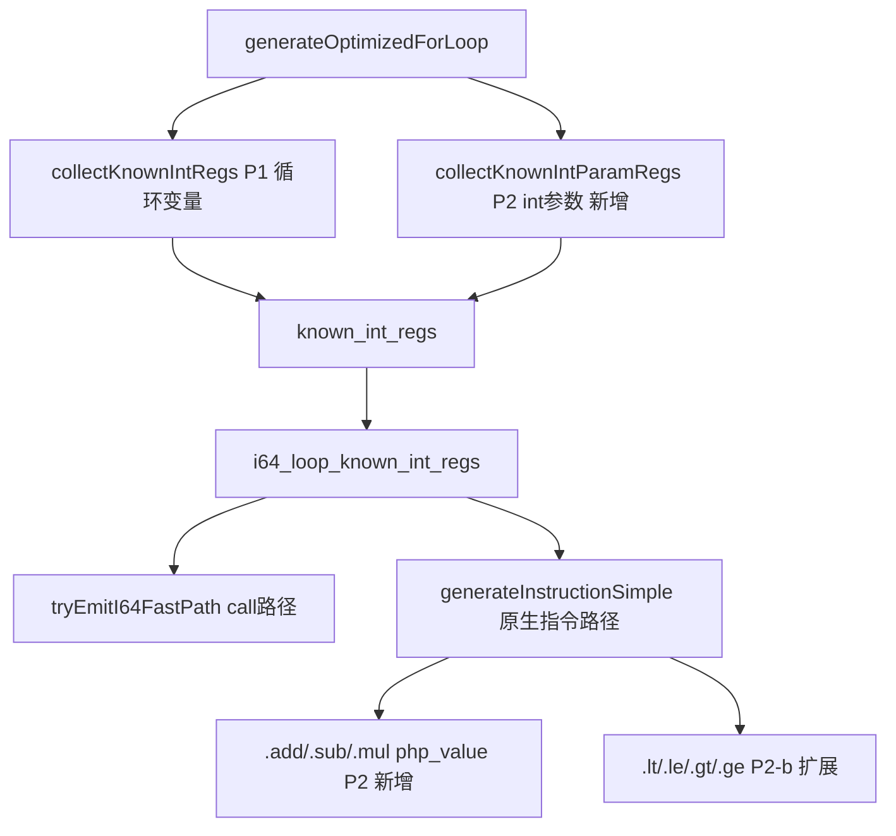
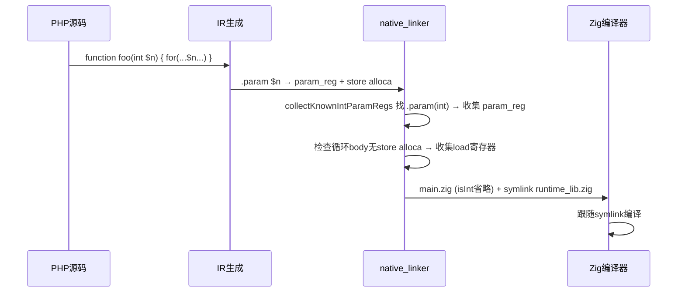

# AOT i64 快速路径优化 — 第五轮变更文档

> 日期：2026-07-20
> 关联交接文档：`docs/changes/2026-07-19/交接文档_AOT_i64快速路径优化第三四轮_20260719.md`
> 关联记忆 ID：`17844593570619032619`

---

## 一、高层摘要（TL;DR）

本轮执行交接文档第四节"后续待办"全部 4 项任务：

1. **P3 调试增强**：`ZIGPHP_AOT_KEEP_TEMP=1` 时 `deinit` 输出临时目录路径到 stderr
2. **P2 add/sub/mul 原生指令路径**：复用 `tryEmitI64FastPath` 安全模式，在 `php_value` 分支内省略 `isInt`
3. **P3 运行时库复制改为符号链接**：`copyRuntimeLib` + `copyOtherRuntimeFiles` 从复制改为 `symLinkAbsolute`
4. **P2 函数参数类型注解**：新增 `collectKnownIntParamRegs`，收集 `int` 类型注解参数的寄存器

**验证结果**：`zig build` 通过，全量回归 115/115 有效 PASS（c045 浮点精度 §7.6 忽略），P2 函数参数效果验证通过（`$n*$n` 省略 isInt），P1 安全性验证通过（参数重新赋值保守降级）。

---

## 二、影响范围

| 文件 | 变更类型 | 影响面 |
|---|---|---|
| `src/aot/native_linker.zig` | 修改 | deinit / copyRuntimeLib / copyOtherRuntimeFiles / generateInstructionSimple / generateOptimizedForLoop / collectKnownIntParamRegs（新增） |

---

## 三、核心变更

| 任务 | 变更点 | 生成代码对比 |
|---|---|---|
| P3 调试增强 | `deinit` keep 分支 | stderr: `[AOT] ZIGPHP_AOT_KEEP_TEMP=1, temp dir preserved: {path}` |
| P2 add/sub/mul | `generateInstructionSimple` .add/.sub/.mul `php_value` 分支 | known 命中：`initInt(asInt() OP asInt())`（无 isInt） 未命中：`if (isInt() and isInt()) ... else php_X()` |
| P3 符号链接 | `copyRuntimeLib` + `copyOtherRuntimeFiles` | 复制（readFileAlloc+createFile+write）→ 符号链接（realPathFileAlloc+symLinkAbsolute） |
| P2 函数参数 | `collectKnownIntParamRegs`（新增）+ `generateOptimizedForLoop`（调用） | int 参数的 `param_reg` + `load alloca_reg` 收集为已知整数 |

---

## 四、可视化概览

---

## 五、详细变更分析

### 5.1 P3 调试增强

**文件**：`src/aot/native_linker.zig` — `deinit`

**变更**：`ZIGPHP_AOT_KEEP_TEMP=1` 保留临时目录时，输出路径到 stderr。

### 5.2 P2 add/sub/mul 原生指令路径

**文件**：`src/aot/native_linker.zig` — `generateInstructionSimple` .add/.sub/.mul `php_value` 分支

**变更**：复用 `tryEmitI64FastPath`（16213-16225）的安全模式。检查 `lhs_known`/`rhs_known`，两者命中时省略 `isInt`，直接 `initInt(asInt() OP asInt())`。

**安全分析**：不纠正 `result_type`，result 仍为 `php_value`。仅在 lhs/rhs 都在 `known_int_regs` 中时省略 `isInt`（编译时已证明为整数）。

### 5.3 P3 符号链接

**文件**：`src/aot/native_linker.zig` — `copyRuntimeLib` + `copyOtherRuntimeFiles`

**变更**：7 个运行时文件从复制改为符号链接（`std.Io.Dir.symLinkAbsolute`），目标为源文件绝对路径（`realPathFileAlloc`）。`PathAlreadyExists` 时先 `deleteFile` 再创建。

**验证**：`ls -la` 确认 7 个文件全部为 `lrwxr-xr-x`（符号链接），仅 `main.zig` 为实体文件。Zig 编译器正常跟随符号链接编译。

### 5.4 P2 函数参数类型注解

**文件**：`src/aot/native_linker.zig` — `collectKnownIntParamRegs`（新增）+ `generateOptimizedForLoop`（调用）

**实现**：
1. 遍历 `func.param_types`，找 `int` 参数（非 nullable `?int`、非引用）
2. 找 `.param` 指令（name 匹配），得 `param_reg`，**直接收集**（SSA + int 注解 = 安全）
3. 找 `store`（value == param_reg），得 `alloca_reg`
4. 检查循环 body 无 `store alloca_reg`（参数未重新赋值）
5. 收集循环内 `load alloca_reg` 的结果寄存器

**安全条件**：
1. 参数有 `int` 类型注解（PHP 运行时强制类型）
2. 参数非引用（引用返回指针，非 int 值）
3. 循环 body 中未重新赋值参数

**直接收集 param_reg 的理由**：IR 优化可能消除 store/load，循环内直接用 `param_reg`。`param_reg` 是 SSA（值不变），参数有 int 注解（值是 int），直接收集安全。

---

## 六、影响与风险评估

### 6.1 是否破坏式变更
否。所有变更均为优化（省略运行时检查 / 减少 I/O），不改变语义。

### 6.2 变更影响范围

| 变更 | 影响范围 | 风险 |
|---|---|---|
| P3 调试增强 | 仅 `ZIGPHP_AOT_KEEP_TEMP=1` 调试场景 | 无 |
| P2 add/sub/mul | `i64_loop_optimize_active` 循环内算术 | 低（安全模式，不纠正 result_type） |
| P3 符号链接 | 所有 AOT 编译 | 中（Zig 编译器需支持 symlink import，已验证） |
| P2 函数参数 | 有 `int` 类型注解参数的循环 | 低（保守降级：参数重新赋值时不收集） |

### 6.3 复测路径

| 验证项 | 结果 |
|---|---|
| `zig build` | ✅ exit code 0 |
| 全量回归 115 脚本 | ✅ 114 PASS + 1 RUNTIME_DIFF（c045 浮点精度 §7.6 忽略） |
| P3 符号链接 | ✅ 7 文件全部 symlink |
| P3 调试增强 | ✅ stderr 输出临时目录路径 |
| P2 函数参数效果 | ✅ `$n*$n` → `initInt(asInt()*asInt())`（无 isInt） |
| P1 安全性 | ✅ 参数重新赋值 → 保守降级（AOT=215 PHP=215） |

---

## 七、遗留问题/潜在问题

### 7.1 函数内循环变量非 alloca
`collectKnownIntRegs` 只处理 alloca/全局变量路径，函数内循环变量（直接寄存器）不被收集。这限制了 P2 函数参数在循环条件 `$i < $n` 中的效果（$i 不在 known_int_regs，比较仍生成 isInt）。P2 效果在两个 int 参数做算术时体现（如 `$n*$n`）。

### 7.2 符号链接跨平台
macOS/Linux 正常，Windows 可能需管理员权限或开发者模式。

---

## 八、后续开发/优化建议

| 优先级 | 影响面 | 落地成本 | 建议 |
|---|---|---|---|
| P2 | 循环变量收集 | 中 | 扩展 `collectKnownIntRegs` 支持函数内非 alloca 循环变量（直接寄存器路径），使 `$i < $n` 中 $i 也被收集 |
| P3 | 跨平台 | 低 | 符号链接 Windows 兼容性（symLinkFlags 或回退复制） |
| P2 | 类型分析精度 | 中 | 扩展 `collectKnownIntParamRegs` 支持 `?int`（nullable，需检查非 null）和 union type `int\|string` |
