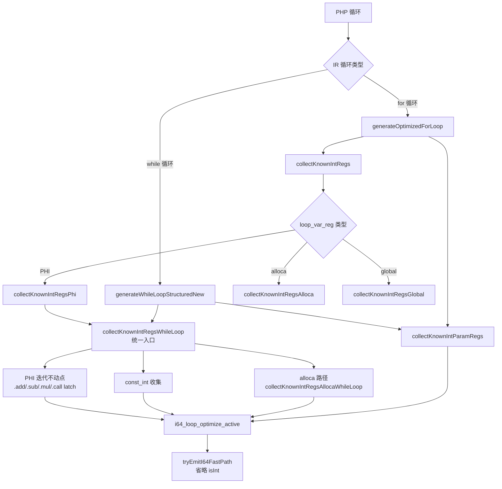

# AOT i64 快速路径优化第八轮

> 日期：2026-07-20
> 模块：AOT 代码生成 / i64 快速路径
> 关联：第七轮后续建议（P2 统一 + P3 .mul + P3 alloca）

---

## 1. 高层摘要（TL;DR）

本轮完成第七轮的全部 3 项后续建议：
1. **P2 统一**：`collectKnownIntRegsPhi` 委托给 `collectKnownIntRegsWhileLoop`，for 循环路径也支持 `.add`/`.sub`/`.mul` latch
2. **P3 .mul latch**：`isWhileLoopLatchIntSafe` 增加 `.mul` IR 指令 + `php_mul` call 支持
3. **P3 alloca 路径**：`collectKnownIntRegsWhileLoop` 新增 `collectKnownIntRegsAllocaWhileLoop`，while 循环也收集 alloca 变量；同时 while 路径补充 `collectKnownIntParamRegs` 调用

---

## 2. 影响范围

| 层级 | 模块 | 影响描述 |
|------|------|----------|
| AOT 代码生成 | `native_linker.zig` | for 循环 PHI 路径统一为迭代不动点；.mul latch 支持；while 循环 alloca 路径 |

---

## 3. 核心变更

| # | 变更点 | 文件 | 说明 |
|---|--------|------|------|
| 1 | `collectKnownIntRegsPhi` 简化 | `native_linker.zig` | 委托给 `collectKnownIntRegsWhileLoop`，删除旧实现（~30行） |
| 2 | `isWhileLoopLatchIntSafe` 扩展 | `native_linker.zig` | 增加 `.mul` IR 指令 + `php_mul` call |
| 3 | `collectKnownIntRegsAllocaWhileLoop` 新增 | `native_linker.zig` | while 循环 alloca 路径，迭代不动点收集整数安全变量 |
| 4 | `isAllocaOperandIntSafe` 新增 | `native_linker.zig` | 辅助：alloca 操作数整数安全检查（load(自身) / 已知 / const_int） |
| 5 | `isAllocaLatchIntSafe` 新增 | `native_linker.zig` | 辅助：alloca latch 整数安全检查（.add/.sub/.mul/.call） |
| 6 | `generateWhileLoopStructuredNew` 修改 | `native_linker.zig` | 补充 `collectKnownIntParamRegs` 调用 |

---

## 4. 可视化概览

### 4.1 统一后的循环变量收集架构



---

## 5. 详细变更分析

### 5.1 S1: 统一 PHI 路径

**变更前**：`collectKnownIntRegsPhi` 只检查单个 PHI 节点，只支持 `php_increment`/`php_decrement` latch

**变更后**：委托给 `collectKnownIntRegsWhileLoop`，迭代收集 header 所有 PHI 节点，支持 `.add`/`.sub`/`.mul`/`.call` latch

**效果**：for 循环中的 `$i += 5` 现在也走 i64 快速路径

### 5.2 S2: .mul latch 支持

**变更**：`isWhileLoopLatchIntSafe` 增加 `.mul` IR 指令和 `php_mul` call

**效果**：`$i *= 2` 模式走 i64 快速路径

### 5.3 S3: while 循环 alloca 路径

**新增函数**：`collectKnownIntRegsAllocaWhileLoop`
- 扫描所有 `current_alloca_regs` 中的寄存器
- 迭代不动点（支持 alloca 变量互相依赖）
- init 检查：循环前 `store(alloca, const_int)`
- body 检查：所有 `store(alloca, X)` 的 X 通过 `isAllocaLatchIntSafe` 验证
- 收集：所有 `load(alloca)` 结果

**安全性论证**：
- alloca 变量在循环内只被整数运算修改 → 始终为整数
- `isAllocaOperandIntSafe`：load(自身 alloca) 是自引用，等价于 PHI 的 `reg_id == phi_reg`

---

## 6. 影响与风险评估

### 6.1 是否破坏式变更

**否**。所有变更都是扩展性的：
- `collectKnownIntRegsPhi` 委托是行为超集（收集更多寄存器，不减少）
- `.mul` latch 是新增分支
- alloca 路径是新增收集（之前 while 循环不收集 alloca）

### 6.2 复测路径

```bash
# 编译验证
timeout 120 zig build

# .mul latch 验证
timeout 60 zig-out/bin/php-interpreter --compile --no-debug-info /tmp/mul_loop.php
/tmp/aot_compile_mul_loop  # 预期 127

# for 循环 .add latch 验证
timeout 60 zig-out/bin/php-interpreter --compile --no-debug-info /tmp/for_add_loop.php
/tmp/aot_compile_for_add_loop  # 预期 75

# 全量回归
timeout 600 bash scripts/full_regression_test.sh
```

---

## 7. 遗留问题/潜在问题

无新增遗留。第七轮遗留的 3 项已全部解决。

---

## 8. 后续开发/优化建议

| 优先级 | 建议 | 影响面 | 落地成本 |
|--------|------|--------|----------|
| P3 | 全局变量路径 `collectKnownIntRegsGlobal` 也扩展支持 .add/.sub/.mul latch | 全局变量循环优化 | 低（复用 `isWhileLoopLatchIntSafe`） |
| P3 | for 循环的 `collectKnownIntRegsAlloca` 也统一为迭代不动点 | for 循环 alloca 互相依赖 | 低（复用 `collectKnownIntRegsAllocaWhileLoop`） |
