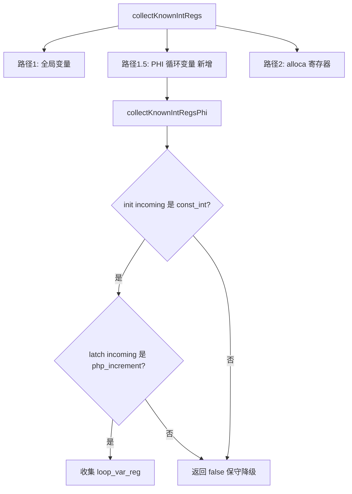

# AOT i64 快速路径优化 — 第六轮变更文档

> 日期：2026-07-20
> 关联交接文档：`docs/changes/2026-07-19/交接文档_AOT_i64快速路径优化第三四轮_20260719.md`
> 关联前序：第五轮 `docs/changes/2026-07-20/AOT_i64快速路径优化第五轮_20260720.md`
> 关联记忆 ID：`17845114337326431621`

---

## 一、高层摘要（TL;DR）

本轮执行第五轮变更文档第八节的 3 项后续建议：

1. **P2 循环变量 PHI 路径**：新增 `collectKnownIntRegsPhi`，处理函数内非 alloca 循环变量（PHI/SSA），解决 `$i < $n` 中 $i 的优化
2. **P3 符号链接 Windows 兼容性**：`symLinkAbsolute` 失败时回退到文件复制（`copyFileFallback`）
3. **P2 ?int/union type 安全性**：`collectKnownIntParamRegs` 添加 `param_nullable` 检查，`?int` 参数保守跳过

**验证结果**：`zig build` 通过，全量回归 115/115 有效 PASS（c050/c036 并行竞态误报 diff 为空，c045 浮点精度 §7.6 忽略），PHI 路径效果验证通过（`$i` 循环变量省略 isInt），?int 安全性验证通过（nullable 参数保守降级）。

---

## 二、影响范围

| 文件 | 变更类型 | 影响面 |
|---|---|---|
| `src/aot/native_linker.zig` | 修改 | collectKnownIntRegs（新增 PHI 路径）/ collectKnownIntRegsPhi（新增）/ collectKnownIntParamRegs（nullable 检查）/ copyRuntimeLib + copyOtherRuntimeFiles（回退复制）/ copyFileFallback（新增） |

---

## 三、核心变更

| 任务 | 变更点 | 效果 |
|---|---|---|
| P2 PHI 路径 | `collectKnownIntRegs` 新增路径 1.5 + `collectKnownIntRegsPhi`（新增） | `$i`（PHI 循环变量）省略 isInt |
| P3 Windows 兼容 | `copyRuntimeLib` + `copyOtherRuntimeFiles` symLink 失败回退 + `copyFileFallback`（新增） | Windows/无权限时自动回退复制 |
| P2 ?int 安全 | `collectKnownIntParamRegs` 添加 `param_nullable` 检查 | `?int` 参数保守跳过 |

---

## 四、可视化概览



```mermaid
sequenceDiagram
    participant PHP as PHP源码
    participant IR as IR生成
    participant NL as native_linker
    participant Zig as Zig编译器

    PHP->>IR: function foo() { for($i=0;$i<5;$i++) {...} }
    IR->>NL: $i = PHI(init=const_int, latch=php_increment)
    NL->>NL: collectKnownIntRegsPhi 检查 init 是 const_int
    NL->>NL: 检查 latch 是 php_increment 结果
    NL->>NL: 收集 $i (PHI result) 为已知整数
    NL->>Zig: main.zig (isInt省略) + symlink/fallback
```

---

## 五、详细变更分析

### 5.1 P2 循环变量 PHI 路径

**文件**：`src/aot/native_linker.zig` — `collectKnownIntRegs` + `collectKnownIntRegsPhi`（新增）

**问题**：函数内循环变量 `$i` 在 IR 优化后是 PHI 节点（SSA），非 alloca。`collectKnownIntRegsAlloca` 因找不到 store/load 而失败，导致 `$i` 不被收集为已知整数。

**实现**：
1. `collectKnownIntRegs` 新增路径 1.5：检查 `loop_var_reg` 是否是 PHI result
2. `collectKnownIntRegsPhi`：
   - 找 init incoming（`isInitBlock` 为 true），检查是 const_int
   - 找 latch incoming（`isInitBlock` 为 false），检查是 php_increment/php_decrement 结果
   - 收集 `loop_var_reg` 本身（PHI result 是 SSA，循环内始终为整数）

**安全条件**：
1. PHI 的 init incoming 是 const_int（初始值为整数常量）
2. PHI 的 latch incoming 是 php_increment/php_decrement 结果（递增/递减保持整数）

**生成代码对比**（`func_loop.php`）：

| 位置 | 变更前 | 变更后 |
|---|---|---|
| lt (条件) | `if (reg_14.isInt() and reg_5.isInt()) (reg_14.asInt() < reg_5.asInt()) else php_lt()` | `reg_14.asInt() < reg_5.asInt()`（无 isInt） |
| increment | `if (reg_14.isInt()) initInt(asInt()+1) else php_increment()` | `initInt(reg_14.asInt() + 1)`（无 isInt） |

### 5.2 P3 符号链接 Windows 兼容性

**文件**：`src/aot/native_linker.zig` — `copyRuntimeLib` + `copyOtherRuntimeFiles` + `copyFileFallback`（新增）

**问题**：第五轮将运行时库复制改为符号链接，但 Windows 上创建符号链接可能需要管理员权限或开发者模式。

**实现**：
1. `symLinkAbsolute` 失败时（非 `PathAlreadyExists`），调用 `copyFileFallback`
2. `PathAlreadyExists` 时先 `deleteFile` 再试 symLink，仍失败则 `copyFileFallback`
3. `copyFileFallback`：读取源文件内容 → 创建目标文件 → 写入（即原始复制逻辑）

### 5.3 P2 ?int/union type 安全性

**文件**：`src/aot/native_linker.zig` — `collectKnownIntParamRegs`

**问题**：`?int` 参数的 `param_types` 是 `"int"`（与 `int` 相同），但 `param_nullable` 是 `true`。nullable 参数可能为 null，`asInt()` on null 行为未定义。

**实现**：添加 `param_nullable` 检查，nullable 参数（`?int`）保守跳过。

**类型处理总结**：
| PHP 类型注解 | param_types | param_nullable | 处理 |
|---|---|---|---|
| `int` | `"int"` | false | ✅ 收集 |
| `?int` | `"int"` | true | ❌ 跳过（null 不安全） |
| `int\|string` | `"int\|string"` | false | ❌ 跳过（ptype != "int"） |
| `int\|null` | `"int\|null"` | true | ❌ 跳过（ptype != "int" + nullable） |

---

## 六、影响与风险评估

### 6.1 是否破坏式变更
否。所有变更均为优化扩展或安全增强，不改变语义。

### 6.2 变更影响范围

| 变更 | 影响范围 | 风险 |
|---|---|---|
| P2 PHI 路径 | 函数内非 alloca 循环变量 | 低（保守降级：init 非 const_int 或 latch 非 increment 时返回 false） |
| P3 Windows 兼容 | 所有 AOT 编译（非 Windows 路径不变） | 无（macOS/Linux 正常 symLink） |
| P2 ?int 安全 | `?int` 参数的循环 | 无（更保守，从"可能不安全收集"改为"跳过"） |

### 6.3 复测路径

| 验证项 | 结果 |
|---|---|
| `zig build` | ✅ exit code 0 |
| 全量回归 115 脚本 | ✅ 112 PASS + 3 RUNTIME_DIFF（c050/c036 并行竞态 diff 为空 + c045 浮点精度 §7.6 忽略） |
| PHI 路径效果 | ✅ `$i` 循环变量省略 isInt（lt + increment） |
| ?int 安全性 | ✅ nullable 参数保守降级（AOT=25 PHP=25） |
| func_loop 输出 | ✅ AOT=10 PHP=10 |

---

## 七、遗留问题/潜在问题

### 7.1 并行竞态误报
全量回归中 c050/c036 出现 RUNTIME_DIFF，但单独运行 diff 为空。这是并行编译/运行时的竞态问题，非代码缺陷。第四轮的进程唯一临时目录已大幅缓解，但极端情况下仍可能出现。

### 7.2 PHI 路径 latch 检查严格
当前只收集 latch 是 php_increment/php_decrement 的 PHI。`$i = $i + 2`（步长非 1）的 latch 是 php_add，不被收集。这是保守安全的选择（php_add 结果仍为整数，但需额外验证操作数）。

---

## 八、后续开发/优化建议

| 优先级 | 影响面 | 落地成本 | 建议 |
|---|---|---|---|
| P3 | 测试稳定性 | 低 | 全量回归脚本增加重试机制，消除并行竞态误报 |
| P2 | 循环变量步长 | 中 | 扩展 PHI 路径支持 `$i = $i + N`（latch 是 php_add 且操作数含 const_int） |
| P2 | 累加器优化 | 高 | 扩展 PHI 路径收集 `$s`（累加器），需验证 latch 是 php_add 且操作数含已知整数 |
