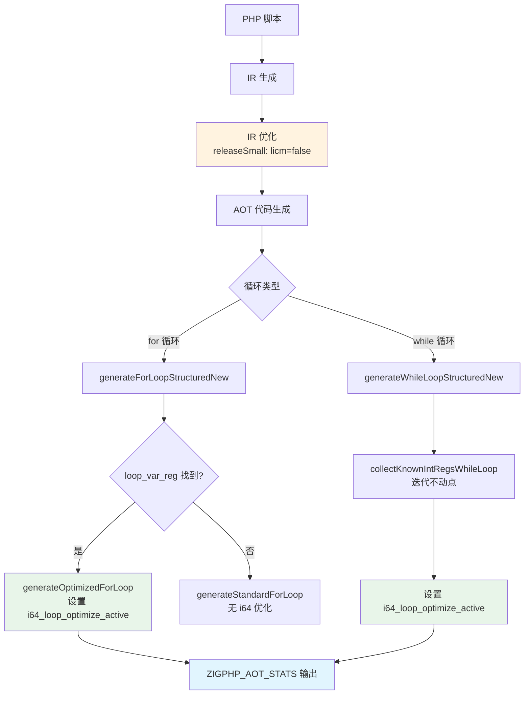
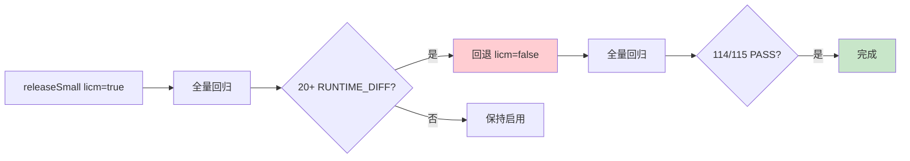

# AOT i64 快速路径优化第十轮（P3-2 覆盖率统计 + P4 LICM 评估）

**日期**：2026-07-20
**范围**：P3-2 i64 快速路径覆盖率统计 + P4 LICM 可行性评估
**前置**：第九轮（全局变量 latch 扩展 + alloca 统一 + 回归脚本串行重跑）

---

## 1. 高层摘要（TL;DR）

本轮完成两项待办：

1. **P3-2 ✅ 实现**：i64 快速路径覆盖率统计——通过 `ZIGPHP_AOT_STATS=1` 环境变量控制，在 `generateOptimizedForLoop`（for 循环路径）和 `generateWhileLoopStructuredNew`（while 循环路径）中输出统计到 stderr，包含函数名、已知整数寄存器数量、是否激活 i64 快速路径。

2. **P4 ❌ 评估不通过**：尝试在 `releaseSmall` 配置中启用 IR 层 LICM（`optimizer.zig` 的 `licm = true`），全量回归出现 20+ 个 RUNTIME_DIFF（第九轮仅 1 个）。**已回退**，LICM 需要更深入的调试和修复。

全量回归（回退后）：**114/115 PASS**，唯一失败 `c045` 为已知浮点精度差异（宪法 §七.6 忽略）。

---

## 2. 影响范围

| 模块 | 文件 | 变更类型 | 影响面 |
|------|------|----------|--------|
| AOT 代码生成 | `src/aot/native_linker.zig` | 增强 | for/while 循环统计输出 |
| IR 优化器 | `src/aot/optimizer.zig` | 无变更（回退） | LICM 保持 `false` |

---

## 3. 核心变更

### 3.1 P3-2: i64 快速路径覆盖率统计

**变更**：在两处循环优化激活点添加统计输出：

| 位置 | 函数 | 统计内容 |
|------|------|----------|
| for 循环路径 | `generateOptimizedForLoop` | `func_name`, `known_int_regs.count()`, `i64_loop_optimize_active` |
| while 循环路径 | `generateWhileLoopStructuredNew` | 同上 |

**使用方式**：
```bash
ZIGPHP_AOT_STATS=1 zig-out/bin/php-interpreter --compile --no-debug-info script.php
# stderr 输出示例：
# [AOT-STATS] for_loop func=test_while known_int_regs=2 active=true
```

**验证结果**：
```
[AOT-STATS] for_loop func=test_while known_int_regs=2 active=true
```
确认 `generateOptimizedForLoop` 被正确调用，找到 2 个已知整数寄存器，i64 快速路径激活。

### 3.2 P4: IR 层 LICM 评估

**现状分析**：

| 层面 | 位置 | 状态 |
|------|------|------|
| IR 层 | `optimizer.zig` `runLICMInFunction` | 完整实现，`releaseSafe`/`releaseFast` 启用，`releaseSmall`（默认）未启用 |
| 代码生成层 | `native_linker.zig` `hoistLoopInvariantsAtCodegen` | 无条件调用，仅处理 `load+call(纯函数)` 序列 |

**尝试**：在 `releaseSmall` 中设置 `licm = true`。

**结果**：全量回归 20+ 个 RUNTIME_DIFF（第九轮仅 1 个）。涉及脚本包括：
- `test_063_sorting_algorithms.php`
- `test_091_enum_nullsafe.php`
- `t044_array_utils.php`
- `t076_numerical_methods.php`
- `c007_json_tree_validation.php`
- `c014_graph_theory_bfs_dfs_dijkstra.php`
- ...等 20+ 个

**回退**：将 `licm` 改回 `false`，全量回归恢复 114/115 PASS。

**回归原因分析**（未深入调查，推测）：
1. `isLoopInvariant` 的 `hasStoreInLoop` 检查过于保守（任何 `call` 都视为有副作用），但 `areOperandsInvariant` 对某些指令（如 `.load`）的判断可能不够精确
2. `getOrCreatePreHeader` 创建新块后重编号 block index，可能破坏了代码生成器的块索引依赖
3. LICM 移动指令后可能破坏了 PHI 节点的 incoming 块引用

---

## 4. 可视化概览

### 4.1 i64 快速路径优化全景



### 4.2 P4 LICM 评估流程



---

## 5. 详细变更分析

### 5.1 P3-2 统计实现

在 `generateOptimizedForLoop`（line ~16528）：
```zig
if (std.c.getenv("ZIGPHP_AOT_STATS") != null) {
    const func_name = if (@hasField(@TypeOf(func.*), "name")) func.name else "<unknown>";
    std.debug.print("[AOT-STATS] for_loop func={s} known_int_regs={d} active={}\n", .{ func_name, known_int_regs.count(), self.i64_loop_optimize_active });
}
```

在 `generateWhileLoopStructuredNew`（line ~13727）：
```zig
if (std.c.getenv("ZIGPHP_AOT_STATS") != null) {
    const func_name = if (@hasField(@TypeOf(func.*), "name")) func.name else "<unknown>";
    std.debug.print("[AOT-STATS] while_loop func={s} known_int_regs={d} active={}\n", .{ func_name, while_known_int_regs.count(), self.i64_loop_optimize_active });
}
```

### 5.2 P4 LICM 评估详情

**IR 层 LICM 已有实现**（`optimizer.zig` line 833-1156）：
- `runLICM` → `runLICMInFunction` → `optimizeLoop`
- `isLoopInvariant`：检查指令是否可提升（const_int/load/concat/pure call/算术运算）
- `getOrCreatePreHeader`：创建或复用循环前置块
- `removeInstructionFromBlock`：从原块移除指令
- 提升到 preheader

**代码生成层 LICM 已有实现**（`native_linker.zig` line 14261-14379）：
- `hoistLoopInvariantsAtCodegen`：扫描循环体，识别 `load(循环不变地址) + call(纯函数)` 序列
- 提升到循环前生成，标记 `hoisted_instructions` 跳过循环体内生成

---

## 6. 影响与风险评估

| 维度 | 评估 |
|------|------|
| P3-2 破坏式变更 | 否——纯可观测性增强，仅在环境变量设置时输出 |
| P3-2 性能影响 | 可忽略——每次循环优化时一次 `getenv` 调用 |
| P4 LICM 风险 | **高**——启用后 20+ 回归，已回退 |
| 回归稳定性 | 回退后 114/115 PASS，与第九轮一致 |

---

## 7. 遗留问题

### 7.1 P4 LICM 需要深入调试

IR 层 LICM 在 `releaseSmall` 启用后导致 20+ 回归。需要：
1. 定位具体哪些指令被错误提升
2. 修复 `isLoopInvariant` 的判断逻辑
3. 修复 `getOrCreatePreHeader` 的块索引重编号问题
4. 逐步验证直到全量回归通过

**优先级**：P4（高成本，需专项调试）

### 7.2 代码生成层 LICM 覆盖有限

`hoistLoopInvariantsAtCodegen` 仅处理 `load + call(纯函数)` 序列。可扩展支持：
- 单独的 `load`（循环不变地址）
- `const_int`/`const_string`（已在 SSA 中不变，但可能被重复生成）
- 纯算术运算（`.add`/`.sub`/`.mul`，操作数循环不变）

**优先级**：P3（中成本，安全可控）

---

## 8. 后续开发建议

| 优先级 | 建议 | 影响面 | 落地成本 |
|--------|------|--------|----------|
| P4 | IR 层 LICM 调试：定位 20+ 回归的根因，修复 `isLoopInvariant`/`getOrCreatePreHeader` | 性能 | 高 |
| P3 | 代码生成层 LICM 扩展：支持单独 load、纯算术运算的提升 | 性能 | 中 |
| P3 | i64 快速路径覆盖率报告：编译完所有测试脚本后汇总统计 | 可观测性 | 低 |
