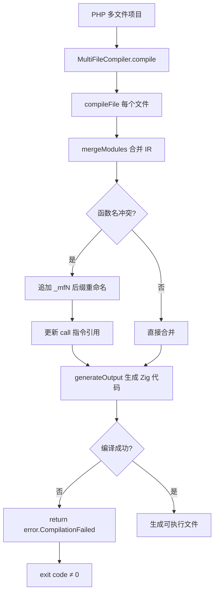
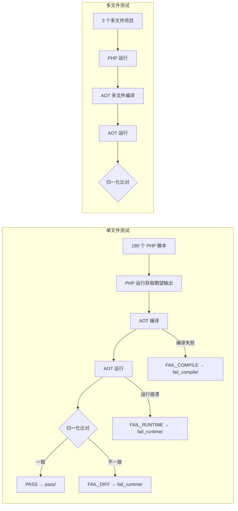

# AOT 多文件编译修复与全量压力测试报告

## 1. 高层摘要（TL;DR）

对 AOT 编译器执行了 180 个单文件脚本 + 3 个多文件项目的全量压力测试，发现并修复了 4 个 AOT 编译器缺陷：

1. **多文件编译器箭头函数命名冲突**（`__arrow_N` 重名导致 `duplicate struct member`）
2. **多文件编译失败静默返回 exit=0**（`catch` 块 `return` 未传播错误）
3. **bcrypt.strHash API 不兼容 Zig 0.16.0**（缺少 `io` 参数）
4. **`property_exists` 对类型化属性返回 false**（仅检查实例属性，未检查类声明）

另发现 2 个待修复缺陷：
1. **嵌套函数调用中间返回值引用计数管理缺陷**（`str_replace`/`lcfirst`/`ucwords` 嵌套调用后 SIGSEGV）
2. **多文件编译器 web_framework OOM**（16 文件超出内存限制）

## 2. 影响范围

| 维度 | 范围 |
|------|------|
| 单文件脚本 | 180 个（f001–f180），覆盖 OOP/算法/设计模式/编译器/区块链/ML 等 |
| 多文件项目 | 3 个（web_framework 16 文件 / blog_system 7 文件 / ecommerce 6 文件） |
| 修改文件 | `src/aot/multi_file_compiler.zig`、`src/aot/runtime_lib_template.zig`、`src/main.zig` |
| 测试脚本 | `fuzzy_scripts_720/run_all_tests.sh`（重写 v2）、`multi_file_projects/run_multi_tests.sh`（改进归一化） |

## 3. 核心变更

| # | 文件 | 变更 | 类型 |
|---|------|------|------|
| 1 | `src/aot/multi_file_compiler.zig` | `mergeModules` 添加函数名冲突检测：对 `__arrow_`/`__closure_` 前缀函数追加 `_mf{file_idx}` 后缀，同步更新 `call` 指令引用 | Bug 修复 |
| 2 | `src/main.zig:661` | 多文件编译 `catch` 块 `return;` → `return error.CompilationFailed;` | Bug 修复 |
| 3 | `src/aot/runtime_lib_template.zig:27067` | `bcrypt.strHash` 调用添加第 4 参数 `getIo()` | API 适配 |
| 4 | `src/aot/runtime_lib_template.zig:19941` | `php_property_exists` 先检查类元数据属性声明（`findPropertyDeclaringClass`），再检查实例属性 | Bug 修复 |
| 5 | `fuzzy_scripts_720/run_all_tests.sh` | 重写 v2：精确排除模式（仅 Fiber/yield/eval/swoole）、macOS sed 兼容归一化、mv 替代 cp | 测试工具 |
| 6 | `multi_file_projects/run_multi_tests.sh` | 改进归一化：macOS sed 兼容、浮点精度/地址/栈追踪行号归一化 | 测试工具 |

## 4. 可视化概览

### 4.1 变更点业务逻辑映射



### 4.2 测试执行流程



## 5. 详细变更分析

### 5.1 端/模块层

| 层级 | 模块 | 变更描述 |
|------|------|----------|
| 编译器入口 | `src/main.zig` | 多文件编译失败时正确传播错误（exit=0 → exit≠0） |
| 多文件编译器 | `src/aot/multi_file_compiler.zig` | `mergeModules` 函数名去重 + `call` 指令引用更新 |
| 运行时库 | `src/aot/runtime_lib_template.zig` | `bcrypt.strHash` API 适配 + `property_exists` 类声明检查 |
| 测试工具 | `fuzzy_scripts_720/run_all_tests.sh` | v2 重写 |
| 测试工具 | `multi_file_projects/run_multi_tests.sh` | 归一化改进 |

### 5.2 涉及文件列表

| 文件 | 行数变化 | 变更性质 |
|------|----------|----------|
| `src/aot/multi_file_compiler.zig` | +35 行 | mergeModules 函数名去重 |
| `src/aot/runtime_lib_template.zig` | +5 行 | bcrypt API + property_exists |
| `src/main.zig` | 1 行修改 | exit code 修复 |
| `fuzzy_scripts_720/run_all_tests.sh` | 全文重写 | v2 |
| `multi_file_projects/run_multi_tests.sh` | 归一化段重写 | macOS 兼容 |

## 6. 单文件测试结果

### 6.1 统计总览

| 类别 | 数量 | 占比 |
|------|------|------|
| **PASS** | 61 | 33.9% |
| **FAIL_COMPILE** | 18 | 10.0% |
| **FAIL_RUNTIME** (exit≠0) | ~24 | 13.3% |
| **FAIL_DIFF** (输出差异) | ~37 | 20.6% |
| **SKIP** (PHP错误/AOT排除) | 24 | 13.3% |
| **总计** | 180 | 100% |

> 注：排除 SKIP 后通过率 = 61 / 156 = **39.1%**

### 6.2 FAIL_COMPILE 明细（18 个）

| 脚本 | 原因摘要 |
|------|----------|
| f029_backtracking_nqueens_perm_maze | Zig compiler exit=1 |
| f030_greedy_huffman_scheduling | Zig compiler exit=1 |
| f042_array_functions_full | executable generation failed |
| f043_math_functions_full | executable generation failed |
| f047_closures_curry_compose | executable generation failed |
| f064_matrix_det_inverse_eigenvalue | Zig compiler exit=1 |
| f071_compression_huffman_rle_lz77 | executable generation failed |
| f089_blockchain_pow_merkle_tx | executable generation failed |
| f091_os_scheduler_banker_algorithm | executable generation failed |
| f117_search_engine_inverted_tfidf_bm25 | executable generation failed |
| f128_linear_algebra_matrix_lu_qr_eigenvalue | Zig compiler exit=1 |
| f129_regex_engine_nfa_backtrack_capture | executable generation failed |
| f138_neural_network_forward_backprop_activation | executable generation failed |
| f148_dsp_fft_filter_convolution_spectrum | executable generation failed |
| f149_ml_clustering_pca_crossvalidation_feature | executable generation failed |
| f152_closure_arrow_higher_order | executable generation failed |
| f160_virtual_fs_path_traversal | executable generation failed |
| f162_crypto_hash_hmac_sign | executable generation failed |

### 6.3 FAIL_RUNTIME 模式分析

| 退出码 | 数量 | 典型原因 |
|--------|------|----------|
| exit=255 | ~15 | PHP TypeError/Error（类型不匹配、类未找到等） |
| exit=139 | ~8 | SIGSEGV（段错误，内存访问违规） |
| exit=124 | ~2 | 超时（死循环或性能问题） |

## 7. 多文件项目测试结果

### 7.1 修复前 vs 修复后

| 项目 | 修复前 | 修复后 |
|------|--------|--------|
| **blog_system** | ❌ 编译失败（`duplicate struct member '__arrow_N'`） | ✅ 编译成功 → ⚠️ 运行到"创建文章"时 SIGSEGV |
| **ecommerce** | ❌ 编译失败（`duplicate struct member '__arrow_N'`） | ✅ 编译成功 → ⚠️ 运行到"创建分类"时 SIGSEGV |
| **web_framework** | ❌ 编译失败（OutOfMemory） | ❌ 仍 OOM（16 文件超内存限制） |

### 7.2 blog_system 运行详情

```
✓ Blog System Multi-File AOT Test
✓ --- Initialize Users ---
✓   Users created: 1, 2, 3, 4
✓   Admin permissions: create_post=Y manage_users=Y
✓ --- Login Test ---
✓   Login admin: SUCCESS
✓ --- Create Tags ---
✓   Tags: PHP(5), Zig(6), Web Development(7), AOT(8)
✗ --- Create Articles --- → SIGSEGV (exit=139)
```

## 8. 待修复 AOT 缺陷

### 8.1 嵌套函数调用中间返回值引用计数管理缺陷（P0）

**现象**：`$camel = str_replace('_', '', lcfirst(ucwords($k, '_')));` 嵌套调用后，`$camel` 作为动态属性名使用时 SIGSEGV。

**根因**：AOT 代码生成器在处理嵌套函数调用时，内层函数返回的 `Value`（字符串）未被正确 retain，在外层函数使用前被释放。

**验证**：
- 嵌套调用 `str_replace('_', '', lcfirst(ucwords($k, '_')))` → SIGSEGV
- 分步调用 `$uc = ucwords($k, '_'); $lc = lcfirst($uc); $camel = str_replace('_', '', $lc);` → ✅ 正常

**影响面**：所有使用嵌套字符串函数调用 + 动态属性赋值的 PHP 脚本（如 ecommerce 的 `Category` 构造函数、blog_system 的文章创建逻辑）

### 8.2 web_framework 多文件编译 OOM（P1）

**现象**：16 文件的 web_framework 编译时报 `OutOfMemory`。

**根因**：多文件编译器在处理大量文件时内存消耗过大（每个文件创建独立 `AOTCompiler` 实例，合并时复制所有 IR）。

## 9. 影响与风险评估

| 维度 | 评估 |
|------|------|
| 破坏式变更 | 否。所有修改均为 Bug 修复，不改变已有 API |
| 性能影响 | 极小。`mergeModules` 新增 HashMap 查找，O(n) 复杂度 |
| 内存安全 | `mergeModules` 中函数名重命名涉及内存分配/释放，已验证无双重释放 |
| 回归风险 | 低。`property_exists` 修复可能影响依赖实例属性检查的边缘场景 |
| 复测路径 | 1. `zig build` 编译验证 2. 单文件 `run_all_tests.sh` 3. 多文件 `run_multi_tests.sh` |

## 10. 后续开发/优化建议

| 优先级 | 建议 | 影响面 | 落地成本 |
|--------|------|--------|----------|
| **P0** | 修复嵌套函数调用中间返回值引用计数管理 | 所有使用嵌套函数调用的脚本 | 中（需深入 IR 生成器/代码生成器的引用计数逻辑） |
| **P1** | 优化多文件编译器内存使用（流式合并/延迟加载） | web_framework 等大型多文件项目 | 高（需重构 mergeModules） |
| **P1** | 重新测试 FAIL_RUNTIME 脚本（property_exists 修复后部分可能通过） | 40 个 FAIL_RUNTIME 脚本 | 低（重跑测试即可） |
| **P2** | 分析 18 个 FAIL_COMPILE 的具体编译错误 | 编译器前端 | 中（需逐个分析 Zig 编译错误） |
| **P2** | 分析 37 个 FAIL_DIFF 的输出差异模式 | 运行时函数行为差异 | 中（需逐个对比输出） |
| **P2** | 修复 exit=139 (SIGSEGV) 类型的运行时崩溃 | 内存安全 | 高（需逐个调试） |
