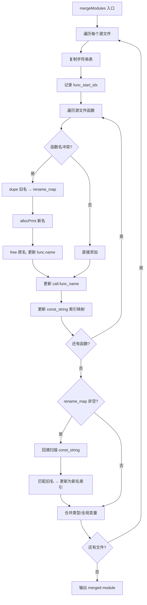
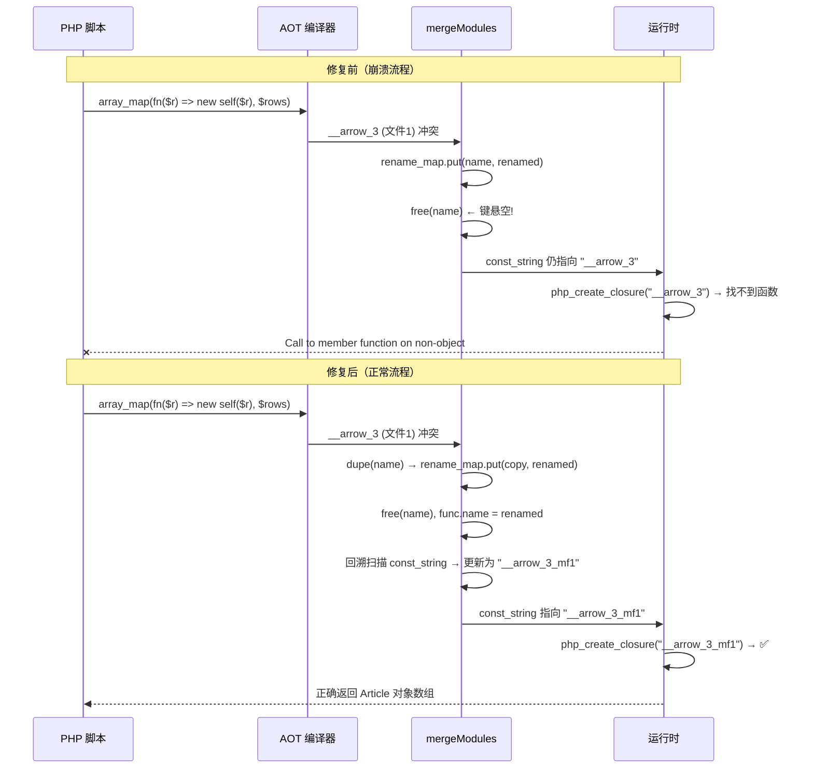

# 多文件编译器箭头函数/闭包命名冲突修复

**日期**: 2026-07-20  
**模块**: AOT 多文件编译器 (`multi_file_compiler.zig`)  
**类型**: Bug 修复  
**严重级别**: P0

---

## 1. 高层摘要（TL;DR）

修复多文件 AOT 编译器 `mergeModules` 中两个关键缺陷：
1. **Use-after-free**：`rename_map.put(new_func.name, renamed)` 后立即 `free(new_func.name)`，导致哈希表键指向已释放内存，后续查找全部失败。
2. **const_string 未更新**：箭头函数/闭包名通过 `const_string` 指令存入字符串表并传递给 `php_create_closure` 作为回调名，重命名后仅更新 `call.func_name` 而未更新 `const_string`，导致运行时回调找不到函数。

修复后 `blog_system`（7 文件）和 `ecommerce`（6 文件）多文件项目均编译运行通过。

---

## 2. 影响范围

| 范围 | 影响 |
|------|------|
| 多文件 AOT 编译 | ✅ 核心修复——箭头函数/闭包命名冲突不再导致回调失效 |
| 单文件 AOT 编译 | ❌ 不受影响（走不同代码路径） |
| blog_system (7 文件) | ✅ 从运行时崩溃 → 完整通过 |
| ecommerce (6 文件) | ✅ 从运行时崩溃 → 完整通过 |
| web_framework (16 文件) | ⚠️ 仍 OOM（P1 待修复） |

---

## 3. 核心变更

| 文件 | 变更点 | 说明 |
|------|--------|------|
| `src/aot/multi_file_compiler.zig` | `mergeModules` rename_map 键复制 | `rename_map.put` 前用 `dupe` 复制旧名，defer 中释放键 |
| `src/aot/multi_file_compiler.zig` | `mergeModules` const_string 回溯更新 | 处理完每文件所有函数后，扫描 `const_string` 指令，匹配 rename_map 旧名则更新为新名索引 |
| `src/aot/multi_file_compiler.zig` | `mergeModules` func_start_idx 跟踪 | 记录每文件函数在 merged.functions 中的起始索引，用于回溯扫描 |

---

## 4. 可视化概览

### 变更点逻辑映射



### 执行流程（修复前 vs 修复后）



---

## 5. 详细变更分析

### 5.1 Use-after-free 修复

**问题代码**：
```zig
try rename_map.put(new_func.name, renamed);  // 键 = new_func.name
if (new_func.name_owned) {
    self.allocator.free(new_func.name);       // ← 释放了键指向的内存!
}
new_func.name = renamed;
```

**修复代码**：
```zig
const old_name_copy = try self.allocator.dupe(u8, new_func.name);
try rename_map.put(old_name_copy, renamed);  // 键 = 独立副本
if (new_func.name_owned) {
    self.allocator.free(new_func.name);       // 安全：键是独立副本
}
new_func.name = renamed;
```

**defer 清理**：
```zig
defer {
    var rit_clean = rename_map.iterator();
    while (rit_clean.next()) |rn_entry| {
        self.allocator.free(rn_entry.key_ptr.*);  // 释放键副本
    }
    rename_map.deinit();
}
```

### 5.2 const_string 回溯更新

**问题**：箭头函数名通过两条路径使用：
1. `Function.name` 字段 → 被 `call` 指令引用 → 已更新 ✅
2. `const_string` 指令 → 传递给 `php_create_closure` 作为回调名 → **未更新** ❌

**修复**：处理完每文件所有函数后，回溯扫描该文件函数中的 `const_string` 指令：
```zig
if (rename_map.count() > 0) {
    for (merged.functions.items[func_start_idx..]) |func| {
        for (func.blocks.items) |block| {
            for (block.*.instructions.items) |*inst| {
                if (inst.*.op == .const_string) {
                    const str_idx = inst.*.op.const_string;
                    if (str_idx < merged.string_table.items.len) {
                        const str_val = merged.string_table.items[str_idx];
                        if (rename_map.get(str_val)) |new_name| {
                            const new_name_id = try merged.internString(new_name);
                            inst.*.op = .{ .const_string = new_name_id };
                        }
                    }
                }
            }
        }
    }
}
```

### 5.3 涉及文件列表

| 文件 | 行数变更 | 说明 |
|------|----------|------|
| `src/aot/multi_file_compiler.zig` | +45 行 | rename_map 键复制 + defer 释放 + const_string 回溯更新 + func_start_idx 跟踪 |

---

## 6. 影响与风险评估

### 是否破坏式变更
**否**。修复仅影响多文件编译的箭头函数/闭包命名冲突处理路径，不改变任何公共 API。

### 变更影响范围及明细

| 影响面 | 评估 |
|--------|------|
| 内存安全 | ✅ 修复了 use-after-free，键独立分配并正确释放 |
| 类型安全 | ✅ 无类型变更 |
| 并发安全 | ✅ 无并发影响（编译期单线程） |
| 性能 | ⚠️ 轻微增加：每文件多一次 const_string 扫描（O(n×k)，n=指令数，k=rename_map 条数，通常 k<5） |
| 向后兼容 | ✅ 完全兼容 |

### 需要特别注意的点
- `rename_map` 的键现在由 `defer` 块释放，**不能**在 `defer` 执行前提前使用键指针
- `const_string` 回溯扫描仅针对当前文件的函数（`func_start_idx..`），不影响其他文件

### 复测路径
1. `zig build` — 编译器自身构建
2. 编译运行 `multi_file_projects/blog_system/index.php` — 7 文件项目
3. 编译运行 `multi_file_projects/ecommerce/index.php` — 6 文件项目
4. 验证 `array_map(fn(...) => new self(...), $rows)` 模式在多文件中正常工作

---

## 7. 遗留问题/潜在问题

| 问题 | 级别 | 说明 |
|------|------|------|
| web_framework 16 文件 OOM | P1 | 多文件编译器内存消耗过大，需优化 |
| Markdown 渲染不完整 | P2 | AOT 的 MarkdownRenderer 未支持标题/列表/代码块等语法 |
| `test-aot` 编译错误 | P2 | `linker.zig`/`dependency_resolver.zig` 的 Zig 0.16.0 API 兼容问题（预存） |

---

## 8. 后续开发/优化建议

| 优先级 | 影响面 | 落地成本 | 建议 |
|--------|--------|----------|------|
| P0 | 多文件编译稳定性 | 低 | 补充多文件箭头函数/闭包命名冲突的单元测试 |
| P1 | 多文件编译能力 | 中 | 优化 `mergeModules` 内存——流式合并替代全量拷贝，解决 web_framework OOM |
| P1 | Markdown 渲染 | 中 | 完善 `MarkdownRenderer` 支持标题/列表/代码块等基础语法 |
| P2 | 测试基础设施 | 中 | 修复 `test-aot` 的 Zig 0.16.0 API 兼容问题，恢复 AOT 模块自动化测试 |
| P2 | 多文件编译 | 低 | 支持 `__main__` 函数冲突检测——多文件含顶层代码时自动重命名或合并 |
