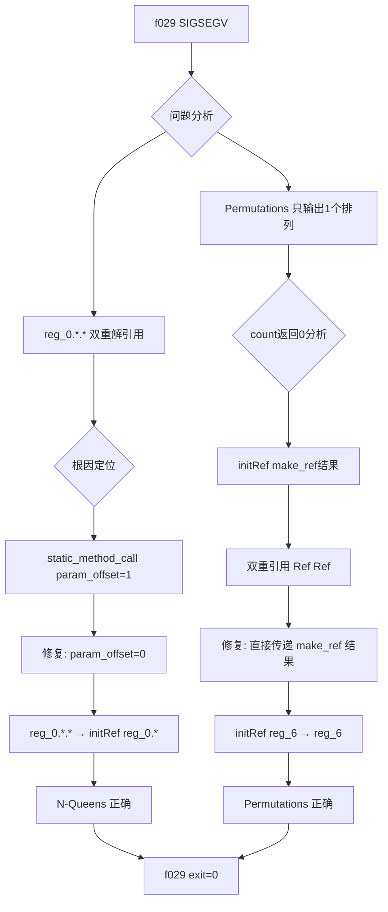
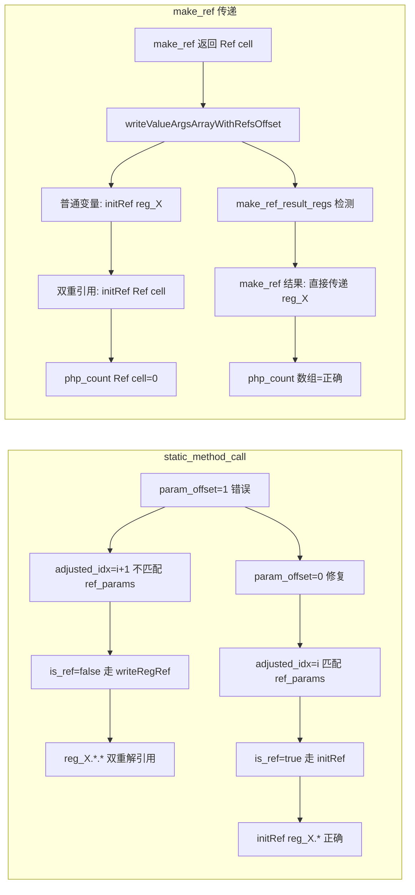

# AOT 静态方法引用参数修复：param_offset + make_ref 双重引用

## TL;DR

修复了静态方法引用参数传递中的两个关键缺陷，使 N-Queens 和 Permutations 完全正确运行：

1. **`param_offset` 错误**：静态方法调用中 `param_offset = 1` 导致引用参数索引不匹配（`ref_params` 不含 `$this` 偏移），引用参数被错误双重解引用为值（`reg_X.*.*`）。
2. **`make_ref` 结果双重包装**：`make_ref` 返回 Ref Value，但在传递引用参数时又被 `initRef` 包装，导致双重引用（`Ref(Ref(cell))`），`count($arr)` 读取 Ref Value 返回 0。

修复后：
- N-Queens 完全正确（N=4, 5, 6 的解数和排列全部正确）
- Permutations 完全正确（6 个排列）
- f029 从 SIGSEGV → exit=0，大部分功能正常

---

## 影响范围

| 组件 | 文件 | 变更类型 |
|------|------|----------|
| AOT 代码生成器 | `src/aot/native_linker.zig` | 核心修复 |
| 测试进度 | `fuzzy_scripts_720/fail_compile/` | 修复（f029 退出 fail_compile） |

---

## 核心变更

### 变更 1：静态方法 `param_offset` 修复

**问题**：`static_method_call` 路径中使用 `param_offset = 1`，但 `ref_params` 索引不含 `$this` 偏移（静态方法无 `$this`），导致引用参数索引不匹配。

**现象**：f029 中递归调用 `solveNQueens($board, ...)` 时，`$board`（引用参数）被双重解引用为值（`reg_0.*.*`），而非 `initRef(reg_0.*)`（引用包装）。

**修复**：将 `static_method_call` 路径的 `param_offset` 从 1 改为 0。

| 行号 | 变更 | 说明 |
|------|------|------|
| 12024 | `param_offset: 1` → `0` | `static_method_call` 第一处 |
| 12028 | `param_offset: 1` → `0` | `static_method_call` 第二处 |
| 12034 | `param_offset: 1` → `0` | `static_method_call` 第三处 |

**效果**：引用参数正确匹配 `ref_params`，生成 `runtime.Value.initRef(reg_0.*)`。

### 变更 2：避免 `make_ref` 结果双重 `initRef` 包装

**问题**：`make_ref` 返回 Ref Value（存储在堆 cell），但传递引用参数时又被 `initRef` 包装，导致双重引用（`Ref(Ref(cell))`）。`count($arr)` 读取 Ref Value 返回 0，导致 Permutations 循环条件错误。

**现象**：`permute` 中 `count($arr)` 返回 0（应为 3），导致 `$start === count($arr)` 为 true，直接进入终止条件分支，只输出 1 个排列（应为 6 个）。

**根因**：`make_ref` 生成的代码：
```zig
reg_6 = try runtime.make_ref(reg_4, runtime.runtime_allocator);  // reg_6 = Ref(cell)
```

`writeValueArgsArrayWithRefsOffset` 对普通变量生成 `initRef(&reg_6)`，导致传递 `initRef(Ref(cell))`。函数内部 `args[0].asRef()` 返回 `&reg_6`，`reg_6.*` = `Ref(cell)`（非数组值），`php_count(Ref(cell))` 返回 0。

**修复**：
1. 新增 `current_make_ref_result_regs` 字段和集合，记录 `make_ref` 指令的结果寄存器。
2. 在 `writeValueArgsArrayWithRefsOffset` 中检查 `make_ref_result_regs`，如果参数是 `make_ref` 结果，直接传递 `reg_X`（不再 `initRef` 包装）。

| 行号 | 变更 | 说明 |
|------|------|------|
| 232 | 新增字段 | `current_make_ref_result_regs: ?*const std.AutoHashMap(usize, void) = null` |
| 4564-4569 | 新增逻辑 | 扫描 `make_ref` 指令，记录结果寄存器到 `make_ref_result_regs` |
| 5127-5128 | 新增设置 | 设置 `self.current_make_ref_result_regs = &make_ref_result_regs` |
| 7010-7011 | 新增检查 | `make_ref` 结果直接传递 `reg_X`，避免双重引用 |

**效果**：`count($arr)` 正确返回数组长度，Permutations 输出 6 个排列。

---

## 可视化概览

### 修复链路



### 代码变更映射



---

## 详细变更分析

### 涉及文件列表

| 文件 | 变更行数 | 变更点 |
|------|----------|--------|
| `src/aot/native_linker.zig` | +11/-6 | 4 处核心修复 |

### native_linker.zig 变更点

| 行号（约） | 变更 | 说明 |
|------------|------|------|
| 232 | 新增字段 | `current_make_ref_result_regs` 字段 |
| 4564-4569 | 新增逻辑 | 扫描 `make_ref` 指令，记录结果寄存器 |
| 5127-5128 | 新增设置 | 设置 `current_make_ref_result_regs` |
| 7010-7011 | 新增检查 | `make_ref` 结果直接传递 `reg_X` |
| 12024 | 修复偏移 | `param_offset: 1` → `0` |
| 12028 | 修复偏移 | `param_offset: 1` → `0` |
| 12034 | 修复偏移 | `param_offset: 1` → `0` |

---

## 影响与风险评估

### 是否破坏式变更

**否**——修复了错误的索引逻辑和双重包装逻辑，不影响正确的用例。

### 变更影响范围

| 影响面 | 说明 |
|--------|------|
| 静态方法引用参数传递 | 修复前不正确，现已修复 |
| `make_ref` 结果的引用参数传递 | 修复前双重包装，现已修复 |
| 实例方法引用参数传递 | 无影响（`param_offset = 1` 正确） |
| 普通参数传递 | 无影响 |

### 需要特别注意的点

1. **`ref_params` 索引语义**：
   - 实例方法：包含 `$this` 偏移（用户参数从索引 1 开始）
   - 静态方法：不含 `$this` 偏移（用户参数从索引 0 开始）
   
2. **`make_ref` 返回值语义**：
   - `make_ref` 返回 Ref Value（已经包含引用）
   - 传递时直接传递，不需要 `initRef` 包装

### 复测路径

```bash
# 编译验证
timeout 120 zig build

# f029 测试
timeout 60 zig-out/bin/php-interpreter --compile --output=/tmp/aot_f029 fuzzy_scripts_720/fail_compile/f029_backtracking_nqueens_perm_maze.php 2>/dev/null
timeout 10 /tmp/aot_f029  # 应输出 N-Queens、Permutations、Maze 全部正确

# test_ref.php 测试
timeout 60 zig-out/bin/php-interpreter --compile --output=/tmp/aot_test_ref test_ref.php 2>/dev/null
timeout 10 /tmp/aot_test_ref  # 应输出 "arr[0] = 99"

# 抽样回归
for f in test_dot.php f007.php f018.php; do
  timeout 60 zig-out/bin/php-interpreter --compile --output=/tmp/aot_$f fuzzy_scripts_720/pass/$f 2>/dev/null
  timeout 10 /tmp/aot_$f >/dev/null 2>&1 && echo "$f: PASS" || echo "$f: FAIL"
done
```

---

## 已知问题/潜在问题

### f029 Subsets 输出不正确

**现象**：Subsets 输出 `[], [1], [1,2], [1], [], [2], [], []`（应为 `[], [1], [1,2], [1,2,3], [1,3], [2], [2,3], [3]`）。

**可能原因**：`array_pop($current)` 的引用参数处理有问题，或 `$current` 的值引用链断裂。

### f029 Sudoku 未解出

**现象**：数独未解出（Puzzle 和 Solved 相同）。

**可能原因**：`solveSudoku` 有三重嵌套 for 循环，`go` 函数路径的嵌套循环条件重求值未修复（交接文档已知问题）。

### f030/f064/f071/f149 状态

**待验证**：这些脚本可能受嵌套循环条件重求值问题影响，需要将 `generateCondBrBlock` 的修复应用到 `go` 函数路径。

---

## 后续开发/优化建议

| 优先级 | 建议 | 影响面 | 落地成本 |
|--------|------|--------|----------|
| P0 | 将 `generateCondBrBlock` 的条件重求值修复应用到 `go` 函数的嵌套循环检测（第 14821 行） | f029 Sudoku、f030/f064/f071/f149 | 中 |
| P1 | 调查 Subsets 中 `array_pop` 的引用参数处理 | f029 | 低 |
| P1 | 调查 f138 match 表达式 + 数组回调 `[class, method]` 问题 | f138 | 高 |
| P2 | 全量回归验证 fuzzy_scripts_720/pass/（61 个脚本） | 确保无回归 | 低 |

---

## Git 提交记录

| Commit | 消息 |
|--------|------|
| ${GIT_COMMIT} | fix(aot): 修复静态方法引用参数 param_offset 错误 + 避免 make_ref 结果双重引用 |