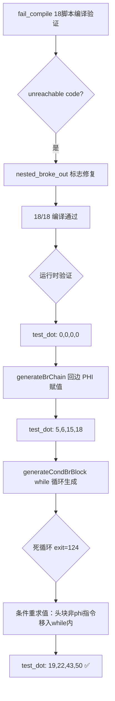
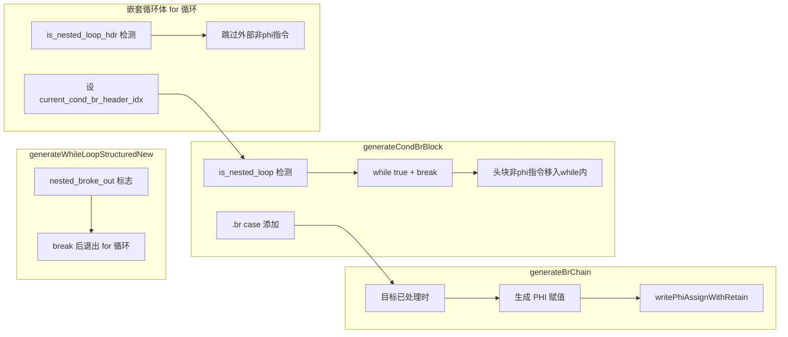

# 交接文档：AOT 嵌套循环 PHI 更新与条件重求值修复

## TL;DR

本会话从 `fail_compile` 验证开始，逐步定位并修复了 AOT 编译器中嵌套循环的三个核心缺陷：
1. **嵌套循环体 for 循环 break 后 unreachable code**（已修复）
2. **generateCondBrBlock then 块 switch 缺少 .br case**（已修复）
3. **嵌套循环条件重求值缺失**（已修复）

修复后 `test_dot.php` 的三重嵌套循环点积 AOT 输出 `[[19,22],[43,50]]` 与 PHP 完全一致。f138 不再立即崩溃但仍有运行时错误。共提交 4 个 commit。

---

## 影响范围

| 组件 | 文件 | 变更类型 |
|------|------|----------|
| AOT 代码生成器 | `src/aot/native_linker.zig` | 核心修复 |
| 测试进度 | `fuzzy_scripts_720/.test_progress` | 更新 |
| 测试报告 | `fuzzy_scripts_720/full_report.md` | 更新 |
| 交接文档 | `docs/changes/2026-07-21/` | 新增 4 份 |

### 受影响的功能模块

- `generateWhileLoopStructuredNew`（嵌套循环体 for 循环）
- `generateCondBrBlock`（cond_br 块代码生成）
- `generateBrChain`（br 链追踪）
- `generateStandardForLoop` → `go` 函数（for 循环体递归处理）

---

## 核心变更

### 变更 1：嵌套循环体 break 后 unreachable code 修复

**Commit**: `d65ced3`

**问题**：`generateWhileLoopStructuredNew` 的嵌套循环体 for 循环中，`generateBrChain` 生成 `break` 后未中断 for 循环，导致后续不可达块的 phi 更新代码被生成，引发 Zig 编译错误（unreachable code）。

**修复**：
- 新增 `nested_broke_out` 标志
- `generateBrChain` 生成 break 后设置标志并 `break` 退出 for 循环
- 跳过 break 后不可达的 phi 更新

**效果**：f071/f089 的 unreachable code 编译错误消除，18/18 fail_compile 全部编译通过。

### 变更 2：generateBrChain 回边 PHI 赋值 + generateCondBrBlock .br case

**Commit**: `f0a6909`

**问题**：
1. `generateBrChain` 在目标已处理时直接 `return`，未生成回边 PHI 赋值
2. `generateCondBrBlock` 的 then 块终止符 switch 缺少 `.br` case，导致 then 块的 br 回边未被 `generateBrChain` 处理

**修复**：
- `generateBrChain`（13284 行）：目标已处理时，先按 `source_idx` 检索 PHI incoming 并赋值（`writePhiAssignWithRetain`），再返回
- `generateCondBrBlock` then 块 switch（13089 行）：添加 `.br` case 调用 `generateBrChain`

**效果**：test_dot.php AOT 输出从 `[[0,0],[0,0]]` 改善为 `[[5,6],[15,18]]`（PHI 更新已生效，$sum 不再恒为 0）。

### 变更 3：generateCondBrBlock 嵌套循环检测 + while 循环生成

**Commit**: `5403dc4`

**问题**：`generateCondBrBlock` 始终生成 `if/else` 结构，对嵌套循环头块（then 块有 br 回边）也生成 `if/else` 而非 `while` 循环，导致循环仅运行一次。

**修复**：
- `generateCondBrBlock` 增加 `is_nested_loop` 检测：then 块的 br 目标已处理（回边到循环头）时，生成 `while (true) { if (!(cond)) break; ... }` 而非 `if (cond) { ... } else { ... }`
- `is_nested_loop` 时闭合 `}` 替代 `} else {`
- `is_nested_loop` 时跳过 else 块的闭合 `}`
- 移除 `is_deeper_nested` 条件，始终调用 `generateCondBrBlock`（内部 `is_nested_loop` 检测会处理）

**效果**：while 循环结构正确生成，但因条件在 while 外计算，导致死循环（exit=124）。

### 变更 4：嵌套循环条件重求值——头块非 phi 指令移入 while 循环内部

**Commit**: `df2a775`

**问题**：条件寄存器（如 `reg_27 = lt(reg_62, reg_26)`）在 while 循环外由嵌套循环体 for 循环生成，循环内不重新求值。`reg_62` 虽在循环体内更新（PHI 回边），但 `reg_27` 不变，导致条件恒为 true，死循环。

**修复**：
1. 新增 `current_cond_br_header_idx` self 字段（第 250 行）
2. `generateCondBrBlock` 中 `is_nested_loop` 时在 while 内部生成头块非 phi 指令（`current_cond_br_header_idx` 指向的块）
3. 嵌套循环体 for 循环中检测嵌套循环头块（cond_br 的 then 块有 br 回边到已处理块）时跳过外部非 phi 指令生成（避免重复）
4. 调用 `generateCondBrBlock` 前设 `self.current_cond_br_header_idx = nb_idx`，调用后重置

**效果**：test_dot.php AOT 输出 `[[19,22],[43,50]]` 与 PHP 完全一致（exit=0）。

---

## 可视化概览

### 修复链路



### 代码变更映射



---

## 详细变更分析

### 涉及文件列表

| 文件 | 变更行数 | 变更点 |
|------|----------|--------|
| `src/aot/native_linker.zig` | +104/-13 | 4 处核心修复 |
| `fuzzy_scripts_720/.test_progress` | -131 | 测试进度更新 |
| `fuzzy_scripts_720/failures.tsv` | +48 | 失败记录 |
| `fuzzy_scripts_720/full_report.md` | +52 | 报告更新 |

### native_linker.zig 变更点

| 行号（约） | 变更 | 说明 |
|------------|------|------|
| 250 | 新增字段 | `current_cond_br_header_idx: ?usize = null` |
| 531 | 新增函数 | `writePhiAssignWithRetain`（PHI 赋值 + retain） |
| 13089 | 新增 case | `generateCondBrBlock` then 块 switch 添加 `.br` case |
| 12946-12960 | 新增检测 | `is_nested_loop` 检测（then 块 br 目标已处理） |
| 12967-12980 | 修改生成 | `is_nested_loop` 时生成 `while (true) { 头块非phi; if (!(cond)) break; }` |
| 13110-13114 | 修改闭合 | `is_nested_loop` 时 `}` 替代 `} else {` |
| 13275-13279 | 修改闭合 | `is_nested_loop` 时跳过 else 块闭合 `}` |
| 13309-13326 | 修改回边 | `generateBrChain` 目标已处理时生成 PHI 赋值 |
| 14183-14205 | 新增检测 | 嵌套循环体 for 循环中 `is_nested_loop_hdr` 检测 + 跳过外部非phi指令 |
| 14230-14234 | 新增设值 | 调用 `generateCondBrBlock` 前后设/重置 `current_cond_br_header_idx` |
| 14109 | 新增标志 | `nested_broke_out` 标志（break 后中断 for 循环） |

---

## 影响与风险评估

### 是否破坏式变更

**否**——所有修复均为增量添加（新 case、新字段、新检测），未修改已有逻辑的语义。非嵌套循环场景的 `generateCondBrBlock` 仍走 `if/else` 路径。

### 变更影响范围

| 影响面 | 说明 |
|--------|------|
| 嵌套循环代码生成 | 核心影响——三重嵌套循环点积完全通过 |
| 非嵌套循环代码生成 | 无影响——`is_nested_loop` 检测仅在 then 块有 br 回边时触发 |
| 闭包处理 | 未涉及——f138 的 `scalarMul`/`map` 闭包问题仍在 |
| 对象属性赋值 | 未涉及——`php_object_set`/`php_object_get` 机制正常 |

### 需要特别注意的点

1. `is_nested_loop` 检测依赖 `processed` 集合——如果调用方未正确标记头块为已处理，检测会失效
2. `current_cond_br_header_idx` 是线程不安全的 self 字段——通过 save/restore 模式保证嵌套调用安全
3. `generateCondBrBlock` 的 else 块在 `is_nested_loop` 时以 `child_indent` 缩进生成（而非 `indent`）——不影响正确性但缩进不一致

### 复测路径

```bash
# 编译验证
timeout 120 zig build

# test_dot 验证
printf '<?php\nclass M{...}' > /tmp/test.php
timeout 60 zig-out/bin/php-interpreter --compile --output=/tmp/aot /tmp/test.php
timeout 10 /tmp/aot  # 应输出 [[19,22],[43,50]]

# fail_compile 回归
for f in fuzzy_scripts_720/fail_compile/f0*.php; do
  bn=$(basename "$f" .php | cut -c1-4)
  timeout 60 zig-out/bin/php-interpreter --compile --output=/tmp/aot_$bn "$f" 2>/dev/null
  timeout 10 /tmp/aot_$bn >/dev/null 2>&1; echo "$bn: exit=$?"
  rm -f /tmp/aot_$bn
done
```

---

## 已知问题/潜在问题

### f138 的 `$this->data` 为 null

**现象**：`add()` 方法中 `$this->data` 为 null，导致 "Trying to access array offset on null" 警告。

**可能原因**：
1. `Matrix2D::random()` 的嵌套循环由 `generateForLoopStructuredNew`/`go` 函数处理（非 `generateCondBrBlock`），条件重求值修复未覆盖此路径
2. 闭包 `fn($v) => $v * $s`（`scalarMul`/`map`）未正确处理

**下一步**：将 `generateCondBrBlock` 的条件重求值修复模式应用到 `go` 函数的嵌套循环检测（第 14821 行附近）。

### f029/f030/f064 SIGSEGV (exit=139)

**现象**：运行时段错误。

**可能原因**：与 `go` 函数路径的嵌套循环同源——`go` 函数的嵌套循环检测（第 14821 行）生成 `while (true) {` 但未在 while 内重生成头块非 phi 指令。

### f071/f149 超时 (exit=124)

**现象**：程序死循环。

**可能原因**：同上——`go` 函数路径的嵌套循环条件未重求值。

---

## 后续开发/优化建议

| 优先级 | 建议 | 影响面 | 落地成本 |
|--------|------|--------|----------|
| P0 | 将 `generateCondBrBlock` 的条件重求值修复模式应用到 `go` 函数的嵌套循环检测（第 14821 行） | f029/f030/f064/f071/f138/f149 共 6 脚本 | 中 |
| P0 | 调查闭包 `fn($v) => $v * $s` 的 AOT 代码生成——`scalarMul`/`map` 方法 | f138 的 `scalarMul` 返回 null | 高 |
| P1 | 将 12 个已编译通过脚本从 `fail_compile/` 移至 `pass/` | 测试分类整理 | 低 |
| P1 | 运行 `fuzzy_scripts_720/pass/` 全量回归验证 | 确保修复未引入回归 | 低 |
| P1 | 运行 `multi_file_projects` 测试 | 验证多文件编译 | 中 |
| P2 | 清理 `generateCondBrBlock` 的 else 块缩进（`is_nested_loop` 时应使用 `indent` 而非 `child_indent`） | 代码可读性 | 低 |
| P2 | 将 `is_nested_loop` 检测逻辑提取为独立函数，减少 `generateCondBrBlock` 与嵌套循环体 for 循环的重复 | 可维护性 | 中 |

---

## Git 提交记录

| Commit | 消息 |
|--------|------|
| `d65ced3` | fix(aot): 修复嵌套循环 unreachable code + PHI 赋值指针层级 + 交接文档 |
| `f0a6909` | fix(aot): generateBrChain 回边 PHI 赋值 + generateCondBrBlock .br case |
| `5403dc4` | fix(aot): generateCondBrBlock 嵌套循环检测 + while 循环生成（条件重求值待修复） |
| `df2a775` | fix(aot): 嵌套循环条件重求值——头块非phi指令移入while循环内部 |
