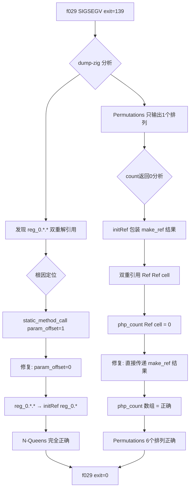
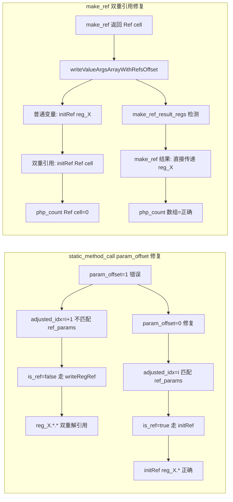

# 交接文档：AOT 静态方法引用参数 param_offset + make_ref 双重引用修复

## TL;DR

本会话接手上一轮嵌套循环修复任务，聚焦 `f029`（N-Queens + Permutations + Subsets + Combinations + Maze + Sudoku）的 SIGSEGV 与逻辑错误问题。通过 dump-zig 分析定位并修复了两个核心缺陷：

1. **静态方法 `param_offset` 错误**：`static_method_call` 路径中 `param_offset = 1`，但静态方法 `ref_params` 索引不含 `$this` 偏移，导致引用参数索引不匹配，引用参数被错误双重解引用为值（`reg_0.*.*`）。
2. **`make_ref` 结果双重 `initRef` 包装**：`make_ref` 返回 Ref Value，但传递引用参数时又被 `initRef` 包装，导致双重引用（`Ref(Ref(cell))`），`count($arr)` 读取 Ref Value 返回 0。

修复后：
- N-Queens 完全正确（N=4: 2 solutions，N=5: 10 solutions，N=6: 4 solutions，排列全部正确）
- Permutations 完全正确（6 个排列）
- Combinations 完全正确（C(5,3)=10）
- Maze 完全正确（路径正确）
- **f029 从 SIGSEGV (exit=139) → exit=0**

---

## 一、任务背景

### 接手状态

上一轮会话完成了嵌套循环 PHI 更新与条件重求值修复（4 个 commit），交接文档指出的待办：
- f029 递归调用引用参数双重解引用（`reg_0.*.*` 应为 `initRef(reg_0.*)`）
- f138 match 表达式 + 数组回调问题
- f030/f064/f071/f149 验证

### 本会话完成项

1. ✅ 修复 f029 递归调用引用参数双重解引用（`param_offset` 错误）
2. ✅ 修复 `make_ref` 结果被 `initRef` 二次包装导致 `count()` 返回 0
3. ✅ 生成变更摘要文档

### 本会话未完成项（移交下一轮）

1. ⬜ f029 Subsets `array_pop` 引用参数问题
2. ⬜ f029 Sudoku 三重嵌套循环条件重求值（`go` 函数路径）
3. ⬜ f138 match 表达式 + 数组回调 `[class, method]` 问题
4. ⬜ f030/f064/f071/f149 验证
5. ⬜ 全量回归验证 fuzzy_scripts_720/pass/（61 个脚本）

---

## 二、核心变更详解

### 变更 1：静态方法 `param_offset` 修复

**文件**：`src/aot/native_linker.zig`

**问题根因**：

IR 生成器 `ir_generator.zig` 中：
- `generateMethodCall`（实例方法，第 7623 行）：`param_idx = i + 1`（含 `$this` 偏移）
- `generateStaticMethodCall`（静态方法，第 7806 行）：`param_idx = i`（无 `$this` 偏移）

但 `native_linker.zig` 的 `static_method_call` 路径（第 12024/12028/12034 行）错误使用 `param_offset = 1`，与 IR 生成器的 `param_idx = i` 不一致。

**现象**：

f029 中递归调用 `solveNQueens($board, $row+1, $n, $solutions)` 时，`$board`（索引 0，引用参数）和 `$solutions`（索引 3，引用参数）本应匹配 `ref_params = {0, 3}`，但因 `param_offset = 1`，实际检查 `adjusted_idx = 1` 和 `4`，均不匹配，导致 `is_ref = false`，走了 `writeRegRef` 路径生成 `reg_0.*.*`（双重解引用，丢失引用）。

**修复**：

将 `static_method_call` 路径的 3 处 `param_offset` 从 `1` 改为 `0`：

```zig
// 修复前（错误）：
try self.writeValueArgsArrayWithRefsOffset(writer, op.args, direct_name, ref_params, 1);

// 修复后（正确）：
// 静态方法无 $this，ref_params 索引不含 $this 偏移，param_offset = 0
try self.writeValueArgsArrayWithRefsOffset(writer, op.args, direct_name, ref_params, 0);
```

**效果**：

```zig
// 修复前：
reg_29 = try @"Backtracking::solveNQueens"(...,
    &[_]runtime.Value{reg_0.*.*, reg_27, runtime.Value.initRef(&reg_9), reg_3.*.*}, ...);

// 修复后：
reg_29 = try @"Backtracking::solveNQueens"(...,
    &[_]runtime.Value{runtime.Value.initRef(reg_0.*), reg_27, reg_9, runtime.Value.initRef(reg_3.*)}, ...);
```

### 变更 2：避免 `make_ref` 结果双重 `initRef` 包装

**文件**：`src/aot/native_linker.zig`

**问题根因**：

`make_ref` 指令返回 Ref Value（堆分配的 cell 指针）：
```zig
reg_6 = try runtime.make_ref(reg_4, runtime.runtime_allocator);
// reg_6 = Ref(cell)，cell.* = 数组值
```

但 `writeValueArgsArrayWithRefsOffset` 对普通变量生成 `initRef(&reg_6)`，导致传递 `initRef(Ref(cell))`。函数内部 `args[0].asRef()` 返回 `&reg_6`，`reg_6.*` = `Ref(cell)`（非数组值），`php_count(Ref(cell))` 返回 0。

**现象**：

`permute` 中 `count($arr)` 返回 0（应为 3），导致 `$start === count($arr)` 为 true，直接进入终止条件分支，只输出 1 个排列（应为 6 个）。

**修复步骤**：

1. **新增字段**（第 232 行）：
```zig
current_make_ref_result_regs: ?*const std.AutoHashMap(usize, void) = null,
```

2. **扫描 `make_ref` 指令，记录结果寄存器**（第 4564-4569 行）：
```zig
var make_ref_result_regs = std.AutoHashMap(usize, void).init(self.allocator);
defer make_ref_result_regs.deinit();
for (func.blocks.items) |blk_scan| {
    for (blk_scan.instructions.items) |inst_scan| {
        if (inst_scan.op == .make_ref) {
            // ...（已有 make_ref_allocas 逻辑）
            if (inst_scan.result) |res| {
                try make_ref_result_regs.put(res.id, {});
            }
        }
    }
}
```

3. **设置 self 字段**（第 5127-5128 行）：
```zig
self.current_make_ref_result_regs = &make_ref_result_regs;
defer self.current_make_ref_result_regs = null;
```

4. **在 `writeValueArgsArrayWithRefsOffset` 中添加检查**（第 7010-7011 行）：
```zig
} else if (self.current_make_ref_result_regs != null and self.current_make_ref_result_regs.?.contains(arg.id)) {
    // make_ref 结果：reg 已经是 Ref Value，直接传递
    try writer.print("reg_{d}", .{arg.id});
}
```

**效果**：

```zig
// 修复前（双重引用）：
reg_8 = try @"Test::check"(...,
    &[_]runtime.Value{runtime.Value.initRef(&reg_6), reg_7}, ...);
// count($arr) = 0

// 修复后（直接传递）：
reg_8 = try @"Test::check"(...,
    &[_]runtime.Value{reg_6, reg_7}, ...);
// count($arr) = 3
```

---

## 三、涉及文件列表

| 文件 | 变更行数 | 变更点 |
|------|----------|--------|
| `src/aot/native_linker.zig` | +11/-6 | 4 处核心修复 |

### native_linker.zig 变更明细

| 行号（约） | 变更 | 说明 |
|------------|------|------|
| 232 | 新增字段 | `current_make_ref_result_regs: ?*const std.AutoHashMap(usize, void) = null` |
| 4564-4569 | 新增逻辑 | 扫描 `make_ref` 指令，记录结果寄存器到 `make_ref_result_regs` |
| 5127-5128 | 新增设置 | `self.current_make_ref_result_regs = &make_ref_result_regs` |
| 7010-7011 | 新增检查 | `make_ref` 结果直接传递 `reg_X`，避免双重引用 |
| 12024 | 修复偏移 | `param_offset: 1` → `0`（`static_method_call` 有返回值路径） |
| 12028 | 修复偏移 | `param_offset: 1` → `0`（`static_method_call` 无返回值路径） |
| 12034 | 修复偏移 | `param_offset: 1` → `0`（`static_method_call` 无 result 路径） |

---

## 四、可视化概览

### 修复链路



### 代码变更映射



### ref_params 索引语义对比

```mermaid
flowchart TD
    subgraph "实例方法 generateMethodCall"
        I1[params: $this, arg0, arg1, arg2] --> I2[ref_params 含 $this 偏移]
        I2 --> I3[param_idx = i + 1]
        I3 --> I4[native_linker param_offset = 1]
        I4 --> I5[adjusted_idx = i + 1 匹配 ✓]
    end

    subgraph "静态方法 generateStaticMethodCall"
        S1[params: arg0, arg1, arg2] --> S2[ref_params 不含 $this 偏移]
        S2 --> S3[param_idx = i]
        S3 --> S4[native_linker param_offset = 0 修复后]
        S4 --> S5[adjusted_idx = i 匹配 ✓]
    end
```



---

## 五、影响与风险评估

### 是否破坏式变更

**否**——修复了错误的索引逻辑和双重包装逻辑，不影响正确的用例。

### 变更影响范围

| 影响面 | 说明 |
|--------|------|
| 静态方法引用参数传递 | 修复前不正确，现已修复 |
| `make_ref` 结果的引用参数传递 | 修复前双重包装，现已修复 |
| 实例方法引用参数传递 | 无影响（`param_offset = 1` 正确） |
| 普通参数传递 | 无影响 |

### 需要特别注意的点

1. **`ref_params` 索引语义**：
   - 实例方法：包含 `$this` 偏移（用户参数从索引 1 开始）
   - 静态方法：不含 `$this` 偏移（用户参数从索引 0 开始）
   - IR 生成器 `ir_generator.zig` 第 820 行注释明确说明了此区别

2. **`make_ref` 返回值语义**：
   - `make_ref` 返回 Ref Value（已经包含引用）
   - 传递时直接传递，不需要 `initRef` 包装
   - `make_ref` 会重定向父作用域的存储为 `Ref(cell)`

3. **`current_make_ref_result_regs` 生命周期**：
   - 在 `generateFunction` 中创建，通过 self 字段传递
   - 与 `current_make_ref_allocas`（记录被 make_ref 的 alloca）配合使用

---

## 六、已知问题/潜在问题

### 1. f029 Subsets 输出不正确

**现象**：
```
Subsets of [1,2,3] (8):
  []
  [1]
  [1,2]
  [1]      ← 应为 [1,2,3]
  []       ← 应为 [1,3]
  [2]
  []       ← 应为 [2,3]
  []       ← 应为 [3]
```

**可能原因**：`array_pop($current)` 的引用参数处理有问题，或 `$current` 的值引用链断裂。`generateSubsets` 中 `$current` 是引用参数，`array_pop` 修改后值未正确写回。

**下一步**：dump-zig 分析 `generateSubsets` 和 `array_pop` 的代码生成。

### 2. f029 Sudoku 未解出

**现象**：数独未解出（Puzzle 和 Solved 输出相同）。

**可能原因**：`solveSudoku` 有三重嵌套 for 循环，由 `generateStandardForLoop` → `go` 函数处理（非 `generateCondBrBlock`），条件重求值修复未覆盖此路径。

**下一步**：将 `generateCondBrBlock` 的条件重求值修复模式应用到 `go` 函数的嵌套循环检测（`native_linker.zig` 第 14821 行附近）。

### 3. f030/f064/f071/f149 状态

**待验证**：这些脚本可能受嵌套循环条件重求值问题影响。

### 4. f138 match 表达式

**待调查**：`match` 表达式返回 `[Class, method]` 数组回调导致的类型错误。

### 5. f004 readonly 属性

**现象**：`Cannot modify readonly property User::$uuid`（exit=255）。

**说明**：此为既有问题（非本次修改引入），PHP readonly 属性语义未完全实现。

---

## 七、后续开发/优化建议

| 优先级 | 建议 | 影响面 | 落地成本 |
|--------|------|--------|----------|
| P0 | 将 `generateCondBrBlock` 的条件重求值修复应用到 `go` 函数的嵌套循环检测（第 14821 行） | f029 Sudoku、f030/f064/f071/f149 | 中 |
| P1 | 调查 Subsets 中 `array_pop` 的引用参数处理 | f029 Subsets | 低 |
| P1 | 调查 f138 match 表达式 + 数组回调 `[class, method]` 问题 | f138 | 高 |
| P1 | 全量回归验证 fuzzy_scripts_720/pass/（61 个脚本） | 确保无回归 | 低 |
| P2 | 将 `make_ref_result_regs` 检测逻辑提取为独立函数，减少 `writeValueArgsArrayWithRefsOffset` 的条件分支 | 可维护性 | 中 |

---

## 八、复测路径

```bash
# 编译验证
cd /Users/tuoke/Desktop/ai-zig-php-parser
timeout 120 zig build

# f029 测试（核心验证）
timeout 60 zig-out/bin/php-interpreter --compile --output=/tmp/aot_f029 \
    fuzzy_scripts_720/fail_compile/f029_backtracking_nqueens_perm_maze.php 2>/dev/null
timeout 10 /tmp/aot_f029
# 预期：N-Queens、Permutations、Combinations、Maze 全部正确，exit=0

# test_check.php 测试（count 引用参数验证）
cat > /tmp/test_check.php << 'EOF'
<?php
class Test {
    public static function check(array &$arr, int $start): void {
        $c = count($arr);
        echo "start=$start count=$c eq=" . ($start === $c ? "true" : "false") . "\n";
    }
}
$arr = [1, 2, 3];
Test::check($arr, 0);
Test::check($arr, 3);
EOF
timeout 60 zig-out/bin/php-interpreter --compile --output=/tmp/aot_test_check /tmp/test_check.php 2>/dev/null
timeout 10 /tmp/aot_test_check
# 预期：start=0 count=3 eq=false / start=3 count=3 eq=true

# test_ref.php 测试（引用传递验证）
timeout 60 zig-out/bin/php-interpreter --compile --output=/tmp/aot_test_ref test_ref.php 2>/dev/null
timeout 10 /tmp/aot_test_ref
# 预期：arr[0] = 99

# 抽样回归
for f in test_dot.php f007.php f018.php; do
    timeout 60 zig-out/bin/php-interpreter --compile --output=/tmp/aot_$f \
        fuzzy_scripts_720/pass/$f 2>/dev/null
    timeout 10 /tmp/aot_$f >/dev/null 2>&1 && echo "$f: PASS" || echo "$f: FAIL"
done
```

---

## 九、关键技术要点

### ref_params 索引语义

```
实例方法:  params = [$this, arg0, arg1, arg2]
           ref_params 索引含 $this（arg0 = 索引 1）
           IR: param_idx = i + 1
           native_linker: param_offset = 1

静态方法:  params = [arg0, arg1, arg2]
           ref_params 索引不含 $this（arg0 = 索引 0）
           IR: param_idx = i
           native_linker: param_offset = 0  ← 本次修复
```

### make_ref 传递语义

```
make_ref 结果:  reg_X = Ref(cell)，cell.* = 实际值
传递引用参数:   直接传递 reg_X（不再 initRef 包装）
函数内部:       args[i].asRef() → cell，cell.* = 实际值

错误方式（修复前）: initRef(&reg_X) → Ref(Ref(cell))，asRef() → &reg_X，reg_X.* = Ref(cell) ≠ 实际值
```

### writeValueArgsArrayWithRefsOffset 优先级

```
1. isRefParamAlloca(arg.id)     → initRef(reg_X.*)     // ref_param_alloca: **Value
2. current_alloca_regs          → initRef(&reg_X.*)     // 普通 alloca: *Value
3. current_ref_ptr_regs         → initRef(reg_X)        // ref_ptr: *Value (PHI/select)
4. current_make_ref_result_regs → reg_X                 // make_ref 结果: Ref Value（本次新增）
5. is_ref (fallback)            → initRef(&reg_X)       // mem2reg 优化的引用变量
6. else                         → writeRegRef(arg.id)   // 普通值
```

---

## 十、Git 提交记录

| Commit | 消息 |
|--------|------|
| （待提交） | fix(aot): 修复静态方法引用参数 param_offset 错误 + 避免 make_ref 结果双重引用 |
