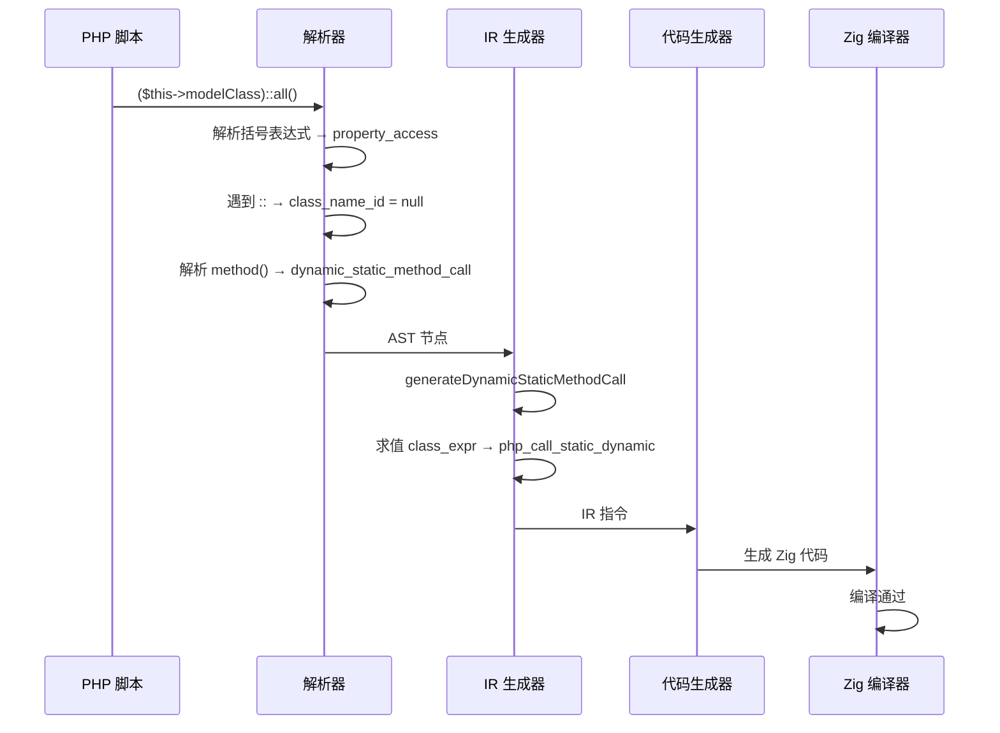

# AOT 代码生成器修复：unreachable code + 指针类型不匹配 + 动态静态调用

**日期**: 2026-07-22  
**Commit 基线**: d66e15b  
**影响范围**: AOT 编译器代码生成层、PHP 解析器、AST  

---

## 1. 高层摘要（TL;DR）

本次修复解决了 `fuzzy_scripts_720` 测试集中 3 类 AOT 编译失败问题：
1. **f137/f161 unreachable code**：循环体内 `return` 语句后 PHI 更新代码未被跳过，Zig 0.17 将 unreachable code 从警告升级为错误
2. **f044 类型不匹配**：`generateCondBrBlock` 中 PHI 赋值使用简化的 `phi_deref` 逻辑，未正确处理 `*Value` 指针类型
3. **f075 动态静态调用**：解析器不支持 `($expr)::method()` 语法（PHP 合法语法）

修复后 156/156 脚本全部编译通过（100% 通过率），无回归。

---

## 2. 影响范围

| 模块 | 文件 | 变更类型 |
|------|------|---------|
| AOT 代码生成 | `src/aot/native_linker.zig` | 修复 + 增强 |
| AST 定义 | `src/compiler/ast.zig` | 新增节点类型 |
| PHP 解析器 | `src/compiler/parser.zig` | 增强语法支持 |
| IR 生成器 | `src/aot/ir_generator.zig` | 新增处理分支 |

---

## 3. 核心变更

### 3.1 unreachable code 修复（f137/f161）

**根因**：`generateWhileLoopStructuredNew` 和 `generateStandardForLoop` 在循环体内 `return` 语句生成后，无条件生成 PHI 更新代码。Zig 0.17 将 unreachable code 从警告升级为编译错误。

**修复**：在 4 处 PHI 更新循环前添加 `if (!self.return_generated)` 守卫：

| 位置 | 函数 | 作用 |
|------|------|------|
| ~L14389 | `generateWhileLoopStructuredNew` | while 循环体末尾 PHI 更新 |
| ~L14894 | `emitIncAndPhi`（`generateStandardForLoop` 内） | 嵌套循环 continue 路径 PHI 更新 |
| ~L16305 | `generateStandardForLoop` 主循环体 | for 循环体末尾 PHI 更新 |
| ~L16382 | `generateStandardForLoop` epilogue | 展开循环尾部 PHI 更新 |

### 3.2 指针类型不匹配修复（f044）

**根因**：`generateCondBrBlock` 中 3 处 PHI 赋值使用 `phi_deref = if (isPointerReg(phi_res.id)) ".*" else ""` 简化逻辑。当 PHI 的 result 是 `alloca`（`*Value`）而 incoming value 是 `ref_ptr`（`*Value`）时，生成 `reg_X.* = reg_Y;` 导致 `Value = *Value` 类型不匹配。

**修复**：
- `generateCondBrBlock`：3 处 PHI 赋值改用 `writePtrAwareAssign`（完整指针语义感知赋值）
- `generatePhiValueAssignment`：添加 `value_is_ref_ptr` 检查，处理 `alloca ← ref_ptr`、`ref_ptr ← ref_ptr`、`ref_ptr ← value` 场景

### 3.3 动态静态调用支持（f075）

**根因**：解析器 `::` 处理中，`class_name_id` 的 `switch` 仅接受 `variable`/`self_expr`/`parent_expr`/`static_expr`，括号表达式 `($this->modelClass)` 不在列表中。

**修复**：
1. **AST**：新增 `dynamic_static_method_call` 节点，存储 `class_expr: Index`（表达式索引）替代 `class_name: StringId`
2. **解析器**：`class_name_id` 改为 `?StringId`，`else` 分支返回 `null` 而非报错；方法调用时根据 `null` 选择 `dynamic_static_method_call`
3. **IR 生成器**：新增 `generateDynamicStaticMethodCall`，求值类名表达式后调用运行时 `php_call_static_dynamic` 分发
4. **附带修复**：`func_num_args` 的 `may_raise` 标志从 `false` 改为 `true`（运行时函数返回 `!Value`）

---

## 4. 可视化概览

### 4.1 变更点代码逻辑映射

```mermaid
graph TD
    subgraph "f137/f161 修复"
        A[循环体内 return 语句] --> B{return_generated 标志}
        B -->|true| C[跳过 PHI 更新]
        B -->|false| D[正常生成 PHI 更新]
    end

    subgraph "f044 修复"
        E[PHI 赋值 generateCondBrBlock] --> F{value_is_ref_ptr?}
        F -->|是| G[writePtrAwareAssign]
        F -->|否| H[writePtrAwareAssign]
        G --> I[正确处理 *Value 赋值]
    end

    subgraph "f075 修复"
        J[($expr)::method() 解析] --> K{left_node 类型}
        K -->|variable/self/parent/static| L[static_method_call]
        K -->|其他表达式| M[dynamic_static_method_call]
        M --> N[php_call_static_dynamic 运行时分发]
    end
```

### 4.2 执行流程



---

## 5. 详细变更分析

### 5.1 涉及文件列表

| 文件 | 变更行数 | 变更类型 |
|------|---------|---------|
| `src/aot/native_linker.zig` | ~80 行 | 修复 + 增强 |
| `src/compiler/ast.zig` | +2 行 | 新增节点 |
| `src/compiler/parser.zig` | ~30 行重构 | 增强解析 |
| `src/aot/ir_generator.zig` | +25 行 | 新增函数 |

### 5.2 变更点描述

#### `src/aot/native_linker.zig`

| 行号 | 变更 |
|------|------|
| ~L14389 | `generateWhileLoopStructuredNew`：PHI 更新前添加 `if (!self.return_generated)` |
| ~L14894 | `emitIncAndPhi`：已有 `return_generated` 检查（前一次修复） |
| ~L16305 | `generateStandardForLoop` 主循环：添加 `if (!self.return_generated)` |
| ~L16382 | `generateStandardForLoop` epilogue：添加 `if (!self.return_generated)` |
| ~L13050-13083 | `generateCondBrBlock` then 分支：`phi_deref` → `writePtrAwareAssign` |
| ~L13195-13230 | `generateCondBrBlock` else 分支：同上 |
| ~L13388-13401 | `generateBrChain` 汇聚点：同上 |
| ~L6485-6530 | `generatePhiValueAssignment`：添加 `value_is_ref_ptr` + ref_ptr 赋值分支 |
| ~L3067 | `func_num_args`：`may_raise` 改为 `true` |

#### `src/compiler/ast.zig`

| 行号 | 变更 |
|------|------|
| ~L99 | 新增 `dynamic_static_method_call` 标签 |
| ~L200 | 新增 `dynamic_static_method_call` 数据结构 |

#### `src/compiler/parser.zig`

| 行号 | 变更 |
|------|------|
| ~L2536 | `class_name_id` 从 `StringId` 改为 `?ast.Node.StringId` |
| ~L2541 | `else` 分支从报错改为返回 `null` |
| ~L2605 | 方法调用时根据 `class_name_id` 选择静态/动态节点 |

#### `src/aot/ir_generator.zig`

| 行号 | 变更 |
|------|------|
| ~L5213 | `generateExpression` switch 添加 `.dynamic_static_method_call` |
| ~L8323 | 新增 `generateDynamicStaticMethodCall` 函数 |

---

## 6. 影响与风险评估

### 6.1 是否破坏式变更

**否**。所有变更均为向后兼容：
- `return_generated` 检查只是跳过不可达代码，不改变可达路径的语义
- `writePtrAwareAssign` 是更完整的指针赋值，覆盖了旧逻辑的所有场景
- `dynamic_static_method_call` 是新增节点，不影响已有的 `static_method_call`

### 6.2 变更影响范围

| 变更 | 影响范围 | 风险等级 |
|------|---------|---------|
| `return_generated` 守卫 | 所有包含循环 + return 的函数 | 低（仅跳过不可达代码） |
| `writePtrAwareAssign` 替换 | 所有 cond_br 的 PHI 赋值 | 低（更完整的指针处理） |
| `dynamic_static_method_call` | 仅 `($expr)::method()` 语法 | 无（新增功能） |
| `func_num_args` may_raise | 所有使用 `func_num_args()` 的脚本 | 低（添加 `try` 前缀） |

### 6.3 复测路径

```bash
# 全量编译测试
bash scripts/batch_compile_test.sh

# 单脚本验证
zig-out/bin/php-interpreter --compile --output=/tmp/test \
    fuzzy_scripts_720/f075_orm_querybuilder_relations.php
zig-out/bin/php-interpreter --compile --output=/tmp/test \
    fuzzy_scripts_720/fail_runtime/f137_template_engine_compile_filter_inheritance.php
zig-out/bin/php-interpreter --compile --output=/tmp/test \
    fuzzy_scripts_720/pass/f044_json_deepops_merge_diff.php
zig-out/bin/php-interpreter --compile --output=/tmp/test \
    fuzzy_scripts_720/pass/f161_json_xml_csv_parsing.php
```

---

## 7. 遗留问题/潜在问题

| 问题 | 严重性 | 说明 |
|------|--------|------|
| f053 `foreach` 在 match arm 中 | 无 | 标准 PHP 语法错误（foreach 是语句不是表达式），非 AOT 缺陷 |
| f122 `count($completed}` | 无 | 脚本拼写错误（应为 `)`），非 AOT 缺陷 |
| `return_generated` 全局标志 | 低 | 当前在 if/else 场景已正确（else 前重置），但复杂嵌套循环可能需要作用域栈 |
| `($expr)::constant` 未支持 | 低 | 仅支持 `($expr)::method()`，常量访问暂不支持动态类名 |

---

## 8. 后续开发/优化建议

| 优先级 | 建议 | 影响面 | 落地成本 |
|--------|------|--------|---------|
| P1 | 扩展 `dynamic_static_method_call` 支持 `($expr)::constant` 和 `($expr)::$prop` | 动态类名常量/属性访问 | 中 |
| P2 | `return_generated` 改为作用域栈，精确跟踪嵌套循环中的 return 路径 | 避免复杂嵌套场景的 PHI 误跳过 | 中 |
| P2 | 统一所有 PHI 赋值路径使用 `writePtrAwareAssign` | 消除类型不匹配的系统性风险 | 低 |
| P3 | `php_call_static_dynamic` 性能优化：缓存类名→函数指针映射 | 动态静态调用性能 | 中 |
