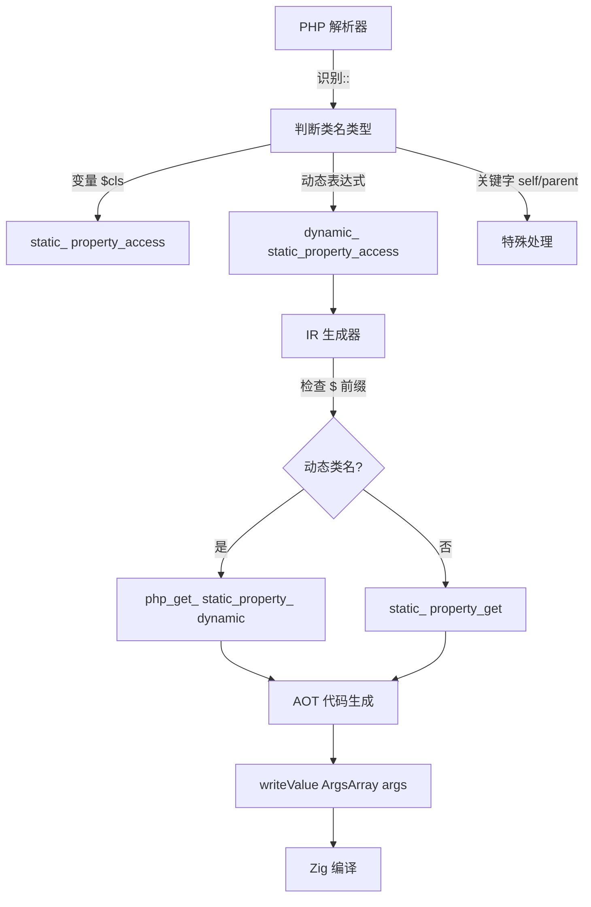

# 动态静态访问扩展及 AOT 代码生成优化

生成时间: 2026-07-22
Commit Hash: d66e15b
模块: AOT 代码生成器

---

## TL;DR

本次更新实现了 PHP 动态类名静态访问的完整支持，包括 `($expr)::method()`、`($expr)::$prop` 和 `($expr)::CONSTANT`。同时优化了 AOT 代码生成器中的 PHI 赋值路径统一和嵌套循环的 `return` 路径跟踪机制，提升了类型安全性和控制流生成的正确性。

## 影响范围

| 影响域 | 描述 |
|--------|------|
| **语法支持** | 新增 `($expr)::$prop` 和 `($expr)::CONSTANT` 语法支持 |
| **AST 节点** | 新增 `dynamic_static_property_access` 和 `dynamic_class_constant_access` 两个节点类型 |
| **IR 生成** | 实现对应 IR 生成函数，对接运行时动态分发机制 |
| **运行时** | 新增 `php_get_static_property_dynamic` 和 `php_get_class_constant_dynamic` 函数 |
| **代码生成** | 统一 PHI 赋值路径使用 `writePtrAwareAssign`，修复嵌套循环 return 路径跟踪 |

## 核心变更

### 1. 动态静态属性/常量访问支持

| 组件 | 变更 |
|------|------|
| **parser.zig** | 重构 `::` 运算符解析逻辑，支持动态类名的静态属性/常量访问 |
| **ast.zig** | 新增 `dynamic_static_property_access` 和 `dynamic_class_constant_access` 节点类型 |
| **ir_generator.zig** | 实现 `generateDynamicStaticPropertyAccess` 和 `generateDynamicClassConstantAccess` |
| **runtime_lib_template.zig** | 新增 `php_get_static_property_dynamic` 和 `php_get_class_constant_dynamic` 函数 |
| **native_linker.zig** | 注册新函数到内置函数表，添加代码生成分支 |

### 2. PHI 赋值路径统一

| 变更点 | 说明 |
|--------|------|
| **writePtrAwareAssign** | 统一所有非循环依赖 PHI 赋值使用该函数 |
| **generatePhiValueAssignment** | 保留循环依赖场景的 `phi_temp` 机制（必要例外） |
| **PHI 路径检查** | 验证所有 PHI 赋值路径已统一，无遗漏的直连赋值 |

### 3. 嵌套循环 Return 路径跟踪

| 变更点 | 说明 |
|--------|------|
| **generateWhileLoopStructuredNew** | 添加 `return_generated` save/restore 机制 |
| **generateStandardForLoop** | 主循环和 epilogue 循环均添加 save/restore |
| **作用域隔离** | 循环体内的 `return` 不影响外层循环的 PHI 更新 |

## 可视化概览

### 代码与逻辑映射



### 执行流程

```
PHP 源码 ($cls)::$prop
  ↓
解析器 → dynamic_static_property_access 节点
  ↓
IR 生成器 → php_get_static_property_dynamic([class_val, prop_name])
  ↓
代码生成器 → try runtime.php_get_static_property_dynamic(&[_]Value{...}, runtime_allocator)
  ↓
运行时 → findClass(class_name) → getStaticProperty(prop_name)
```

## 详细变更分析

### 端/模块层

#### AST 模块
- 新增两个节点数据结构：
  ```zig
  dynamic_static_property_access: struct {
      class_expr: Index,      // 类名表达式
      property_name: StringId,  // 属性名
  },
  dynamic_class_constant_access: struct {
      class_expr: Index,      // 类名表达式
      constant_name: StringId,  // 常量名
  }
  ```

#### IR 生成器
- 实现动态路径检测：`class_name.len > 0 and class_name[0] == '$'`
- 对于 `$cls::$prop` 场景：
  1. 提取类名变量值（`global_get` 或 `load`）
  2. 构造属性名常量（`const_string`）
  3. 调用动态函数

#### 运行时
- `php_get_static_property_dynamic(args: []const Value, allocator: Allocator) !Value`
  - 参数：`[class_name_val, property_name_val]`
  - 转发给 `php_get_static_property(class_name, prop_name)`

- `php_get_class_constant_dynamic(args: []const Value, allocator: Allocator) !Value`
  - 特殊处理 `::class` → 返回类名字符串
  - 遍历继承链查找类常量（`static_properties` 字段）

### 涉及文件列表

| 文件 | 变更 |
|------|------|
| `src/compiler/ast.zig` | 新增两个 AST 节点类型 |
| `src/compiler/parser.zig` | 重构 `::` 解析逻辑，支持动态类名属性/常量 |
| `src/aot/ir_generator.zig` | 实现 IR 生成，添加 `$` 前缀检测 |
| `src/aot/runtime_lib_template.zig` | 新增两个动态访问函数 |
| `src/aot/native_linker.zig` | 注册函数，添加代码生成分支，统一 PHI，作用域栈 |

## 影响与风险评估

### 是否破坏式变更
- 否。新增语法和函数，不影响现有代码。

### 变更影响范围及明细
- **语法支持**：新增 `($expr)::$prop` 和 `($expr)::CONSTANT`，兼容标准 PHP
- **编译产物**：`writeValueArgsArray` 使用 `&[_]runtime.Value{...}` 格式
- **内存安全**：所有动态访问均通过引用计数管理

### 需要特别注意的点
1. **变量名包含 `$`**：AST 中变量名存储为 `$cls`（含 `$` 前缀），IR 检测 `class_name[0] == '$'` 判断动态类名
2. **类常量存储位置**：类常量存储在 `static_properties` 而非独立 `constants` 字段
3. **循环作用域隔离**：`return_generated` save/restore 防止内层循环 `return` 影响外层 PHI 更新

### 复测路径
1. **动态静态调用**：`($cls)::method()`、`($cls)::$prop`、`($cls)::CONSTANT`
2. **嵌套循环 return**：内层循环 `return` 后外层循环 PHI 应正常更新
3. **类型安全**：`Value` vs `*Value` PHI 赋值正确解引用

## 遗留问题/潜在问题

1. **命名空间支持**：当前动态类名解析未处理命名空间前缀（如 `Foo\\Bar::CONST`）
2. **类常量继承**：`php_get_class_constant_dynamic` 使用简单的链式遍历，未处理 `use` 别名

## 后续开发/优化建议

| 优先级 | 建议 | 影响面 | 落地成本 |
|--------|------|--------|----------|
| P0 | 扩展动态类名支持到 `::class` 特殊场景 | 高 | 低 |
| P1 | 实现命名空间前缀动态解析 | 中 | 中 |
| P2 | 优化类常量继承查找为哈希表缓存 | 低 | 中 |
| P2 | 添加动态静态访问的 JIT 快速路径 | 低 | 高 |

---

## 附录：测试脚本

```php
<?php
// 测试动态静态访问
class Foo {
    public static $count = 42;
    const VERSION = "1.0.0";

    public static function getName(): string {
        return "FooClass";
    }
}

$cls = "Foo";
echo ($cls)::getName() . "\n";     // FooClass
echo ($cls)::$count . "\n";        // 42
echo ($cls)::VERSION . "\n";        // 1.0.0
```

编译运行：
```bash
./zig-out/bin/php-interpreter --compile --output=aot_test test.php
./aot_test
```