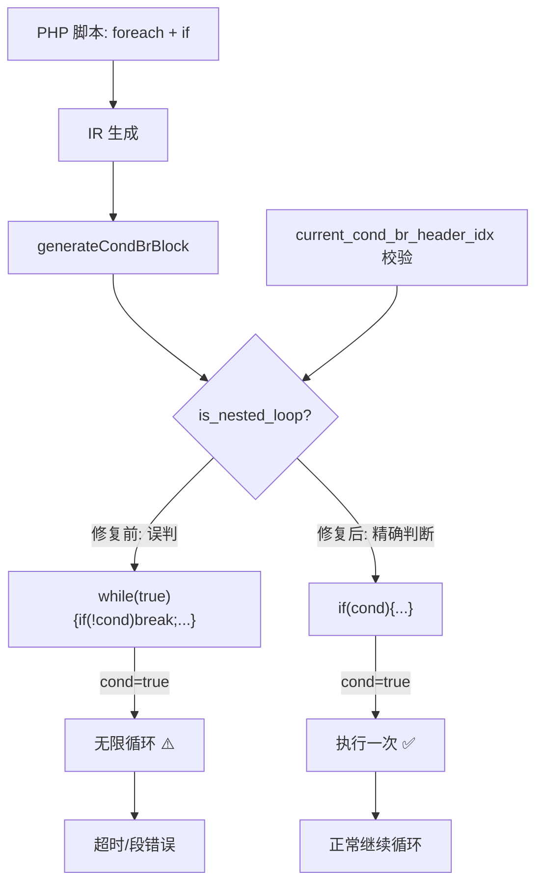

# AOT 修复：is_nested_loop 误判导致 if 语句在循环内生成无限循环

**提交哈希**: `460d38b`
**日期**: 2026-07-22
**影响级别**: P0（关键 — 影响 ReleaseFast 模式下 7 个脚本的运行时正确性）

---

## 1. 高层摘要（TL;DR）

`generateCondBrBlock` 中的 `is_nested_loop` 检测逻辑存在误判：仅检查 `then` 块的 `br` 目标是否已被 `processed.contains()` 标记，但 `if` 语句的 `then` 块也可能 `br` 到已处理的 merge 点（如外层 `if` 的汇聚点或循环体块），导致误判为嵌套循环。

误判后果：生成 `while(true){if(!cond)break;...}` 但缺少末尾 `break`，当条件为 `true` 时形成无限循环，在 ReleaseFast 下表现为超时（exit=124）或段错误（exit=139）。

**修复**：增加 `current_cond_br_header_idx` 校验，只有 `br` 目标 == 当前循环头索引时才标记为嵌套循环（真正的回边），否则生成标准 `if(cond){...}` 模式。

---

## 2. 影响范围

| 维度 | 说明 |
|------|------|
| 影响模式 | AOT ReleaseFast/ReleaseSafe 编译模式 |
| 影响场景 | 循环（for/foreach/while）内包含 `if` 语句的 PHP 脚本 |
| 影响脚本数 | 9 个回归失败中的 7 个已修复 |
| Debug 模式 | 不受影响（Debug 模式下不触发优化路径） |

### 修复前后对比

| 脚本 | 修复前 | 修复后 | 根因 |
|------|--------|--------|------|
| `f104_game_engine_ecs_collision_render.php` | 段错误 (exit=139) | ✅ 通过 | `if` 在 `foreach` 内误判为嵌套循环 |
| `f051_validator_rule_chain_batch.php` | 超时 (exit=124) | ✅ 通过 | 同上 |
| `f056_crdt_gcounter_lww_orset.php` | 超时 (exit=124) | ✅ 通过 | 同上 |
| `f070_event_sourcing_cqrs_snapshot.php` | 输出差异 | ✅ 通过 | 同上 |
| `f085_geo_rtree_knn_geocoder.php` | 超时 (exit=124) | ✅ 通过 | 同上 |
| `f090_promise_future_async_concurrent.php` | 输出差异 | ✅ 通过 | 同上 |
| `f161_json_xml_csv_parsing.php` | 超时 (exit=124) | ✅ 通过 | 同上 |
| `f081_bplustree_index_range_query.php` | 超时 (exit=124) | ❌ 仍挂起 | 疑似 `break 2` 多层跳出支持缺失 |
| `f171_state_machine_dfa.php` | 超时 (exit=124) | ❌ 仍挂起 | 疑似 `for` 循环内嵌套问题 |

---

## 3. 核心变更

| 文件 | 变更类型 | 变更内容 |
|------|----------|----------|
| `src/aot/native_linker.zig` | 修复 | `generateCondBrBlock` 函数 `is_nested_loop` 检测逻辑：增加 `current_cond_br_header_idx` 校验 |
| `scripts/regression_test_720.sh` | 新增 | macOS 兼容的回归测试脚本（内置 timeout 实现） |

### 变更代码位置

```
文件: src/aot/native_linker.zig
函数: generateCondBrBlock
行号: ~12993-13005（修复前）
```

**修复前**：
```zig
if (br_target_idx < func.blocks.items.len and processed.contains(br_target_idx)) {
    is_nested_loop = true;  // 误判：任何已处理的 br 目标都被视为回边
}
```

**修复后**：
```zig
if (br_target_idx < func.blocks.items.len and processed.contains(br_target_idx)) {
    // 只有 br 目标是当前循环头时才是真正的回边
    if (self.current_cond_br_header_idx) |hdr_idx| {
        is_nested_loop = (br_target_idx == hdr_idx);
    }
    // 如果不在循环中，不标记为嵌套循环
}
```

---

## 4. 可视化概览



---

## 5. 详细变更分析

### 5.1 端/模块层

| 层级 | 模块 | 变更说明 |
|------|------|----------|
| 编译器后端 | `src/aot/native_linker.zig` | `generateCondBrBlock` 函数中 `is_nested_loop` 检测条件收紧 |
| 测试工具 | `scripts/regression_test_720.sh` | 新增 macOS 兼容回归测试脚本 |

### 5.2 修复原理

#### 背景：`generateCondBrBlock` 的两种生成路径

当 `generateCondBrBlock` 处理 `cond_br`（条件分支）指令时，有两种代码生成路径：

1. **`is_nested_loop = true`**：生成 `while (true) { header; if (!cond) break; ...body... }` 模式
   - 适用于：真正的循环回边（`then` 块 `br` 回到循环头）
   - 循环体执行后自动回到 `while` 顶部，重复执行

2. **`is_nested_loop = false`**：生成 `if (cond) { ...body... } else { ...else... }` 模式
   - 适用于：普通 `if` 语句
   - `then` 块只执行一次

#### 误判场景

当 `if` 语句位于 `foreach`/`for`/`while` 循环内部时：
- `if` 的 `then` 块执行完毕后 `br` 到 `if` 之后的 merge 点
- 该 merge 点可能已被 `processed` 标记（因为循环体的其他块已经处理过）
- 旧检测逻辑误判为"嵌套循环"，生成 `while(true){if(!cond)break;...}`
- 但 `then` 块末尾没有 `break`，导致条件为 `true` 时无限循环

#### 修复方法

利用 `current_cond_br_header_idx` 字段（在 `generateWhileLoopStructuredNew` 中设置）：
- 该字段记录当前正在生成的 `while` 循环的头块索引
- 只有 `br` 目标 == `current_cond_br_header_idx` 时才是真正的循环回边
- 否则是 `if` 语句的 forward branch，应生成标准 `if(cond){...}` 模式

---

## 6. 影响与风险评估

### 是否破坏式变更

**否**。修复仅收紧了 `is_nested_loop` 的检测条件，不会将真正的循环回边误判为 `if` 语句（因为 `current_cond_br_header_idx` 精确匹配循环头）。

### 变更影响范围

| 范围 | 影响 |
|------|------|
| 真正的嵌套循环（`while` 内 `cond_br` 的 `then` 块回边到循环头） | 无影响 — `br` 目标 == `current_cond_br_header_idx`，仍标记为 `is_nested_loop` |
| 循环内的 `if` 语句（`then` 块 `br` 到 merge 点） | 修复 — 不再误判为嵌套循环，正确生成 `if(cond){...}` |
| 顶层 `if` 语句（不在循环内） | 无影响 — `current_cond_br_header_idx` 为 null，不触发 `is_nested_loop` |

### 需要特别注意的点

1. `current_cond_br_header_idx` 仅在 `generateWhileLoopStructuredNew` 中设置，`generateStandardForLoop` 不设置此字段。如果 `for` 循环内也有类似问题，可能需要额外处理。
2. `f081` 和 `f171` 仍有挂起问题，疑似 `break 2` 多层跳出或 `for` 循环嵌套问题，需独立调查。

### 复测路径

```bash
# 编译
zig build

# 单独测试修复的脚本
./zig-out/bin/php-interpreter --compile --output=/tmp/aot_test fuzzy_scripts_720/pass/f104_game_engine_ecs_collision_render.php
/tmp/aot_test

# 全量回归
bash scripts/regression_test_720.sh
```

---

## 7. 遗留问题/潜在问题

| 编号 | 问题 | 优先级 | 说明 |
|------|------|--------|------|
| 1 | `f081_bplustree_index_range_query.php` 仍挂起 | P1 | 疑似 `break 2` 多层跳出不支持，导致 `while($leaf!==null)` 无限循环 |
| 2 | `f171_state_machine_dfa.php` 仍挂起 | P1 | 疑似 `for` 循环内嵌套 `if` 的代码生成问题（`generateStandardForLoop` 未设置 `current_cond_br_header_idx`） |
| 3 | `f070` 和 `f090` 输出可能仍有差异 | P2 | 修复后运行正常但输出与 PHP 可能有细微差异（需全量回归确认） |

---

## 8. 后续开发/优化建议

| 优先级 | 建议 | 影响面 | 落地成本 |
|--------|------|--------|----------|
| P0 | 在 `generateStandardForLoop` 中也设置 `current_cond_br_header_idx` | 高 | 低 |
| P1 | 支持 `break N` 多层跳出 | 中 | 中 |
| P2 | 将 `is_nested_loop` 检测升级为基于支配树的回边分析 | 中 | 高 |
| P2 | 为 `generateCondBrBlock` 添加单元测试 | 中 | 中 |
| P3 | 考虑废弃 `while(true){if(!cond)break;...}` 模式，统一使用 `if/else` | 低 | 高 |
