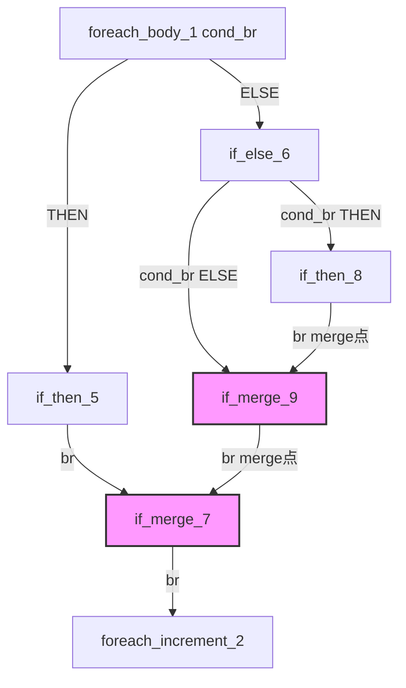

# AOT PHI 一致性修复 — merge→merge 链式处理 (f070)

## 1. 高层摘要 (TL;DR)

修复了 AOT 编译器中 `foreach` 循环体内嵌套 `if/else/if/else` 结构时，merge 块 PHI 赋值被无条件覆盖的缺陷（f070）。通过在 `generateCondBrBlock` 的 THEN/ELSE merge 点添加 merge→merge 链式处理，以及在 `body_block_indices` 中跳过已被分支内处理的 merge 块，实现了 PHI 赋值的分支内一致性。

**回归测试结果：59 PASS, 2 FAIL（f004 测试脚本路径问题 + f090 已知闭包缺陷）**

## 2. 影响范围

| 范围 | 说明 |
|------|------|
| 影响文件 | `src/aot/native_linker.zig` |
| 影响路径 | `body_block_indices`（while/foreach 循环体代码生成） |
| 影响组件 | `generateCondBrBlock`、`generateBrChain` |
| 影响测试 | f070 修复，f027/f176 等 57 个脚本无回归 |

## 3. 核心变更

| 变更点 | 位置 | 说明 |
|--------|------|------|
| 新增字段 `cond_br_merge_phi_generated` | 结构体字段 | 跟踪已被 cond_br 分支内处理过 PHI 的 merge 块索引集合 |
| `generateCondBrBlock` THEN merge→merge 处理 | THEN merge 点 | 当 merge 块 br 到另一个 merge 块时，在 THEN 分支内生成目标 merge 块的 PHI |
| `generateCondBrBlock` ELSE merge→merge 处理 | ELSE merge 点 | 同上，在 ELSE 分支内生成 |
| `generateBrChain` merge→merge 链式处理 | merge point handler | 在 `generateBrChain` 内也处理 merge→merge 链，并标记 `cond_br_merge_phi_generated` |
| `body_block_indices` setup | 循环体生成入口 | 设置 `cond_br_merge_phi_generated` 追踪集 |
| `body_block_indices` `target_phi_handled` 检查 | br 处理 | 当源和目标都是已处理的 merge 块时，跳过 `generateBrChain` |

### 关键设计决策

- **不移除 `!processed_body.contains`** → 改为不检查（因为 `br_target_idx != header_idx` 已排除循环头）
- **不修改 `isMergeBlock`** → 保持原始回边检测逻辑，避免影响嵌套循环
- **不修改 `go` 函数** → f070 使用 `body_block_indices` 路径，不需要 `generateStandardForLoop` 修改

## 4. 可视化概览

### 修复前问题
- `if_merge_9` 的 br 到 `if_merge_7` 在 `body_block_indices` for 循环中被**无条件**处理
- 生成的 `reg_70 = reg_71` 覆盖了 THEN 路径（`if_then_5 → if_merge_7`）的值

### 修复后
- THEN 分支内：`generateBrChain` 处理 `if_then_5 → if_merge_7`，标记 `if_merge_7`
- ELSE 分支内：`generateCondBrBlock` ELSE merge 点处理 `if_merge_9`，merge→merge 生成 `if_merge_7` PHI
- 顶层 for 循环：`target_phi_handled` 检测到 `if_merge_9` 和 `if_merge_7` 都已标记 → 跳过 `generateBrChain`

## 5. 详细变更分析

### 涉及文件列表

| 文件 | 变更类型 |
|------|----------|
| `src/aot/native_linker.zig` | 新增字段 + 5 处代码修改 |

### 变更点描述

1. **`cond_br_merge_phi_generated` 字段**（~line 255）
   - `?*std.AutoHashMap(usize, void)` 类型，跟踪已处理 PHI 的 merge 块

2. **`generateCondBrBlock` THEN merge→merge**（~line 13101）
   - 在 THEN merge 点的 br-to-exit 检查后，添加 `else if` 分支
   - 检查 `!processed.contains(merge_target_idx) and countPredecessors > 1`
   - 生成目标 merge 块的 PHI 赋值并标记

3. **`generateCondBrBlock` ELSE merge→merge**（~line 13246）
   - 对称处理，在 ELSE merge 点添加相同逻辑

4. **`generateBrChain` merge→merge 链式**（~line 13408）
   - 在 merge point handler 中添加链式处理
   - 检查 `!processed.contains(next_target_idx) and countPredecessors > 1`
   - 生成并标记目标 merge 块

5. **`body_block_indices` setup**（~line 14050）
   - 创建 `cond_br_merge_phi_set`，保存/恢复 `self.cond_br_merge_phi_generated`

6. **`body_block_indices` `target_phi_handled`**（~line 14405）
   - 检查 `set.contains(blk_idx) and set.contains(br_target_idx)`
   - 同时检查 `countPredecessors > 1`（双方都是 merge 块）
   - 不检查 `!processed_body.contains`（因为 `br_target_idx != header_idx` 已排除循环头）

## 6. 影响与风险评估

- **是否破坏式变更**：否
- **变更影响范围**：仅影响 `body_block_indices` 路径（while/foreach 循环），不影响 `generateStandardForLoop`（for 循环）
- **需要特别注意的点**：
  - `cond_br_merge_phi_generated` 是线程局部状态，通过 save/restore 机制保证嵌套循环正确性
  - `!processed.contains` 检查在 `generateCondBrBlock` 和 `generateBrChain` 中防止为循环头生成错误 PHI
- **复测路径**：
  1. `scripts/test_class_method.php`（f070）
  2. `fuzzy_scripts_720/pass/f027_number_theory_primes_modular.php`
  3. `fuzzy_scripts_720/pass/f176_specification_chain_rules.php`
  4. 全量 `fuzzy_scripts_720/pass/*.php`

## 7. 遗留问题/潜在问题

- **f090 Promise.all 闭包变量捕获缺陷**（P2）：独立问题，与本次修复无关
- **`go` 函数路径**（`generateStandardForLoop`）：未修改，如果 for 循环出现类似 merge→merge 模式，可能需要类似修复
- **`generateBrChain` 回边处理器的标记**：当前会标记回边目标（包括循环头），但 `target_phi_handled` 检查通过 `br_target_idx != header_idx` 排除循环头，不会影响循环变量更新

## 8. 后续开发/优化建议

| 优先级 | 任务 | 影响面 | 落地成本 |
|--------|------|--------|----------|
| P0 | 提交当前修复并清理编译产物 | 全局 | 低 |
| P1 | 调查 f090 Promise.all 闭包变量捕获 | f090 | 高 |
| P2 | 在 `go` 函数中添加类似 merge→merge 处理（for 循环路径） | for 循环 | 中 |
| P2 | 考虑将 `cond_br_merge_phi_generated` 改为 per-cond_br 作用域 | 代码清晰度 | 低 |
| P3 | 添加 f070 场景的单元测试 | 测试覆盖 | 中 |
