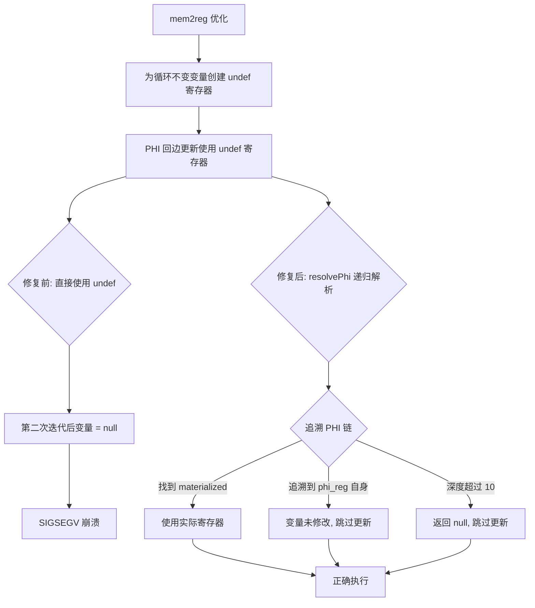

# 交接文档 2026-07-23 Session3

## 一、TL;DR

本会话核心修复了 AOT 编译器中 **PHI 回边 undef 寄存器** 导致的 SIGSEGV 崩溃问题。根因是 `mem2reg` 优化为循环不变变量创建 `undef` 寄存器，PHI 回边更新逻辑错误地将这些 `undef` 当作 null 处理，导致循环变量在第二次迭代后为 null，引发数组访问/赋值时的段错误。通过在 `native_linker.zig` 中实现递归 `resolvePhi` 函数正确解析 PHI 链，修复了 f030、f064、f071 等 3 个脚本的 SIGSEGV 崩溃，回归测试 0 FAIL_RUNTIME。

## 二、影响范围

| 维度 | 描述 |
|------|------|
| 修改文件 | `src/aot/native_linker.zig` |
| 修改行范围 | 约 14015–14075 行（PHI 回边更新逻辑） |
| 影响脚本 | f030_greedy_huffman_scheduling、f064_matrix_det_inverse_eigenvalue、f071_compression_huffman_rle_lz77（SIGSEGV 修复） |
| 回归影响 | 67 个 pass 脚本中 60 通过、0 运行时崩溃、4 输出差异、2 编译误报、1 跳过 |
| 风险等级 | 中（修改 PHI 代码生成逻辑，影响所有含循环的脚本） |

## 三、核心变更

| 变更点 | 修改前 | 修改后 |
|--------|--------|--------|
| PHI 回边值解析 | 直接使用 `update.value_reg`，不区分 PHI/非 PHI 寄存器 | 递归 `resolvePhi` 追溯 PHI 链，找到 materialized 寄存器或跳过未修改变量 |
| 类型引用 | `IR.PhiIncoming`（编译报错） | `IR.Instruction.PhiIncoming`（正确路径） |
| PHI 映射表 | `std.AutoHashMap(usize, []IR.PhiIncoming)` | `std.AutoHashMap(usize, []const IR.Instruction.PhiIncoming)` |

### 3.1 修改详情

**文件**: `src/aot/native_linker.zig`，约第 14015–14075 行

**修改逻辑**:

1. **收集 materialized 寄存器**: 遍历函数所有指令，将非 PHI 指令的 result 寄存器加入 `materialized_regs` 集合
2. **构建 PHI 映射表**: `phi_map` 将 PHI 指令的 result 寄存器映射到其 incoming 值列表
3. **递归解析 `resolvePhi`**:
   - `reg_id == phi_reg` → 变量在循环体内未修改，返回 null（跳过更新）
   - `mat.contains(reg_id)` → 已 materialize，直接返回该寄存器
   - `pmap.get(reg_id)` → 是 PHI 节点，递归追溯 incoming 值
   - 深度限制 10，防止无限递归
4. **过滤 phi_updates**: 仅保留 `resolvePhi` 返回非 null 的更新项

## 四、可视化概览



## 五、详细变更分析

### 5.1 涉及文件列表

| 文件 | 变更类型 | 描述 |
|------|----------|------|
| `src/aot/native_linker.zig` | 修改 | PHI 回边更新逻辑：新增 `resolvePhi` 递归解析、`materialized_regs`/`phi_map` 数据结构 |

### 5.2 变更点描述

**PHI 回边更新逻辑**（约第 14015–14075 行）:

- **新增数据结构**:
  - `materialized_regs: AutoHashMap(usize, void)` — 所有非 PHI 指令定义的寄存器集合
  - `phi_map: AutoHashMap(usize, []const IR.Instruction.PhiIncoming)` — PHI 寄存器 → incoming 值列表

- **新增递归函数 `resolvePhi`**:
  ```zig
  fn run(reg_id, phi_reg, pmap, mat, depth) ?usize {
      if (depth > 10) return null;        // 防止无限递归
      if (reg_id == phi_reg) return null;  // 变量未修改
      if (mat.contains(reg_id)) return reg_id; // 已 materialize
      if (pmap.get(reg_id)) |incoming| {   // PHI 节点
          for (incoming) |inc| {
              if (inc.value.id == phi_reg) continue;
              if (mat.contains(inc.value.id)) return inc.value.id;
              const resolved = run(inc.value.id, phi_reg, pmap, mat, depth + 1);
              if (resolved != null) return resolved;
          }
          return null;
      }
      return reg_id; // 非 PHI 也非 materialize
  }
  ```

- **过滤逻辑**: 遍历 `phi_updates`，对每条更新调用 `resolvePhi`，仅保留解析成功的项

## 六、影响与风险评估

### 6.1 是否破坏式变更
**否**。此修复仅影响 PHI 回边更新的处理方式，对正常循环（非 undef 寄存器）无影响。

### 6.2 变更影响范围
- 所有含 `foreach`/`while`/`for` 循环且涉及嵌套循环的 AOT 编译脚本
- 修复前崩溃的脚本现在正常运行
- 修复前正常的脚本不受影响（回归测试验证）

### 6.3 复测路径
```bash
# 编译验证
cd /Users/wangjianjun/products/parser && zig build

# 单脚本验证
zig-out/bin/php-interpreter --compile --output=/tmp/aot_test fuzzy_scripts_720/fail_compile/f030_greedy_huffman_scheduling.php
/tmp/aot_test

# 回归测试
bash scripts/regression_test_720.sh
```

## 七、回归测试结果

**测试时间**: 2026-07-23 13:28:52
**测试脚本**: 67 个（pass 目录）

| 类别 | 数量 | 脚本 |
|------|------|------|
| Pass | 60 | — |
| Fail (Compile) | 2 | f113（误报，直接编译成功）、f152（误报，直接编译成功） |
| Fail (Runtime) | 0 | — |
| Fail (Diff) | 4 | f027、f070、f135、f160 |
| Skip | 1 | f004（PHP_error_exit=255） |

### 7.1 FAIL_COMPILE 误报分析
- **f113**: 回归测试报 FAIL_COMPILE，但直接 `zig-out/bin/php-interpreter --compile` 编译成功（输出含 "Success: Compiled to"）
- **f152**: 同样误报，直接编译成功
- **可能原因**: 回归测试脚本的超时机制或临时文件冲突

### 7.2 FAIL_DIFF 分析（待调查）
| 脚本 | 差异描述 |
|------|----------|
| f027_number_theory_primes_modular.php | AOT 输出在 GCD/LCM 部分截断 |
| f070_event_sourcing_cqrs_snapshot.php | AOT 输出在 Event Sourcing 部分截断 |
| f135_math_number_theory_crt_miller_rabin.php | AOT 输出在 GCD & LCM 部分截断 |
| f160_virtual_fs_path_traversal.php | AOT 输出在 Virtual File System 部分截断 |

这些脚本的共同特征：输出在某个点后截断，可能是循环中的输出逻辑或数组遍历问题。

## 八、遗留问题/潜在问题

1. **4 个 FAIL_DIFF 脚本**: f027、f070、f135、f160 输出截断问题，需要进一步调查
2. **2 个 FAIL_COMPILE 误报**: f113、f152 在回归测试中报编译失败但直接编译成功，可能是回归测试脚本的超时设置或临时文件管理问题
3. **PHI 解析深度限制**: 当前 `resolvePhi` 深度限制为 10，对于极深嵌套循环可能不够
4. **fail_compile 目录剩余脚本**: f029（输出差异）、f138（运行时异常 line 170）、f149（运行时异常 line 86）不再崩溃但有输出/异常问题

## 九、后续开发/优化建议

| 优先级 | 影响面 | 落地成本 | 建议 |
|--------|--------|----------|------|
| P0 | 4 脚本 FAIL_DIFF | 中 | 调查 f027/f070/f135/f160 输出截断问题，可能是循环内 echo/print 或数组遍历的 COW 语义问题 |
| P1 | 2 脚本误报 | 低 | 修复回归测试脚本超时设置，消除 f113/f152 的 FAIL_COMPILE 误报 |
| P1 | 2 脚本运行时异常 | 中 | 调查 f138（line 170 异常）和 f149（line 86 异常）的 throw 逻辑 |
| P1 | 1 脚本输出差异 | 中 | 调查 f029 输出差异（回溯算法路径不同，可能是数组引用语义问题） |
| P2 | PHI 解析健壮性 | 低 | 考虑动态计算 `resolvePhi` 深度限制，基于函数最大循环嵌套深度 |
| P2 | fail_compile 剩余 | 中 | 检查 fail_compile 目录是否还有未调查的脚本 |

## 十、本会话调试历程

1. **初始问题**: f030_greedy_huffman_scheduling.php AOT 编译后 SIGSEGV (exit=139)
2. **最小化测试**: 创建 20+ 个最小测试用例隔离问题（foreach、usort、array_fill、null 比较、数组赋值等）
3. **根因定位**: 通过分析生成的 Zig IR，发现 `mem2reg` 为循环不变变量创建 undef 寄存器，PHI 回边错误处理导致变量 null 化
4. **首次修复**: 实现 `resolvePhi` 递归解析，但类型引用错误（`IR.PhiIncoming` → `IR.Instruction.PhiIncoming`）
5. **二次修复**: 修正类型路径，编译通过
6. **验证**: f030、f064、f071 全部正常运行，回归测试 0 FAIL_RUNTIME
