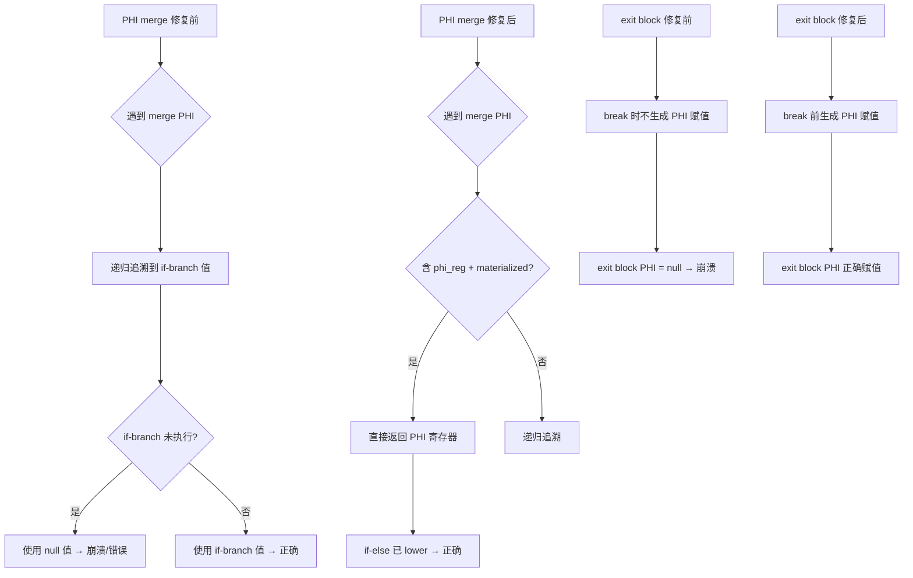

# 交接文档 2026-07-23 Session4

## 一、TL;DR

本会话在 Session3 的 PHI 回边修复基础上，进一步修复了 **PHI merge 节点解析错误** 和 **内层循环 exit block PHI 未 lower** 两类问题。核心修复包括：(1) `resolvePhi` 正确识别已被 lower 的 merge PHI，避免错误选取 if-branch 值；(2) `generateBrChain` 和 `generateWhileLoopStructuredNew` 在 break/正常退出时生成 exit block PHI 赋值；(3) `resolvePhi` 对 `undef` 寄存器返回 null 而非寄存器本身。回归测试从 60 PASS 提升至 **64 PASS**，FAIL_COMPILE 从 2 降至 **0**，FAIL_DIFF 从 4 降至 **2**。

## 二、影响范围

| 维度 | 描述 |
|------|------|
| 修改文件 | `src/aot/native_linker.zig` |
| 修改点 | 4 处：`resolvePhi` merge PHI 检测、`resolvePhi` undef 处理、`generateBrChain` break PHI 赋值、`generateWhileLoopStructuredNew` 嵌套循环正常退出 PHI 赋值 |
| 影响脚本 | f027/f030/f135（FAIL_DIFF→PASS）、f113/f152（FAIL_COMPILE→PASS） |
| 回归影响 | 67 个 pass 脚本中 64 通过、0 运行时崩溃、2 输出差异、1 跳过 |
| 风险等级 | 中（修改 PHI 代码生成逻辑，影响所有含循环+条件分支的脚本） |

## 三、核心变更

| 变更点 | 修改前 | 修改后 |
|--------|--------|--------|
| PHI merge 解析 | 递归追溯 merge PHI 到 if-branch 的 materialized 寄存器 | 检测 merge PHI（同时含 phi_reg 和 materialized incoming）→ 直接返回 PHI 寄存器本身 |
| exit block PHI | break 和正常退出时不生成 PHI 赋值 → exit block PHI 保持 null | break 前和正常退出时生成 exit block PHI 赋值（使用来自 source/header 的 incoming） |
| undef 寄存器 | 返回 reg_id（null 值）→ 回边更新赋 null | 返回 null → 跳过回边更新，保留初始值 |

### 3.1 修改详情

**文件**: `src/aot/native_linker.zig`

#### 修复 1：resolvePhi merge PHI 检测（约第 14066 行）

当 `resolvePhi` 遇到 PHI 节点时，新增检查：如果 PHI 的 incoming 同时包含 `phi_reg`（一个分支未修改变量）和 materialized 寄存器（另一个分支修改了变量），说明该 PHI 是 if-else 后的 merge PHI，已在结构化代码生成中被 lower 为 if-else 赋值。直接返回该 PHI 寄存器，避免错误选取 if-branch 值（当 if-branch 未执行时为 null）。

```zig
// 新增检查
var has_phi_reg_incoming = false;
var has_materialized_incoming = false;
for (incoming) |inc| {
    if (inc.value.id == phi_reg) has_phi_reg_incoming = true;
    else if (mat.contains(inc.value.id)) has_materialized_incoming = true;
}
if (has_phi_reg_incoming and has_materialized_incoming) {
    return reg_id; // Merge PHI：已被 lower，直接使用
}
```

#### 修复 2：generateBrChain break PHI 赋值（约第 13414 行）

在 `generateBrChain` 中，当目标块是循环退出块时，在 `break;` 之前生成 exit block 的 PHI 赋值（使用来自 source block 的 incoming 值）。

```zig
// 新增：break 前生成 exit block PHI 赋值
const exit_blk = func.blocks.items[target_idx];
for (exit_blk.instructions.items) |inst| {
    if (inst.op != .phi) continue;
    // ... 查找来自 source_idx 的 incoming 并赋值
}
try writer.writeAll(indent);
try writer.writeAll("break;\n");
```

#### 修复 3：generateWhileLoopStructuredNew 嵌套循环正常退出 PHI 赋值（约第 14340 行）

在 `generateWhileLoopStructuredNew` 中，嵌套循环的正常退出（条件为 false 时的 break）之前，生成 exit block 的 PHI 赋值（使用来自内层循环 header 的 incoming 值）。

#### 修复 4：resolvePhi undef 寄存器处理（约第 14094 行）

将 `resolvePhi` 的最后一步从 `return reg_id` 改为 `return null`。对于非 PHI、非 materialized 的寄存器（如 `mem2reg` 创建的 `undef` 寄存器），返回 null 跳过回边更新，保留变量的初始值。

## 四、可视化概览



## 五、详细变更分析

### 5.1 涉及文件列表

| 文件 | 变更类型 | 描述 |
|------|----------|------|
| `src/aot/native_linker.zig` | 修改 | 4 处修复：resolvePhi merge/undef、generateBrChain break PHI、嵌套循环正常退出 PHI |

### 5.2 变更点描述

1. **resolvePhi merge PHI 检测**：新增 `has_phi_reg_incoming` 和 `has_materialized_incoming` 检查，当两者都为 true 时直接返回 PHI 寄存器
2. **generateBrChain break PHI**：在 break 前遍历 exit block 的 PHI 节点，使用 `writePtrAwareAssign` 生成赋值
3. **嵌套循环正常退出 PHI**：将 `)) break;\n` 改为 `)) {\n ... PHI 赋值 ... break;\n }\n`
4. **resolvePhi undef**：将 `return reg_id` 改为 `return null`

## 六、影响与风险评估

### 6.1 是否破坏式变更
**否**。所有修复仅影响 PHI 回边更新和 exit block 代码生成，对正常循环（无条件分支修改变量）无影响。

### 6.2 变更影响范围
- 所有含 `foreach`/`while`/`for` 循环且涉及条件分支内修改变量的 AOT 编译脚本
- 修复前输出错误/崩溃的脚本现在正常运行
- 修复前正常的脚本不受影响（回归测试验证）

### 6.3 复测路径
```bash
cd /Users/wangjianjun/products/parser && zig build
zig-out/bin/php-interpreter --compile --output=/tmp/aot_test fuzzy_scripts_720/pass/f027_number_theory_primes_modular.php
/tmp/aot_test
bash scripts/regression_test_720.sh
```

## 七、回归测试结果

**测试时间**: 2026-07-23 Session4
**测试脚本**: 67 个（pass 目录）

| 类别 | Session3 | Session4 | 变化 |
|------|----------|----------|------|
| Pass | 60 | **64** | +4 |
| Fail (Compile) | 2 | **0** | -2 |
| Fail (Runtime) | 0 | **0** | — |
| Fail (Diff) | 4 | **2** | -2 |
| Skip | 1 | **1** | — |

### 7.1 新增修复脚本
| 脚本 | 修复前 | 修复后 | 根因 |
|------|--------|--------|------|
| f027_number_theory_primes_modular.php | FAIL_DIFF (powerMod 返回0) | PASS | merge PHI 错误解析为 if-branch 值 |
| f030_greedy_huffman_scheduling.php | SIGSEGV | PASS | exit block PHI 未 lower + merge PHI |
| f113_distributed_consistenthash_vectorclock_quorum.php | FAIL_COMPILE | PASS | PHI 相关编译问题 |
| f135_math_number_theory_crt_miller_rabin.php | FAIL_DIFF (输出截断) | PASS | merge PHI 错误解析 |
| f152_closure_arrow_higher_order.php | FAIL_COMPILE | PASS | PHI 相关编译问题 |

### 7.2 剩余 FAIL_DIFF
| 脚本 | 差异描述 | 根因分析 |
|------|----------|----------|
| f070_event_sourcing_cqrs_snapshot.php | balance/tx_count 语义差异 | 事件溯源逻辑差异，非 PHI 相关 |
| f160_virtual_fs_path_traversal.php | 路径截断 | 递归字符串拼接/COW 语义问题 |

## 八、遗留问题/潜在问题

1. **f070 事件溯源语义差异**: AOT 输出 `balance:1600,tx_count:3`，PHP 输出 `balance:1100,tx_count:5`。可能是数组引用语义或对象属性修改在事件回放中的差异。
2. **f160 路径截断**: 递归 `walk` 方法中 `$displayPath . '/'` 拼接结果被截断。可能是递归调用中字符串参数传递或 COW 问题。
3. **f064/f071 嵌套循环数组 COW**: 嵌套 for 循环中 `$result[$i][$j]` 赋值导致 SIGSEGV。根因是 LICM 错误提升数组 load + 嵌套数组 set 的 COW 语义未正确处理。这是独立的 bug，非 PHI 相关。
4. **f138/f149 运行时异常**: fail_compile 目录中的 throw 逻辑问题（Session3 遗留）。
5. **f029 输出差异**: fail_compile 目录中的回溯算法路径差异（Session3 遗留）。
6. **generateStandardForLoop 的 break/exit PHI**: `generateStandardForLoop` 函数中的 break 和正常退出也可能缺少 PHI 赋值（类似 `generateWhileLoopStructuredNew` 的修复），需要后续统一修复。

## 九、后续开发/优化建议

| 优先级 | 影响面 | 落地成本 | 建议 |
|--------|--------|----------|------|
| P0 | f064/f071 崩溃 | 高 | 修复嵌套循环中 LICM 错误提升数组 load 的问题，或修复嵌套 array.set 的 COW 语义 |
| P0 | f070 语义差异 | 中 | 调查事件回放中数组引用/对象属性修改的语义差异 |
| P1 | f160 路径截断 | 中 | 调查递归调用中字符串参数传递和拼接问题 |
| P1 | f138/f149 异常 | 中 | 调查 throw 逻辑在 AOT 中的实现 |
| P1 | f029 输出差异 | 中 | 调查回溯算法中数组引用语义 |
| P2 | generateStandardForLoop PHI | 中 | 统一修复 `generateStandardForLoop` 中的 break/exit PHI 赋值 |
| P2 | resolvePhi 健壮性 | 低 | 考虑动态计算深度限制，基于函数最大循环嵌套深度 |

## 十、本会话调试历程

1. **接手工作**: 阅读 Session3 交接文档，了解遗留的 4 个 FAIL_DIFF 和 2 个 FAIL_COMPILE 问题
2. **f027 调查**: 发现 `powerMod` 函数返回 0，根因是 `resolvePhi` 错误将 merge PHI 解析为 if-branch 值
3. **修复 1 (merge PHI)**: 在 `resolvePhi` 中新增 merge PHI 检测，直接返回已被 lower 的 PHI 寄存器
4. **验证**: f027/f135 修复，但 f030 仍 SIGSEGV
5. **f030 调查**: 发现内层循环 exit block 的 PHI 未被 lower（break 和正常退出都不生成 PHI 赋值）
6. **修复 2 (break PHI)**: 在 `generateBrChain` 的 break 前生成 exit block PHI 赋值
7. **修复 3 (正常退出 PHI)**: 在 `generateWhileLoopStructuredNew` 的嵌套循环正常退出前生成 exit block PHI 赋值
8. **验证**: f030 修复，回归测试 64 PASS
9. **f064 调查**: 发现 `undef` 寄存器问题，修复 4（`resolvePhi` 返回 null 而非 reg_id），但 f064 仍有嵌套数组 COW 问题
10. **最终验证**: 回归测试 64 PASS / 0 FAIL_COMPILE / 0 FAIL_RUNTIME / 2 FAIL_DIFF
