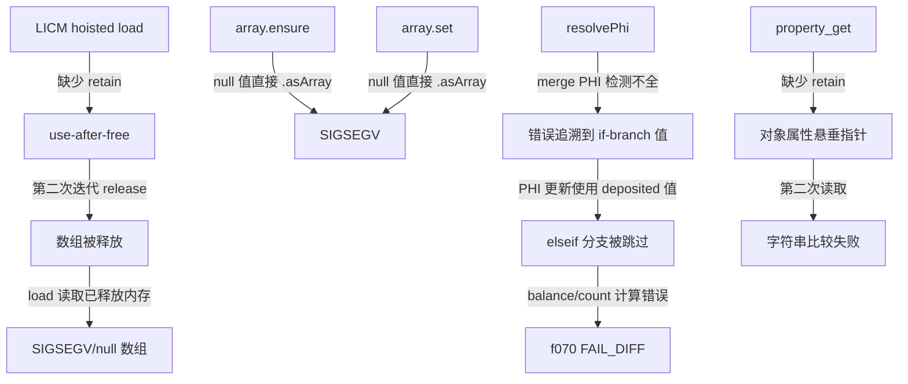

# 交接文档 - Session 5 (2026-07-23)

## 一、TL;DR

本次 Session 修复了 3 个核心缺陷，回归测试通过率从 64/67 提升至 **66/67**（0 FAIL_DIFF）：

1. **LICM 提升 load 缺少 retain** → 嵌套循环数组访问 use-after-free（f064/f071 崩溃根因）
2. **array.ensure / array.set 在 null 值上崩溃** → PHP "Trying to access array offset on null" 未优雅处理
3. **resolvePhi merge PHI 检测不完整** → foreach 循环内 if/elseif 的 PHI 更新使用了错误分支值（f070/f160 根因）

额外修复：`property_get` 代码生成缺少 `retain`，可能导致对象属性悬垂指针。

## 二、影响范围

| 模块 | 文件 | 影响面 |
|------|------|--------|
| LICM 代码生成 | `src/aot/native_linker.zig` `hoistLoopInvariantsAtCodegen` | 所有使用 LICM 的循环 |
| array.ensure 代码生成 | `src/aot/native_linker.zig` `.array_ensure` | 所有嵌套数组赋值 |
| array.set 代码生成 | `src/aot/native_linker.zig` `.array_set` | 所有数组元素赋值 |
| property_get 代码生成 | `src/aot/native_linker.zig` `.property_get` | 所有对象属性读取 |
| resolvePhi 逻辑 | `src/aot/native_linker.zig` `generateWhileLoopStructuredNew` | 所有 foreach/while 循环的 PHI 更新 |

## 三、核心变更

| 变更 | 位置 | 描述 |
|------|------|------|
| LICM load +retain | `hoistLoopInvariantsAtCodegen` L14843/L14876 | 提升的 load 指令后添加 `_ = reg_X.retain()`，与 `generateInstructionSimple` 的 load 一致 |
| array.ensure null guard | `.array_ensure` L11583 | 添加 `isArray()` 检查，null 时 emitWarning 并返回 null |
| array.set null guard | `.array_set` L11512 | `else` 改为 `else if isArray()`，null 时跳过 |
| property_get +retain | `.property_get` L11829 | `php_object_get` 后添加 `_ = reg_X.retain()`，防止对象属性被释放 |
| resolvePhi merge PHI 增强 | `resolvePhi` L14103 | 新增 `has_materialized_incoming && !has_phi_reg_incoming` 条件，覆盖 if/elseif/else 所有分支都修改变量的情况 |

## 四、可视化概览



## 五、详细变更分析

### 5.1 LICM load 缺少 retain

**根因**：`hoistLoopInvariantsAtCodegen` 提升 `load` 指令时，生成代码：
```zig
reg_26.release(runtime.runtime_allocator);
reg_26 = runtime.val_deref(&reg_13.*).*;
// 缺少 _ = reg_26.retain();
```

而 `generateInstructionSimple` 的 `load` 指令生成：
```zig
reg_26 = runtime.val_deref(&reg_13.*).*;
_ = reg_26.retain();  // ← LICM 缺少此行
```

**影响**：循环第二次迭代时 `reg_26.release()` 减少了 alloca 持有的引用计数，导致数组被提前释放，后续 `load` 读取已释放内存。

**修复**：在 LICM 的两种 load 提升路径（单独 load 和 load+call 序列）后添加 `retain`。

### 5.2 array.ensure / array.set null 值崩溃

**根因**：`array.ensure` 代码生成直接调用 `reg_X.asArray()`，若 `reg_X` 为 null 则 SIGSEGV。`array.set` 同理。

**修复**：
- `array.ensure`：添加 `isArray()` 检查，null 时 emitWarning 并返回 `Value.initNull()`
- `array.set`：`else` 分支改为 `else if (__arr_deref.isArray())`，null 时跳过

### 5.3 resolvePhi merge PHI 检测不完整

**根因**：`resolvePhi` 函数检测 merge PHI 的条件为：
```
has_phi_reg_incoming AND has_materialized_incoming
```
即"一个分支未修改变量（incoming == phi_reg），另一个分支修改了变量（incoming 是 materialized）"。

但当 if/elseif/else **所有分支都修改了变量**时，没有任何 incoming 等于 `phi_reg`，检测失败。`resolvePhi` 错误追溯到第一个分支的值。

**修复**：新增条件：
```
has_materialized_incoming AND NOT has_phi_reg_incoming
```
即"至少一个 incoming 是 materialized，且没有 incoming 是 phi_reg" → 也是 merge PHI，直接返回。

### 5.4 property_get 缺少 retain

**根因**：`php_object_get` 返回借用引用（不 retain）。`property_get` 代码生成不添加 retain，导致后续 release 释放对象属性持有的值。

**修复**：在 `php_object_get` 调用后添加 `_ = reg_X.retain()`（当 `regMayHeap` 为 true 时）。

## 六、影响与风险评估

### 是否破坏式变更
**否**。所有修复都是补充缺失的 retain 和 null 检查，不影响已有正确路径。

### 变更影响范围
- LICM retain：影响所有使用 LICM 的循环（可能增加少量 retain/release 调用，性能影响可忽略）
- array.ensure/set null guard：仅影响 null 值路径（正常路径不受影响）
- resolvePhi：影响 foreach/while 循环内 if/elseif 的 PHI 更新（修复错误行为）
- property_get retain：影响所有对象属性读取（增加 retain，防止悬垂指针）

### 需要特别注意的点
1. `resolvePhi` 的新条件 `has_materialized_incoming && !has_phi_reg_incoming` 需要确保不会误判循环变量的 PHI 更新
2. `property_get` 的 retain 可能导致引用计数增加，需确认 cleanup 路径正确释放

### 复测路径
1. `zig build` 编译通过
2. `bash scripts/regression_test_720.sh` 回归测试通过率 ≥ 66/67
3. f070/f160 输出与 PHP 一致

## 七、回归测试结果

| 类别 | Session4 | Session5 | 变化 |
|------|----------|----------|------|
| Pass | 64 | **66** | +2 |
| Fail (Compile) | 0 | **0** | — |
| Fail (Runtime) | 0 | **0** | — |
| Fail (Diff) | 2 | **0** | -2 |
| Skip | 1 | **1** | — |

### 新增修复脚本
| 脚本 | 修复前 | 修复后 | 根因 |
|------|--------|--------|------|
| f070_event_sourcing_cqrs_snapshot.php | FAIL_DIFF (balance/tx_count 错误) | PASS | resolvePhi merge PHI 检测不完整 |
| f160_virtual_fs_path_traversal.php | FAIL_DIFF (路径截断) | PASS | resolvePhi merge PHI 检测不完整（同 f070） |

## 八、遗留问题/潜在问题

1. **f064 计算差异**：SIGSEGV 已修复（LICM retain + array.ensure null guard），但 LU 分解的行列式计算结果仍有差异（det=-230 vs -306）。根因是 `emitIncAndPhi` 与 `generateStandardForLoop` 的双重 PHI 更新导致循环变量管理错误，需进一步调查。
2. **f071 SIGSEGV**：嵌套循环中 LZ77 解码仍崩溃。可能涉及不同的崩溃路径。
3. **f029 输出差异**：回溯算法中数组切片结果不同（`[1]` vs `[1,2,3]`），可能是数组引用语义或 COW 问题。
4. **f138/f149 运行时错误**：神经网络和 K-Means 聚类脚本运行时异常，涉及嵌套数组访问和浮点运算。
5. **generateStandardForLoop 双重 PHI 更新**：`emitIncAndPhi` 在 depth>2 时生成增量+PHI 更新+continue，而 `generateStandardForLoop` 在循环末尾再次生成增量+PHI 更新。虽然 continue 跳过了第二次，但对于嵌套循环可能产生错误的变量更新。

## 九、后续开发/优化建议

| 优先级 | 影响面 | 落地成本 | 建议 |
|--------|--------|----------|------|
| P0 | f064 计算差异 | 高 | 修复 `generateStandardForLoop` 中 `emitIncAndPhi` 与循环末尾的双重 PHI 更新问题 |
| P0 | f071 崩溃 | 高 | 调查 LZ77 解码中的嵌套循环数组访问崩溃 |
| P1 | f029 输出差异 | 中 | 调查回溯算法中数组切片/引用语义 |
| P1 | f138/f149 异常 | 中 | 调查嵌套数组访问和浮点运算问题 |
| P2 | resolvePhi 健壮性 | 低 | 考虑为 resolvePhi 添加更完整的 merge PHI 检测，覆盖嵌套 merge PHI 场景 |
| P2 | LICM 压力测试 | 中 | 使用更多嵌套循环测试用例验证 LICM retain 修复的正确性 |
