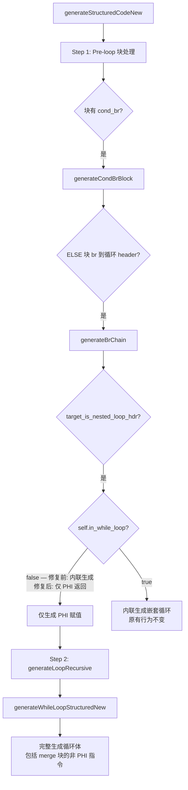
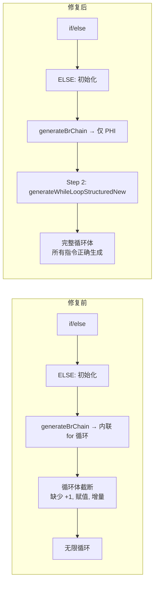

# AOT Pre-Loop 块处理修复 — 顶层循环 header 内联截断

## 1. 高层摘要（TL;DR）

修复了 `generateStructuredCodeNew` 的 pre-loop 块处理阶段中 `generateBrChain` 错误地将顶层循环 header 内联到 if/else 分支的问题。该问题导致 f071 Huffman compress 方法的 for 循环体在 null 合并操作 `??` 后截断，缺少 `+1` 运算、数组赋值、`$i++` 增量和回边，造成无限循环。

**修复方案**：在 `generateBrChain` 中检测到"嵌套循环 header"时，若当前不在 while 循环内（`self.in_while_loop == false`），仅生成 PHI 赋值后返回，让 `generateStructuredCodeNew` 的 step 2（`generateLoopRecursive → generateWhileLoopStructuredNew`）处理该循环。

## 2. 影响范围

| 影响面 | 说明 |
|--------|------|
| f071 Huffman compress | ✅ 已修复：for 循环体不再截断，输出与 PHP 解释器完全一致 |
| f071 LZ77 长文本 | ⚠️ 性能问题：嵌套循环较慢，260 字节文本压缩超时（非正确性问题） |
| f064 矩阵逆计算 | ⚠️ 既有问题：第1列部分值为0，与本次修复无关 |
| zig build test | ✅ 291/292 通过，1 个既有失败（CSE dominance check） |
| 最小测试用例 | ✅ null 合并在 for 循环中正常工作 |

## 3. 核心变更

| 文件 | 位置 | 变更描述 |
|------|------|----------|
| `src/aot/native_linker.zig` | `generateBrChain` L13528 | 新增 `if (!self.in_while_loop)` 分支：当不在 while 循环内时，仅生成 PHI 赋值后返回，不内联顶层循环 |
| `src/aot/native_linker.zig` | `buildLoopNestingTree` L18702 | 移除 `std.debug.print("  vs loop ...")` 调试输出 |

## 4. 可视化概览

### 变更点逻辑映射

### 修复前后对比

## 5. 详细变更分析

### 端/模块层

| 层级 | 模块 | 变更点 |
|------|------|--------|
| 代码生成层 | `native_linker.zig` | `generateBrChain` 新增 pre-loop 阶段的顶层循环 header 保护 |
| 调试清理 | `native_linker.zig` | `buildLoopNestingTree` 移除 `std.debug.print` |

### 涉及文件列表

- `src/aot/native_linker.zig`

### 变更点描述

**`generateBrChain` 新增 `!self.in_while_loop` 分支（L13528-13549）**：

当 `generateBrChain` 检测到目标块是"嵌套循环 header"（有回边的 cond_br 块）时：
- **修复前**：无论是否在 while 循环内，都调用 `generateCondBrBlock` 内联生成循环。但在 pre-loop 块处理阶段（不在 while 循环内），`generateCondBrBlock`/`generateBrChain` 对 merge 块只生成 PHI 赋值，不生成非 PHI 指令（如 `+1`、数组赋值、增量），导致循环体不完整。
- **修复后**：若 `self.in_while_loop == false`（如在 pre-loop 块处理阶段），仅生成来自 `source_idx` 的 PHI 赋值并标记为已处理后返回。循环由 `generateStructuredCodeNew` 的 step 2（`generateLoopRecursive → generateWhileLoopStructuredNew`）完整生成，后者正确处理 merge 块的非 PHI 指令。

## 6. 影响与风险评估

| 维度 | 评估 |
|------|------|
| 破坏式变更 | 否 — 仅影响 pre-loop 阶段的 br 链处理，不影响 while 循环内的嵌套循环 |
| 变更影响范围 | 仅影响包含 `if (cond) { ... } else { ... 循环 ... }` 模式的函数（如 f071 compress） |
| 需特别注意 | `processed.put(target_idx, {})` 标记 header 为已处理，但 `generateLoopRecursive` 不检查此标记，不影响 step 2 |
| 复测路径 | `php-interpreter --compile f071_compression_huffman_rle_lz77.php` → 运行 AOT 产物 |

## 7. 遗留问题/潜在问题

1. **f071 LZ77 长文本性能**：LZ77::compress 的三重嵌套循环在 AOT 编译后性能较慢（260 字节需 >10s），需进一步优化嵌套循环代码生成
2. **f064 矩阵逆计算**：第1列部分值为0，与本次修复无关，需单独排查
3. **CSE dominance check 测试失败**：`test_loop_unroll.zig:260` 的既有失败，与本次修复无关

## 8. 后续开发/优化建议

| 优先级 | 建议 | 影响面 | 落地成本 |
|--------|------|--------|----------|
| P0 | 排查 f064 矩阵逆计算第1列值为0的问题 | f064 正确性 | 中 |
| P1 | 优化 LZ77 嵌套循环性能（减少状态机回退或优化 while 循环体生成） | f071 长文本性能 | 高 |
| P1 | 修复 CSE dominance check 测试失败 | 编译器测试 | 中 |
| P2 | 考虑为 `generateBrChain` 传入 `cfg` 引用，使其能精确区分顶层循环与嵌套循环 | 代码生成健壮性 | 中 |
