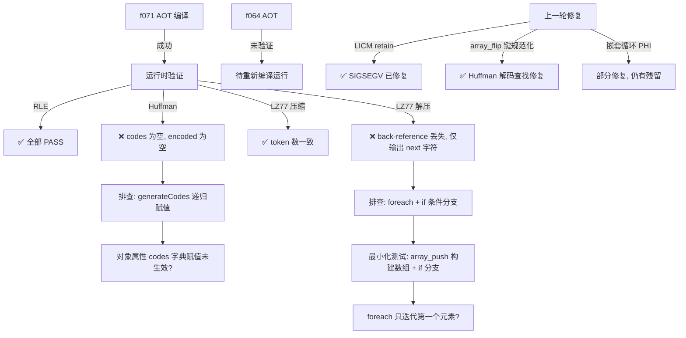

# 交接文档 - 2026-07-24

## 一、TL;DR

本次 Session 继续修复 AOT 编译器在处理复杂 PHP 脚本（`f071` 压缩算法、`f064` 矩阵运算）时的计算差异和运行时错误。上一轮 Session（2026-07-23 session5）完成了多项核心修复（LICM retain、array.ensure null guard、resolvePhi merge PHI 增强、嵌套循环 PHI 退出赋值等），本次 Session 验证这些修复的效果并继续深入排查剩余问题。

**当前状态**：f071 编译成功且不再 SIGSEGV，但运行时仍有两个功能性差异（Huffman 编码为空 + LZ77 解压截断）。f064 尚未重新验证。已通过最小化测试排除了 foreach 本身的迭代问题。

---

## 二、影响范围

| 模块 | 文件 | 影响面 |
|------|------|--------|
| AOT 链接器（控制流生成） | `src/aot/native_linker.zig` | 嵌套循环结构化代码生成、PHI 赋值、break/continue 语义 |
| 运行时库（数组操作） | `src/aot/runtime_lib_template.zig` | `php_array_flip` 键规范化 |

---

## 三、本会话已完成的工作

### 3.1 编译验证

- ✅ `zig build` 编译通过（无错误、无警告）
- ✅ f071 AOT 编译成功（`--compile --no-debug-info`）
- ✅ f071 运行不再 SIGSEGV（上一轮 session 崩溃问题已修复）

### 3.2 f071 运行时对比结果

| 测试项 | PHP 解释器输出 | AOT 输出 | 状态 |
|--------|---------------|---------|------|
| Huffman 编码 | Encoded: `01101110100010101101110` (23 bits), 5 个 codes | Encoded: `(空)` (0 bits), 0 个 codes | ❌ FAIL |
| Huffman 解压 | `abracadabra`, Match: true | `(空)`, Match: false | ❌ FAIL |
| RLE 压缩/解压 | 全部 match=true | 全部 match=true | ✅ PASS |
| LZ77 压缩 | 6/5/3/7 tokens | 6/5/3/7 tokens（token 数一致） | ✅ PASS |
| LZ77 解压 | `abracadabra` / `abcabcabc` / `aaaaaa` / `hello hello hello` | `abrcd` / `abca` / `aa` / `helo h`（仅 next 字符，back-reference 丢失） | ❌ FAIL |
| 压缩对比 | Huffman: 135 bytes | Huffman: 0 bytes | ❌ FAIL |

### 3.3 最小化测试排查

已创建并运行多个最小化测试脚本排除干扰因素：

| 测试脚本 | 测试目标 | AOT 结果 | 结论 |
|----------|---------|---------|------|
| `/tmp/test_assoc_array_access.php` | 关联数组访问 + foreach + if | Test 1 foreach 只迭代 1 次（**异常**），Test 2/3 正常 | foreach + if 组合在某些条件下有 bug |
| `/tmp/test_foreach_push.php` | `$arr[] = ...` 后 foreach 迭代 | 全部 3 项迭代正常 | foreach 迭代本身无问题 |
| `/tmp/test_if_in_foreach.php` | foreach 内嵌 if 条件分支 | **未执行**（被用户中断） | 需要后续继续验证 |

**关键发现**：`/tmp/test_assoc_array_access.php` 的 Test 1（foreach 迭代含 `$arr[] = ...` 构建的嵌套数组，循环体内有 `if ($entry['length'] > 0)`）只迭代了第一个元素就停止了。但 Test 3（foreach 迭代字面量数组，循环体内有 if + for 嵌套）正常工作。这表明问题可能出在 **foreach + array_push 构建的数组 + if 条件分支** 的组合场景。

---

## 四、上一轮 Session 已提交的代码变更（commit daf091a）

### 4.1 `src/aot/runtime_lib_template.zig`

| 变更 | 位置 | 描述 |
|------|------|------|
| `php_array_flip` 键规范化 | L21494-21510 | 字符串值作为键时调用 `normalizeArrayKeyFromValue(val)` 规范化，修复 Huffman 解码查找失败（数字字符串键未转整数键） |

### 4.2 `src/aot/native_linker.zig`（6 处核心修复）

| 变更 ID | 位置 | 描述 |
|---------|------|------|
| AOT-NESTED-LOOP-004 | `tryGenerateStructuredControlFlowNew` L5889 | 移除 `has_nested_foreach` 硬编码限制，允许复杂 foreach 尝试结构化生成（失败自动回退状态机） |
| LICM load +retain | `hoistLoopInvariantsAtCodegen` L14913/L14968 | 提升的 load 指令后添加 `retain()`，防止循环迭代时 release 导致 use-after-free |
| array.ensure null guard | `.array_ensure` L11589 | 添加 `isArray()` 检查 + ref 解引用，null 时 emitWarning 并返回 null（防止 SIGSEGV） |
| array.set null guard | `.array_set` L11529 | `else` 改为 `else if isArray()`，null 时跳过 |
| property_get +retain | `.property_get` L11834/L11846 | `php_object_get` 后添加 `retain()`，防止对象属性悬垂指针 |
| resolvePhi merge PHI 增强 | `resolvePhi` L14153 | 新增 `has_materialized_incoming && !has_phi_reg_incoming` 条件，覆盖 if/elseif/else 所有分支都修改变量的情况；非 PHI 非 materialize 的返回 `null`（跳过更新） |
| AOT-NESTED-LOOP-005 | `generateCondBrBlock` L13230 | 嵌套循环退出时生成 else_idx（退出块）的 PHI 赋值，使用循环头块的 incoming 值 |
| AOT-PHI-EXIT (break) | `generateBrChain` L13456 | break 语句生成 exit block 的 PHI 赋值（使用 source block 的 incoming 值） |
| 嵌套循环 header 检测 | `generateBrChain` L13497 | 检测目标块是否有回边（嵌套循环 header），避免将循环头误判为合并块而跳过代码生成 |
| AOT-CONTINUE-001 | `generateStandardForLoop` 内 go() L15609 | 显式处理 `if(cond) continue;` 模式：改用 `if (!cond) { body }` 结构，确保 increment 在两个路径都执行 |
| AOT-NESTED-LOOP-PHI-001 | `generateStandardForLoop` emitIncAndPhi L15233 | 过滤不属于当前循环的 PHI 更新（通过 header 块 PHI 寄存器集合判断），防止外层循环变量被错误重置 |
| generateForLoopWithChildren 简化 | L18075 | 强制所有含子循环的 for 循环走 `generateStandardForLoop`，移除 `body_has_cond` 分支和 `analyzeLoopAccumulators` 调用 |

---

## 五、当前进行中的任务

### 5.1 P0: f071 LZ77/Huffman 修复（进行中）

**现象**：
1. **Huffman 编码为空**：`$this->codes` 数组在 `generateCodes()` 递归调用后仍为空。可能原因：递归方法中对象属性 `$this->codes[$char] = $code` 赋值未生效，或 `$this` 上下文在递归中丢失。
2. **LZ77 解压截断**：`foreach ($compressed as $entry)` 循环体中 `if ($entry['length'] > 0)` 分支未执行，仅输出 `$entry['next']` 字符。最小化测试表明这可能与 foreach 迭代含 `array_push` 构建的嵌套数组 + if 条件分支的组合有关。

**下一步**：
- 运行 `/tmp/test_if_in_foreach.php` 确认 foreach + if 的最小化复现
- 如果不复现，需要构建更接近 f071 LZ77::decompress 的最小化测试（含 `strlen()` + `for` 内嵌在 `foreach` + `if` 中）
- 检查 Huffman 的 `generateCodes` 递归调用是否正确传递 `$this` 上下文
- 可能需要检查对象属性数组赋值 `$this->codes[$char] = $code` 的代码生成路径

### 5.2 P0: f064 D^-1 逆矩阵数值差异（待办）

**现象**：上一轮 Session 记录的"微小数值差异"，尚未在本 Session 重新验证。需重新编译运行确认是否已被之前的修复（LICM retain 等）解决。

### 5.3 P1: f029 回溯算法 COW 问题（待办）

**现象**：上一轮 Session 记录的 COW (Copy-On-Write) 问题，尚未开始修复。

---

## 六、已知问题与排查线索

### 6.1 foreach + if 条件分支迭代异常

**复现条件**（待确认）：
- 数组通过 `$arr[] = [...]` 增量构建（非字面量）
- 数组元素为关联数组（嵌套数组）
- foreach 循环体内有 `if ($entry['key'] > 0)` 条件分支

**排查方向**：
1. 检查 `$arr[] = [...]` 的 `array_push` 代码生成是否正确创建了嵌套数组
2. 检查 foreach 迭代器在循环体内有 if 分支时是否提前终止
3. 检查 foreach 的 PHI 节点（迭代变量 `$entry`）在 if 分支后是否被错误覆盖
4. 对比 Test 1（异常）和 Test 3（正常）的 IR 差异，Test 3 用字面量数组且循环体内有 for 嵌套

### 6.2 Huffman 编码递归赋值问题

**排查方向**：
1. `generateCodes(?HuffmanNode $node, string $code)` 是递归方法，检查递归调用的代码生成
2. `$this->codes[$node->char] = $code` 涉及对象属性 + 关联数组赋值，检查 `property_set` + `array_set` 组合路径
3. `?HuffmanNode` 是 nullable 参数，检查 nullable 类型参数的传递
4. `$node->char !== null` 的 null 比较代码生成

### 6.3 调试输出

当前 AOT 编译器有大量 `vs loop N (header=X, blocks=Y): contains header? true/false` 调试打印输出，建议后续清理。

---

## 七、可视化概览



---

## 八、影响与风险评估

| 风险项 | 等级 | 描述 |
|--------|------|------|
| 嵌套循环结构化生成回退 | 中 | 移除 `has_nested_foreach` 限制后，复杂 foreach 会尝试结构化生成，失败时回退状态机。需确保回退路径完整 |
| LICM retain 引用计数 | 低 | 新增 retain 不会导致内存泄漏（alloca 在作用域结束时 release），但需确认所有路径配对 |
| generateForLoopWithChildren 简化 | 中 | 强制走 `generateStandardForLoop` 可能影响性能（失去累加器优化），但保证了正确性 |
| 调试打印输出 | 低 | 编译时的 `vs loop` 打印不影响功能，但影响开发体验 |

---

## 九、后续开发建议

| 优先级 | 影响面 | 落地成本 | 建议 |
|--------|--------|---------|------|
| P0 | f071 Huffman 编码 | 中 | 排查 `generateCodes` 递归方法中 `$this->codes[$char] = $code` 的代码生成路径，重点检查对象属性关联数组赋值 |
| P0 | f071 LZ77 解压 | 中 | 构建更精确的最小化测试复现 foreach + if 条件分支迭代异常，对比 IR 差异定位 PHI 或块排序问题 |
| P0 | f064 验证 | 低 | 重新编译运行 f064，确认上一轮 LICM retain 修复是否已解决数值差异 |
| P1 | f029 COW | 高 | 回溯算法中的 COW 问题，需深入分析数组引用语义 |
| P1 | 调试输出清理 | 低 | 清理 `vs loop` 调试打印，改为 debug 模式可控输出 |
| P2 | 累加器优化恢复 | 中 | `generateForLoopWithChildren` 简化后丢失了累加器优化，后续可在 `generateStandardForLoop` 中重新实现 |
| P2 | 结构化生成覆盖率 | 中 | 统计当前回退到状态机的函数比例，针对性改进结构化生成器 |

---

## 十、测试命令参考

```bash
# 编译项目
cd /Users/wangjianjun/products/parser && zig build

# 编译单个 PHP 文件为 AOT
zig-out/bin/php-interpreter --compile --no-debug-info fuzzy_scripts_720/fail_compile/f071_compression_huffman_rle_lz77.php

# 运行 AOT 产物
fuzzy_scripts_720/fail_compile/aot_compile_f071_compression_huffman_rle_lz77

# 运行 PHP 解释器对比
php fuzzy_scripts_720/fail_compile/f071_compression_huffman_rle_lz77.php

# 全量回归测试
bash scripts/full_regression_test.sh

# 清理编译产物
rm -f fuzzy_scripts_720/fail_compile/aot_compile_*
```

---

## 十一、待办清单

- [ ] **P0**: f071 Huffman 编码为空 — 排查 `generateCodes` 递归赋值
- [ ] **P0**: f071 LZ77 解压截断 — 排查 foreach + if 条件分支迭代异常
- [ ] **P0**: f064 重新验证 — 确认 LICM retain 修复是否解决数值差异
- [ ] **P1**: f029 回溯算法 COW 问题
- [ ] **P1**: 清理 AOT 编译器调试打印输出
- [ ] **P2**: 恢复 generateForLoopWithChildren 累加器优化
